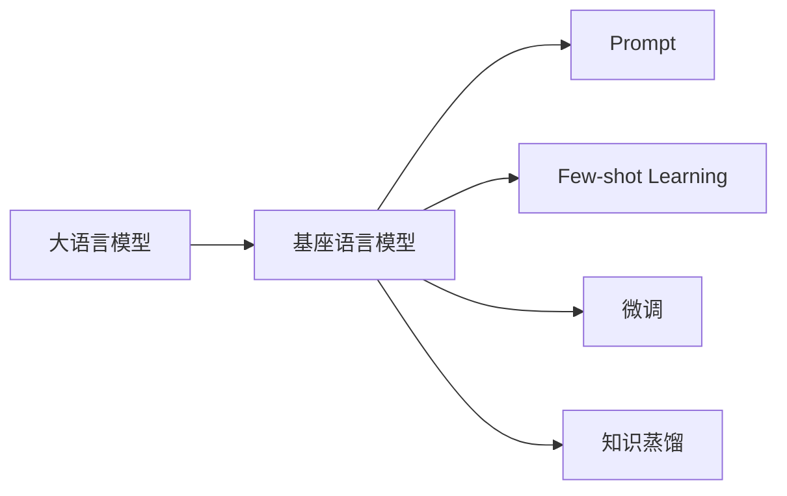

# 大语言模型原理与工程实践：基座语言模型的评测

关键词：大语言模型、基座模型、评测方法、Prompt、Few-shot Learning、微调、知识蒸馏

## 1. 背景介绍
### 1.1  问题的由来
近年来，大语言模型（Large Language Model, LLM）在自然语言处理领域取得了突破性进展。从GPT-3到PaLM、Chinchilla等，LLM的规模不断扩大，性能也持续提升。这些模型展现出了令人惊叹的语言理解和生成能力，在问答、对话、写作等多个任务上达到甚至超越人类的水平。然而，训练和部署如此庞大的模型需要巨大的计算资源和存储空间，这对于大多数研究者和开发者来说是难以企及的。因此，如何在资源有限的情况下，充分利用LLM的能力，成为了一个亟待解决的问题。

### 1.2  研究现状
为了让更多人能够使用LLM的能力，研究者提出了基座语言模型（Foundation Language Model）的概念。基座模型通常是在海量语料上预训练得到的通用语言模型，具有强大的语言理解和生成能力。在此基础上，可以通过Prompt、Few-shot Learning、微调等技术，将基座模型应用到下游任务中，而无需从头训练专门的模型。这大大降低了任务适配的成本，使得LLM的能力得以普惠。

目前，业界已经发布了多个开源的基座模型，如GPT-Neo、T5、BART、RoBERTa等。这些模型在不同的语料和目标任务上进行了优化，具有各自的特点和优势。为了帮助用户选择合适的基座模型，以及评估模型在实际任务中的表现，需要建立科学的评测方法和基准。

### 1.3  研究意义
基座语言模型的评测研究具有重要意义。首先，它可以帮助用户全面了解不同基座模型的性能特点，选择最适合自己任务的模型。其次，通过分析模型的行为和局限性，可以指导算法的改进和优化。此外，评测结果也为基座模型的应用提供了重要参考，有助于开发者设计更有效的Prompt和微调方案。总之，系统的评测工作将推动基座语言模型的发展和应用，让更多人受益于LLM技术的进步。

### 1.4  本文结构
本文将全面探讨基座语言模型的评测方法和实践。第2部分介绍相关的核心概念；第3部分讨论评测的核心算法原理和具体步骤；第4部分建立评测任务的数学模型，并给出详细的公式推导和案例分析；第5部分提供评测代码的实现细节；第6部分展望评测技术在实际应用中的场景；第7部分推荐相关的工具和学习资源；第8部分总结全文，并展望未来的发展趋势和挑战；第9部分列出常见问题解答。

## 2. 核心概念与联系
在讨论基座语言模型的评测之前，需要明确几个核心概念：

- 大语言模型（Large Language Model, LLM）：在海量文本语料上训练的神经网络模型，通常基于Transformer结构，具有强大的语言理解和生成能力。代表模型有GPT-3、PaLM、Chinchilla等。

- 基座语言模型（Foundation Language Model）：可以在多个下游任务上进行适配的通用语言模型。通常是预训练好的LLM，可以通过Prompt、Few-shot Learning、微调等方式应用到具体任务中。

- Prompt：一种利用自然语言指令来引导语言模型执行特定任务的方法。通过设计恰当的Prompt，可以在不修改模型参数的情况下，让预训练模型适应新的任务。

- Few-shot Learning：利用少量样本来指导模型进行任务适配的方法。通过在Prompt中提供少数示例，让模型快速理解任务要求，生成符合要求的结果。

- 微调（Fine-tuning）：在预训练模型的基础上，使用下游任务的训练数据对模型进行二次训练，使其更好地适应任务的方法。与Prompt和Few-shot Learning相比，微调需要更多的计算资源，但通常可以取得更好的效果。

- 知识蒸馏（Knowledge Distillation）：将大模型的知识转移到小模型中的方法。通过让小模型学习大模型的行为，可以在保持性能的同时，大幅降低模型的尺寸和推理成本。

下图展示了这些概念之间的关系：



可以看到，大语言模型是基座语言模型的基础，而Prompt、Few-shot Learning、微调和知识蒸馏都是在基座模型的基础上进行的任务适配方法。这些方法可以根据任务的特点和资源限制进行灵活选择和组合，以达到最佳的性能。

## 3. 核心算法原理 & 具体操作步骤
### 3.1  算法原理概述
基座语言模型的评测主要包括以下几个步骤：

1. 选择合适的基座模型。根据任务的特点和资源限制，选择性能好、参数量适中的基座模型，如GPT-Neo、T5等。

2. 构建评测任务。根据实际应用场景，设计覆盖不同难度和类型的评测任务，如问答、对话、写作等。准备好任务的输入数据和参考答案。

3. 设计Prompt。对于每个评测任务，设计适当的Prompt，引导模型生成符合要求的输出。Prompt可以包含任务指令、输入示例、格式要求等信息。

4. 生成模型输出。使用设计好的Prompt将输入数据输入到基座模型中，生成相应的输出结果。

5. 评估模型性能。将模型生成的输出与参考答案进行比较，计算各项评价指标，如BLEU、ROUGE、Accuracy等。综合分析各项指标，得出模型在该任务上的性能表现。

6. 优化模型和Prompt。根据评测结果，分析模型的不足之处，尝试通过优化Prompt、Few-shot示例、微调等方式来提升性能。不断迭代优化，直到达到理想的效果。

通过上述步骤，可以系统地评测基座语言模型在不同任务上的性能，并根据需要进行优化改进。

### 3.2  算法步骤详解

下面以文本摘要任务为例，详细说明评测的具体步骤。

步骤1：选择基座模型。这里我们选用GPT-Neo作为基座模型，它是一个开源的GPT-3类模型，在摘要任务上表现优异。

步骤2：构建评测任务。我们从CNN/DailyMail新闻语料中抽取出100篇文章作为测试集，每篇文章都配有人工撰写的摘要作为参考答案。

步骤3：设计Prompt。我们设计如下的Prompt模板：

```
请为下面的文章生成一个简洁的摘要：

{{文章内容}}

摘要：
```

其中，`{{文章内容}}`部分会替换为实际的输入文章。

步骤4：生成模型输出。对于测试集中的每篇文章，将其内容填入Prompt模板，输入到GPT-Neo模型中，让模型生成相应的摘要输出。

步骤5：评估模型性能。使用ROUGE指标，将模型生成的摘要与参考摘要进行比较，计算ROUGE-1、ROUGE-2、ROUGE-L的F1值。最后取这三个值的算术平均作为模型的整体性能得分。

步骤6：优化模型和Prompt。分析模型生成的摘要，总结存在的问题，如语义不连贯、信息遗漏等。尝试通过以下方式优化：

- 改进Prompt，如增加字数限制、关键词指导等
- 在Prompt中添加Few-shot示例，让模型学习摘要的写作风格
- 使用摘要数据集对模型进行微调，进一步提升摘要生成能力

不断迭代优化，直到模型的性能达到满意的水平。

以上就是基座语言模型评测的详细步骤。通过合理设计评测任务和Prompt，并采用适当的自动化评价指标，可以全面评估模型的性能，并为优化提供指导。

### 3.3  算法优缺点

基座语言模型评测的优点包括：

- 全面性：通过设计不同类型和难度的评测任务，可以全面考察模型的语言理解和生成能力。
- 高效性：利用Prompt等技术，可以在不修改模型参数的情况下快速适配新任务，大大节省了评测的时间和资源。
- 可解释性：通过分析模型在不同任务上的表现，可以洞察其内部工作机制，为算法改进提供启发。
- 可扩展性：评测方法可以方便地扩展到新的任务和数据集，适应不断变化的应用需求。

同时，该方法也存在一些局限性：

- Prompt设计难度大：设计一个好的Prompt需要对任务有深入的理解，并进行反复尝试和优化，对评测者的技能要求较高。
- 评价指标不够完善：目前常用的BLEU、ROUGE等指标主要关注表面的词句匹配，无法准确评估生成文本的语义连贯性和逻辑合理性。
- 样本数量受限：由于生成模型推理的高昂开销，评测通常只能在较小的测试集上进行，样本覆盖不够全面。
- 泛化能力有待验证：模型在评测任务上的出色表现，不一定能完全转化为实际应用中的性能提升，还需要在真实场景下进行进一步验证。

### 3.4  算法应用领域

基座语言模型评测技术可以应用于以下领域：

- 学术研究：评测不同的基座模型和任务适配方法，推动相关算法的发展和创新。
- 工业应用：为企业选择合适的基座模型，并指导模型在特定任务上的优化和部署。
- 教育培训：帮助学习者理解语言模型的工作原理，掌握任务适配的实践技能。
- 竞赛基准：构建标准的评测基准，为模型开发者提供公平的比较环境，促进技术交流。

总之，基座语言模型评测是一项连接算法研究和实际应用的关键技术，有助于发掘语言模型的潜力，推动自然语言处理技术的普及应用。

## 4. 数学模型和公式 & 详细讲解 & 举例说明
### 4.1  数学模型构建
为了对基座语言模型的性能进行量化评估，需要建立相应的数学模型。以生成摘要任务为例，我们可以将其抽象为一个条件语言生成问题。给定输入文章 $x$，模型需要生成一个摘要 $y$，使得 $y$ 能够准确概括 $x$ 的主要内容，同时又简洁流畅。

形式化地，我们将摘要生成模型记为 $f$，输入文章 $x$ 和摘要 $y$ 的词嵌入序列分别为 $\mathbf{x}=(x_1,\ldots,x_m)$ 和 $\mathbf{y}=(y_1,\ldots,y_n)$，其中 $m$ 和 $n$ 分别为文章和摘要的长度。模型 $f$ 的目标是最大化如下的条件概率：

$$
P(\mathbf{y}|\mathbf{x}) = \prod_{i=1}^n P(y_i|\mathbf{y}_{<i},\mathbf{x})
$$

其中，$\mathbf{y}_{<i}$ 表示摘要的前 $i-1$ 个词。直观地，模型需要在给定文章和已生成摘要片段的条件下，预测下一个最可能的词，直到生成完整的摘要。

在评测中，我们希望生成的摘要 $\hat{\mathbf{y}}$ 能够尽可能接近参考摘要 $\mathbf{y}^*$。因此，可以将评测任务建模为最小化以下的损失函数：

$$
\mathcal{L}(\hat{\mathbf{y}}, \mathbf{y}^*) = -\frac{1}{n}\sum_{i=1}^n \log P(y_i^*|\hat{\mathbf{y