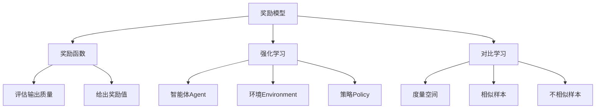

# 大语言模型原理与工程实践：奖励模型的训练

关键词：大语言模型、奖励模型、强化学习、人工智能、自然语言处理

## 1. 背景介绍
### 1.1  问题的由来
近年来,随着深度学习技术的飞速发展,自然语言处理(NLP)领域取得了巨大的突破。尤其是随着 Transformer 架构的提出以及预训练语言模型(PLM)的广泛应用,NLP 任务的性能得到了显著提升。然而,传统的语言模型主要是通过最大化似然估计(MLE)来训练的,存在一定的局限性。为了进一步提升语言模型的性能,研究人员开始探索奖励模型(Reward Model)的训练方法。

### 1.2  研究现状 
奖励模型源自于强化学习(RL)领域,其核心思想是通过奖励函数来引导模型学习,从而达到更好的性能。近年来,奖励模型在 NLP 领域得到了广泛关注。例如,OpenAI 在 2020 年提出了 InstructGPT 模型[1],通过人工反馈数据来训练奖励模型,显著提升了语言模型的性能。此外,DeepMind、Google、Meta 等知名机构也纷纷开展了奖励模型相关的研究工作[2-4]。

### 1.3  研究意义
奖励模型为语言模型的训练提供了一种新的思路。与传统的 MLE 训练不同,奖励模型引入了外部反馈信息,可以更好地引导模型学习,提升模型的泛化能力和鲁棒性。此外,奖励模型还为语言模型的可解释性和可控性提供了支持。通过分析奖励函数,我们可以更好地理解模型的行为和决策过程。因此,深入研究奖励模型对于推动 NLP 技术的发展具有重要意义。

### 1.4  本文结构
本文将围绕大语言模型中的奖励模型展开深入探讨。第二部分将介绍奖励模型的核心概念以及与其他概念的联系。第三部分将详细阐述奖励模型的算法原理和具体操作步骤。第四部分将建立奖励模型的数学模型,并结合实例进行详细讲解。第五部分将通过代码实例,演示奖励模型的工程实践。第六部分将讨论奖励模型的实际应用场景。第七部分将推荐奖励模型相关的工具和学习资源。最后,第八部分将总结全文,并对奖励模型的未来发展趋势和面临的挑战进行展望。

## 2. 核心概念与联系
奖励模型的核心概念是奖励函数(Reward Function)。奖励函数用于评估模型生成的输出质量,并给出相应的奖励值。模型的目标是最大化累积奖励,从而生成高质量的输出。奖励函数的设计直接影响着模型的性能,因此是奖励模型的关键所在。

奖励模型与强化学习(RL)密切相关。RL 的目标是通过智能体(Agent)与环境(Environment)的交互,学习最优策略(Policy)以最大化累积奖励。在奖励模型中,语言模型扮演着智能体的角色,生成的文本序列对应着智能体的动作(Action),而奖励函数则对应着环境给出的奖励(Reward)。通过不断地生成文本并获得奖励反馈,语言模型逐步优化,生成质量不断提升。

奖励模型与对比学习(Contrastive Learning)也有着紧密的联系。对比学习的目标是学习一个度量空间,使得相似的样本距离较近,而不相似的样本距离较远。在奖励模型中,我们可以将生成的文本看作是一个样本,将参考答案看作是另一个样本。通过最小化生成文本与参考答案之间的距离,模型可以学习到更好的文本生成策略。

下图展示了奖励模型的核心概念以及它们之间的联系:

## 3. 核心算法原理 & 具体操作步骤
### 3.1  算法原理概述
奖励模型的核心算法是基于策略梯度(Policy Gradient)的强化学习算法。策略梯度算法的目标是最大化期望奖励,其中期望是基于当前策略(即语言模型)的概率分布计算的。通过梯度上升(Gradient Ascent)不断优化策略,使其生成的文本能够获得更高的奖励。

具体来说,令 $\pi_\theta(a|s)$ 表示参数为 $\theta$ 的策略在状态 $s$ 下采取动作 $a$ 的概率,令 $Q^\pi(s,a)$ 表示在状态 $s$ 下采取动作 $a$ 并继续遵循策略 $\pi$ 的期望累积奖励。那么,策略梯度算法的目标函数可以表示为:

$$J(\theta)=\mathbb{E}_{s \sim \rho^\pi, a \sim \pi_\theta}[Q^\pi(s,a)]$$

其中 $\rho^\pi$ 表示策略 $\pi$ 诱导的状态分布。根据策略梯度定理[5],目标函数 $J(\theta)$ 的梯度可以表示为:

$$\nabla_\theta J(\theta) = \mathbb{E}_{s \sim \rho^\pi, a \sim \pi_\theta}[Q^\pi(s,a) \nabla_\theta \log \pi_\theta(a|s)]$$

### 3.2  算法步骤详解
奖励模型的训练过程可以分为以下几个步骤:

1. 初始化语言模型参数 $\theta$,随机或使用预训练模型初始化。

2. 重复以下步骤,直到收敛:
   
   a. 使用当前模型 $\pi_\theta$ 生成一批文本序列 $\{a_1,a_2,...,a_n\}$。
   
   b. 对每个生成的文本序列 $a_i$,使用奖励函数 $r(a_i)$ 计算其奖励值。
   
   c. 使用蒙特卡洛(Monte Carlo)方法估计每个动作的 Q 值:
      
      $$Q^\pi(s_i,a_i) \approx r(a_i)$$
   
   d. 计算策略梯度的估计值:
      
      $$g=\frac{1}{n}\sum_{i=1}^n r(a_i) \nabla_\theta \log \pi_\theta(a_i|s_i)$$
   
   e. 使用梯度上升更新模型参数:
      
      $$\theta \leftarrow \theta + \alpha g$$
      
      其中 $\alpha$ 是学习率。

3. 返回优化后的模型参数 $\theta^*$。

### 3.3  算法优缺点
策略梯度算法的优点在于:

1. 可以直接优化期望奖励,与具体任务目标直接相关。

2. 可以处理高维、连续的动作空间,适用于文本生成任务。

3. 训练过程简单,易于实现。

但是,策略梯度算法也存在一些缺点:

1. 方差较大,训练不稳定,需要较大的样本量。

2. 对奖励函数的设计较为敏感,奖励函数的好坏直接影响算法性能。

3. 容易陷入局部最优,难以探索更优策略。

### 3.4  算法应用领域
策略梯度算法是强化学习的经典算法之一,在 NLP 领域有着广泛的应用。除了本文重点讨论的奖励模型外,策略梯度算法还被用于以下任务:

1. 对话生成(Dialogue Generation):通过奖励函数引导模型生成连贯、相关的对话响应[6]。

2. 文本摘要(Text Summarization):通过奖励函数优化摘要的信息量、连贯性等指标[7]。

3. 机器翻译(Machine Translation):通过奖励函数优化翻译的流畅度、忠实度等指标[8]。

4. 问答系统(Question Answering):通过奖励函数引导模型生成准确、完整的答案[9]。

## 4. 数学模型和公式 & 详细讲解 & 举例说明
### 4.1  数学模型构建
为了更好地理解奖励模型的原理,我们可以将其形式化为一个马尔可夫决策过程(Markov Decision Process, MDP)。一个 MDP 由以下元素组成:

- 状态空间 $\mathcal{S}$:所有可能的状态的集合。在奖励模型中,状态对应着文本生成过程中的中间序列。
  
- 动作空间 $\mathcal{A}$:所有可能的动作的集合。在奖励模型中,动作对应着在当前状态下生成的下一个单词或标记。
  
- 转移概率 $P(s'|s,a)$:在状态 $s$ 下采取动作 $a$ 后转移到状态 $s'$ 的概率。在奖励模型中,转移概率由语言模型的条件概率分布决定。
  
- 奖励函数 $r(s,a)$:在状态 $s$ 下采取动作 $a$ 后获得的即时奖励。在奖励模型中,奖励函数由人工设计或通过训练得到。
  
- 折扣因子 $\gamma \in [0,1]$:用于平衡即时奖励和长期奖励的权重。$\gamma$ 越大,模型越重视长期奖励。

基于 MDP,我们可以定义状态价值函数 $V^\pi(s)$ 和动作价值函数 $Q^\pi(s,a)$:

$$V^\pi(s)=\mathbb{E}_{a \sim \pi}[Q^\pi(s,a)]$$

$$Q^\pi(s,a)=r(s,a)+\gamma \mathbb{E}_{s' \sim P}[V^\pi(s')]$$

其中 $\pi$ 表示策略,即语言模型。状态价值函数 $V^\pi(s)$ 表示从状态 $s$ 开始,遵循策略 $\pi$ 的期望累积奖励。动作价值函数 $Q^\pi(s,a)$ 表示在状态 $s$ 下采取动作 $a$,然后继续遵循策略 $\pi$ 的期望累积奖励。

### 4.2  公式推导过程
根据 MDP 的定义,我们可以推导出奖励模型的目标函数和梯度公式。

首先,奖励模型的目标是最大化期望累积奖励:

$$J(\theta)=\mathbb{E}_{\tau \sim \pi_\theta}[R(\tau)]$$

其中 $\tau=(s_0,a_0,r_0,s_1,a_1,r_1,...)$ 表示一个完整的轨迹(Trajectory),从初始状态 $s_0$ 开始,遵循策略 $\pi_\theta$ 生成的状态-动作-奖励序列。$R(\tau)=\sum_{t=0}^T \gamma^t r_t$ 表示轨迹 $\tau$ 的累积奖励。

根据期望的线性性质,目标函数可以改写为:

$$J(\theta)=\sum_\tau P(\tau|\theta)R(\tau)$$

其中 $P(\tau|\theta)$ 表示在参数 $\theta$ 下生成轨迹 $\tau$ 的概率。

对目标函数求梯度,可以得到:

$$\nabla_\theta J(\theta)=\sum_\tau P(\tau|\theta)R(\tau)\nabla_\theta \log P(\tau|\theta)$$

进一步,轨迹的概率可以分解为状态转移概率和策略概率的乘积:

$$P(\tau|\theta)=P(s_0)\prod_{t=0}^T P(s_{t+1}|s_t,a_t)\pi_\theta(a_t|s_t)$$

将其代入梯度公式,可以得到:

$$\nabla_\theta J(\theta)=\mathbb{E}_{\tau \sim \pi_\theta}[\sum_{t=0}^T \nabla_\theta \log \pi_\theta(a_t|s_t)\sum_{t'=t}^T \gamma^{t'-t}r_{t'}]$$

这就是策略梯度定理的另一种形式,其中 $\sum_{t'=t}^T \gamma^{t'-t}r_{t'}$ 表示从时刻 $t$ 开始的累积奖励