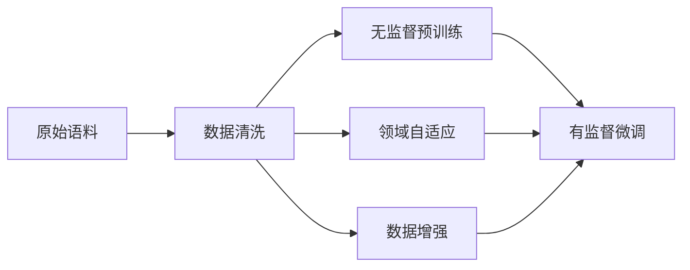

# 大语言模型原理与工程实践：常用数据集的完整构建方式

关键词：大语言模型、数据集构建、预训练、微调、Transformer

## 1. 背景介绍
### 1.1 问题的由来
近年来，大语言模型(Large Language Model, LLM)在自然语言处理(Natural Language Processing, NLP)领域取得了突破性的进展。从GPT系列到BERT，再到最新的GPT-4，LLM展现出了惊人的语言理解和生成能力，引领了NLP技术的发展潮流。然而，训练出高质量的LLM离不开优质的训练数据集。如何高效地构建LLM常用的大规模文本数据集，成为了NLP研究者和工程师面临的重要问题。

### 1.2 研究现状
目前，业界主流的LLM训练数据集主要包括以下几类：
1. 通用文本语料：如Wikipedia、Common Crawl等，提供了海量的通用领域文本数据。
2. 垂直领域语料：如新闻、医疗、法律等特定领域的文本数据，可用于训练适应特定任务的LLM。
3. 结构化数据：如知识图谱、关系数据库等，可用于训练具备知识增强能力的LLM。
4. 多模态数据：如图文对齐数据集，可用于训练多模态LLM。

在数据集构建方法上，主要有以下几种途径：
1. 网络爬取：从互联网上爬取海量的网页数据，经过清洗、去重等预处理步骤，得到高质量的文本语料。
2. 众包标注：利用众包平台，如Amazon Mechanical Turk，招募大量人力对数据进行人工标注，从而获得高质量的标注数据集。  
3. 合成数据生成：利用规则或模型自动生成虚拟的训练数据，如通过语法模板生成句子，通过知识图谱生成问答对等。
4. 数据增强：在已有数据集的基础上，通过回译、近义词替换、插入/删除词等数据增强技术，扩充原始数据集的规模和多样性。

### 1.3 研究意义
探索高效的LLM数据集构建方法，对于推动LLM技术的进一步发展具有重要意义：
1. 提升模型性能：优质的训练数据是训练高性能LLM的基础，数据质量的提升可以直接带来模型效果的提升。
2. 降低训练成本：通过改进数据集构建流程，提高标注效率，可以大幅降低LLM的训练成本。
3. 拓展应用场景：构建特定领域的LLM数据集，有助于将LLM技术拓展到更多的垂直应用场景，解决行业痛点问题。

### 1.4 本文结构
本文将重点介绍LLM常用数据集的构建方法和工程实践，内容安排如下：
- 第2节介绍LLM数据集构建的核心概念；
- 第3节介绍数据集构建的核心算法原理和操作步骤；
- 第4节介绍数据集构建涉及的数学模型和公式；
- 第5节通过代码实例演示数据集构建的完整流程；
- 第6节讨论数据集构建技术在实际场景中的应用；
- 第7节推荐数据集构建相关的工具和学习资源；
- 第8节总结全文，并展望未来的发展趋势和挑战；
- 第9节列举数据集构建中的常见问题与解答。

## 2. 核心概念与联系

在LLM数据集构建过程中，有几个核心概念需要了解：

- 无监督预训练(Unsupervised Pre-training)：利用大规模无标注语料，通过自监督学习任务，如自回归、掩码语言建模等，训练LLM的通用语言理解能力。预训练得到的模型可以作为下游任务的基础模型。
- 有监督微调(Supervised Fine-tuning)：在预训练模型的基础上，利用带标注的任务数据集，通过有监督学习，微调模型参数，使其适应特定的下游任务，如分类、序列标注、问答等。
- 领域自适应(Domain Adaptation)：针对目标领域的数据分布与预训练数据分布不一致的问题，通过领域自适应技术，如对抗训练、混合精度训练等，提升预训练模型在目标领域的适用性。
- 数据清洗(Data Cleaning)：对爬取的原始语料进行预处理，如去除HTML标签、过滤低质量文本、断句、分词等，提高数据质量。
- 数据增强(Data Augmentation)：通过数据变换方法，如回译、近义词替换、插入/删除词等，从原始数据中生成更多的训练样本，提高模型的泛化性和鲁棒性。

下图展示了上述核心概念在LLM数据集构建流程中的联系：

## 3. 核心算法原理 & 具体操作步骤
### 3.1 算法原理概述
LLM数据集构建的核心算法主要包括：
1. 文本预处理算法：如正则化、分词、词干提取、去停用词等，用于对原始文本进行结构化处理。
2. 文本数据增强算法：如EDA、Back Translation等，通过同义词替换、随机插入/删除/交换词语等方式，从原始样本中生成新样本。
3. 领域自适应算法：如对抗训练、混合精度训练等，通过对抗学习缩小源域和目标域的分布差异，提高模型的领域适应性。
4. 主题模型算法：如LDA、LSA等，通过无监督学习方法，从大规模语料库中发现潜在主题，用于语料的聚类、组织和可视化。

### 3.2 算法步骤详解
以下以文本数据增强算法EDA为例，详细介绍其操作步骤。

EDA(Easy Data Augmentation)是一种简单易用的文本数据增强算法，通过同义词替换(Synonym Replacement, SR)、随机插入(Random Insertion, RI)、随机交换(Random Swap, RS)和随机删除(Random Deletion, RD)等四种操作，从原始文本中生成多个变体。其具体步骤如下：

1. 同义词替换(SR)：
   - 对于文本中的每个词$w_i$，以概率$p$决定是否替换该词
   - 若需替换，从$w_i$的同义词集合中随机选择一个进行替换
2. 随机插入(RI)：
   - 对于文本中的每个词$w_i$，以概率$p$决定是否在其后插入新词
   - 若需插入，从$w_i$的同义词集合中随机选择一个，插入到$w_i$后
   - 为每个位置重复上述过程$n$次
3. 随机交换(RS)：
   - 对于文本中的每个词$w_i$，以概率$p$决定是否与其他词交换位置
   - 若需交换，随机选择词表中的另一个词$w_j$，交换$w_i$和$w_j$的位置
   - 为每个位置重复上述过程$n$次
4. 随机删除(RD)：
   - 对于文本中的每个词$w_i$，以概率$p$决定是否删除该词

通过组合上述四种操作，可以从一条原始文本生成多条增强后的文本。EDA算法简单高效，在多个NLP任务上取得了不错的效果提升。

### 3.3 算法优缺点
EDA等文本数据增强算法的优点包括：
- 简单易用，可以无需修改模型，直接应用于原始数据
- 有效缓解标注数据稀疏的问题，提高模型泛化性
- 基本保持原文本的语义不变，生成的样本质量较高

同时，这类算法也存在一些局限性：
- 仅考虑词级别的变换，难以生成句法和语义层面丰富的样本
- 引入噪声的风险，可能产生语法错误或语义偏移的样本
- 需要高质量的同义词典，构建成本较高

### 3.4 算法应用领域
文本数据增强算法在多个NLP任务中得到了广泛应用，如：
- 文本分类：通过数据增强扩充训练集，提高分类模型的泛化性和鲁棒性
- 序列标注：通过数据增强生成更多样的标注数据，缓解标注数据稀疏问题
- 机器翻译：通过回译等数据增强方法，构建更大规模的平行语料库
- 问答系统：通过数据增强构建更多样化的问答对，提高系统应对灵活问题的能力

## 4. 数学模型和公式 & 详细讲解 & 举例说明
### 4.1 数学模型构建
LLM的数学模型通常基于Transformer架构。Transformer是一种基于自注意力机制(Self-Attention)的序列建模网络，摒弃了传统RNN模型的循环连接，通过Self-Attention实现了任意两个位置之间的直接交互，极大地提高了模型的并行计算效率和长程依赖捕获能力。

Transformer的编码器和解码器都由若干个相同的模块堆叠而成，每个模块包含两个子层：Multi-Head Self-Attention和Position-wise Feed-Forward Network。

Multi-Head Self-Attention的计算公式如下：

$$
\begin{aligned}
Q,K,V &= XW_q, XW_k, XW_v \\
head_i &= \text{Attention}(QW_i^Q, KW_i^K, VW_i^V) \\
\text{MultiHead}(Q,K,V) &= \text{Concat}(head_1,...,head_h)W^O
\end{aligned}
$$

其中，$X$为输入序列的词嵌入表示，$W_q,W_k,W_v$为学习的参数矩阵，用于将$X$映射为查询(Query)、键(Key)、值(Value)向量。$W_i^Q,W_i^K,W_i^V$为第$i$个注意力头的参数矩阵，$W^O$为输出层的参数矩阵。$\text{Attention}$函数计算Query和Key的相似度，并将相似度作为权重，对Value进行加权求和：

$$
\text{Attention}(Q,K,V) = \text{softmax}(\frac{QK^T}{\sqrt{d_k}})V
$$

其中，$d_k$为Key向量的维度，用于缩放点积结果，避免softmax函数的梯度消失。

Position-wise Feed-Forward Network对每个位置的Self-Attention输出进行非线性变换，公式如下：

$$
\text{FFN}(x) = \max(0, xW_1 + b_1)W_2 + b_2
$$

其中，$W_1,W_2,b_1,b_2$为学习的参数矩阵和偏置项。

### 4.2 公式推导过程
以下推导Transformer中Self-Attention的计算过程。

假设输入序列的词嵌入表示为$X \in \mathbb{R}^{n \times d}$，$n$为序列长度，$d$为词嵌入维度。

首先，通过线性变换将$X$映射为Query、Key、Value矩阵：

$$
\begin{aligned}
Q &= XW_q \\
K &= XW_k \\
V &= XW_v
\end{aligned}
$$

其中，$W_q, W_k, W_v \in \mathbb{R}^{d \times d_k}$为学习的参数矩阵，$d_k$为Query/Key/Value的维度。

然后，计算Query和Key的点积注意力分数：

$$
\text{scores} = \frac{QK^T}{\sqrt{d_k}} \in \mathbb{R}^{n \times n}
$$

接着，对注意力分数应用softmax函数，得到注意力权重：

$$
\text{weights} = \text{softmax}(\text{scores}) \in \mathbb{R}^{n \times n}
$$

最后，将注意力权重与Value相乘，得到Self-Attention的输出：

$$
\text{Attention}(Q,K,V) = \text{weights} \cdot V \in \mathbb{R}^{n \times d_k}
$$

Multi-Head Attention则是将上述过程重复$h$次，每次使用不同的参数矩阵，最后将$h$个头的输出拼接起来，再经过一个线性变换得到最终输出：

$$
\begin{aligned}
head_i &= \text{Attention}