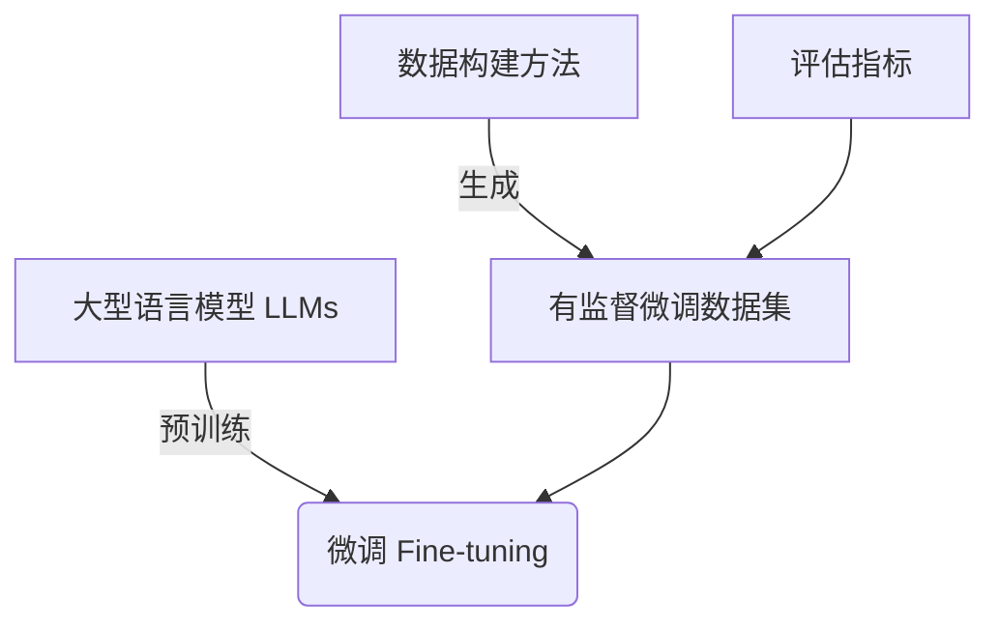

# 大语言模型原理与工程实践：有监督微调数据的构建

## 1. 背景介绍

### 1.1 问题的由来

近年来,大型语言模型(Large Language Models, LLMs)在自然语言处理(NLP)领域取得了令人瞩目的成就。这些模型通过在大规模语料库上进行预训练,学习了丰富的语言知识,并展现出强大的文本生成、理解和推理能力。然而,尽管预训练模型具有广泛的通用知识,但它们在特定领域或任务上的性能往往不尽如人意。为了提高大型语言模型在特定任务上的表现,需要对预训练模型进行微调(fine-tuning)。

微调是一种常见的技术,通过在特定任务的标注数据上进行进一步训练,使预训练模型适应特定领域和任务。然而,构建高质量的微调数据集是一项具有挑战性的工作,因为它需要大量的人力和时间投入。传统的数据标注方式通常依赖于人工标注,这不仅成本高昂,而且效率低下。因此,如何高效、低成本地构建大规模的微调数据集,成为了提升大型语言模型性能的关键挑战之一。

### 1.2 研究现状

为了解决上述挑战,研究人员提出了多种自动或半自动构建微调数据集的方法。其中,一种流行的方法是利用预训练语言模型自身的生成能力,通过提示(prompt)和少量种子数据,自动生成大量的候选数据样本。然后,通过人工审查和筛选,从中挑选出高质量的数据样本,用于模型微调。

另一种方法是利用数据增强(Data Augmentation)技术,从现有的少量标注数据出发,通过各种数据变换和扩充策略,生成更多的训练样本。常见的数据增强方法包括回译(Back-Translation)、同义词替换(Synonym Replacement)、随机插入(Random Insertion)等。

除了上述方法外,一些研究还探索了利用知识图谱(Knowledge Graph)或结构化数据源自动构建微调数据集的可能性。此外,一些工作也尝试通过主动学习(Active Learning)和人机协作(Human-in-the-Loop)的方式,提高数据构建的效率和质量。

### 1.3 研究意义

构建高质量的微调数据集对于提升大型语言模型在特定任务上的性能至关重要。高质量的微调数据可以帮助模型更好地理解任务语义,掌握任务特定的知识和模式,从而提高模型的泛化能力和鲁棒性。此外,高效的数据构建方法也有助于降低人力和时间成本,使微调过程更加经济高效。

本文将深入探讨有监督微调数据的构建方法,包括利用预训练模型自身的生成能力、数据增强技术、知识图谱和结构化数据源等。我们将介绍这些方法的原理和实现细节,并通过实例和案例分析,帮助读者更好地理解和掌握这些技术。同时,我们还将讨论当前方法的局限性和挑战,并展望未来的研究方向。

### 1.4 本文结构

本文的结构安排如下:

1. 背景介绍:阐述问题的由来、研究现状和意义。
2. 核心概念与联系:介绍有监督微调数据构建的核心概念和技术,并探讨它们之间的联系。
3. 核心算法原理与具体操作步骤:详细阐述各种数据构建算法的原理和实现细节。
4. 数学模型和公式详细讲解与举例说明:对相关的数学模型和公式进行推导和案例分析。
5. 项目实践:代码实例和详细解释说明:提供实际的代码实现和运行结果,帮助读者更好地掌握这些技术。
6. 实际应用场景:介绍有监督微调数据构建技术在实际应用中的案例和场景。
7. 工具和资源推荐:推荐相关的学习资源、开发工具和论文等。
8. 总结:未来发展趋势与挑战:总结研究成果,展望未来发展趋势和面临的挑战。
9. 附录:常见问题与解答:解答一些常见的问题和疑虑。

## 2. 核心概念与联系

在深入探讨有监督微调数据构建的具体方法之前,我们先介绍一些核心概念和它们之间的联系。

1. **大型语言模型(Large Language Models, LLMs)**:大型语言模型是指通过在大规模语料库上进行预训练而获得的庞大神经网络模型。这些模型能够捕捉丰富的语言知识和模式,展现出强大的文本生成、理解和推理能力。常见的大型语言模型包括GPT、BERT、T5等。

2. **微调(Fine-tuning)**:微调是指在预训练模型的基础上,利用特定任务的标注数据进行进一步训练,使模型适应特定领域和任务的过程。通过微调,预训练模型可以学习任务特定的知识和模式,从而提高在该任务上的性能。

3. **有监督微调数据**:有监督微调数据是指用于模型微调的标注数据集。这些数据通常由输入文本和对应的标签或目标输出组成,用于指导模型学习特定任务的映射关系。构建高质量的有监督微调数据集是提升模型性能的关键。

4. **数据构建方法**:本文重点探讨的是各种自动或半自动构建有监督微调数据集的方法,包括利用预训练模型自身的生成能力、数据增强技术、知识图谱和结构化数据源等。这些方法旨在降低人工标注的成本和工作量,提高数据构建的效率和质量。

5. **评估指标**:为了评估构建的微调数据集的质量,我们需要一些评估指标。常见的指标包括数据覆盖率、多样性、语义一致性、任务相关性等。这些指标可以帮助我们衡量数据集的完整性、多样性和对任务的适用性。

上述概念密切相关,构成了有监督微调数据构建的核心框架。预训练的大型语言模型为数据构建提供了基础;微调则是利用构建的数据集对模型进行进一步训练的过程;各种数据构建方法旨在高效、低成本地生成高质量的微调数据;而评估指标则用于衡量构建数据集的质量和效果。这些概念相互作用,共同推动了大型语言模型在特定任务上性能的提升。



## 3. 核心算法原理与具体操作步骤

在本节中,我们将详细介绍几种核心的有监督微调数据构建算法,包括它们的原理、具体操作步骤,以及优缺点和应用场景。

### 3.1 算法原理概述

#### 3.1.1 基于预训练模型生成

这种方法利用预训练语言模型强大的生成能力,通过提供少量种子数据和提示(prompt),让模型自动生成大量的候选数据样本。然后,通过人工审查和筛选,从中挑选出高质量的数据样本,用于模型微调。

算法原理如下:

1. 准备少量高质量的种子数据,作为生成的起点。
2. 设计合适的提示,引导模型生成所需的数据样本。
3. 让预训练模型基于种子数据和提示,自动生成大量候选样本。
4. 人工审查和筛选生成的样本,挑选出高质量的数据。
5. 将筛选出的数据用于模型微调。

这种方法的优点是可以利用预训练模型的强大生成能力,快速构建大规模的数据集。缺点是需要人工审查和筛选,存在一定的人力成本。此外,生成的数据质量也受到种子数据和提示设计的影响。

#### 3.1.2 数据增强

数据增强技术是从现有的少量标注数据出发,通过各种数据变换和扩充策略,生成更多的训练样本。常见的数据增强方法包括:

- **回译(Back-Translation)**:将原始数据先翻译成其他语言,然后再翻译回原语言,生成新的样本。
- **同义词替换(Synonym Replacement)**:用同义词替换原始数据中的某些词语,生成新样本。
- **随机插入(Random Insertion)**:在原始数据中随机插入一些词语或短语,生成新样本。
- **随机交换(Random Swap)**:交换原始数据中词语的位置,生成新样本。
- **随机掩码(Random Mask)**:在原始数据中随机掩码部分词语,生成新样本。

数据增强的优点是可以从少量种子数据出发,生成大量新的训练样本,扩充数据集的规模。缺点是生成的数据质量可能不如人工标注的数据,需要进一步的筛选和优化。

#### 3.1.3 基于知识图谱和结构化数据

这种方法利用知识图谱或其他结构化数据源(如数据库、表格等),自动构建微调数据集。算法原理如下:

1. 从知识图谱或结构化数据源中抽取相关的实体、关系和事实等信息。
2. 根据抽取的信息,自动生成自然语言文本作为输入数据。
3. 将抽取的结构化信息作为对应的标签或目标输出。
4. 将生成的输入文本和标签对构成微调数据集。

这种方法的优点是可以利用已有的结构化知识源,自动生成大规模的数据集,减少人工标注的工作量。缺点是生成的数据可能缺乏多样性和复杂性,无法完全覆盖实际任务的需求。

### 3.2 算法步骤详解

接下来,我们将详细介绍上述三种算法的具体实现步骤。

#### 3.2.1 基于预训练模型生成

1. **准备种子数据**

   首先,我们需要准备一些高质量的种子数据,作为生成的起点。种子数据可以是人工标注的,也可以是从现有数据集中挑选出的。种子数据的质量和多样性将直接影响生成数据的质量。

2. **设计提示**

   设计合适的提示(prompt)是这种方法的关键。提示应该能够清晰地表达我们想要生成的数据类型和格式,同时也要留有足够的空间,让模型发挥创造性。例如,对于一个问答任务,提示可以是:"问题:xxx 答案:"。

3. **生成候选样本**

   利用预训练模型(如GPT-3)和设计好的提示,让模型基于种子数据自动生成大量的候选样本。可以调整模型的生成参数(如温度、топp/topk等)来控制生成样本的多样性和创造性。

4. **人工审查和筛选**

   由于模型生成的样本质量参差不齐,需要人工审查和筛选,挑选出高质量的数据样本。可以设置一些评估标准,如语义一致性、任务相关性、多样性等,指导筛选过程。

5. **构建微调数据集**

   将筛选出的高质量样本组合成微调数据集,用于模型的进一步微调训练。

下面是一个使用Python伪代码实现的示例:

```python
import openai

# 准备种子数据
seed_data = ["问题:什么是机器学习? 答案:机器学习是一种..."]

# 设计提示
prompt = "问题:{} 答案:"

# 生成候选样本
candidate_samples = []
for seed in seed_data:
    response = openai.Completion.create(
        engine="text-davinci-003",
        prompt=prompt.format(seed),
        max_tokens=100,
        n=10,  # 生成10个候选样本
        stop=None,
        temperature=0.7,
    )
    candidate_samples.extend([r.text for r in response.choices])

# 人工审查和筛选
filtered_samples = []
for sample in candidate_samples:
    if check_quality(sample):  # 自定义质量检查函数
        filtered_samples.append(sample)

# 构建微调数据集
finetuning_dataset = filtered_samples
```

#### 3.2.2 数据增强

数据增强算法的步骤如下:

1. **