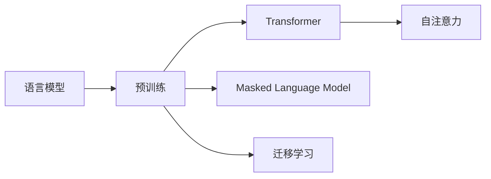

# 大语言模型原理与工程实践：核心架构

## 1. 背景介绍
### 1.1 问题的由来
近年来,随着深度学习技术的快速发展,自然语言处理(NLP)领域取得了突破性进展。其中,大语言模型(Large Language Model,LLM)作为 NLP 的一个重要分支,因其在语言理解、生成等任务上表现出色而备受关注。LLM 能够从海量文本数据中学习语言知识,具备强大的语言理解和生成能力,为智能对话、知识问答、文本摘要等应用提供了坚实基础。

### 1.2 研究现状
目前,业界已经涌现出一批优秀的大语言模型,如 GPT 系列、BERT、XLNet 等。这些模型在多个 NLP 任务上取得了 state-of-the-art 的表现,展现了 LLM 的巨大潜力。微软、谷歌、OpenAI 等科技巨头和研究机构也纷纷投入大量资源,致力于 LLM 的研究和应用。LLM 正在成为 NLP 领域的研究热点和产业发展的新引擎。

### 1.3 研究意义
LLM 的研究对于推动 NLP 技术进步、促进人机交互、赋能垂直行业应用具有重要意义:

1. 技术层面:LLM 的突破有望解决 NLP 领域长期存在的语义理解瓶颈,为构建更加智能的 NLP 系统奠定基础。 

2. 应用层面:LLM 可以广泛应用于智能客服、知识图谱、语义搜索等场景,提升系统的语言处理能力,创造更多商业价值。

3. 产业层面:LLM 的发展将推动 NLP 产业变革,催生更多创新应用和商业模式,为数字经济注入新动能。

### 1.4 本文结构
本文将围绕大语言模型的原理和工程实践展开,重点探讨其核心架构。内容安排如下:

- 第2部分介绍 LLM 的核心概念及其内在联系
- 第3部分阐述 LLM 的核心算法原理和具体操作步骤
- 第4部分建立 LLM 的数学模型,并结合案例进行公式推导和讲解
- 第5部分给出 LLM 的代码实例,并进行详细的解释说明
- 第6部分分析 LLM 的实际应用场景,展望其未来发展空间
- 第7部分推荐 LLM 相关的学习资源、开发工具和研究文献
- 第8部分总结全文,指出 LLM 的发展趋势与面临的挑战
- 第9部分列举 LLM 的常见问题,并给出专业解答

## 2. 核心概念与联系

大语言模型的核心概念包括:

1. 语言模型:对语言符号序列的概率分布进行建模,刻画语言单元之间的依赖关系和出现规律。LLM 本质上是一种强大的语言模型。

2. 预训练:在大规模无标注语料上进行自监督学习,让模型自主学习语言知识和模式。预训练是 LLM 的关键环节。

3. Transformer:一种基于自注意力机制的神经网络架构,能够有效建模长距离语言依赖。Transformer 是当前主流 LLM 的基础架构。

4. 自注意力:通过计算序列不同位置之间的注意力分数,动态地聚焦到关键信息。自注意力赋予了 LLM 强大的语境理解能力。  

5. Masked Language Model:通过随机遮挡词语,预测被遮挡位置的词语。MLM 是 BERT 等模型采用的预训练范式。

6. 迁移学习:将预训练模型应用到下游任务,通过微调适配任务数据。迁移学习使 LLM 具备了广泛的适用性。

这些概念环环相扣,共同构成了 LLM 的理论和方法体系:

## 3. 核心算法原理 & 具体操作步骤
### 3.1 算法原理概述
大语言模型的核心算法可以概括为基于 Transformer 的预训练和微调范式。具体来说:

1. 在大规模无标注语料上,利用 Transformer 编码器结构对语言进行建模,通过自监督学习目标(如 MLM)进行预训练,让模型学习通用语言知识。

2. 在下游任务数据上,在预训练模型的基础上添加任务特定的输出层,通过有监督微调使模型适应具体任务。

这一范式的关键在于利用预训练学习通用语言知识,再通过微调快速适应不同任务,实现知识的迁移和泛化。

### 3.2 算法步骤详解

LLM 的训练主要分为两个阶段:预训练和微调。

预训练阶段的主要步骤如下:

1. 语料准备:收集大规模高质量的无标注文本数据,进行清洗和预处理。

2. 输入表示:将词语映射为稠密向量(如 Word Embedding),同时加入位置编码以建模序列信息。

3. Transformer 编码:利用多层 Transformer 编码器对输入序列进行特征提取,通过自注意力机制建模语言单元之间的依赖关系。

4. 预训练任务:设计自监督学习目标,如 MLM、Next Sentence Prediction 等,让模型在完成这些任务的过程中学习语言知识。

5. 损失计算:基于预测结果和真实标签计算损失函数,如交叉熵损失。

6. 参数优化:利用优化算法(如 Adam)对模型参数进行更新,最小化损失函数。

7. 模型评估:在验证集上评估模型性能,如 MLM 准确率等。

微调阶段的主要步骤如下:

1. 任务数据准备:对下游任务的标注数据进行预处理,构建训练集和验证集。

2. 模型构建:在预训练模型的基础上,根据任务需求添加相应的输出层,如分类、序列标注等。

3. 损失计算:基于任务的预测结果和真实标签,计算特定的损失函数。

4. 参数微调:利用优化算法对模型参数进行微调,使其适应具体任务。通常只微调部分参数以防止过拟合。

5. 模型评估:在任务验证集上评估微调后模型的性能,如准确率、F1 值等。

6. 模型部署:将微调后的模型部署到实际应用环境中,进行推理和预测。

### 3.3 算法优缺点

LLM 算法的主要优点包括:

1. 语言理解能力强:通过在大规模语料上预训练,LLM 能够学习到丰富的语言知识,具备强大的语义理解能力。

2. 泛化能力好:预训练使 LLM 具备了可迁移的语言知识,使其能够快速适应不同的下游任务。

3. 应用范围广:LLM 可以应用于多种 NLP 任务,如文本分类、命名实体识别、问答系统等。

LLM 算法的主要缺点包括:

1. 计算资源要求高:训练 LLM 需要大规模的数据和算力,对计算资源要求较高。

2. 解释性不足:LLM 内部的语言表示和推理过程难以解释,存在一定的"黑盒"特性。

3. 偏见风险:LLM 从训练数据中学习,如果数据存在偏见,模型也可能继承这些偏见。

### 3.4 算法应用领域

LLM 可以广泛应用于以下领域:

1. 智能对话:通过 LLM 构建对话系统,实现人机自然交互。

2. 信息抽取:利用 LLM 从非结构化文本中抽取结构化知识。

3. 文本生成:应用 LLM 进行文本续写、摘要、翻译等生成任务。

4. 知识问答:基于 LLM 构建问答系统,回答用户的自然语言问题。

5. 情感分析:用 LLM 判断文本的情感倾向,如正面、负面、中性等。

## 4. 数学模型和公式 & 详细讲解 & 举例说明
### 4.1 数学模型构建

大语言模型的核心是建立单词序列的概率分布模型。给定单词序列 $w_1, w_2, \cdots, w_n$,语言模型的目标是估计其概率:

$$P(w_1, w_2, \cdots, w_n) = \prod_{i=1}^n P(w_i | w_1, w_2, \cdots, w_{i-1})$$

其中,$P(w_i | w_1, w_2, \cdots, w_{i-1})$ 表示在给定前 $i-1$ 个单词的条件下,第 $i$ 个单词为 $w_i$ 的条件概率。

在 Transformer 架构下,这一概率分布可以通过自注意力机制和前馈神经网络来建模:

$$h_i = \text{Transformer}(w_1, w_2, \cdots, w_i)$$

$$P(w_i | w_1, w_2, \cdots, w_{i-1}) = \text{softmax}(W_o \cdot h_i + b_o)$$

其中,$h_i$ 为第 $i$ 个位置的 Transformer 编码器输出,$W_o$ 和 $b_o$ 为输出层的参数。

### 4.2 公式推导过程

以 MLM 预训练任务为例,对数似然损失函数可以表示为:

$$L_{\text{MLM}} = -\sum_{i=1}^n m_i \log P(w_i | w_1, w_2, \cdots, w_{i-1}, w_{i+1}, \cdots, w_n)$$

其中,$m_i$ 为遮挡指示变量,若第 $i$ 个位置被遮挡则为 1,否则为 0。

结合 Transformer 编码器的输出,MLM 的预测概率可以表示为:

$$P(w_i | w_1, w_2, \cdots, w_{i-1}, w_{i+1}, \cdots, w_n) = \text{softmax}(W_o \cdot h_i^{\text{masked}} + b_o)$$

其中,$h_i^{\text{masked}}$ 为第 $i$ 个位置在被遮挡词语处的 Transformer 编码器输出。

假设词表大小为 $V$,softmax 函数定义为:

$$\text{softmax}(z_i) = \frac{e^{z_i}}{\sum_{j=1}^V e^{z_j}}$$

将 softmax 函数代入损失函数,并利用梯度下降法对参数进行优化:

$$\theta^{t+1} = \theta^t - \eta \cdot \nabla_\theta L_{\text{MLM}}$$

其中,$\theta$ 为模型参数,$\eta$ 为学习率。

### 4.3 案例分析与讲解

以下是一个 MLM 预训练的简单例子:

原始文本:"The quick brown fox jumps over the lazy dog."

遮挡后的文本:"The quick [MASK] fox [MASK] over the lazy dog."

MLM 任务就是预测出被 [MASK] 遮挡的单词。模型根据上下文信息,计算每个词语的概率分布:

$$P(\text{[MASK]}_1 = \text{brown} | \text{The quick [MASK] fox [MASK] over the lazy dog.})$$

$$P(\text{[MASK]}_2 = \text{jumps} | \text{The quick [MASK] fox [MASK] over the lazy dog.})$$

通过不断预测被遮挡词语,模型可以学习到单词之间的依赖关系和语言规律。

### 4.4 常见问题解答

Q:MLM 预训练的优点是什么?

A:MLM 可以学习双向语境信息,捕捉单词之间的深层次关系,有利于下游任务的 fine-tuning。同时,MLM 可以缓解传统语言模型的"曝光偏差"问题。

Q:Transformer 相比 RNN/LSTM 的优势是什么?

A:Transformer 通过自注意力机制建模任意距离的语言依赖,并行计算效率更高。同时,Transformer 不受长期依赖问题的影响,更适合处理长文本序列。

## 5. 项目实践：代码实例和详细解释说明
### 5.1 开发环境搭建

本项目基于 Python 3 和 PyT