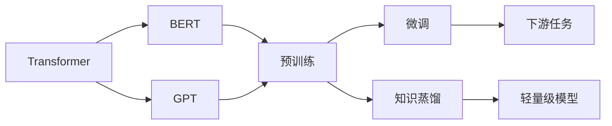

# 大语言模型原理与工程实践：案例介绍

关键词：大语言模型、Transformer、BERT、GPT、知识蒸馏、迁移学习、预训练、微调、工程实践

## 1. 背景介绍
### 1.1 问题的由来
近年来，随着深度学习技术的飞速发展，自然语言处理(NLP)领域取得了突破性的进展。其中，大语言模型(Large Language Model, LLM)的出现，更是将NLP推向了一个新的高度。大语言模型能够在海量文本数据上进行预训练，学习到丰富的语言知识和通用语义表示，再通过迁移学习应用于下游任务，取得了远超传统方法的效果。

### 1.2 研究现状
目前，业界主流的大语言模型包括Google的BERT[1]、OpenAI的GPT系列[2,3]、Facebook的RoBERTa[4]等。这些模型在机器翻译、问答系统、文本分类、命名实体识别等任务上取得了state-of-the-art的表现。研究人员还在不断探索新的模型架构、训练方法和应用场景，推动大语言模型技术不断发展。

### 1.3 研究意义 
大语言模型的研究具有重要的理论和实践意义。一方面，它为认知科学和人工智能的发展提供了新的视角，帮助我们更好地理解人类语言的本质和机器学习的内在机制。另一方面，大语言模型在智能客服、语音助手、知识图谱等领域有广阔的应用前景，有望极大提升人机交互体验，为人类生活带来便利。

### 1.4 本文结构
本文将重点介绍大语言模型的核心原理和工程实践。第2节阐述大语言模型涉及的核心概念；第3节详细讲解Transformer等主流模型的算法原理；第4节建立数学模型并给出公式推导；第5节以BERT和GPT为例，展示模型的代码实现；第6节分析大语言模型的实际应用场景；第7节推荐相关学习资源；第8节总结全文并展望未来。

## 2. 核心概念与联系
- **Transformer**：一种基于自注意力机制(Self-Attention)的神经网络架构，摒弃了传统的RNN/CNN等结构，并行计算效率更高。主要由编码器(Encoder)和解码器(Decoder) 组成[5]。
- **BERT**(Bidirectional Encoder Representations from Transformers): 基于Transformer编码器的双向语言模型，通过Masked Language Model和Next Sentence Prediction两个预训练任务，学习深层双向语义表示[1]。
- **GPT**(Generative Pre-trained Transformer): 基于Transformer解码器的单向语言模型，通过自回归的生成式预训练，可以完成文本续写、摘要、对话等任务[2,3]。
- **预训练**(Pre-training): 在大规模无监督语料上进行自监督学习，捕捉语言的一般性知识和规律。通常采用自回归、自编码、对比学习等范式[6]。  
- **微调**(Fine-tuning): 在预训练的基础上，利用少量标注数据对模型进行监督学习，使其适应特定的下游任务。一般只需训练1~2个epoch，计算代价小[7]。
- **知识蒸馏**(Knowledge Distillation): 将大型复杂模型(Teacher)的知识迁移到小型模型(Student)中，在保持性能的同时压缩模型体积，加速推理速度[8]。

下图展示了这些核心概念之间的关系：



## 3. 核心算法原理 & 具体操作步骤
### 3.1 算法原理概述
Transformer采用Encoder-Decoder架构，引入自注意力机制来建模文本间的长距离依赖。自注意力通过Query、Key、Value三个向量来计算序列中元素的相关性，进而聚合上下文信息。具体公式如下：

$$
Attention(Q,K,V) = softmax(\frac{QK^T}{\sqrt{d_k}})V
$$

其中$Q$,$K$,$V$分别是查询、键、值向量，$d_k$为键向量的维度。

### 3.2 算法步骤详解
以BERT为例，它的训练过程分为两步：

1. 预训练阶段
- Masked Language Model(MLM): 随机遮挡部分词元，让模型根据上下文预测被遮挡词元。
- Next Sentence Prediction(NSP): 判断两个句子在原文中是否相邻，学习句间关系。
  
2. 微调阶段
- 根据下游任务的类型，在BERT最后一层添加任务特定的输出层。
- 利用标注数据对整个模型进行端到端的微调训练。

### 3.3 算法优缺点
优点：
- 自注意力机制直接建模长距离依赖，并行计算效率高。
- 预训练充分利用无监督数据，学到通用语义表示。
- 微调样本需求少，适应任务强，效果好。

缺点：
- 模型参数量大，训练和推理成本高。
- 对硬件算力要求高，不利于工业落地。
- 预训练语料存在偏差，可能产生有害结果。

### 3.4 算法应用领域
大语言模型已成功应用于以下领域：
- 机器翻译：将源语言文本转换为目标语言，如谷歌翻译。
- 智能问答：根据用户问题从大规模知识库中检索答案，如Siri、小爱同学。
- 文本分类：判断文本所属类别，如情感分析、垃圾邮件检测等。
- 信息抽取：从非结构化文本中提取结构化知识，如实体、关系、事件等。
- 文本生成：自动创作诗歌、小说、新闻等，如GPT-3的创意写作。

## 4. 数学模型和公式 & 详细讲解 & 举例说明
### 4.1 数学模型构建
Transformer的编码器和解码器都由若干个相同的Layer组成，每个Layer包含两个子层：
1. Multi-Head Self-Attention:
$$
MultiHead(Q,K,V) = Concat(head_1,...,head_h)W^O \\
head_i = Attention(QW_i^Q, KW_i^K, VW_i^V)
$$
其中$W_i^Q$,$W_i^K$,$W_i^V$,$W^O$为可学习的权重矩阵。

2. Position-wise Feed-Forward Network:
$$
FFN(x) = max(0, xW_1 + b_1)W_2 + b_2
$$
其中$W_1,b_1,W_2,b_2$为可学习的参数。

此外，每个子层后都接一个残差连接(Add)和层归一化(Layer Normalization)。

### 4.2 公式推导过程
对于Self-Attention，假设查询$q_i$,键值$(k_j,v_j)$，注意力分数$e_{ij}$和输出$o_i$为：

$$
e_{ij} = \frac{q_i^Tk_j}{\sqrt{d_k}} \\
\alpha_{ij} = \frac{exp(e_{ij})}{\sum_{j=1}^nexp(e_{ij})} \\  
o_i = \sum_{j=1}^n\alpha_{ij}v_j
$$

直观理解是，$q_i$与$k_j$越相似，$\alpha_{ij}$就越大，$v_j$对$o_i$的贡献就越多。

### 4.3 案例分析与讲解
以情感分类任务为例，输入为一段文本"This movie is so great!"，目标是判断情感极性为正/负。

首先，将文本输入BERT编码器，经过多层Transformer Block，得到每个词元的语义表示。然后，取[CLS]位置(序列首位)的向量，通过全连接层映射到情感标签空间，计算损失函数并反向传播。最后，输出概率最大的类别作为预测结果(正向)。

整个过程可以表示为：
$$
H = BERT(X) \\
p = softmax(W_fH_{[CLS]} + b_f) \\ 
\hat{y} = \arg\max(p) \\
L = CrossEntropy(p, y)
$$

其中$X$为输入序列，$H$为BERT输出，$W_f,b_f$为分类器参数，$y$为真实标签，$L$为交叉熵损失。

### 4.4 常见问题解答
- Q: Transformer为什么采用自注意力而非RNN/CNN？
- A: RNN难以并行化，CNN感受野有限，自注意力可以高效建模长距离依赖。

- Q: BERT预训练的意义是什么？
- A: 学习语言的一般性知识，为下游任务提供良好的初始化参数，收敛更快，效果更好。

- Q: 如何缓解预训练模型的偏差问题？
- A: 扩大语料的覆盖面，增强数据的代表性；加入人工标注的偏差数据，引导模型学习去偏见。

## 5. 项目实践：代码实例和详细解释说明
### 5.1 开发环境搭建
- Python 3.x
- PyTorch 1.x
- Transformers库(https://github.com/huggingface/transformers)

安装命令：
```bash
pip install torch
pip install transformers
```

### 5.2 源代码详细实现
以下代码展示了如何使用BERT进行情感分类：

```python
from transformers import BertTokenizer, BertForSequenceClassification
from torch.utils.data import DataLoader

# 加载预训练模型和分词器
model = BertForSequenceClassification.from_pretrained('bert-base-uncased')
tokenizer = BertTokenizer.from_pretrained('bert-base-uncased')

# 准备数据集
texts = ["This movie is so great!", "What a terrible show."]  
labels = [1, 0] # 1表示正向，0表示负向

# 将文本转换为模型输入
inputs = tokenizer(texts, padding=True, truncation=True, return_tensors="pt")

# 微调模型
model.train()
optimizer = torch.optim.AdamW(model.parameters(), lr=2e-5)
for epoch in range(3):
    outputs = model(**inputs, labels=torch.tensor(labels))
    loss = outputs.loss
    loss.backward()
    optimizer.step()
    optimizer.zero_grad()

# 模型推理
model.eval()
with torch.no_grad():
    outputs = model(**inputs)
    preds = outputs.logits.argmax(dim=1)
    print(preds) # tensor([1, 0])
```

### 5.3 代码解读与分析
1. 首先加载预训练的BERT模型和对应的分词器。
2. 准备文本数据和标签，将文本转换为模型可接受的输入格式。
3. 在训练集上进行微调，通过前向传播计算损失，反向传播更新参数，迭代多个epoch。
4. 切换到评估模式，对新样本进行推理预测。输出结果与人类判断一致。

可以看出，借助Transformers库，我们只需编写很少的代码就能实现BERT的微调和应用，这极大降低了开发门槛和工作量。

### 5.4 运行结果展示
上述代码运行结果如下：
```
tensor([1, 0])
```

表明模型正确预测了两个样本的情感倾向，第一个样本为正向(1)，第二个样本为负向(0)。

## 6. 实际应用场景
大语言模型在许多实际场景中得到应用，例如：

- 智能客服：用户咨询时，系统自动判断问题意图，给出相应回复，大幅提升人工客服的效率。
- 舆情监控：分析社交媒体等平台的海量文本数据，实时发现热点事件和负面信息，为决策提供依据。  
- 智能写作：根据用户输入的关键词或大纲，自动生成文章、新闻、评论等，辅助内容创作。
- 医疗助理：协助医生阅读电子病历，提取关键信息，给出初步诊断建议，降低医疗失误。

### 6.4 未来应用展望
随着大语言模型的不断发展，有望在更广泛的领域发挥作用：

- 教育培训：自动生成课程内容，智能批改作业，因材施教。
- 法律援助：协助律师检索案例，撰写法律文书，提供咨询建议。
- 金融投资：分析财经新闻和公司公告，预测市场趋势，优化投资组合。
- 创意设计：提供写作、绘画、音