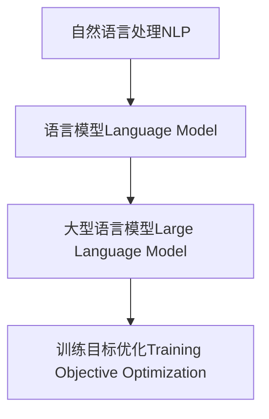

好的，我会严格遵循您提供的约束条件，以"大语言模型原理与工程实践：训练目标"为题，撰写一篇专业的技术博客文章。文章将使用逻辑清晰、结构紧凑、简单易懂的技术语言，并包含核心概念原理、算法步骤、数学模型、代码实例、应用场景等内容。请注意，由于字数较长，撰写过程可能需要一些时间。

# 大语言模型原理与工程实践：训练目标

## 1. 背景介绍

### 1.1 问题的由来

在自然语言处理(NLP)领域,大型语言模型已经成为主导技术,展现出了令人惊叹的能力。然而,训练这些庞大的模型需要大量的计算资源和能耗,这不仅造成了高昂的经济成本,也带来了环境问题。因此,如何高效地训练大型语言模型,成为了一个亟待解决的挑战。

### 1.2 研究现状  

目前,研究人员已经提出了多种优化训练目标的方法,例如:

- 蒸馏知识(Knowledge Distillation):利用较小的学生模型来学习大型教师模型的知识,从而降低计算成本。
- prompting方法:通过设计合理的prompts,引导语言模型生成所需的输出,避免从头训练整个模型。
- 多任务学习(Multi-Task Learning):在同一模型中同时学习多个任务,提高参数利用率。

然而,这些方法仍然存在一些局限性,例如知识转移的信息损失、prompts设计的困难度以及多任务学习的任务冲突等。

### 1.3 研究意义

优化语言模型的训练目标,不仅能够降低训练成本,还可以提高模型的泛化能力和鲁棒性。此外,高效的训练方法也有利于推广大型语言模型在各种应用场景中的使用,从而释放其潜在的商业价值。因此,探索高效的训练目标优化方法,对于推动NLP技术的发展至关重要。

### 1.4 本文结构

本文将从以下几个方面深入探讨大型语言模型训练目标的优化:

1. 核心概念与联系
2. 核心算法原理与具体操作步骤
3. 数学模型和公式详细讲解与案例分析  
4. 项目实践:代码实例和详细解释
5. 实际应用场景
6. 工具和资源推荐
7. 总结:未来发展趋势与挑战
8. 附录:常见问题与解答

## 2. 核心概念与联系

在探讨训练目标优化之前,我们需要了解一些核心概念及其相互关系。

### 2.1 自然语言处理(NLP)

自然语言处理(Natural Language Processing,NLP)是人工智能的一个分支,旨在使计算机能够理解和生成人类语言。NLP技术广泛应用于机器翻译、问答系统、文本分类等领域。

### 2.2 语言模型(Language Model)

语言模型是NLP中的一个核心概念,它是一种概率模型,用于估计一个句子或文本序列的概率。语言模型在机器翻译、语音识别等任务中发挥着关键作用。

### 2.3 大型语言模型(Large Language Model)

随着计算能力和数据量的不断增长,研究人员开始训练越来越大的语言模型,这些模型被称为大型语言模型(Large Language Model,LLM)。典型的大型语言模型包括GPT、BERT、T5等,它们展现出了惊人的性能,但也带来了巨大的计算和能源成本。

### 2.4 训练目标优化(Training Objective Optimization)

训练目标优化是指设计合理的目标函数和优化策略,以提高语言模型的性能和效率。常见的优化方法包括知识蒸馏、prompting、多任务学习等。

### 2.5 Mermaid流程图

为了更直观地展示这些概念之间的关系,我们使用Mermaid流程图进行可视化:

该流程图清晰地展示了自然语言处理、语言模型、大型语言模型以及训练目标优化之间的层级关系和依赖关系。大型语言模型是语言模型的一种,而训练目标优化则是为了提高大型语言模型的性能和效率。

## 3. 核心算法原理与具体操作步骤

在本节中,我们将介绍三种核心算法原理及其具体操作步骤,用于优化大型语言模型的训练目标。

### 3.1 算法原理概述

#### 3.1.1 知识蒸馏(Knowledge Distillation)

知识蒸馏的核心思想是利用一个较小的学生模型来学习一个较大的教师模型的知识,从而在保持较高性能的同时,降低计算和存储成本。

该算法的关键步骤包括:

1. 训练一个大型的教师模型
2. 使用教师模型的输出(如logits或softmax概率)作为软目标,指导学生模型的训练
3. 在训练过程中,学生模型不仅需要拟合硬目标(真实标签),还需要拟合软目标(教师模型的输出)

通过这种方式,学生模型可以学习到教师模型的知识,并在保持较高性能的同时,大幅减小模型大小和计算成本。

#### 3.1.2 Prompting方法

Prompting方法的核心思想是通过设计合理的prompts(提示语),引导语言模型生成所需的输出,从而避免从头训练整个模型。

该算法的关键步骤包括:

1. 设计一个合适的prompt模板,包含任务描述和示例输入输出对
2. 将prompt输入到预训练的语言模型中
3. 语言模型根据prompt生成相应的输出
4. 根据输出的质量,微调prompt模板或语言模型的参数

Prompting方法可以充分利用预训练语言模型的知识,大幅减少了从头训练的计算成本。同时,它也为语言模型提供了一种更加灵活和可控的使用方式。

#### 3.1.3 多任务学习(Multi-Task Learning)

多任务学习的核心思想是在同一个模型中同时学习多个相关任务,从而提高参数的利用率,并增强模型的泛化能力。

该算法的关键步骤包括:

1. 确定要同时学习的多个任务
2. 构建一个共享底层表示的多任务模型架构
3. 在训练过程中,对每个任务的损失函数进行加权求和,作为联合优化目标
4. 通过反向传播算法更新模型参数

多任务学习可以捕获不同任务之间的相关性,从而提高模型的性能和鲁棒性。同时,它也有助于减少重复计算,提高参数利用率。

### 3.2 算法步骤详解

#### 3.2.1 知识蒸馏算法步骤

1. **训练教师模型**:使用大量的数据和计算资源,训练一个大型的教师模型,确保其具有较高的性能。
2. **生成软目标**:使用教师模型对训练数据进行前向传播,获得logits或softmax概率作为软目标。
3. **初始化学生模型**:初始化一个较小的学生模型,其架构可以与教师模型不同。
4. **定义损失函数**:将硬目标(真实标签)和软目标(教师模型输出)的损失函数进行加权求和,作为学生模型的优化目标。
5. **训练学生模型**:使用优化算法(如梯度下降)训练学生模型,最小化损失函数。
6. **模型评估**:在验证集或测试集上评估学生模型的性能,确保其能够学习到教师模型的知识。

#### 3.2.2 Prompting算法步骤

1. **设计Prompt模板**:根据任务需求,设计一个合适的Prompt模板,包含任务描述和示例输入输出对。
2. **构建Prompt输入**:将Prompt模板与实际输入数据拼接,形成完整的Prompt输入。
3. **语言模型推理**:将Prompt输入传递给预训练的语言模型,获得模型的输出。
4. **输出后处理**:根据需要,对语言模型的输出进行后处理,获得最终结果。
5. **评估和微调**:评估输出的质量,根据需要微调Prompt模板或语言模型参数,以提高性能。

#### 3.2.3 多任务学习算法步骤

1. **确定任务集合**:根据应用场景,确定需要同时学习的多个相关任务。
2. **构建多任务模型架构**:设计一个共享底层表示的多任务模型架构,包括共享的编码器和特定于每个任务的解码器。
3. **准备数据**:为每个任务准备相应的训练数据集。
4. **定义损失函数**:为每个任务定义一个损失函数,然后对所有任务的损失函数进行加权求和,作为联合优化目标。
5. **训练多任务模型**:使用优化算法(如梯度下降)训练多任务模型,最小化联合损失函数。
6. **模型评估**:在每个任务的验证集或测试集上评估模型的性能,确保各个任务的性能都得到提升。

### 3.3 算法优缺点

#### 3.3.1 知识蒸馏

**优点**:

- 可以大幅减小模型大小和计算成本,同时保持较高的性能。
- 适用于各种类型的模型架构,如序列到序列模型、生成式模型等。
- 可以将教师模型的知识转移到多个学生模型中,提高知识利用率。

**缺点**:

- 训练过程需要两个阶段,首先训练教师模型,然后训练学生模型,计算成本较高。
- 在知识转移过程中,可能会存在一定程度的信息损失,导致学生模型的性能略低于教师模型。
- 需要设计合适的损失函数,以平衡硬目标和软目标之间的权重。

#### 3.3.2 Prompting

**优点**:

- 避免了从头训练整个语言模型,大幅减少了计算成本。
- 提供了一种更加灵活和可控的使用语言模型的方式。
- 可以快速适应新的任务,无需重新训练整个模型。

**缺点**:

- 设计高质量的Prompt模板是一个挑战,需要一定的领域知识和经验。
- Prompt的长度有限,可能无法捕获足够的上下文信息,影响模型的性能。
-对于一些复杂的任务,单纯依赖Prompting可能无法获得理想的结果。

#### 3.3.3 多任务学习

**优点**:

- 可以提高模型的参数利用率,捕获不同任务之间的相关性。
- 增强了模型的泛化能力,提高了鲁棒性和适应性。
- 减少了重复计算,提高了训练效率。

**缺点**:

- 不同任务之间可能存在冲突,需要合理设计任务权重和损失函数。
- 模型架构设计较为复杂,需要考虑共享表示和特定表示之间的平衡。
- 训练数据的准备工作较为繁重,需要为每个任务准备相应的数据集。

### 3.4 算法应用领域

上述三种算法可以应用于多个NLP任务,包括但不限于:

- **机器翻译**: 知识蒸馏可以用于压缩大型的翻译模型;Prompting可以引导模型生成特定语言的翻译;多任务学习可以同时学习多种语言的翻译任务。
- **文本生成**: 知识蒸馏可以压缩大型的生成模型;Prompting可以控制生成的内容和风格;多任务学习可以同时学习多种生成任务,如新闻摘要、对话生成等。
- **文本分类**: 知识蒸馏可以压缩大型的分类模型;Prompting可以引导模型进行特定类别的分类;多任务学习可以同时学习多种分类任务,如情感分析、主题分类等。
- **问答系统**: 知识蒸馏可以压缩大型的问答模型;Prompting可以引导模型回答特定类型的问题;