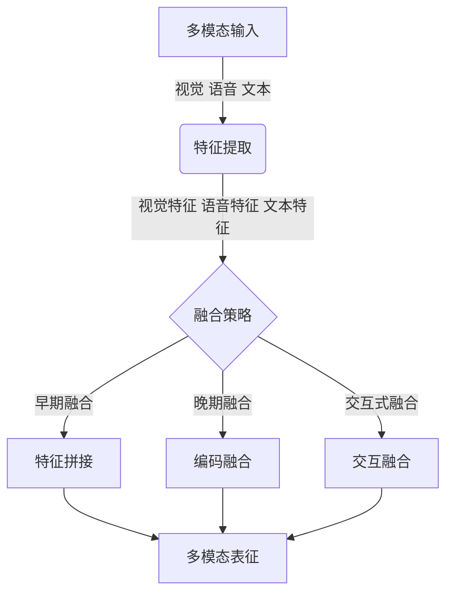
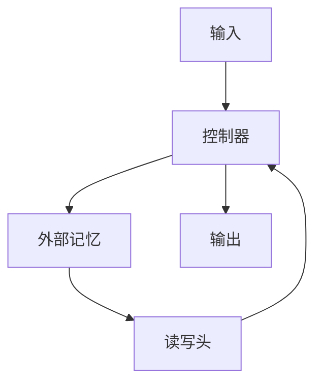
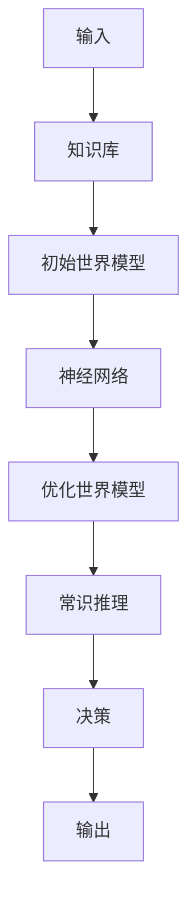
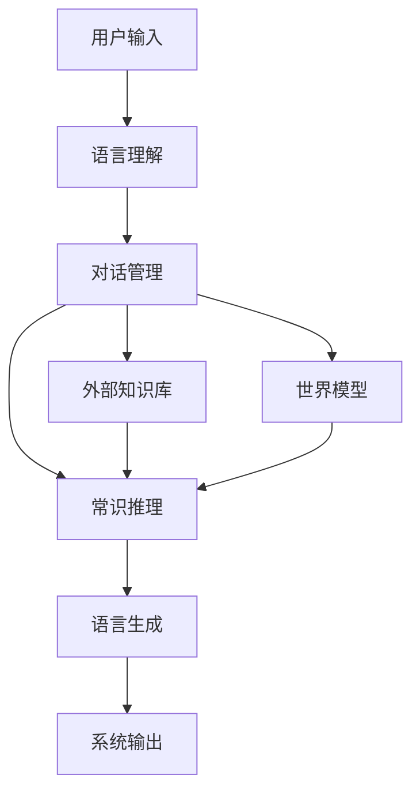
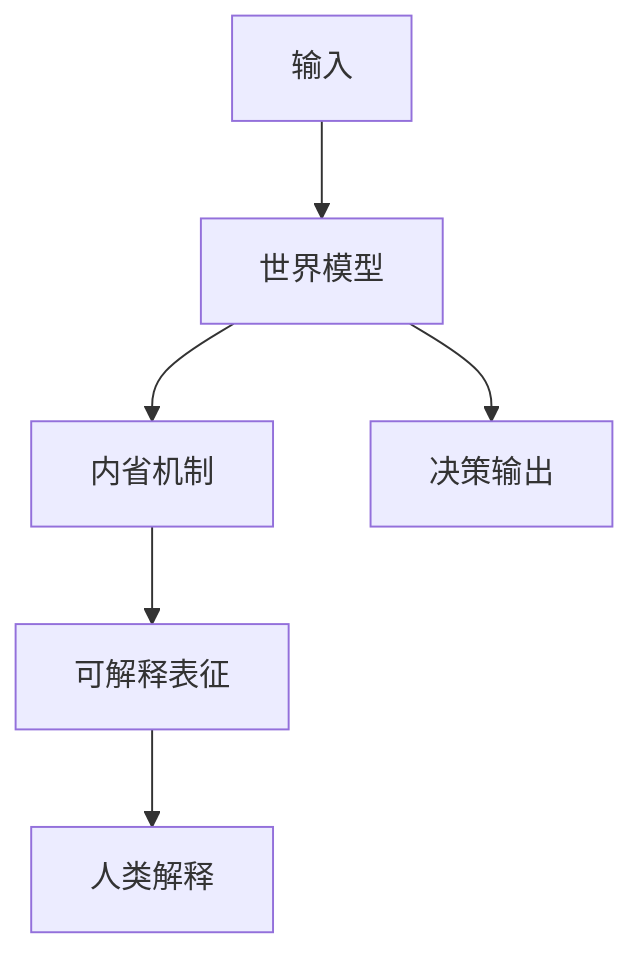

# 大语言模型原理基础与前沿 世界模型

## 1. 背景介绍

### 1.1 问题的由来

在过去的几年里,自然语言处理(NLP)领域取得了长足的进步,很大程度上归功于transformer模型和大规模语言模型的出现。这些模型通过在大量文本数据上进行预训练,学习到了丰富的语言知识,展现出令人惊叹的泛化能力。然而,现有的大语言模型仍然存在一些局限性和挑战,例如:

1. **缺乏持久记忆能力**:大多数语言模型只能关注有限的上下文窗口,无法很好地捕捉长期依赖关系。
2. **缺乏常识推理能力**:语言模型通常缺乏对真实世界的理解,难以进行复杂的推理和决策。
3. **缺乏交互能力**:现有模型主要关注单向生成,无法与人类进行自然的对话交互。
4. **缺乏解释能力**:大型语言模型通常是黑盒子,难以解释其内部工作机理。
5. **训练成本高昂**:训练大型语言模型需要消耗大量的计算资源和能源。

为了应对这些挑战,研究人员提出了"世界模型(World Model)"的概念,旨在构建能够真正理解和模拟现实世界的人工智能系统。世界模型致力于整合多模态感知、持久记忆、常识推理、交互能力和可解释性等关键能力,最终实现通用人工智能(Artificial General Intelligence, AGI)的目标。

### 1.2 研究现状

目前,世界模型的研究仍处于起步阶段,主要集中在以下几个方向:

1. **多模态感知**:通过整合视觉、语音、文本等多种模态信息,构建对现实世界的多维度理解。
2. **持久记忆与世界建模**:设计新的神经网络架构和训练范式,赋予模型持久的记忆能力,逐步构建对世界的内部表征。
3. **常识推理与决策**:引入外部知识库,结合符号推理和机器学习,增强模型的常识推理和决策能力。
4. **交互与对话系统**:探索新的交互范式,实现与人类自然、流畅的对话交互。
5. **可解释性与可信赖性**:提高模型的透明度和可解释性,确保其行为的可靠性和可控性。

虽然取得了一些初步进展,但构建真正的世界模型仍面临着诸多挑战,需要长期的持续探索和突破。

### 1.3 研究意义

世界模型的研究具有重大的理论意义和应用价值:

- **理论意义**:世界模型旨在揭示人工智能系统获得通用智能的根本途径,是人工智能领域的终极目标之一。它将推动我们对认知、推理、学习和交互等智能过程的深入理解。

- **应用价值**:世界模型有望催生下一代智能系统,在众多领域产生变革性影响,如智能助手、自动驾驶、智能机器人、智能决策支持系统等。它将极大提升人工智能在复杂环境中的适应性和自主性。

### 1.4 本文结构

本文将全面介绍世界模型的基础理论、核心技术、实践应用及未来发展趋势。具体来说,将包括以下几个方面的内容:

1. 核心概念与联系
2. 核心算法原理与具体操作步骤
3. 数学模型和公式详细讲解与案例分析  
4. 项目实践:代码实例和详细解释说明
5. 实际应用场景
6. 工具和资源推荐
7. 总结:未来发展趋势与挑战
8. 附录:常见问题与解答

接下来,我们将逐一深入探讨上述各个方面。

## 2. 核心概念与联系

世界模型是一个庞大而复杂的研究领域,涉及多个核心概念及其相互关联。我们将从以下几个核心概念入手,阐述它们的内涵及相互联系:

1. **多模态感知**
2. **持久记忆与世界建模**  
3. **常识推理与决策**
4. **交互与对话系统**
5. **可解释性与可信赖性**

### 2.1 多模态感知

多模态感知是指通过整合视觉、语音、文本等多种模态信息,构建对现实世界的多维度理解。人类的认知就是一个典型的多模态过程,我们通过视觉、听觉、触觉等多种感官通道获取信息,并在大脑中融合形成对世界的统一表征。

类似地,世界模型也需要具备多模态感知能力,以全面感知和理解复杂的现实环境。例如,一个智能机器人不仅需要识别视觉场景,还需要理解语音指令并结合环境上下文作出反应。

实现多模态感知的一个关键是多模态融合,即如何有效地将不同模态的信息整合到统一的表征空间中。常见的方法包括早期融合(直接拼接特征)、晚期融合(分别编码后融合)和交互式融合(模态间信息交互)等。

多模态感知为世界模型提供了全面的信息输入,是构建对现实世界表征的基础。但仅靠感知是不够的,我们还需要设计合理的内部结构,对感知信息进行持久的记忆和建模。

### 2.2 持久记忆与世界建模

持久记忆是指模型能够长期保留和积累经验知识的能力,而不是像现有语言模型那样只关注短期上下文。世界建模则是指基于持久记忆,逐步构建对现实世界的内部表征。

为了实现持久记忆,一种常见的方法是引入外部记忆单元,例如神经图灵机(Neural Turing Machine)和神经计算机(Neural Computer)等。这些架构通过增加可读写的记忆模块,赋予神经网络持久存储和检索信息的能力。

另一种思路是设计新的神经网络架构,使其内部具有持久记忆的倾向性。例如,通过门控循环单元(GRU)或长短期记忆网络(LSTM)等递归结构,模型可以学会选择性地保留和遗忘信息。一些最新的工作还探索了基于注意力机制和平行计算的持久记忆架构。

除了持久记忆,世界建模的另一个核心是如何有效地对现实世界进行内部表征。一种可能的方式是借鉴认知科学中的"概念模型"理论,通过符号化的结构(如图、树、逻辑规则等)来表示世界知识。另一种思路是利用深度学习的强大表征能力,让模型自主学习世界的隐式表征。

无论采用何种方式,持久记忆和世界建模都为模型提供了对现实世界的长期理解和内化,这是实现高级认知能力(如常识推理、决策等)的关键基础。

### 2.3 常识推理与决策

常识推理是指基于对现实世界的理解,进行符合人类常识的推理和判断。决策则是根据推理结果,作出相应的行为选择。这两个能力对于世界模型而言至关重要,是实现自主智能行为的核心。

常识推理涉及多种复杂的认知过程,如因果推理、类比推理、归纳推理等。要赋予模型这些能力,需要将符号化的常识知识库与连续的神经网络表征相结合。一种可能的方式是先用知识库构建一个初始的"世界模型",然后通过机器学习不断优化和扩充这一模型。

决策则需要基于推理结果,综合考虑目标、约束和效用,选择最优行为方案。这可以借鉴强化学习、规划算法等技术,将推理所得的世界模型与奖赏信号相结合,通过试错学习获得最佳策略。

值得注意的是,常识推理和决策往往需要处理不确定性和模糊性,因此概率推理和模糊逻辑等技术也将发挥重要作用。

### 2.4 交互与对话系统

交互是世界模型的另一个重要组成部分。理想的世界模型不应是一个封闭的系统,而应能够主动获取信息,并与人类或环境进行自然的交互和对话。

实现自然语言交互的一个关键是设计高效的对话管理模块。该模块需要能够跟踪对话状态、理解用户意图、管理对话流程等。同时,它还需要与语言理解、常识推理等其他模块紧密集成,形成一个端到端的对话系统。

除了自然语言交互,世界模型还需要能够通过其他模态(如视觉、手势等)与人类和环境进行交互。这将需要多模态融合、计算机视觉等多种技术的支持。

值得注意的是,交互不仅是世界模型的一个重要组成部分,也是获取训练数据和持续学习的重要途径。通过与人类和环境的互动,世界模型可以不断获取新的经验,更新和完善其内部表征。

### 2.5 可解释性与可信赖性

可解释性和可信赖性是保证世界模型安全有效运行的关键因素。由于世界模型的复杂性,它的内部工作机理很可能是一个黑盒,难以被人类理解和解释。然而,对于一个将广泛应用于现实环境的智能系统而言,确保其行为的可解释性和可信赖性至关重要。

实现可解释性的一个可能途径是设计内省机制,让模型能够自我解释其内部状态和决策过程。另一种思路是借助可解释的中间表征(如概念模型、逻辑规则等),使模型的工作过程对人类可解释。

可信赖性则需要从多个角度入手,包括数据质量、模型稳健性、安全性和伦理性等。例如,我们需要保证训练数据的多样性和公正性,防止模型学习到有偏见的知识;我们需要提高模型对噪声和对抗性攻击的鲁棒性;我们还需要考虑模型决策的潜在风险,并设置适当的约束和控制机制。

通过不断改进可解释性和可信赖性,我们才能确保世界模型的安全可控,并最终获得人类的信任和认可。

以上几个核心概念相互关联、环环相扣,共同构成了世界模型的基本框架。多模态感知为世界模型提供信息输入,持久记忆和世界建模让模型内化这些信息,常识推理和决策赋予模型智能行为能力,交互系统使模型能够主动获取信息并与外界交流,而可解释性和可信赖性则确保了模型的安全性和可控性。

只有将这些关键组件有机结合,我们才能最终构建出真正通用的人工智能系统。接下来,我们将深入探讨世界模型的核心算法原理和具体实现细节。

## 3