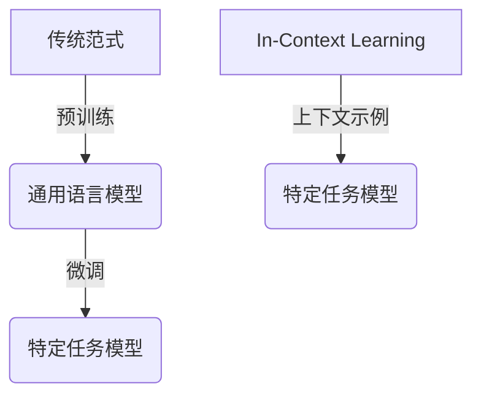

# 大语言模型原理基础与前沿：为什么ICL有效

## 1. 背景介绍

### 1.1 问题的由来

随着深度学习技术的不断发展,大型语言模型在自然语言处理领域取得了令人瞩目的成就。然而,训练这些庞大的模型需要消耗大量的计算资源,导致了高昂的计算成本和碳排放。此外,大型语言模型在推理过程中存在一些固有缺陷,例如缺乏一致性、可解释性和可控性。为了解决这些问题,研究人员提出了一种新的训练范式:内循环学习(In-Context Learning,ICL)。

### 1.2 研究现状

目前,大多数大型语言模型都采用了传统的预训练-微调范式。这种范式包括两个阶段:首先在大量无监督文本数据上进行自监督预训练,获得一个通用的语言模型;然后在特定任务的有监督数据上进行微调,将通用模型转化为特定任务的模型。虽然这种方法取得了一定的成功,但它存在一些固有的缺陷,如计算成本高、数据效率低以及缺乏一致性和可解释性。

相比之下,ICL是一种新兴的范式,它通过在上下文示例中直接学习任务,从而避免了预训练和微调的过程。ICL不仅能够显著降低计算成本,还能提高模型的一致性、可解释性和可控性。近年来,ICL在自然语言处理任务中取得了令人鼓舞的成绩,引起了广泛关注。

### 1.3 研究意义

探索ICL的原理和优势具有重要的理论和实践意义。从理论层面上,深入研究ICL有助于我们更好地理解大型语言模型的学习机制,揭示其背后的本质原理。从实践层面上,ICL有望成为一种新的范式,为训练高效、可解释和可控的大型语言模型提供一种有力的解决方案。

### 1.4 本文结构

本文将全面探讨ICL的原理、优势和挑战。首先,我们将介绍ICL的核心概念和与传统范式的联系。接下来,我们将深入剖析ICL的核心算法原理和具体操作步骤,并讨论其数学模型和公式推导过程。然后,我们将通过代码实例和实际应用场景,展示ICL在实践中的应用。最后,我们将总结ICL的发展趋势和面临的挑战,并提供相关的工具和资源推荐。

## 2. 核心概念与联系

ICL与传统的预训练-微调范式有着密切的联系。传统范式首先在大量无监督数据上进行自监督预训练,获得一个通用的语言模型。然后,在特定任务的有监督数据上进行微调,将通用模型转化为特定任务的模型。

与传统范式不同,ICL直接在上下文示例中学习特定任务,避免了预训练和微调的过程。ICL利用一种称为"prompt"的技术,将任务表示为一个或多个上下文示例,并要求模型在给定的上下文中生成正确的输出。通过这种方式,模型可以直接从上下文示例中学习任务,而无需进行预训练和微调。

ICL的核心思想是利用大型语言模型强大的文本理解和生成能力,通过上下文示例来指导模型学习特定任务。这种方法不仅能够显著降低计算成本,还能提高模型的一致性、可解释性和可控性。

## 3. 核心算法原理与具体操作步骤

### 3.1 算法原理概述

ICL算法的核心原理是通过上下文示例来指导模型学习特定任务。具体来说,ICL算法包括以下几个关键步骤:

1. **构建上下文示例**:首先,我们需要为特定任务构建一个或多个上下文示例。这些示例应该能够清晰地表达任务的目标和要求,并提供足够的上下文信息来指导模型学习。

2. **模型推理**:将上下文示例输入到大型语言模型中,要求模型在给定的上下文中生成正确的输出。这个过程类似于传统的语言模型推理,但是输入包含了任务相关的上下文信息。

3. **损失计算**:将模型生成的输出与ground truth进行比较,计算损失函数。损失函数的选择取决于具体任务,可以是序列生成任务的交叉熵损失,也可以是其他形式的损失函数。

4. **模型更新**:根据计算得到的损失,使用优化算法(如梯度下降)更新模型参数,使模型能够更好地适应给定的上下文示例和任务要求。

5. **迭代训练**:重复步骤2-4,直到模型在验证集上达到满意的性能或者达到预设的训练轮数。

通过上述步骤,ICL算法能够利用上下文示例中蕴含的任务信息,直接指导大型语言模型学习特定任务,从而避免了传统范式中预训练和微调的过程。

### 3.2 算法步骤详解

下面我们将详细解释ICL算法的每一个步骤:

#### 3.2.1 构建上下文示例

构建高质量的上下文示例是ICL算法成功的关键。一个好的上下文示例应该具备以下特点:

1. **任务相关性**:上下文示例应该能够清晰地表达任务的目标和要求,提供足够的信息来指导模型学习。

2. **多样性**:为了确保模型能够泛化到不同的输入,上下文示例应该具有一定的多样性,包括不同的输入格式、语境和难度级别。

3. **一致性**:不同的上下文示例之间应该保持一致性,避免出现自相矛盾或者模糊不清的情况。

4. **适当难度**:上下文示例的难度应该适中,既不能太简单导致模型无法学习到有价值的知识,也不能太难以至于模型无法理解和学习。

构建高质量的上下文示例通常需要人工的努力和经验,但也有一些自动化的方法可以辅助构建,如基于规则的生成、基于检索的生成等。

#### 3.2.2 模型推理

在模型推理阶段,我们将上下文示例输入到大型语言模型中,要求模型在给定的上下文中生成正确的输出。这个过程类似于传统的语言模型推理,但是输入包含了任务相关的上下文信息。

具体来说,我们将上下文示例表示为一个文本序列,并将其输入到语言模型中。然后,语言模型会根据输入的上下文信息,生成一个条件概率分布,表示下一个token的可能性。我们可以通过贪婪搜索或者beam search等方法,从条件概率分布中采样出最可能的输出序列。

在推理过程中,我们可以采用一些策略来提高模型的性能,如提示工程(prompt engineering)、示例增强(example augmentation)等。这些策略旨在优化上下文示例的表示形式,使其更加清晰和有效地传递任务信息。

#### 3.2.3 损失计算

在得到模型生成的输出后,我们需要计算损失函数,以衡量模型输出与ground truth之间的差距。损失函数的选择取决于具体任务,常见的损失函数包括:

- **交叉熵损失**:适用于序列生成任务,如机器翻译、文本摘要等。
- **均方误差损失**:适用于回归任务,如情感分析、文本分类等。
- **F1分数损失**:适用于生成式任务,如实体识别、关系抽取等。

除了上述常见的损失函数外,我们还可以根据任务的特点定制化损失函数,以更好地衡量模型的性能。

#### 3.2.4 模型更新

根据计算得到的损失,我们使用优化算法(如梯度下降)更新模型参数,使模型能够更好地适应给定的上下文示例和任务要求。

在更新过程中,我们可以采用一些常见的优化技术,如动量优化、自适应学习率优化等,以加速模型收敛和提高性能。同时,我们还可以引入一些正则化策略,如权重衰减、dropout等,以防止模型过拟合。

#### 3.2.5 迭代训练

我们重复上述步骤2-4,直到模型在验证集上达到满意的性能或者达到预设的训练轮数。在每一轮迭代中,我们可以调整上下文示例、损失函数或者优化策略,以进一步提高模型的性能。

### 3.3 算法优缺点

相比于传统的预训练-微调范式,ICL算法具有以下优点:

1. **计算成本低**:ICL算法避免了预训练和微调的过程,从而大大降低了计算成本。

2. **数据效率高**:ICL算法可以直接利用少量的上下文示例进行训练,提高了数据利用效率。

3. **一致性和可解释性**:由于ICL算法直接在上下文示例中学习任务,因此模型的输出更加一致和可解释。

4. **可控性**:通过调整上下文示例,我们可以更好地控制模型的行为和输出。

然而,ICL算法也存在一些缺点和挑战:

1. **构建高质量上下文示例的难度**:构建高质量的上下文示例需要人工的努力和经验,这可能会增加工作量。

2. **泛化能力的限制**:由于ICL算法直接在上下文示例中学习任务,因此模型的泛化能力可能会受到限制。

3. **缺乏理论支持**:目前对ICL算法的理论基础还缺乏深入的研究和理解。

4. **评估和比较的困难**:由于ICL算法与传统范式存在差异,因此很难直接对比它们的性能。

### 3.4 算法应用领域

ICL算法可以应用于各种自然语言处理任务,包括但不限于:

- **序列生成任务**:如机器翻译、文本摘要、对话系统等。
- **文本分类任务**:如情感分析、新闻分类、垃圾邮件检测等。
- **信息抽取任务**:如实体识别、关系抽取、事件抽取等。
- **问答任务**:如开放域问答、阅读理解等。
- **其他任务**:如文本生成、文本增强、文本纠错等。

总的来说,ICL算法适用于任何可以通过上下文示例来表达和学习的自然语言处理任务。

## 4. 数学模型和公式详细讲解与举例说明

### 4.1 数学模型构建

为了更好地理解和分析ICL算法,我们可以构建一个数学模型来描述其工作原理。

假设我们有一个大型语言模型$M$,它是一个基于transformer架构的序列到序列模型。给定一个输入序列$X=(x_1,x_2,...,x_n)$,模型$M$的目标是生成一个输出序列$Y=(y_1,y_2,...,y_m)$,使得$Y$是对$X$的正确响应或翻译。

在传统的预训练-微调范式中,我们首先在大量无监督数据$D_{unsup}$上预训练模型$M$,获得一个通用的语言模型$M_{pretrained}$:

$$M_{pretrained} = \arg\max_M \sum_{(X,Y)\in D_{unsup}} \log P_M(Y|X)$$

然后,我们在特定任务的有监督数据$D_{sup}$上对$M_{pretrained}$进行微调,获得特定任务的模型$M_{finetuned}$:

$$M_{finetuned} = \arg\max_M \sum_{(X,Y)\in D_{sup}} \log P_M(Y|X)$$

在ICL算法中,我们不需要进行预训练和微调,而是直接在上下文示例$D_{context}$中学习特定任务。每个上下文示例$(X,Y)\in D_{context}$都包含一个输入序列$X$和一个期望输出序列$Y$。我们的目标是直接优化模型$M$,使其能够在给定的上下文示例中生成正确的输出:

$$M_{ICL} = \arg\max_M \sum_{(X,Y)\in D