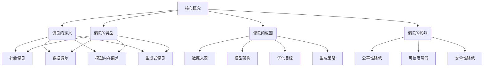

以下是对《大语言模型原理基础与前沿 偏见》这个主题的深入探讨和分析。

# 大语言模型原理基础与前沿 偏见

## 1. 背景介绍

### 1.1 问题的由来

随着深度学习和自然语言处理技术的不断发展,大型语言模型(Large Language Models, LLMs)近年来取得了令人瞩目的进展。这些基于海量文本数据训练而成的模型展现出惊人的语言生成和理解能力,在多个领域产生了深远影响。然而,伴随着性能的提升,LLMs也暴露出了一些令人忧虑的问题,其中最为突出的就是偏见(Bias)问题。

### 1.2 研究现状  

目前,LLMs中存在的偏见主要分为以下几种类型:

1. **社会偏见传播**:LLMs在训练过程中吸收了大量社会中存在的有害偏见,比如种族、性别、年龄等方面的定型偏见。
2. **数据偏差放大**:训练数据本身存在的偏差被模型放大,导致生成的文本存在严重的不平等或不公正表述。
3. **模型内在偏差**:即使训练数据无偏差,模型架构和优化目标本身也可能引入偏见。
4. **生成式偏见**:模型生成的文本可能包含新的、意料之外的有害偏见内容。

这些偏见不仅影响模型的公平性和伦理性,也会极大地降低模型在实际应用中的可靠性和安全性。因此,消除和缓解LLMs中的偏见已成为当前研究的重点和难点。

### 1.3 研究意义

消除LLMs偏见对于构建更加公平、负责和可信的人工智能系统至关重要。只有解决了偏见问题,LLMs才能真正发挥其强大的语言能力,为各个领域提供更加精准和高效的语言智能服务。同时,偏见研究也将推动人工智能算法和模型朝着更加透明和可解释的方向发展,从而提高人工智能系统的可靠性和可控性。

### 1.4 本文结构

本文将从以下几个方面深入探讨LLMs偏见的原理、检测和缓解方法:

1. 阐述LLMs偏见的核心概念和理论基础
2. 介绍偏见的主要类型及其成因分析 
3. 详细讲解偏见检测和量化的算法和数学模型
4. 重点分析当前主流的偏见缓解技术及其优缺点
5. 通过实际案例分析不同方法的效果和挑战
6. 总结现有研究的不足,并展望未来的发展方向

## 2. 核心概念与联系

上图展示了LLMs偏见的核心概念及其内在联系。偏见可以定义为模型在语言生成或理解过程中展现出的不公正或不平等的倾向性。主要分为四种类型:社会偏见传播、数据偏差放大、模型内在偏差和生成式偏见。这些偏见的成因可以归结为数据来源、模型架构、优化目标和生成策略等方面的问题。偏见会导致模型的公平性、可信度和安全性降低,从而极大影响其实际应用。

因此,理解和掌握这些核心概念及其内在联系,是消除LLMs偏见的前提和基础。只有深入剖析偏见的根源,才能针对性地设计出有效的检测和缓解方法。

## 3. 核心算法原理 & 具体操作步骤

### 3.1 算法原理概述

目前,检测和缓解LLMs偏见的主要算法可以分为三大类:

1. **基于规则的方法**:通过预定义的规则集合来识别和过滤偏见内容。
2. **基于数据的方法**:利用标注数据训练分类器,对模型输出进行偏见检测和过滤。
3. **基于模型的方法**:在模型训练和生成过程中融入偏见缓解机制。

这些算法原理各有利弊,需要根据具体场景和需求进行选择和组合使用。

### 3.2 算法步骤详解

#### 3.2.1 基于规则的算法

基于规则的算法通常包括以下几个步骤:

1. **规则构建**:基于语言学知识和偏见类型,构建用于识别偏见内容的规则集合。
2. **模式匹配**:对模型输出进行模式匹配,识别和过滤匹配规则的内容。
3. **规则优化**:根据实际效果,不断优化和扩充规则集合。

这种方法的优点是直观、高效,但缺点是构建规则的工作量大,且存在覆盖面不全的问题。

#### 3.2.2 基于数据的算法

基于数据的算法流程如下:

1. **数据标注**:构建包含偏见标注的数据集。
2. **模型训练**:使用标注数据训练分类器模型,识别输出中的偏见内容。
3. **模型集成**:将分类器集成到LLMs的生成流程中,过滤偏见输出。
4. **模型优化**:根据实际效果,不断优化分类器模型。

这种方法的优点是可以自动学习偏见模式,缺点是需要大量高质量的标注数据。

#### 3.2.3 基于模型的算法

基于模型的算法主要分为以下几个步骤:

1. **目标建模**:将偏见缓解目标形式化为损失函数或约束条件。
2. **模型修改**:修改LLMs的架构、损失函数或训练策略以融入偏见缓解机制。
3. **模型训练**:在新的优化目标下重新训练LLMs。
4. **模型评估**:评估训练后模型的偏见水平,并根据需要进行迭代优化。

这种方法的优点是无需额外的数据和模型,直接修改LLMs本身,缺点是设计合理的目标函数和模型修改方式具有一定挑战。

### 3.3 算法优缺点

上述三类算法各有优缺点:

- 基于规则的方法简单高效,但覆盖面有限且构建成本高。
- 基于数据的方法具有一定通用性,但需要大量高质量的标注数据。
- 基于模型的方法无需额外数据,但设计合理的目标函数和模型修改具有挑战。

因此,在实际应用中往往需要结合使用多种算法,发挥各自的优势,从而达到更好的偏见缓解效果。

### 3.4 算法应用领域

上述算法可应用于LLMs在多个领域的偏见缓解,如:

- 对话系统:减少对话机器人输出的有害偏见内容
- 内容审核:自动识别和过滤网络内容中的偏见言论
- 文本生成:确保生成的文本不含有害偏见
- 问答系统:为问答系统的输出去除潜在的偏见
- 等等

随着LLMs在更多领域的应用,偏见缓解算法的应用场景也将不断扩展。

## 4. 数学模型和公式 & 详细讲解 & 举例说明

### 4.1 数学模型构建

为了量化和检测LLMs中的偏见,研究人员提出了多种数学模型。其中,一种广为使用的模型是**偏置度量(Bias Metric)模型**。

偏置度量模型的核心思想是:通过比较模型针对不同人口统计群体(如不同种族、性别等)的输出差异,来量化偏见的程度。常用的偏置度量包括:

1. **真实值和预测值差异(True Value and Predicted Value Difference)**
2. **统计学显著性测试(Statistical Significance Tests)**
3. **预测分数差异(Prediction Score Difference)**

以预测分数差异为例,其公式定义为:

$$D_{psi}(X,A,Y) = \mathbb{E}_{x \sim X|A=1}[f(x)] - \mathbb{E}_{x \sim X|A=0}[f(x)]$$

其中,$f(x)$表示模型对输入$x$的预测分数,$A$是二元化的敏感属性(如性别),该公式衡量了在给定敏感属性$A$取不同值时,模型预测分数的期望差异。

### 4.2 公式推导过程

以上公式是如何推导得到的呢?我们从模型公平性的形式化定义出发:

已知条件概率分布$P(Y|X,A)$,其中$X$是输入特征,$A$是敏感属性,$Y$是输出标签。如果对任意的$x$和$y$,有:

$$P(Y=y|X=x,A=0) = P(Y=y|X=x,A=1)$$

则称该模型对于敏感属性$A$是公平的。

进一步推广,如果对任意的$x$和$y$,有:

$$\mathbb{E}_{x \sim X|A=0}[f(x)] = \mathbb{E}_{x \sim X|A=1}[f(x)]$$

其中$f(x)$是模型的预测函数,那么该模型对于敏感属性$A$在预测值上也是公平的。

根据上式,我们可以定义预测分数差异$D_{psi}$作为衡量模型偏见程度的度量:

$$D_{psi}(X,A,Y) = \mathbb{E}_{x \sim X|A=1}[f(x)] - \mathbb{E}_{x \sim X|A=0}[f(x)]$$

当$D_{psi} = 0$时,模型在预测值上对于敏感属性$A$是公平的;否则,$D_{psi}$的绝对值越大,表明模型存在的偏见程度越高。

### 4.3 案例分析与讲解

现在,我们通过一个具体的案例来分析上述偏置度量模型。假设我们有一个二元文本分类模型,用于判断一段文本是否包含仇恨言论。我们的目标是检测这个模型在"种族"这一敏感属性上是否存在偏见。

首先,我们需要构建一个包含种族标注的数据集,并将其分为两个子集$X_0$和$X_1$,分别对应着不同的种族群体。然后,我们计算模型在这两个子集上的平均预测分数:

$$\mu_0 = \mathbb{E}_{x \sim X_0}[f(x)], \mu_1 = \mathbb{E}_{x \sim X_1}[f(x)]$$

其中,$f(x)$表示模型对输入$x$的预测分数,取值范围为$[0,1]$。

接下来,我们计算预测分数差异$D_{psi}$:

$$D_{psi}(X,A,Y) = \mu_1 - \mu_0$$

如果$D_{psi}$显著不为0,那么就表明模型在种族这一敏感属性上存在偏见。例如,如果$\mu_1 > \mu_0$,则意味着模型对于某一种族群体更倾向于判定为仇恨言论,这就是一种潜在的有害偏见。

### 4.4 常见问题解答

**Q1:为什么要使用数学模型来量化偏见?**

A1:使用数学模型可以更加客观、精确地衡量偏见的程度,而不是主观的判断。这对于评估不同偏见缓解方法的效果,以及监控偏见的动态变化都是非常必要的。

**Q2:偏置度量模型是否足够全面?**

A2:目前的偏置度量模型主要关注模型输出层的偏见,但并不能完全反映训练数据、模型架构和优化目标等方面的偏见。因此,需要结合其他模型和指标来全面评估偏见问题。

**Q3:如何选择合适的偏置度量?**

A3:不同的偏置度量对应着不同的公平性定义,适用于不同的任务和场景。选择时需要结合具体需求、数据特