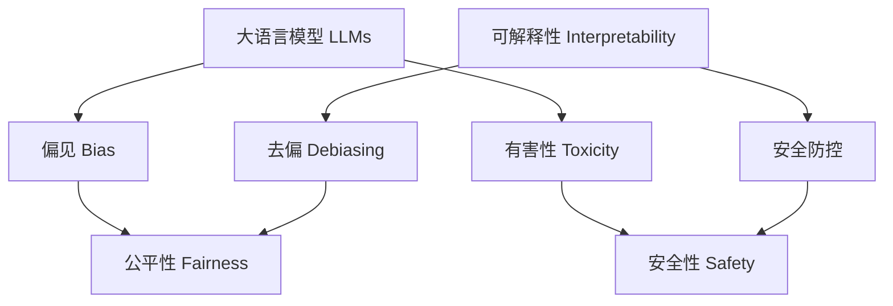

# 大语言模型原理基础与前沿 减少偏见和有害性

关键词：大语言模型、偏见、有害性、去偏、安全、伦理

## 1. 背景介绍
### 1.1 问题的由来
近年来，随着深度学习技术的飞速发展，大语言模型(Large Language Models, LLMs)在自然语言处理(NLP)领域取得了突破性的进展。LLMs通过在海量文本数据上进行预训练，能够学习到丰富的语言知识和常识，在机器翻译、问答系统、文本生成等任务上表现出色。然而，LLMs在给NLP带来巨大提升的同时，也暴露出了一些亟待解决的问题，其中最为严峻的就是模型中存在的偏见(Bias)和有害性(Toxicity)问题。

LLMs从网络上爬取的海量文本语料中学习语言知识，而这些数据往往包含了人类社会中固有的偏见和刻板印象，例如性别歧视、种族歧视等。模型在训练过程中会无意识地吸收这些有偏见的信息，导致其在下游任务中产生偏颇、不公平的输出结果。此外，互联网上充斥着大量低质、有害的内容，如仇恨言论、暴力色情等，LLMs在学习过程中不可避免地会接触并模仿这些有害文本，使得模型具有产生危险、有害言论的风险。偏见和有害性问题严重影响了LLMs的可用性和安全性，成为阻碍其大规模应用的主要障碍。

### 1.2 研究现状
学术界和工业界高度重视LLMs的偏见和有害性问题，开展了大量的研究工作。微软、谷歌等科技巨头纷纷成立了专门的AI伦理团队，致力于研究如何开发出更加公平、安全的AI系统。在学术领域，相关研究主要集中在几个方面：

1. 偏见和有害性的度量与评估。研究者们提出了各种度量指标和评估框架，用于量化LLMs中的偏见和有害性水平，为后续的消除和改进提供依据。例如，发展了基于人口统计属性的公平性度量，以及基于不良词典的毒性检测方法等。

2. 数据去偏方法。针对数据中固有的偏见，研究者提出了数据增强、样本平衡、对抗学习等方法，在数据层面上减轻偏见。例如，通过数据增强生成更加均衡的样本分布，或利用对抗训练消除数据中的敏感属性信息。

3. 模型去偏技术。在模型训练和推理阶段引入去偏机制，如公平性正则化、后处理校准等，从算法层面上削弱模型的偏见。例如，在目标函数中加入公平性约束项，使模型在追求性能的同时兼顾公平性。

4. 安全防控机制。针对LLMs生成有害内容的风险，研究者提出了内容过滤、输出控制等安全防控手段。例如，基于黑名单过滤生成结果中的敏感词，或用人工规则和额外的分类器控制模型输出。

尽管已有大量工作，但彻底解决LLMs的偏见和有害性问题仍然任重道远，现有方法在鲁棒性、效果、可解释性等方面还有很大改进空间。未来还需要持续投入更多的研究力量。

### 1.3 研究意义
研究LLMs的偏见和有害性问题，对于实现AI的可信、可靠、可用具有重大意义：

1. 促进AI公平。消除LLMs的偏见，有助于避免基于性别、种族等敏感属性的歧视，促进AI决策的公平性，建设一个更加包容、平等的社会。

2. 保障AI安全。防范LLMs生成有害内容的风险，对于维护网络空间安全、营造清朗健康的舆论环境至关重要，事关人民群众切身利益。

3. 推动AI规范化发展。偏见和有害性问题是AI伦理的重要组成部分，加强这一领域的研究，有利于建立AI治理规范，引导AI技术在符合伦理道德、保障安全的轨道上健康发展。

4. 拓宽LLMs应用场景。消除LLMs的偏见和有害性，将极大拓宽其应用领域和场景，特别是在客服、教育、法律等对公平性和安全性要求较高的领域，为行业数字化转型赋能。

总之，LLMs偏见和有害性的研究，对于构建可信、有益的AI系统具有基础性和前瞻性意义，是实现人工智能健康可持续发展的重要支撑。

### 1.4 本文结构
本文将全面探讨大语言模型中偏见和有害性的基础理论、核心技术、前沿进展，剖析其技术原理、数学模型，给出代码实例，展望未来发展方向，回应业界关切。全文组织结构如下：

第2部分介绍LLMs偏见和有害性问题涉及的核心概念，梳理其内在联系。第3部分详细阐述几类代表性的偏见和有害性检测、消除的核心算法原理和实现步骤。第4部分建立偏见和有害性问题的数学模型，推导相关公式，并举例说明。第5部分给出偏见和有害性消除的项目实践，分享代码实例。第6部分讨论LLMs偏见和有害性技术在实际场景中的应用情况。第7部分推荐相关学习资源和开发工具。第8部分总结全文，展望LLMs偏见和有害性技术的未来发展趋势和挑战。第9部分列举常见问题解答。

## 2. 核心概念与联系
在讨论大语言模型中的偏见和有害性问题时，需要厘清几个核心概念：

- 大语言模型(Large Language Models, LLMs)：以Transformer为代表的深度神经网络模型，在大规模文本语料上进行预训练，具备强大的语言理解和生成能力，代表模型有BERT、GPT系列等。
- 偏见(Bias)：模型输出结果中存在的、源自训练数据或算法的系统性差异，这种差异通常表现为对某些人口统计学属性(如性别、种族)的歧视或不公平对待。
- 有害性(Toxicity)：模型生成的文本内容具有攻击性、威胁性、污秽性等负面特征，可能对用户或社会造成伤害。
- 公平性(Fairness)：模型的预测结果不因个体的敏感属性(性别、种族等)而有差异，即对不同人群一视同仁。常见的公平性指标有统计学平等、机会平等等。
- 安全性(Safety)：确保模型不会产生危害用户或社会的输出，如仇恨言论、暴力色情内容等。
- 去偏(Debiasing)：消除模型输出中的系统偏差，使其满足特定的公平性要求。去偏技术可在数据、算法、后处理等层面展开。
- 可解释性(Interpretability)：让模型的决策过程对人类而言是透明、可理解的，便于分析模型行为背后的原因，识别有偏见或有害的特征。

这些概念之间有着密切联系。LLMs是偏见、有害性问题的"载体"，偏见和有害输出是评判LLMs的两个核心维度。去偏和安全防控技术是消除LLMs偏见和有害性的重要手段，二者相辅相成，共同服务于提升模型的公平性和安全性。可解释性则是实现LLMs透明治理的基础，有助于准确定位偏见和有害性问题的源头。

理解这些概念之间的联系，对于系统地分析和解决LLMs的偏见、有害性问题至关重要。本文将在此基础上，深入探讨相关算法、模型、实践。

## 3. 核心算法原理 & 具体操作步骤
### 3.1 算法原理概述
针对LLMs的偏见和有害性问题，学界提出了许多检测和消除的算法。按照技术原理可大致分为几类：

1. 基于统计的方法。通过分析模型在不同人口统计学属性上的性能差异，度量模型输出的统计偏差，代表方法有均等机会、人口均等等。

2. 对抗学习方法。引入对抗机制，通过学习去除文本特征中的敏感属性信息，从而得到公平的文本表示。代表模型有对抗性去偏自编码器(ADAE)等。

3. 因果推理方法。利用因果理论建模文本、标签与敏感属性之间的因果关系，通过调整因果路径消除模型偏见。代表方法有基于因果的去偏技术(CDA)等。

4. 数据增强方法。通过改写、替换文本中的敏感属性词，构造均衡、无偏的数据集，缓解数据偏差对模型的影响。代表方法有对抗性文本改写等。

5. 后处理校准方法。在模型推理阶段，对模型的预测结果进行事后纠偏，满足特定的公平性约束。代表方法有拒绝选项分类(ROC)后处理等。

6. 基于强化学习的方法。将无偏见、无害的语言生成建模为强化学习任务，通过设计奖励函数引导模型学习安全、公平的策略。

这些方法在实践中常常结合使用，发挥各自的优势。例如，可先用数据增强方法缓解数据偏差，再在训练过程中加入对抗学习，最后再用后处理方法矫正残余偏见。

### 3.2 算法步骤详解
下面以对抗性去偏自编码器(ADAE)为例，详细说明其消除LLMs偏见的步骤。ADAE由一个编码器、一个解码器、一个敏感属性分类器构成，通过对抗训练学习公平的文本表示。主要步骤如下：

1. 数据准备：构建包含文本内容和敏感属性标签(如性别、种族)的数据集，并划分为训练集和测试集。

2. 初始化模型：随机初始化ADAE的编码器、解码器、分类器的参数。编码器将文本映射为隐表示，解码器从隐表示重构文本，分类器从隐表示预测敏感属性。

3. 对抗训练：
   - 编码器-解码器联合训练，优化重构损失，使解码器能从隐表示还原原始文本。
   - 分类器训练，优化分类损失，使其能从隐表示准确预测敏感属性。
   - 编码器训练，优化重构损失和对抗损失，使隐表示能重构文本、但不能预测敏感属性，学得公平表示。
   
   上述三个训练过程交替进行，直至模型收敛。

4. 无偏文本生成：用训练好的编码器将文本编码为公平表示，送入LLMs进行fine-tune，之后的文本生成过程将不受敏感属性影响，实现去偏。

5. 评估与迭代：在测试集上评估模型的去偏效果，用各类公平性指标衡量偏见水平。若去偏效果不理想，调整超参数重新训练。

以上就是ADAE去偏的主要步骤。其核心在于adversarial training，通过编码器和分类器的博弈，学习抹去敏感属性的文本表示，再用于LLMs的训练，从而获得公平的语言模型。

### 3.3 算法优缺点
ADAE相比其他去偏方法有以下优点：
- 端到端的去偏过程，无需人工设计属性模板，自适应性强。
- 通过对抗博弈机制学习公平表示，减少了有偏见的特征。
- 可用文本重构损失保证生成质量，避免改写造成的语义损失。

但ADAE也存在一定局限性：
- 需要敏感属性标注数据，获取成本高。
- 对抗训练不易收敛，实践中容易训不动