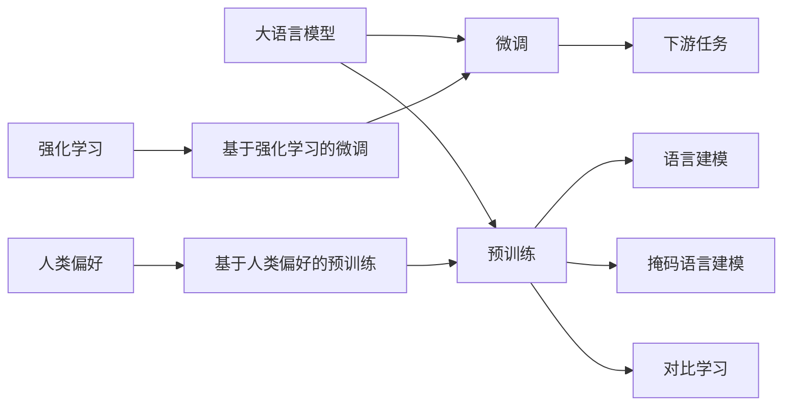

# 大语言模型原理基础与前沿 基于强化学习的微调和基于人类偏好的预训练

作者：禅与计算机程序设计艺术 / Zen and the Art of Computer Programming

关键词：大语言模型、强化学习、人类偏好、预训练、微调

## 1. 背景介绍

### 1.1 问题的由来

随着人工智能技术的快速发展,自然语言处理(NLP)领域取得了长足的进步。作为NLP的核心技术之一,语言模型在机器翻译、对话系统、文本摘要等诸多任务中发挥着至关重要的作用。近年来,大语言模型(Large Language Model, LLM)以其强大的语言理解和生成能力引起了学术界和工业界的广泛关注。

然而,现有的大语言模型仍然存在一些亟待解决的问题。一方面,大语言模型通常需要在海量语料上进行预训练,这不仅耗费大量的计算资源,而且预训练得到的模型泛化能力有限,难以适应下游任务的需求。另一方面,预训练阶段缺乏对人类偏好的考虑,导致生成的文本可能存在偏差和不符合人类期望的问题。

### 1.2 研究现状

为了解决上述问题,研究者们提出了多种改进方案。其中,基于强化学习的微调(Reinforcement Learning based Fine-tuning)和基于人类偏好的预训练(Human Preference based Pre-training)是两个备受关注的研究方向。

基于强化学习的微调旨在通过引入奖励机制,使得模型在微调阶段能够更好地适应下游任务的需求。这种方法不仅可以提高模型在特定任务上的表现,而且还能提升模型的泛化能力。代表性工作包括REINFORCE算法[1]、PPO算法[2]等。

基于人类偏好的预训练则致力于在预训练阶段引入人类反馈,使得模型能够更好地理解和满足人类的期望。通过收集人类对模型生成文本的评价,并将其作为训练目标,可以使模型生成更加符合人类偏好的文本。代表性工作包括InstructGPT[3]、Constitutional AI[4]等。

### 1.3 研究意义

将强化学习和人类偏好引入大语言模型的训练过程,有望进一步提升模型的性能和适用性。一方面,强化学习可以帮助模型更好地适应下游任务,提高模型的泛化能力。另一方面,人类偏好的引入可以使模型生成更加符合人类期望的文本,提升模型的可用性和可解释性。

深入研究基于强化学习的微调和基于人类偏好的预训练技术,对于推动大语言模型的发展具有重要意义。这不仅可以促进自然语言处理技术的进步,而且还能够拓展大语言模型的应用场景,为智能对话、知识问答等领域提供更加强大的技术支撑。

### 1.4 本文结构

本文将围绕基于强化学习的微调和基于人类偏好的预训练两个主题展开论述。第二部分将介绍相关的核心概念及其联系。第三部分将详细阐述强化学习微调的算法原理和具体操作步骤。第四部分将建立数学模型,推导相关公式,并通过案例进行分析和讲解。第五部分将给出代码实例,并对其进行详细解释说明。第六部分将探讨算法的实际应用场景和未来应用展望。第七部分将推荐相关的学习资源、开发工具和研究论文。第八部分将总结全文,并对未来的发展趋势和挑战进行展望。第九部分为附录,列举了一些常见问题与解答。

## 2. 核心概念与联系

在探讨基于强化学习的微调和基于人类偏好的预训练之前,我们有必要对一些核心概念进行介绍,并阐明它们之间的联系。

**大语言模型(Large Language Model, LLM)**是一类基于深度神经网络的语言模型,通过在海量语料上进行预训练,可以学习到丰富的语言知识和生成能力。代表性的大语言模型包括GPT系列[5]、BERT系列[6]、T5[7]等。大语言模型通常采用Transformer[8]等注意力机制作为基本架构。

**强化学习(Reinforcement Learning, RL)**是一种机器学习范式,旨在通过与环境的交互来学习最优策略。在强化学习中,智能体(Agent)根据当前状态采取动作,并从环境中获得奖励反馈,通过不断试错和优化来提高决策的质量。常见的强化学习算法包括Q-Learning[9]、SARSA[10]、Policy Gradient[11]等。

**微调(Fine-tuning)**是一种常见的迁移学习方法,即在预训练模型的基础上,针对特定任务进行进一步训练,以提高模型在该任务上的表现。微调通常只需要较少的训练数据和计算资源,可以显著提升模型的性能。在大语言模型中,微调技术被广泛应用于各种下游任务,如文本分类、命名实体识别、问答系统等。

**人类偏好(Human Preference)**是指人类对于模型生成文本的主观评价和期望。通过收集人类反馈,并将其作为训练目标,可以使模型生成更加符合人类偏好的文本。人类偏好可以通过多种方式引入模型训练过程,如奖励建模[12]、对比学习[13]等。

**预训练(Pre-training)**是指在大规模语料上对模型进行初步训练的过程。预训练旨在让模型学习到通用的语言知识和表示能力,为后续的微调和应用奠定基础。常见的预训练任务包括语言建模、掩码语言建模[14]、对比学习[15]等。

强化学习和人类偏好都可以与预训练和微调过程相结合,形成基于强化学习的微调和基于人类偏好的预训练两种范式。前者利用强化学习优化模型在下游任务上的表现,后者则在预训练阶段引入人类反馈,使模型生成更加符合人类期望的文本。两种范式相互补充,共同推动了大语言模型的发展。

下图展示了各个核心概念之间的关系:

## 3. 核心算法原理 & 具体操作步骤

### 3.1 算法原理概述

基于强化学习的微调的核心思想是将下游任务建模为一个强化学习问题。具体而言,我们将预训练好的大语言模型视为智能体(Agent),将下游任务视为环境(Environment)。智能体根据当前状态(如输入文本)采取动作(如生成下一个单词),并从环境中获得奖励反馈(如生成文本的质量评分)。通过不断与环境交互并优化策略,智能体可以逐步提高在下游任务上的表现。

常见的基于强化学习的微调算法包括REINFORCE算法、Actor-Critic算法[16]、PPO算法等。这些算法通过估计动作的价值函数或优势函数,并利用梯度上升等优化技术来更新模型参数,使得智能体的策略不断改进。

### 3.2 算法步骤详解

以REINFORCE算法为例,基于强化学习的微调的具体步骤如下:

1. 初始化预训练好的大语言模型作为智能体的策略网络 $\pi_{\theta}$,其中 $\theta$ 表示模型参数。

2. 根据任务设置适当的奖励函数 $r$,用于评估生成文本的质量。奖励函数可以基于人工设计的规则,也可以通过训练奖励模型来自动学习。

3. 对于每个训练样本 $x$,执行以下步骤:
   
   a. 根据当前策略网络 $\pi_{\theta}$ 生成一个完整的文本序列 $y=(y_1,y_2,...,y_T)$,其中 $T$ 为序列长度。
   
   b. 计算生成序列 $y$ 的奖励 $R=\sum_{t=1}^T r(y_t|y_{1:t-1},x)$。
   
   c. 计算损失函数 $L(\theta)=-\log \pi_{\theta}(y|x) \cdot R$。
   
   d. 通过梯度上升更新策略网络参数: $\theta \leftarrow \theta + \alpha \nabla_{\theta} L(\theta)$,其中 $\alpha$ 为学习率。

4. 重复步骤3,直到策略网络收敛或达到预设的训练轮数。

5. 在测试阶段,使用训练好的策略网络 $\pi_{\theta}$ 生成文本序列。

### 3.3 算法优缺点

基于强化学习的微调具有以下优点:

- 可以针对特定任务进行优化,提高模型在下游任务上的表现。
- 通过引入奖励机制,可以使模型生成更加符合人类期望的文本。
- 相比从头训练,微调需要的计算资源和训练数据更少。

同时,该算法也存在一些缺点:

- 奖励函数的设计需要领域知识和人工经验,不当的奖励设计可能导致模型生成低质量的文本。
- 强化学习算法通常需要大量的训练时间和计算资源,收敛速度较慢。
- 生成的文本可能存在不稳定性和随机性,难以完全控制生成结果。

### 3.4 算法应用领域

基于强化学习的微调在多个自然语言处理任务中得到了应用,包括:

- 对话生成:通过引入对话质量、连贯性等奖励,使模型生成更加自然流畅的对话文本[17]。
- 文本摘要:通过引入信息覆盖度、语法流畅度等奖励,使模型生成更加精炼准确的摘要[18]。
- 机器翻译:通过引入翻译质量、流畅度等奖励,使模型生成更加优质的翻译结果[19]。

除了上述任务外,基于强化学习的微调还可以应用于文本改写、风格迁移、知识图谱推理等多个领域,具有广阔的应用前景。

## 4. 数学模型和公式 & 详细讲解 & 举例说明

### 4.1 数学模型构建

我们将基于强化学习的微调过程建模为一个马尔可夫决策过程(Markov Decision Process, MDP),其中包含以下元素:

- 状态空间 $\mathcal{S}$:表示模型在生成过程中的各种可能状态,通常由输入文本和已生成的部分文本组成。
- 动作空间 $\mathcal{A}$:表示模型在每个状态下可以采取的行动,通常为生成下一个单词或标记。
- 转移概率 $P(s'|s,a)$:表示在状态 $s$ 下采取动作 $a$ 后转移到状态 $s'$ 的概率。
- 奖励函数 $r(s,a)$:表示在状态 $s$ 下采取动作 $a$ 所获得的即时奖励。
- 折扣因子 $\gamma \in [0,1]$:表示未来奖励的折扣程度,用于平衡即时奖励和长期奖励。

基于以上定义,我们的目标是学习一个最优策略 $\pi^*$,使得在该策略下获得的期望累积奖励最大化:

$$\pi^* = \arg\max_{\pi} \mathbb{E}_{\tau \sim \pi}[\sum_{t=0}^{\infty} \gamma^t r(s_t,a_t)]$$

其中 $\tau=(s_0,a_0,s_1,a_1,...)$ 表示一个完整的交互轨迹。

### 4.2 公式推导过程

在REINFORCE算法中,我们通过梯度上升来更新策略网络参数 $\theta$。策略网络的目标是最大化期望累积奖励:

$$J(\theta) = \mathbb{E}_{\tau \sim \pi_{\theta}}[\sum_{t=0}^{T-1} r(s_t,a_t)]$$