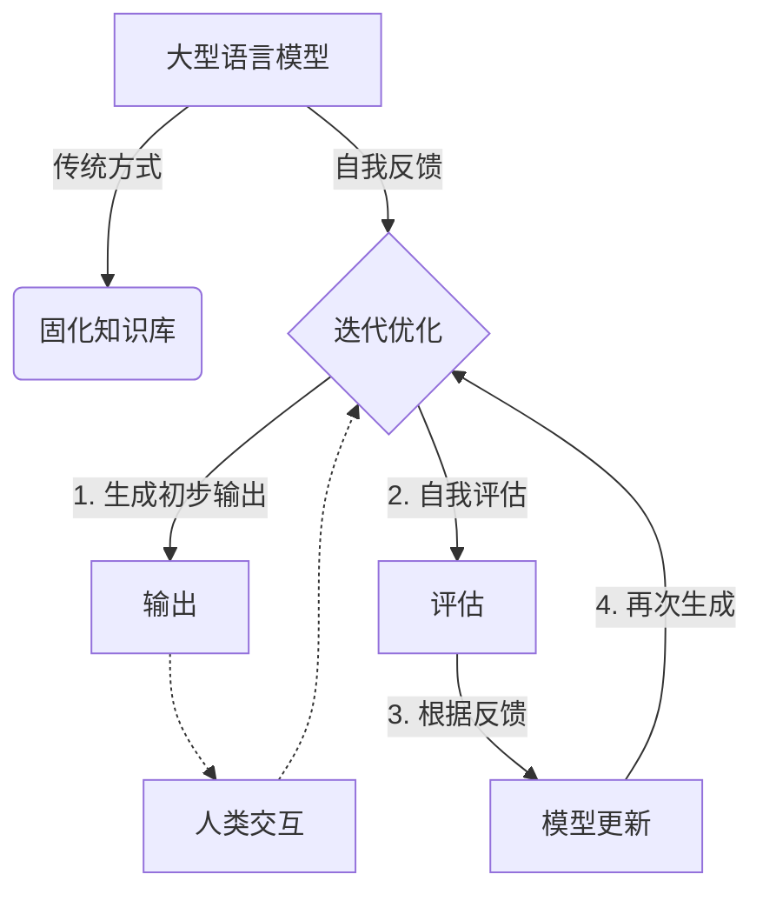

# 大语言模型原理基础与前沿 基于自我反馈进行迭代优化

## 1. 背景介绍

### 1.1 问题的由来

在过去几年中,自然语言处理(NLP)领域取得了长足的进步,很大程度上归功于大型语言模型(Large Language Models, LLMs)的兴起。这些模型通过在大规模语料库上进行预训练,学习了丰富的语言知识,并展现出惊人的泛化能力,可以应用于广泛的下游任务。然而,尽管取得了巨大成功,现有的LLMs仍然存在一些局限性,例如:

1. **知识的静态性**: 大多数LLMs在训练后就"固化"了,无法持续学习和更新知识。
2. **缺乏交互性**: 现有模型难以与人类进行富有意义的对话交互,无法根据上下文动态调整输出。
3. **缺乏解释性**: 模型的内部工作机制往往是一个"黑箱",难以解释其预测的原因。
4. **数据质量依赖**: 模型的性能高度依赖于训练数据的质量和多样性。

为了解决这些挑战,研究人员提出了一种新颖的范式:基于自我反馈的迭代优化(Iterative Refinement with Self-Feedback)。该范式旨在通过模型与自身交互,不断优化和完善语言模型的能力。

### 1.2 研究现状

目前,已经有一些初步的工作探索了自我反馈的思路,取得了令人鼓舞的成果。例如,OpenAI的InstructGPT通过对话式微调(Conversational Fine-tuning),使语言模型能够更好地理解和执行指令。DeepMind的Chinchilla则采用了一种称为"思考-反馈-修正"(Think-Feedback-Refine)的范式,让模型先生成一个初步输出,然后根据自身的反馈进行多轮迭代,最终产生更高质量的输出。

然而,这些工作仍处于初级阶段,许多关键问题有待解决,例如:如何设计高效的自我反馈机制?如何量化和评估模型的进展?如何确保模型的收敛性和稳定性?等等。

### 1.3 研究意义

自我反馈范式有望为语言模型带来以下重要意义:

1. **持续学习能力**: 模型可以通过与人类交互和自我反馈,不断吸收新知识,更新自身的语言理解和生成能力。
2. **更强的交互性**: 模型可以根据上下文动态调整输出,更好地与人类进行对话交互。
3. **增强的解释性**: 通过分析自我反馈过程,有望揭示模型内部的决策机制,提高模型的可解释性。
4. **减轻数据依赖**: 模型可以通过自我反馈来弥补训练数据的不足,降低对高质量数据的依赖。

因此,深入研究自我反馈范式,不仅可以推进语言模型的理论发展,也将为实际应用带来重大影响。

### 1.4 本文结构

本文将全面探讨基于自我反馈的大型语言模型迭代优化方法。首先,我们将介绍自我反馈范式的核心概念和原理,阐述其与传统语言模型的区别。接下来,我们将深入探讨自我反馈的核心算法,包括反馈生成、模型更新等关键步骤。然后,我们将构建数学模型并推导公式,量化分析自我反馈过程。在此基础上,我们将通过实际代码实例,演示如何实现自我反馈模型。此外,我们还将讨论该方法在不同应用场景中的潜力,并介绍相关工具和学习资源。最后,我们将总结研究成果,展望未来发展趋势和面临的挑战。

## 2. 核心概念与联系

基于自我反馈的大型语言模型迭代优化范式,与传统的"一次训练,固化知识"的方式形成鲜明对比。其核心思想是:让语言模型通过与自身的交互,不断生成、评估和更新自己的输出,从而达到持续优化的目的。

具体而言,这一过程可分为以下几个关键步骤:

1. **生成初步输出**: 语言模型根据给定的输入(如问题或指令),生成一个初步的输出。
2. **自我评估**: 模型对自己的输出进行评估,判断其质量和准确性。评估过程可以基于各种启发式规则或学习到的评分函数。
3. **根据反馈更新**: 根据自我评估的结果,模型对自身的参数或内部状态进行调整和更新。
4. **再次生成输出**: 更新后的模型再次生成新的输出。

该过程可以重复进行多轮迭代,直至模型的输出达到满意的质量。在迭代的同时,模型还可以与人类进行交互,获取额外的反馈和指导,进一步优化自身。

通过这种自我反馈机制,语言模型不再是一个静态的知识库,而是能够持续学习和进化的动态系统。它可以根据新的输入和反馈,主动发现和纠正自身的缺陷和错误,从而不断提高语言理解和生成的能力。

## 3. 核心算法原理与具体操作步骤

### 3.1 算法原理概述

自我反馈迭代优化算法的核心原理,可以概括为以下几个关键环节:

1. **输出生成**: 利用当前的语言模型,根据给定的输入(如问题或指令),生成一个初步的输出序列。
2. **输出评估**: 通过某种评估函数或规则,对模型的输出进行评分和评估,判断其质量和准确性。
3. **反馈建模**: 根据输出评估的结果,构建一个反馈信号,用于指导模型的更新和优化。
4. **模型更新**: 利用反馈信号,对语言模型的参数或内部状态进行调整和更新,以期生成更好的输出。

该算法通过不断重复上述环节,形成一个闭环的自我反馈过程。在每一轮迭代中,模型都会根据自身的输出和评估,主动发现缺陷并进行改进,从而不断优化自身的语言理解和生成能力。

### 3.2 算法步骤详解

1. **输出生成**

   给定输入 $x$,我们利用当前的语言模型 $M_\theta$ (其中 $\theta$ 表示模型参数)生成一个初步的输出序列 $y^{(0)}$:

   $$y^{(0)} = M_\theta(x)$$

   输出序列 $y^{(0)}$ 可以是一个单词序列、一段文本,或者是对输入 $x$ 的任何形式的响应。

2. **输出评估**

   我们使用一个评估函数 $R(y, x)$ 来评估输出 $y$ 相对于输入 $x$ 的质量或准确性。评估函数可以是一个手工设计的规则集合,也可以是一个学习到的评分模型。

   对于初步输出 $y^{(0)}$,我们计算其评分:

   $$r^{(0)} = R(y^{(0)}, x)$$

   评分 $r^{(0)}$ 反映了输出 $y^{(0)}$ 的质量,值越高表示质量越好。

3. **反馈建模**

   根据评分 $r^{(0)}$,我们构建一个反馈信号 $f^{(0)}$,用于指导模型的更新。反馈信号可以是一个标量值(如评分的梯度),也可以是一个更复杂的结构(如注意力权重)。

   反馈建模的具体方式因算法而异,但通常都会利用评分 $r^{(0)}$ 和输入输出对 $(x, y^{(0)})$ 的信息。我们用函数 $F$ 表示反馈建模过程:

   $$f^{(0)} = F(r^{(0)}, x, y^{(0)})$$

4. **模型更新**

   利用反馈信号 $f^{(0)}$,我们对语言模型 $M_\theta$ 进行更新,得到新的模型 $M_{\theta'}$:

   $$\theta' = \text{Update}(\theta, f^{(0)})$$

   更新函数 $\text{Update}$ 的具体形式也因算法而异,可以是梯度下降、元学习等优化方法。

5. **迭代**

   使用更新后的模型 $M_{\theta'}$,我们重复上述步骤,生成新的输出 $y^{(1)}$、计算评分 $r^{(1)}$、构建反馈 $f^{(1)}$,并进一步更新模型参数,得到 $\theta''$。该过程可以重复进行多轮迭代,直至输出质量达到满意的程度。

   在迭代过程中,我们还可以引入人类反馈,将人类的评价也纳入反馈建模的过程,从而进一步提高模型的性能。

### 3.3 算法优缺点

**优点**:

1. **持续学习能力**: 模型可以通过自我反馈,不断发现并纠正自身的缺陷,持续提高语言理解和生成的能力。
2. **减轻数据依赖**: 相比依赖大量高质量数据进行监督训练,自我反馈范式可以在较少的数据基础上,通过自我迭代来优化模型。
3. **增强交互性**: 自我反馈过程可以与人类交互相结合,使模型更好地理解人类意图,提供更加贴合的响应。
4. **提高可解释性**: 通过分析自我反馈的过程,可以揭示模型内部的决策机制,提高模型的可解释性。

**缺点**:

1. **收敛性和稳定性**: 自我反馈过程的收敛性和稳定性需要仔细设计和控制,否则可能导致模型输出的发散或振荡。
2. **计算开销**: 自我反馈需要进行多轮迭代,计算开销较大,对硬件资源要求较高。
3. **评估函数设计**: 设计一个准确、高效的评估函数是一个挑战,直接影响到自我反馈的效果。
4. **局部最优陷阱**: 自我反馈过程可能陷入局部最优,无法找到全局最优解。

### 3.4 算法应用领域

基于自我反馈的迭代优化算法,可以应用于多个领域:

1. **对话系统**: 通过自我反馈,对话模型可以更好地理解上下文,生成更加贴合的响应。
2. **问答系统**: 自我反馈有助于问答模型生成更准确、完整的答案。
3. **文本生成**: 在自我反馈的指导下,模型可以生成更加流畅、连贯的长文本。
4. **文本summarization**: 自我反馈有助于模型生成更加准确、简洁的文本摘要。
5. **代码生成**: 通过自我反馈,模型可以生成更加高效、可读性更强的代码。
6. **机器翻译**: 自我反馈有助于提高翻译质量,消除歧义和不通顺的地方。

总的来说,任何需要生成高质量语言输出的任务,都可以从自我反馈迭代优化算法中受益。

## 4. 数学模型和公式详细讲解与举例说明

在前面的章节中,我们介绍了自我反馈迭代优化算法的基本原理和步骤。现在,我们将构建数学模型,对该算法进行更加形式化的描述和分析。

### 4.1 数学模型构建

我们将语言模型 $M_\theta$ 建模为一个条件概率分布 $P_\theta(y|x)$,表示在给定输入 $x$ 的情况下,生成输出序列 $y$ 的概率。其中 $\theta$ 是模型参数。

在自我反馈的框架下,我们的目标是找到一组最优参数 $\theta^*$,使得在训练数据集 $\mathcal{D} = \{(