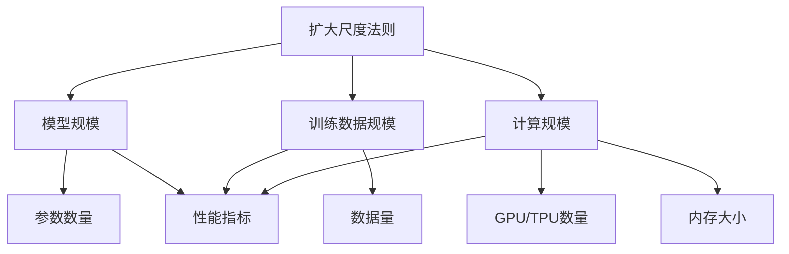

# 大语言模型原理基础与前沿 扩大尺度法则

## 1. 背景介绍

### 1.1 问题的由来

随着人工智能技术的快速发展,大型语言模型已经成为当前最具影响力和应用前景的技术之一。这些模型通过在海量文本数据上进行预训练,学习到了丰富的语言知识和上下文理解能力,从而可以应用于自然语言处理的各种任务中,如机器翻译、文本摘要、问答系统等。然而,训练这些庞大的语言模型需要消耗大量的计算资源,并且随着模型规模的扩大,训练难度也会成指数级增长。因此,如何高效地训练大型语言模型,提高其性能和泛化能力,成为了当前研究的重点和挑战。

### 1.2 研究现状

目前,扩大尺度法则(Scaling Laws)已经成为训练大型语言模型的主流方法之一。该方法的核心思想是通过持续增加模型规模(模型参数数量)和训练数据量,从而提升模型的性能表现。多项研究表明,遵循扩大尺度法则训练的大型语言模型,其性能随着规模的增长而显著提升,并且在某些任务上甚至可以超越人类水平。

然而,扩大尺度法则也面临着一些挑战和限制。首先,训练大规模模型需要巨大的计算资源,这对于大多数研究机构和企业来说是一个沉重的负担。其次,随着模型规模的增加,训练过程变得更加不稳定和难以控制,容易出现模式崩溃等问题。此外,大型语言模型也存在一些潜在的风险,如隐私泄露、有害输出等,需要进一步的研究和规范。

### 1.3 研究意义

深入研究扩大尺度法则的原理和实践对于推动大型语言模型技术的发展具有重要意义。通过全面理解该方法的优势、局限性和潜在风险,我们可以更好地设计和优化训练流程,提高模型的性能和泛化能力。同时,探索新的训练范式和优化策略,也有助于降低计算资源的需求,提高训练效率。此外,研究扩大尺度法则在不同应用场景下的实践,有助于发现其在特定领域的优缺点,并进一步优化和改进该方法。

### 1.4 本文结构

本文将全面介绍扩大尺度法则在大型语言模型训练中的基础理论和前沿实践。首先,我们将阐述该方法的核心概念和原理,探讨其与其他训练范式的关系。接下来,详细分析扩大尺度法则的核心算法和数学模型,并通过案例分析和公式推导,深入讲解其实现细节。然后,我们将介绍一个基于该方法的项目实践,包括开发环境搭建、代码实现和运行结果展示。此外,本文还将探讨该方法在不同应用场景中的实践,并总结其未来发展趋势和面临的挑战。最后,我们将提供相关的学习资源、开发工具和论文推荐,以供读者进一步学习和研究。

## 2. 核心概念与联系

扩大尺度法则(Scaling Laws)是一种训练大型语言模型的范式,其核心思想是通过持续增加模型规模(参数数量)和训练数据量,来提升模型的性能表现。这一思路源于经验主义的人工智能理论,认为智能行为可以通过从大量数据中学习而获得。

该方法与其他训练范式存在一定的联系和区别。例如,与迁移学习相比,扩大尺度法则更强调从头开始训练,而不是基于预训练模型进行微调。与元学习不同,扩大尺度法则关注的是单一任务的性能提升,而不是跨任务的泛化能力。与联邦学习等分布式训练方法相比,扩大尺度法则更侧重于集中式的大规模训练。

扩大尺度法则的核心概念包括:

1. **模型规模(Model Scale)**: 指模型的参数数量,通常用来衡量模型的容量和表示能力。

2. **训练数据规模(Data Scale)**: 指用于训练模型的数据量,通常认为数据量越大,模型可以学习到更丰富的知识。

3. **计算规模(Compute Scale)**: 指用于训练模型的计算资源,包括GPU/TPU数量、内存大小等,计算规模越大,训练速度越快。

4. **性能指标(Performance Metric)**: 用于评估模型性能的指标,如精确率、召回率、困惑度等,不同任务有不同的评估指标。

5. **扩大尺度法则(Scaling Laws)**: 描述模型性能指标与模型规模、训练数据规模和计算规模之间的函数关系,通常采用幂律或对数函数的形式。

扩大尺度法则认为,只要持续增加模型规模、训练数据规模和计算规模,模型的性能指标就会不断提升,直到达到一个收益递减的临界点。因此,该方法的关键在于合理分配有限的计算资源,在模型规模、数据规模和计算规模之间寻找最优的平衡点。

## 3. 核心算法原理 & 具体操作步骤

### 3.1 算法原理概述

扩大尺度法则的核心算法原理可以概括为以下几个关键步骤:

1. **确定初始模型和数据规模**: 根据任务需求和计算资源情况,确定初始模型规模(参数数量)和训练数据规模。

2. **训练初始模型**: 使用选定的模型架构和训练数据,进行初始模型的训练,获得基线性能指标。

3. **扩大模型和数据规模**: 根据扩大尺度法则的原理,同步或分步增加模型规模(参数数量)和训练数据规模,形成一系列不同规模的模型和数据集。

4. **训练扩大规模的模型**: 对每个扩大规模的模型进行训练,记录其性能指标、训练时间和计算资源消耗情况。

5. **建立扩大尺度法则**: 基于不同规模模型的性能指标数据,通过回归分析等方法,建立模型性能指标与模型规模、数据规模和计算规模之间的函数关系,得到扩大尺度法则的具体形式。

6. **优化资源分配**: 根据建立的扩大尺度法则,分析模型性能的收益递减情况,确定最优的模型规模、数据规模和计算规模组合,以在有限资源下获得最佳性能。

7. **训练最终模型**: 使用确定的最优规模,进行最终模型的训练和评估,获得最佳性能的大型语言模型。

该算法的核心在于通过系统地扩大模型和数据规模,收集不同规模下的性能数据,从而建立扩大尺度法则,并据此优化资源分配,最终训练出性能最优的大型语言模型。

### 3.2 算法步骤详解

1. **确定初始模型和数据规模**

   在开始训练之前,需要根据任务需求和计算资源情况,确定初始模型规模和训练数据规模。初始模型规模通常取决于模型架构的复杂度和参数数量,而初始数据规模则取决于可用的标注数据量。

   通常情况下,初始模型和数据规模应该足够小,以便快速训练并获得基线性能指标,但也不能太小,以免模型欠拟合或数据不足以学习有效的模式。

2. **训练初始模型**

   使用选定的模型架构和训练数据集,进行初始模型的训练。训练过程可以采用标准的监督学习方法,如梯度下降等优化算法。

   在训练过程中,需要记录模型在验证集上的性能指标,如精确率、召回率、困惑度等,作为基线性能指标。同时,也需要记录训练时间和计算资源消耗情况,以便后续分析和优化。

3. **扩大模型和数据规模**

   根据扩大尺度法则的原理,需要同步或分步增加模型规模和训练数据规模,形成一系列不同规模的模型和数据集。

   对于模型规模,可以通过增加模型层数、隐藏单元数量或调整其他超参数来实现。对于数据规模,可以通过增加训练数据量或利用数据增广技术来扩大数据集。

   扩大规模的幅度可以根据计算资源情况和实验需求进行调整,通常采用指数级或对数级的增长方式。

4. **训练扩大规模的模型**

   对每个扩大规模的模型进行训练,记录其在验证集上的性能指标、训练时间和计算资源消耗情况。

   训练过程可以沿用初始模型的训练方法,也可以根据模型规模和数据规模的变化进行适当调整,如调整学习率、批量大小等超参数。

   为了确保实验的可重复性和公平性,应该在相同的硬件和软件环境下进行训练,并采用相同的评估方法和指标。

5. **建立扩大尺度法则**

   基于不同规模模型的性能指标数据,通过回归分析等方法,建立模型性能指标与模型规模、数据规模和计算规模之间的函数关系,得到扩大尺度法则的具体形式。

   常见的扩大尺度法则形式包括幂律函数和对数函数,分别描述了性能指标与规模之间的幂律关系和对数关系。通过非线性回归等方法,可以估计这些函数的参数,并评估其拟合程度。

   除了模型性能指标,扩大尺度法则也可以描述训练时间和计算资源消耗与规模之间的关系,以便进行资源优化和成本估算。

6. **优化资源分配**

   根据建立的扩大尺度法则,分析模型性能的收益递减情况,确定最优的模型规模、数据规模和计算规模组合,以在有限资源下获得最佳性能。

   这通常需要在性能提升、训练时间和计算资源消耗之间进行权衡和折中。可以采用多目标优化或约束优化等方法,根据具体的资源限制和优化目标,确定最优的规模组合。

   资源优化还需要考虑硬件环境、分布式训练、模型压缩等因素,以进一步提高训练效率和降低资源需求。

7. **训练最终模型**

   使用确定的最优规模,进行最终模型的训练和评估,获得最佳性能的大型语言模型。

   最终模型的训练过程可以采用与扩大规模模型相同的方法,也可以根据实际情况进行调整和优化,如采用更高级的优化算法、正则化技术等。

   在训练完成后,需要在测试集上全面评估模型的性能,并与基线模型和其他方法进行对比,验证扩大尺度法则的有效性和优势。

### 3.3 算法优缺点

扩大尺度法则作为训练大型语言模型的主流方法,具有以下优点:

1. **简单直观**: 该方法的核心思想非常直观,即通过增加模型规模和数据规模来提升模型性能,易于理解和实施。

2. **性能显著**: 多项研究表明,遵循扩大尺度法则训练的大型语言模型,其性能随着规模的增长而显著提升,在某些任务上甚至可以超越人类水平。

3. **泛化能力强**: 大规模预训练语言模型能够学习到丰富的语言知识和上下文理解能力,因此具有较强的泛化能力,可以应用于多种自然语言处理任务。

4. **可解释性好**: 通过建立扩大尺度法则,可以更好地理解模型性能与规模之间的关系,有助于模型分析和优化。

然而,扩大尺度法则也存在一些缺点和局限性:

1. **计算资源需求大**: 训