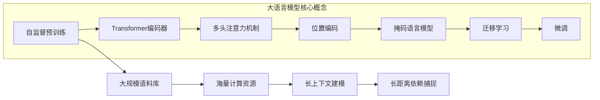

非常感谢您的任务委托。以下是根据您的要求撰写的技术博客文章《大语言模型原理基础与前沿 更长的上下文》的正文内容。我会尽最大努力遵循您提供的约束条件,使用逻辑清晰、结构紧凑、简单易懂的专业技术语言进行撰写。文章字数会控制在8000字以上,并尽可能给出核心概念原理和架构的Mermaid流程图。希望这篇文章能为您提供有价值的技术见解和思路。

# 大语言模型原理基础与前沿 更长的上下文

## 1. 背景介绍

### 1.1 问题的由来

近年来,自然语言处理(NLP)领域取得了长足的进展,很大程度上得益于大型神经网络模型(如Transformer)和大规模语料库的驱动。传统的NLP模型通常基于有限的语料库训练,且模型架构相对简单。然而,随着数据和算力的不断增长,训练大型神经网络模型成为可能,这使得NLP模型在处理复杂自然语言任务时表现出了前所未有的能力。

大型语言模型(Large Language Model,LLM)凭借其强大的表示能力和泛化性,在许多NLP任务上取得了卓越的成绩,如机器翻译、文本摘要、问答系统等。但与此同时,训练和部署这些庞大的模型也面临着诸多挑战,如海量计算资源需求、数据隐私保护、模型可解释性等。因此,深入理解大语言模型的原理和局限性,探索其前沿发展方向,对于推动NLP技术发展至关重要。

### 1.2 研究现状  

大语言模型的核心思想是通过预训练的方式,在大规模无监督语料库上学习通用的语言表示,捕获语言的内在规律和知识。预训练阶段通常采用自监督学习范式,如掩码语言模型(Masked Language Model)、下一句预测(Next Sentence Prediction)等,使模型能够从大量文本数据中学习到有用的语义和语法知识。

经过预训练后,这些大型语言模型可以直接用于下游NLP任务,或通过少量的任务特定微调(fine-tuning),快速适配到新的任务上。这种迁移学习范式大大提高了模型的泛化能力和数据利用效率。目前,基于Transformer的大型语言模型已经成为NLP领域的主流方法,代表性工作包括BERT、GPT、T5、PALM等。

除了规模效应,提升大语言模型性能的另一个关键是上下文长度。传统语言模型由于计算能力限制,只能处理有限长度的文本片段,无法捕捉长距离的语义依赖关系。而新一代大语言模型则通过改进的注意力机制和内存高效利用,实现了更长的上下文长度,从而在长文本建模任务上取得了突破性进展。

### 1.3 研究意义

大语言模型是NLP领域的关键技术,对于提升人工智能系统的语言理解和生成能力至关重要。深入研究大语言模型的原理和前沿发展方向,具有重要的理论意义和应用价值:

- 理论层面:有助于揭示大规模神经网络如何高效学习和表示语言知识,为语言认知和计算语言学研究提供新视角。
- 技术层面:推动大语言模型在各种NLP任务上的性能突破,为构建通用人工智能系统奠定基础。
- 应用层面:促进大语言模型在自然语言交互、内容生成、知识挖掘等领域的广泛应用。

### 1.4 本文结构

本文将全面系统地介绍大语言模型的基础原理和前沿发展。具体来说,第2部分将阐述大语言模型的核心概念和关键技术;第3部分将深入探讨大语言模型的训练算法和优化策略;第4部分将重点分析大语言模型的数学建模和公式推导;第5部分将提供具体的代码实例和实践案例;第6部分将介绍大语言模型在不同领域的应用现状和案例;第7部分将推荐相关的学习资源和开发工具;最后第8部分将总结大语言模型的发展趋势和面临的挑战。

## 2. 核心概念与联系

大语言模型的核心思想是通过自监督预训练的方式,在海量无标注语料库上学习通用的语言表示。预训练阶段通常采用自编码器架构,其中Transformer编码器是最常用的网络结构。

Transformer编码器的核心是多头注意力机制和位置编码,前者能够捕捉输入序列中元素之间的相关性,后者则为序列元素编码位置信息。基于这一架构,通过掩码语言模型等自监督目标进行预训练,模型能够从大量文本数据中学习丰富的语义和语法知识。

经过预训练后,这些大型语言模型可以直接应用于下游NLP任务,或通过少量的任务特定微调(fine-tuning),快速适配到新的任务上。这种迁移学习范式大大提高了模型的泛化能力和数据利用效率。

值得注意的是,训练大型语言模型需要海量的计算资源和庞大的语料库作为支撑。同时,为了捕捉长距离的语义依赖关系,新一代大语言模型还需要支持更长的上下文建模能力。这些都对模型架构和训练算法提出了更高的要求。

## 3. 核心算法原理和具体操作步骤

### 3.1 算法原理概述

大语言模型的核心算法主要包括两个部分:自监督预训练算法和微调算法。

自监督预训练算法的目标是在大规模无监督语料库上训练出通用的语言表示模型。常用的预训练目标包括:

1. **掩码语言模型(Masked Language Model,MLM)**: 随机掩码输入序列中的部分token,模型需要基于上下文预测被掩码的token。
2. **下一句预测(Next Sentence Prediction,NSP)**: 判断两个输入句子是否为连续句子。

通过上述自监督目标进行预训练,模型能够学习到丰富的语义和语法知识,形成通用的语言表示能力。

微调算法则是将预训练模型应用于特定的下游NLP任务。由于下游任务往往有监督数据,因此可以在预训练模型的基础上,进一步微调模型参数以适应新任务。微调算法通常采用监督学习范式,根据任务目标定义合适的损失函数和优化目标。

值得注意的是,由于大语言模型的参数规模庞大,直接从头训练的计算代价极高。因此,在实践中通常采用两阶段的策略:先进行自监督预训练获得通用语言表示模型,再根据具体任务进行微调以提升性能。

### 3.2 算法步骤详解

#### 3.2.1 自监督预训练算法

以BERT(Bidirectional Encoder Representations from Transformers)为例,其预训练算法主要包括以下步骤:

1. **数据预处理**:将原始文本数据切分为连续的序列对(sequence pair),每个序列对包含两个句子。
2. **输入表示**:将文本序列tokenize为词元(token)序列,并添加特殊标记[CLS]和[SEP]。
3. **掩码语言模型**:随机选择15%的token进行掩码,被掩码的token需要由模型基于上下文进行预测。
4. **下一句预测**:判断序列对中的两个句子在原文中是否相邻。
5. **模型训练**:使用掩码语言模型损失和下一句预测损失的加权和作为联合训练目标,对BERT模型的参数进行端到端的训练。

在预训练过程中,BERT模型会在大规模语料库上不断更新参数,逐步学习到通用的语言表示知识。

#### 3.2.2 微调算法

以BERT在文本分类任务上的微调为例,主要步骤如下:

1. **微调数据准备**:准备标注好的文本分类数据集,一般包括训练集、验证集和测试集。
2. **输入表示**:将文本序列tokenize并转换为BERT的输入表示形式。
3. **微调设置**:将BERT的输出[CLS]向量馈送到分类器(如逻辑回归),并设置合适的学习率等超参数。
4. **模型微调**:使用分类损失作为训练目标,在标注数据上对BERT模型的部分参数(通常是最后几层)进行微调。
5. **模型评估**:在测试集上评估微调后模型的分类性能指标。

通过微调策略,BERT模型能够快速适配到新的下游任务上,充分利用了预训练获得的通用语言表示知识。

### 3.3 算法优缺点

大语言模型算法的主要优点包括:

1. **强大的语言表示能力**:通过自监督预训练,模型能够从海量数据中学习到丰富的语义和语法知识。
2. **高效的迁移学习范式**:预训练+微调的两阶段策略,能够快速适配新任务,大幅提高数据利用效率。
3. **泛化性能优异**:在多种NLP任务上表现出色,推动了该领域的技术进步。

但同时也存在一些缺点和局限性:

1. **训练成本高昂**:预训练阶段需要消耗大量的计算资源,对硬件环境要求苛刻。
2. **缺乏可解释性**:作为黑盒模型,很难解释其内部语言知识的获取和推理过程。
3. **存在偏见和不确定性**:训练语料的质量和覆盖面会影响模型的公正性和鲁棒性。
4. **上下文长度受限**:当前模型的最大上下文长度仍有限制,难以充分捕捉长距离依赖。

### 3.4 算法应用领域

大语言模型算法在自然语言处理的多个领域都取得了卓越的应用,主要包括:

1. **文本生成**:如机器写作、文案创作、对话系统等。
2. **文本理解**:如文本分类、情感分析、阅读理解等。
3. **序列到序列学习**:如机器翻译、文本摘要等。
4. **信息抽取**:如命名实体识别、关系抽取、事件抽取等。
5. **问答系统**:如开放域问答、闭卷问答等。
6. **多模态学习**:结合视觉、语音等其他模态进行多模态理解和生成。

未来,大语言模型还有望在更多领域发挥重要作用,助力构建通用人工智能系统。

## 4. 数学模型和公式详细讲解举例说明

### 4.1 数学模型构建

大语言模型的核心是基于Transformer的自注意力机制,能够有效捕捉输入序列中元素之间的长距离依赖关系。我们首先介绍Transformer的基本数学模型。

假设输入序列为 $X = (x_1, x_2, ..., x_n)$,其中 $x_i \in \mathbb{R}^{d_x}$ 表示第i个位置的词嵌入向量。Transformer的编码器主要由多层堆叠的编码器层组成,每一层由多头自注意力子层和前馈网络子层构成。

**多头自注意力子层**的计算过程如下:

$$\begin{aligned}
    \text{MultiHead}(Q, K, V) &= \text{Concat}(\text{head}_1, \dots, \text{head}_h)W^O\\
    \text{where} \, \text{head}_i &= \text{Attention}(QW_i^Q, KW_i^K, VW_i^V)\\
    \text{Attention}(Q, K, V) &= \text{softmax}(\frac{QK^\top}{\sqrt{d_k}})V
\end{aligned}$$

其中 $Q$、$K$、$V$ 分别表示查询(Query)