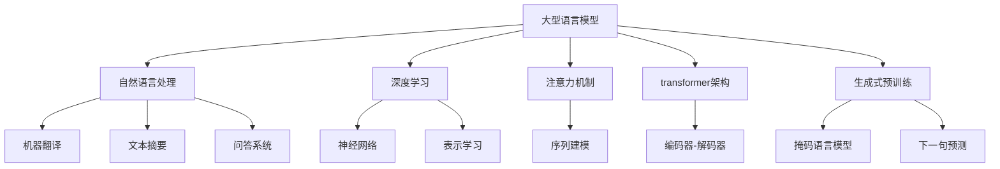

# 大语言模型原理基础与前沿 沟通意图

## 1. 背景介绍

### 1.1 问题的由来

在人工智能领域中,自然语言处理(NLP)一直是一个具有挑战性的任务。随着深度学习技术的飞速发展,大型语言模型(Large Language Models,LLM)应运而生,为解决复杂的NLP任务提供了新的途径。

大型语言模型是一种基于深度神经网络的机器学习模型,旨在从大量文本数据中学习语言的统计规律和语义信息。这些模型通过消化海量文本数据,捕捉语言的内在结构和上下文关系,从而能够生成看似人类写作的自然语言输出。

然而,训练出一个高质量的大型语言模型并非易事。它需要大量的计算资源、海量的训练数据,以及精心设计的模型架构和训练策略。此外,如何有效地控制模型的输出,使其符合特定的任务需求和意图,也是一个亟待解决的问题。

### 1.2 研究现状

近年来,一些科技巨头和研究机构已经开发出了多种大型语言模型,如OpenAI的GPT系列、Google的LaMDA、DeepMind的Chinchilla等。这些模型在自然语言生成、机器翻译、问答系统等任务中表现出色,引起了学术界和工业界的广泛关注。

然而,现有的大型语言模型仍然存在一些局限性和挑战,例如:

1. **可解释性不足**: 大型语言模型的内部机理往往是一个"黑箱",难以解释其输出的原因和逻辑。
2. **缺乏可控性**: 模型的输出往往难以精确控制,可能会产生不符合预期的结果。
3. **数据偏差**: 训练数据的质量和多样性直接影响模型的性能和公正性。
4. **计算资源需求高**: 训练和部署大型语言模型需要大量的计算资源,成本高昂。

为了解决这些问题,研究人员正在探索各种新颖的模型架构、训练策略和控制方法,以提高大型语言模型的性能、可解释性和可控性。

### 1.3 研究意义

大型语言模型的研究对于推进人工智能技术的发展具有重要意义。通过深入理解和改进这些模型,我们可以:

1. **提高自然语言处理的性能**: 大型语言模型可以用于各种NLP任务,如机器翻译、文本摘要、问答系统等,提高这些任务的准确性和效率。
2. **促进人机交互**: 通过改善模型的可控性和可解释性,我们可以实现更自然、更人性化的人机交互方式。
3. **推动人工智能的发展**: 大型语言模型是通用人工智能(AGI)的一个重要组成部分,对于推动AGI的发展具有重要意义。
4. **促进跨学科融合**: 大型语言模型的研究需要计算机科学、语言学、认知科学等多个学科的知识和方法,有助于促进不同领域的交叉融合。

综上所述,深入研究大型语言模型的原理和前沿技术,对于推动人工智能技术的发展、促进人机交互的进步、实现通用人工智能等方面都具有重要的理论和应用价值。

### 1.4 本文结构

本文将全面探讨大型语言模型的基础理论和前沿技术,内容包括:

1. 核心概念与联系
2. 核心算法原理与具体操作步骤
3. 数学模型和公式详细讲解与案例分析
4. 项目实践:代码实例和详细解释说明
5. 实际应用场景
6. 工具和资源推荐
7. 总结:未来发展趋势与挑战
8. 附录:常见问题与解答

通过对这些内容的深入探讨,读者将能够全面了解大型语言模型的理论基础、核心技术、实践应用,以及未来的发展趋势和挑战。

## 2. 核心概念与联系

在深入探讨大型语言模型的具体原理和技术之前,我们首先需要了解一些核心概念及它们之间的联系。

1. **大型语言模型(Large Language Model,LLM)**: 指基于深度神经网络的大型机器学习模型,旨在从海量文本数据中学习语言的统计规律和语义信息,从而生成自然语言输出。

2. **自然语言处理(Natural Language Processing,NLP)**: 是人工智能的一个分支,旨在使计算机能够理解和生成人类语言。大型语言模型是NLP领域的一个重要工具。

3. **深度学习(Deep Learning)**: 是机器学习的一种方法,使用多层神经网络从数据中自动学习特征表示。大型语言模型通常基于深度学习技术构建。

4. **注意力机制(Attention Mechanism)**: 是一种用于序列建模的技术,允许模型在处理序列时动态关注不同位置的信息。注意力机制是大型语言模型的关键组成部分。

5. **Transformer架构**: 是一种基于注意力机制的序列到序列模型架构,被广泛应用于大型语言模型的构建。

6. **生成式预训练(Generative Pre-training)**: 是一种训练大型语言模型的策略,通过预测被掩码的词或下一句来学习语言的统计规律。

7. **机器翻译、文本摘要、问答系统**: 是自然语言处理的几个重要应用领域,大型语言模型可以为这些任务提供强大的语言理解和生成能力。

8. **神经网络、表示学习**: 深度学习的核心概念,大型语言模型通过神经网络学习文本的分布式表示。

9. **序列建模**: 是自然语言处理的一个核心任务,旨在捕捉序列数据(如文本)中的统计规律和上下文信息。

10. **编码器-解码器**: 是一种常见的序列到序列模型架构,被广泛应用于机器翻译等任务。Transformer架构是其一种变体。

11. **掩码语言模型、下一句预测**: 是生成式预训练的两种常见策略,分别通过预测被掩码的词和下一句来学习语言的统计规律。

上述概念相互关联、相辅相成,共同构建了大型语言模型的理论基础和技术框架。理解这些核心概念及其联系,对于深入掌握大型语言模型的原理和应用至关重要。

## 3. 核心算法原理与具体操作步骤

### 3.1 算法原理概述

大型语言模型的核心算法原理是基于**自注意力机制(Self-Attention Mechanism)**和**Transformer架构**。自注意力机制允许模型在处理序列时动态关注不同位置的信息,而Transformer架构则提供了一种高效的序列到序列模型结构。

在Transformer架构中,输入序列首先被映射为一系列向量表示,称为**嵌入(Embeddings)**。然后,这些嵌入被输入到一系列**编码器(Encoder)**层中,每一层都包含一个**多头自注意力(Multi-Head Self-Attention)**子层和一个**前馈神经网络(Feed-Forward Neural Network)**子层。

多头自注意力子层允许每个位置的向量与其他位置的向量进行交互,捕捉序列中的长程依赖关系。前馈神经网络子层则对每个位置的向量进行非线性映射,提取更高级的特征表示。通过堆叠多个编码器层,模型可以逐步构建出输入序列的深层次表示。

对于生成任务(如机器翻译、文本生成等),Transformer架构还包含一系列**解码器(Decoder)**层。解码器层的结构与编码器层类似,但增加了一个**掩码多头自注意力(Masked Multi-Head Self-Attention)**子层,用于防止注意到未来的位置。解码器层还包含一个**编码器-解码器注意力(Encoder-Decoder Attention)**子层,允许解码器关注编码器的输出,从而融合输入序列的信息。

通过上述架构,大型语言模型能够有效地捕捉输入序列的上下文信息,并基于此生成高质量的自然语言输出。

### 3.2 算法步骤详解

下面我们将详细介绍大型语言模型算法的具体操作步骤:

1. **输入表示**:
   - 将输入序列(如一段文本)转换为一系列向量表示(嵌入)。
   - 常用的嵌入方法包括词嵌入(Word Embeddings)和子词嵌入(Subword Embeddings)。

2. **位置编码(Positional Encoding)**:
   - 由于Transformer缺乏递归或卷积结构,因此需要显式地编码序列中每个位置的信息。
   - 常用的位置编码方法包括正弦/余弦位置编码和可学习的位置嵌入。

3. **编码器层**:
   - 输入嵌入和位置编码相加,得到初始的序列表示。
   - 该序列表示被输入到一系列编码器层中进行处理。
   - 每个编码器层包含:
     - 多头自注意力子层:允许每个位置的向量与其他位置的向量进行交互,捕捉长程依赖关系。
     - 前馈神经网络子层:对每个位置的向量进行非线性映射,提取更高级的特征表示。
     - 残差连接(Residual Connection)和层归一化(Layer Normalization):提高模型的训练稳定性和性能。

4. **解码器层(用于生成任务)**:
   - 解码器层的结构与编码器层类似,但增加了掩码多头自注意力子层和编码器-解码器注意力子层。
   - 掩码多头自注意力子层:防止注意到未来的位置,确保模型只依赖于当前和过去的信息进行预测。
   - 编码器-解码器注意力子层:允许解码器关注编码器的输出,从而融合输入序列的信息。

5. **输出生成**:
   - 对于生成任务,解码器层的输出被馈送到一个线性层和softmax层,生成下一个词的概率分布。
   - 通过贪婪搜索或beam search等策略,可以从概率分布中选择最可能的词序列作为最终输出。

6. **训练**:
   - 大型语言模型通常采用自监督的方式进行预训练,如掩码语言模型(Masked Language Modeling)和下一句预测(Next Sentence Prediction)等策略。
   - 预训练后,模型可以通过微调(Fine-tuning)或提示学习(Prompt Learning)等方式,针对特定的下游任务进行进一步的训练和优化。

上述步骤描述了大型语言模型算法的核心流程。通过自注意力机制和Transformer架构,模型能够有效地捕捉输入序列的上下文信息,并基于此生成高质量的自然语言输出。

### 3.3 算法优缺点

大型语言模型算法具有以下优点:

1. **强大的语言理解和生成能力**:通过从海量文本数据中学习,大型语言模型能够捕捉语言的统计规律和语义信息,从而生成看似人类写作的自然语言输出。

2. **通用性**:大型语言模型是一种通用的模型架构,可以应用于各种自然语言处理任务,如机器翻译、文本摘要、问答系统等。

3. **可扩展性**:由于采用了自注意力机制和Transformer架构,大型语言模型具有良好的并行计算能力,可以通过增加模型规模和训练数据来提高性能。

4. **Transfer Learning能力**:预训练的大型语言模型可以通过微调或提示学习等方式,快速适应新的下游任务,减少了从头开始训练的计算成本。

然而,大型语言模型算法也存在一些缺点和挑战:

1. **计算资源需求高