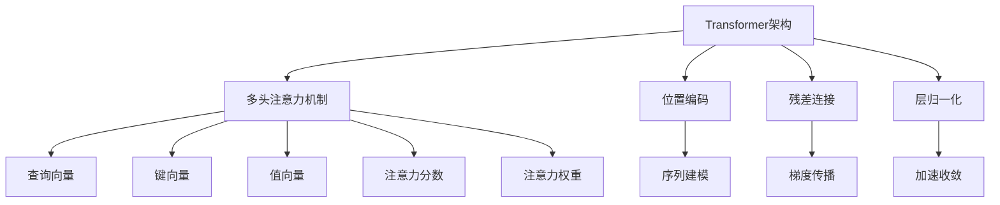

# 大语言模型原理基础与前沿 高效扩展Transformer推理

## 1. 背景介绍

### 1.1 问题的由来

在过去几年中,自然语言处理(NLP)领域取得了长足的进步,很大程度上归功于Transformer模型的出现。Transformer是一种基于注意力机制的神经网络架构,被广泛应用于机器翻译、文本生成、问答系统等各种NLP任务中。然而,随着模型规模的不断增大,Transformer推理过程中的计算复杂度和内存消耗也在快速增长,这给硬件资源带来了巨大压力,限制了模型的实际应用。因此,如何提高Transformer推理的效率,降低计算和内存开销,成为了当前研究的热点问题。

### 1.2 研究现状

为了解决Transformer推理效率低下的问题,研究人员提出了多种优化策略,包括模型压缩、推理加速和硬件加速等方法。其中,模型压缩技术旨在减小模型的参数量和计算量,如pruning、量化、知识蒸馏等;推理加速技术则侧重于优化推理过程,如内存优化、并行计算、缓存加速等;硬件加速则是通过专用硬件(如GPU、TPU等)来加速计算。这些方法在一定程度上提高了Transformer推理的效率,但仍然存在一些局限性,如精度下降、硬件成本高等。

### 1.3 研究意义

提高Transformer推理效率不仅可以降低计算资源的消耗,还可以促进大型语言模型在移动设备、边缘计算等资源受限环境中的应用,扩大其应用范围。此外,高效的推理也是实现实时交互式系统的关键,对于提升用户体验至关重要。因此,研究高效的Transformer推理策略,对于推动NLP技术的发展和应用具有重要意义。

### 1.4 本文结构

本文将全面介绍Transformer推理效率提升的理论基础和实践方法。第2部分将介绍Transformer模型的核心概念和关键技术;第3部分将详细阐述Transformer推理的核心算法原理和具体操作步骤;第4部分将构建数学模型,推导公式并进行案例分析;第5部分将提供代码实例和详细解释;第6部分将探讨实际应用场景;第7部分将推荐相关工具和学习资源;最后,第8部分将总结研究成果,展望未来发展趋势和面临的挑战。

## 2. 核心概念与联系

Transformer是一种全新的基于注意力机制的序列到序列模型,它摒弃了传统的RNN和CNN结构,完全基于注意力机制来捕捉输入和输出序列之间的长程依赖关系。Transformer的核心组件包括:

1. **多头注意力机制(Multi-Head Attention)**:通过将查询(Query)与键(Key)序列进行点积运算来计算注意力分数,然后根据注意力分数对值(Value)序列进行加权求和,从而捕获序列之间的长程依赖关系。
2. **位置编码(Positional Encoding)**:由于Transformer没有递归或卷积结构,因此需要位置编码来提供序列的位置信息,以便模型能够学习序列中元素的相对位置关系。
3. **残差连接(Residual Connection)**:通过将输入直接与子层的输出相加,有助于梯度的传播,缓解了深度神经网络的梯度消失问题。
4. **层归一化(Layer Normalization)**:对每一层的输入进行归一化处理,加速模型的收敛速度,提高模型的稳定性。

这些核心概念和技术的巧妙结合,使得Transformer模型能够有效地捕捉长期依赖关系,并在机器翻译、文本生成等序列到序列任务中取得了卓越的性能表现。

## 3. 核心算法原理 & 具体操作步骤

### 3.1 算法原理概述

Transformer推理的核心算法是**缩放点积注意力(Scaled Dot-Product Attention)**,它是多头注意力机制的基础。缩放点积注意力的计算过程如下:

1. 将输入序列分别线性映射到查询(Query)、键(Key)和值(Value)向量。
2. 计算查询向量与所有键向量的点积,得到未缩放的注意力分数。
3. 对注意力分数进行缩放,以避免过大的值导致梯度下降过慢。
4. 对缩放后的注意力分数应用softmax函数,得到注意力权重。
5. 将注意力权重与值向量进行加权求和,得到注意力输出。

通过这种方式,Transformer能够自动学习输入序列中不同位置元素之间的相关性,并动态地分配注意力权重,从而捕捉长期依赖关系。

### 3.2 算法步骤详解

1. **查询、键、值向量计算**

   对于序列 $X = (x_1, x_2, \dots, x_n)$,我们将其线性映射到查询矩阵 $Q$、键矩阵 $K$ 和值矩阵 $V$:

   $$Q = XW^Q$$
   $$K = XW^K$$
   $$V = XW^V$$

   其中 $W^Q \in \mathbb{R}^{d \times d_q}$、$W^K \in \mathbb{R}^{d \times d_k}$、$W^V \in \mathbb{R}^{d \times d_v}$ 分别是查询、键和值的线性映射矩阵,它们将输入向量从 $d$ 维映射到 $d_q$、$d_k$ 和 $d_v$ 维。

2. **注意力分数计算**

   计算查询矩阵 $Q$ 与键矩阵 $K$ 的点积,得到未缩放的注意力分数矩阵 $S$:

   $$S = QK^T$$

   其中 $S \in \mathbb{R}^{n \times n}$,每个元素 $s_{ij}$ 表示第 $i$ 个查询向量与第 $j$ 个键向量的相似度分数。

3. **注意力分数缩放**

   为了避免点积过大导致softmax函数的梯度下降过慢,我们对注意力分数矩阵 $S$ 进行缩放:

   $$\tilde{S} = \frac{S}{\sqrt{d_k}}$$

   其中 $\sqrt{d_k}$ 是缩放因子,可以有效防止梯度消失或爆炸。

4. **注意力权重计算**

   对缩放后的注意力分数矩阵 $\tilde{S}$ 应用softmax函数,得到注意力权重矩阵 $A$:

   $$A = \text{softmax}(\tilde{S}) = \begin{bmatrix}
   \alpha_{11} & \alpha_{12} & \cdots & \alpha_{1n} \\
   \alpha_{21} & \alpha_{22} & \cdots & \alpha_{2n} \\
   \vdots & \vdots & \ddots & \vdots \\
   \alpha_{n1} & \alpha_{n2} & \cdots & \alpha_{nn}
   \end{bmatrix}$$

   其中每个元素 $\alpha_{ij}$ 表示第 $i$ 个查询向量对第 $j$ 个键向量的注意力权重。

5. **注意力输出计算**

   将注意力权重矩阵 $A$ 与值矩阵 $V$ 相乘,得到注意力输出矩阵 $O$:

   $$O = AV$$

   注意力输出矩阵 $O \in \mathbb{R}^{n \times d_v}$ 的每一行向量都是对应位置的查询向量对值向量序列的加权和,它捕捉了输入序列中不同位置元素之间的长期依赖关系。

通过上述步骤,Transformer模型能够动态地分配注意力权重,关注输入序列中与当前位置最相关的部分,从而有效地建模长期依赖关系。

### 3.3 算法优缺点

**优点**:

1. **并行计算**:与RNN不同,Transformer不存在递归计算,因此可以有效利用现代硬件(如GPU)的并行计算能力,大大提高了计算效率。
2. **长期依赖建模**:基于注意力机制,Transformer能够直接捕捉输入和输出序列之间的长期依赖关系,避免了RNN中的梯度消失和梯度爆炸问题。
3. **灵活的序列长度**:Transformer对输入序列的长度没有严格限制,能够处理变长序列,这使得它在多种任务中具有广泛的应用前景。

**缺点**:

1. **计算复杂度高**:尽管Transformer具有并行计算的优势,但注意力机制的计算复杂度仍然较高,随着序列长度的增加,计算开销会快速增长。
2. **内存消耗大**:在计算注意力分数时,需要存储所有位置之间的注意力权重,这导致了较大的内存开销,限制了Transformer在资源受限环境中的应用。
3. **缺乏位置信息**:Transformer本身无法捕捉序列中元素的绝对位置信息,需要依赖位置编码来提供位置信息,这可能会影响模型的性能。

### 3.4 算法应用领域

由于Transformer模型在捕捉长期依赖关系方面的卓越表现,它已经被广泛应用于自然语言处理的各个领域,包括但不限于:

1. **机器翻译**:Transformer被首次提出并应用于机器翻译任务,在多种翻译基准测试中取得了最佳性能。
2. **文本生成**:Transformer可以用于各种文本生成任务,如新闻摘要、对话系统、故事创作等。
3. **语言理解**:Transformer在阅读理解、自然语言推理、情感分析等语言理解任务中表现出色。
4. **语音识别**:Transformer也被应用于语音识别领域,用于建模语音序列和文本序列之间的映射关系。
5. **计算机视觉**:除了NLP领域,Transformer也被引入到计算机视觉任务中,如图像分类、目标检测和图像描述等。

总的来说,Transformer模型的出现为自然语言处理和其他序列数据处理任务带来了革命性的变化,它的影响力正在不断扩大。

## 4. 数学模型和公式 & 详细讲解 & 举例说明

### 4.1 数学模型构建

为了更好地理解Transformer的核心算法,我们需要构建数学模型并推导相关公式。假设输入序列为 $X = (x_1, x_2, \dots, x_n)$,其中每个 $x_i \in \mathbb{R}^d$ 是一个 $d$ 维向量。我们的目标是学习一个映射函数 $f$,将输入序列 $X$ 映射到输出序列 $Y = (y_1, y_2, \dots, y_m)$,其中每个 $y_j \in \mathbb{R}^{d'}$ 是一个 $d'$ 维向量。

在Transformer中,映射函数 $f$ 由多个编码器(Encoder)层和解码器(Decoder)层组成,每一层都包含多头注意力子层和前馈网络子层。我们将重点关注编码器层中的多头注意力机制,它是Transformer的核心组件。

多头注意力机制由 $h$ 个并行的注意力头组成,每个注意力头都会学习不同的注意力模式。对于第 $i$ 个注意力头,它会将输入序列 $X$ 映射到查询矩阵 $Q_i$、键矩阵 $K_i$ 和值矩阵 $V_i$,然后计算注意力输出 $O_i$:

$$Q_i = XW_i^Q, \quad K_i = XW_i^K, \quad V_i = XW_i^V$$
$$O_i = \text{Attention}(Q_i, K_i, V_i)$$

其中 $W_i^Q \in \mathbb{R}^{d \times d_q}$、$W_i^K \in \mathbb{R}^{d \times d_k}$ 和 $W_i^V \in \mathbb{R}^{d \times d_