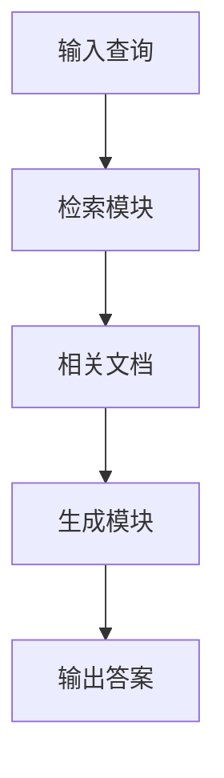

# 大语言模型应用指南：RAG框架微调概述

## 1. 背景介绍

### 1.1 问题的由来

在自然语言处理(NLP)领域,大型语言模型(LLM)已经取得了令人瞩目的成就。然而,这些模型在回答需要外部知识的问题时,往往会产生不准确或者不相关的结果。为了解决这个问题,研究人员提出了RAG(Retrieval Augmented Generation)框架,旨在将语言模型与外部知识库相结合,从而提高模型在知识密集型任务上的表现。

### 1.2 研究现状

RAG框架最初由Facebook AI Research团队在2020年提出,并在多项知识密集型任务中取得了优异的表现。该框架的核心思想是首先使用检索模块从外部知识库中检索相关文档,然后将这些文档与原始查询一起输入到生成模型中,生成最终的答案。

目前,RAG框架已经被广泛应用于各种NLP任务,如开放式问答、事实核查、对话系统等。研究人员还在不断探索如何优化RAG框架的各个组件,以提高其性能和泛化能力。

### 1.3 研究意义

RAG框架的提出为解决大型语言模型缺乏外部知识的问题提供了一种有效的解决方案。通过将语言模型与外部知识库相结合,RAG框架可以显著提高模型在知识密集型任务上的表现,从而推动NLP技术在各个领域的应用。

此外,RAG框架的研究也为语言模型与其他模态(如视觉、音频等)的融合提供了借鉴,为构建更加通用的人工智能系统奠定了基础。

### 1.4 本文结构

本文将全面介绍RAG框架的原理、实现细节和应用场景。首先,我们将探讨RAG框架的核心概念和算法原理。接下来,我们将详细阐述RAG框架的数学模型和公式推导过程,并通过案例分析加深理解。然后,我们将提供一个完整的代码实例,并对其进行详细的解释和分析。最后,我们将讨论RAG框架在实际应用中的场景,并对其未来发展趋势和挑战进行展望。

## 2. 核心概念与联系

RAG框架的核心思想是将语言模型与外部知识库相结合,以提高模型在知识密集型任务上的表现。该框架由两个主要组件组成:检索模块(Retriever)和生成模块(Generator)。



1. **检索模块(Retriever)**:检索模块的作用是从外部知识库中检索与输入查询相关的文档。常见的检索方法包括基于TF-IDF的稀疏检索、基于双编码器的密集检索等。检索模块的性能对RAG框架的整体表现有着重要影响。

2. **生成模块(Generator)**:生成模块是一个大型语言模型,它将输入查询和检索到的相关文档作为输入,并生成最终的答案。生成模块需要具备理解查询、综合知识文档和生成连贯自然语言的能力。

通过将检索模块和生成模块有机结合,RAG框架可以利用语言模型的生成能力,同时又能够从外部知识库中获取所需的知识,从而提高模型在知识密集型任务上的表现。

## 3. 核心算法原理 & 具体操作步骤

### 3.1 算法原理概述

RAG框架的核心算法原理可以概括为以下三个步骤:

1. **检索相关文档**:给定输入查询,检索模块从外部知识库中检索与查询相关的文档。

2. **构建输入序列**:将输入查询和检索到的相关文档拼接成一个输入序列,作为生成模块的输入。

3. **生成最终答案**:生成模块基于输入序列,生成最终的答案。

### 3.2 算法步骤详解

1. **检索相关文档**

   检索模块的主要任务是从外部知识库中检索与输入查询相关的文档。常见的检索方法包括:

   - **基于TF-IDF的稀疏检索**:利用TF-IDF算法计算查询与文档之间的相似度,并返回相似度最高的文档。
   - **基于双编码器的密集检索**:使用双编码器模型将查询和文档映射到同一个密集向量空间,然后根据向量相似度检索相关文档。

   无论采用何种检索方法,检索模块都需要对知识库进行预处理和索引,以提高检索效率。

2. **构建输入序列**

   将输入查询和检索到的相关文档拼接成一个输入序列,作为生成模块的输入。输入序列的构建方式有多种,常见的做法是:

   - 将查询和文档简单拼接,例如: `[查询] [文档1] [文档2] ...`
   - 在查询和文档之间添加特殊标记,例如: `[查询] <sep> [文档1] <sep> [文档2] ...`
   - 对文档进行排序和截断,保留与查询最相关的前几个文档。

3. **生成最终答案**

   生成模块是一个经过微调的大型语言模型,它将输入序列作为输入,并生成最终的答案。生成模块需要具备以下能力:

   - 理解输入查询的语义
   - 从相关文档中提取有用的知识
   - 综合查询和知识,生成连贯自然的答案

   生成模块通常采用序列到序列(Seq2Seq)的架构,使用自回归(Autoregressive)的方式生成答案。

### 3.3 算法优缺点

**优点**:

- 利用外部知识库,可以显著提高语言模型在知识密集型任务上的表现。
- 模块化设计,检索模块和生成模块可以独立优化和替换。
- 生成的答案具有较高的连贯性和自然度。

**缺点**:

- 依赖于外部知识库的质量和覆盖范围。
- 检索模块的性能对整体表现有重大影响。
- 生成模型可能会产生不一致或虚构的内容。

### 3.4 算法应用领域

RAG框架可以应用于各种知识密集型NLP任务,包括但不限于:

- **开放式问答(Open-Domain Question Answering)**:回答需要外部知识的自然语言问题。
- **事实核查(Fact Checking)**:验证给定陈述的真实性,并提供支持或反驳的证据。
- **对话系统(Dialogue Systems)**:在对话过程中,根据上下文和知识库生成自然的回复。
- **文本生成(Text Generation)**:基于给定主题和知识,生成连贯、信息丰富的文本。

## 4. 数学模型和公式 & 详细讲解 & 举例说明

### 4.1 数学模型构建

在RAG框架中,检索模块和生成模块都可以使用不同的数学模型。我们将分别介绍这两个模块的数学模型。

**1. 检索模块数学模型**

检索模块的主要任务是计算输入查询与知识库中文档之间的相似度,并返回最相关的文档。常见的相似度计算方法包括:

- **基于TF-IDF的余弦相似度**:

  $$\text{sim}_\text{tfidf}(q, d) = \frac{\vec{q} \cdot \vec{d}}{|\vec{q}||\vec{d}|}$$

  其中 $\vec{q}$ 和 $\vec{d}$ 分别表示查询和文档的TF-IDF向量。

- **基于双编码器的向量相似度**:

  $$\text{sim}_\text{dense}(q, d) = \frac{\vec{q}^\top \vec{d}}{|\vec{q}||\vec{d}|}$$

  其中 $\vec{q}$ 和 $\vec{d}$ 分别表示查询和文档在密集向量空间中的表示。

根据相似度得分,检索模块可以返回与查询最相关的前 $k$ 个文档。

**2. 生成模块数学模型**

生成模块通常采用基于Transformer的序列到序列(Seq2Seq)模型,其目标是最大化输出序列 $Y$ 给定输入序列 $X$ 的条件概率 $P(Y|X)$。具体来说,模型需要学习参数 $\theta$ 来最小化负对数似然损失:

$$\mathcal{L}(\theta) = -\sum_{(X, Y) \in \mathcal{D}} \log P(Y|X; \theta)$$

其中 $\mathcal{D}$ 表示训练数据集。

在RAG框架中,输入序列 $X$ 由查询和相关文档构成,输出序列 $Y$ 为生成的答案。模型通过自回归(Autoregressive)的方式生成答案,即:

$$P(Y|X; \theta) = \prod_{t=1}^{|Y|} P(y_t|y_{<t}, X; \theta)$$

其中 $y_t$ 表示答案序列的第 $t$ 个标记,而 $y_{<t}$ 表示前 $t-1$ 个标记。

### 4.2 公式推导过程

在RAG框架中,生成模块的核心是基于Transformer的序列到序列模型。我们将推导该模型的基本公式。

首先,我们定义输入序列 $X = (x_1, x_2, \dots, x_n)$ 和输出序列 $Y = (y_1, y_2, \dots, y_m)$。目标是最大化输出序列 $Y$ 给定输入序列 $X$ 的条件概率 $P(Y|X)$。

根据链式法则,我们可以将 $P(Y|X)$ 分解为:

$$P(Y|X) = \prod_{t=1}^{m} P(y_t|y_{<t}, X)$$

其中 $y_{<t} = (y_1, y_2, \dots, y_{t-1})$ 表示输出序列的前 $t-1$ 个标记。

现在,我们引入模型参数 $\theta$,目标是学习 $\theta$ 来最大化 $P(Y|X; \theta)$。通过最小化负对数似然损失,我们可以得到优化目标:

$$\mathcal{L}(\theta) = -\sum_{(X, Y) \in \mathcal{D}} \log P(Y|X; \theta)$$

$$= -\sum_{(X, Y) \in \mathcal{D}} \sum_{t=1}^{m} \log P(y_t|y_{<t}, X; \theta)$$

其中 $\mathcal{D}$ 表示训练数据集。

在实际应用中,我们通常使用自回归(Autoregressive)的方式来预测每个标记 $y_t$,即:

$$P(y_t|y_{<t}, X; \theta) = \text{Model}(y_{<t}, X; \theta)$$

其中 $\text{Model}(\cdot)$ 表示序列到序列模型,如Transformer等。

通过梯度下降算法优化上述损失函数,我们可以学习到模型参数 $\theta$,从而使模型能够生成高质量的答案序列。

### 4.3 案例分析与讲解

为了更好地理解RAG框架的工作原理,我们将通过一个具体案例进行分析和讲解。

**案例背景**:

假设我们有一个开放式问答系统,需要回答关于"人工智能"主题的问题。我们将使用RAG框架来构建这个系统。

**输入查询**:
```
什么是人工智能?人工智能的主要研究方向有哪些?
```

**步骤1: 检索相关文档**

检索模块从知识库中检索与输入查询相关的文档。假设检索到的前两个最相关文档如下:

文档1:
```
人工智能(Artificial Intelligence,AI)是一门研究如何使机器模拟人类智能行为的学科,旨在创造出能够执行人类智能活动的机器系统。人工智能的研究包括机器学习、计算机视觉、自然语言处理、机器人技术、专家系统等多个领域。
```

文档2:
```
人工智能的主要研究方向包括:
1. 机器学习:赋予机器学习和建模的能力,从数据中自动分析获得规律。
2. 计算机视觉:赋予机器视觉感知和理解的能力。
3. 自然语言处理:赋予机器理解和生成人类语言的能力。
4. 机器人技术:赋予机器感知、规划和操作的能力。
5. 专家系统:模拟人