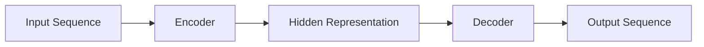
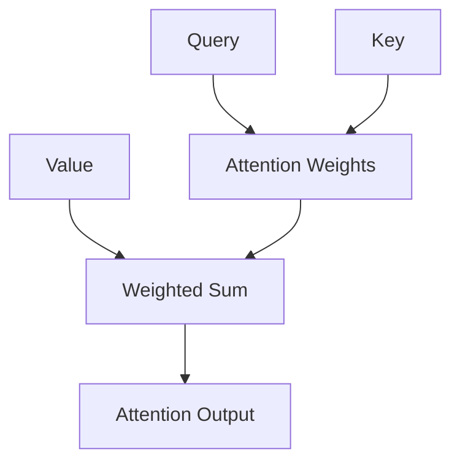
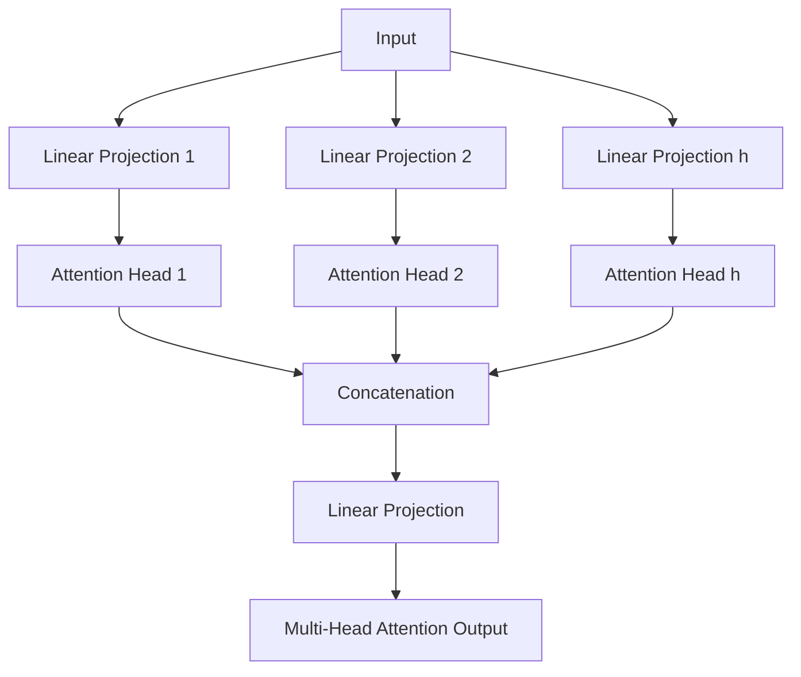

# 大语言模型应用指南：什么是工作记忆

关键词：大语言模型、工作记忆、Transformer、自回归、上下文学习、注意力机制、提示学习

## 1. 背景介绍
### 1.1  问题的由来
近年来，随着深度学习技术的飞速发展，大语言模型(Large Language Model, LLM)在自然语言处理(Natural Language Processing, NLP)领域取得了巨大的突破。从GPT-3到ChatGPT，LLM展现出了令人惊叹的语言理解和生成能力。然而，LLM要真正发挥其潜力，高效利用其海量知识，工作记忆(Working Memory)是一个关键因素。

### 1.2  研究现状
目前，工作记忆在LLM中的研究还处于初级阶段。一些学者提出了基于外部存储的方法[1]，将知识库与LLM结合；也有研究探索了LLM内部表征的特点[2]，试图找到类似工作记忆的机制。但离真正理解和应用LLM的工作记忆，还有很长的路要走。

### 1.3  研究意义
深入研究LLM的工作记忆，对于提升其在复杂任务中的表现、实现更加智能化的交互都有重要意义。通过工作记忆，LLM可以在对话中记住关键信息，根据上下文进行推理，表现出更加连贯、合理的行为。这将大大拓展LLM的应用场景，为认知智能的实现奠定基础。

### 1.4  本文结构 
本文将从以下几个方面展开讨论：
- 首先介绍LLM中工作记忆的核心概念和内在联系
- 然后重点阐述相关的核心算法原理和具体操作步骤
- 接着从数学角度对工作记忆建模，给出详细的公式推导和案例分析
- 进一步通过代码实例，讲解如何在项目中实践工作记忆
- 随后分析工作记忆在实际场景中的应用和未来展望
- 最后总结全文，展望未来研究方向，并附上常见问题解答

## 2. 核心概念与联系
要理解LLM中的工作记忆，首先需要了解以下几个核心概念：

- **语言模型**：对语言符号序列的概率分布建模，可以预测下一个最可能出现的词。LLM通过海量语料训练，学习到了强大的语言理解和生成能力。
- **Transformer结构**：目前主流的LLM如GPT系列都采用了Transformer[3]的编码器-解码器结构。Transformer中的自注意力机制和前馈网络使其能够高效地学习文本间的长距离依赖。
- **自回归**：LLM在生成文本时，是通过自回归(Auto-Regressive)的方式，根据之前生成的词预测下一个词。这种自回归过程蕴含了一定的记忆能力。
- **上下文学习**：不同于传统的监督学习，LLM采用了上下文学习(Context Learning)的范式。通过海量语料的自监督预训练，LLM可以学习到丰富的语义信息，具备了一定的常识和推理能力。
- **注意力机制**：Transformer的核心是注意力机制(Attention Mechanism)，它使得模型能够在编码和生成时有选择地关注输入和历史信息中的不同部分，动态调整权重。这为工作记忆的实现提供了基础。
- **提示学习**：LLM虽然拥有海量知识，但需要合适的提示(Prompt)才能将其激发出来。提示学习(Prompt Learning)[4]旨在优化输入的提示，引导模型进行特定任务。工作记忆也需要恰当的提示来调用。

这些概念相互关联，共同构成了LLM工作记忆的基础。Transformer结构和注意力机制提供了存储和访问历史信息的机制，自回归和上下文学习使LLM能够根据上下文进行预测和决策，提示学习则为外部调用工作记忆提供了接口。下面我们将详细探讨其中的算法原理。

## 3. 核心算法原理 & 具体操作步骤
### 3.1  算法原理概述
LLM工作记忆的核心算法，是基于Transformer结构和注意力机制的。具体来说，主要涉及以下几个方面：

1. **Transformer的编码器-解码器结构**：如图1所示，Transformer由编码器和解码器组成，分别用于编码输入序列和生成输出序列。编码器将输入转化为隐向量表示，解码器根据隐向量和之前生成的词，预测下一个词。

图1 Transformer的编码器-解码器结构

2. **自注意力机制**：Transformer的核心是自注意力机制，它允许模型在处理当前词时，参考输入序列中的任意位置。如图2所示，自注意力通过查询(Query)、键(Key)、值(Value)三个向量来计算注意力权重，得到加权求和的注意力输出。

图2 自注意力机制

3. **多头注意力**：为了捕捉不同的注意力模式，Transformer采用了多头注意力(Multi-Head Attention)。如图3所示，多头注意力将输入进行多次线性变换，并行计算多个注意力头，最后拼接起来。这使得模型能够关注不同的语义层面。

图3 多头注意力

4. **位置编码**：为了引入位置信息，Transformer在输入嵌入中加入了位置编码(Positional Encoding)。位置编码可以是固定的正余弦函数，也可以是可学习的参数。

5. **前馈网络**：在自注意力之后，Transformer还使用了前馈网络(Feed-Forward Network)对特征进行非线性变换，增强模型的表达能力。

### 3.2  算法步骤详解
结合上述原理，LLM工作记忆的具体算法步骤如下：

1. 将输入文本转化为嵌入向量，加上位置编码。
2. 对嵌入向量进行自注意力计算，得到上下文表示。
   - 将嵌入向量线性变换为查询、键、值向量
   - 计算查询与键的点积，得到注意力权重
   - 将注意力权重乘以值向量，得到加权求和的注意力输出
   - 多头注意力并行计算，拼接结果
3. 对注意力输出进行前馈网络变换，得到最终的隐向量表示。
4. 解码器根据隐向量和之前生成的词，计算下一个词的概率分布。
   - 解码器的自注意力参考了之前生成的词，体现了一定的记忆能力
   - 解码器还会参考编码器的隐向量，即编码-解码注意力
5. 根据概率分布采样或选择最可能的词，作为新生成的内容。
6. 重复步骤4-5，直到生成结束标记或达到最大长度。

在这个过程中，工作记忆主要体现在两个方面：
- 编码器的自注意力可以捕捉输入序列中的长距离依赖，将上下文信息存储在隐向量中。
- 解码器的自注意力可以参考之前生成的内容，结合上下文进行预测。

### 3.3  算法优缺点
LLM工作记忆算法的优点包括：
- 通过注意力机制，可以灵活地存储和访问长距离的上下文信息。
- 多头注意力可以捕捉不同层次的语义信息，提供更全面的上下文表示。
- 前馈网络增强了模型的非线性表达能力，使其能够处理复杂模式。
- 端到端的训练方式，不需要显式设计存储和访问机制。

但该算法也存在一些局限性：
- 注意力计算的复杂度随序列长度平方增长，难以处理极长文本。
- 模型参数量巨大，训练和推理成本高昂。
- 记忆能力依赖于训练数据，可能出现遗忘或混淆。
- 缺乏显式的知识管理和推理机制，难以进行可解释和可控的记忆操作。

### 3.4  算法应用领域
尽管有局限性，LLM工作记忆算法已经在多个NLP任务中取得了显著成果，如：
- 对话系统：如ChatGPT，可以根据对话历史进行上下文感知的回复。
- 文本摘要：通过注意力机制，自动提取文章的关键信息，生成摘要。
- 机器翻译：编码器-解码器结构使模型能够在翻译时考虑长距离依赖。
- 问答系统：通过记忆相关段落，自动推理出问题的答案。
- 文本生成：如GPT-3，可以根据提示生成连贯、富有创意的长文本。

未来，随着算法的进一步优化和扩展，LLM工作记忆有望在更广泛的认知任务中发挥重要作用。

## 4. 数学模型和公式 & 详细讲解 & 举例说明
### 4.1  数学模型构建
为了更准确地刻画LLM工作记忆的特点，我们可以建立相应的数学模型。设输入文本序列为 $\mathbf{x}=(x_1,\cdots,x_n)$，其中 $x_i$ 表示第 $i$ 个词的嵌入向量。模型的目标是最大化如下条件概率：

$$P(\mathbf{y}|\mathbf{x})=\prod_{t=1}^{m}P(y_t|\mathbf{x},y_1,\cdots,y_{t-1})$$

其中 $\mathbf{y}=(y_1,\cdots,y_m)$ 为生成的目标序列。在Transformer中，这个条件概率通过编码器-解码器结构和注意力机制来建模。

编码器的第 $l$ 层隐状态表示为 $\mathbf{h}^l=(\mathbf{h}_1^l,\cdots,\mathbf{h}_n^l)$，每个向量的维度为 $d$。初始状态 $\mathbf{h}^0$ 即为输入嵌入加上位置编码。之后的每一层状态通过自注意力和前馈网络递归计算：

$$
\begin{aligned}
\mathbf{h}^l &= \text{LayerNorm}(\mathbf{z}^l + \text{FFN}(\mathbf{z}^l)) \\
\mathbf{z}^l &= \text{LayerNorm}(\mathbf{h}^{l-1} + \text{MultiHead}(\mathbf{h}^{l-1}))
\end{aligned}
$$

其中 $\text{LayerNorm}$ 为层归一化，$\text{FFN}$ 为前馈网络，$\text{MultiHead}$ 为多头注意力。

多头注意力将状态 $\mathbf{h}^{l-1}$ 线性变换为查询 $\mathbf{Q}$、键 $\mathbf{K}$、值 $\mathbf{V}$ 三个矩阵，然后并行计算 $H$ 个注意力头：

$$
\begin{aligned}
\text{head}_i &= \text{Attention}(\mathbf{Q}_i, \mathbf{K}_i, \mathbf{V}_i) \\
\text{MultiHead}(\mathbf{h}^{l-1}) &= \text{Concat}(\text{head}_1, \cdots, \text{head}_H)\mathbf{W}^O
\end{aligned}
$$

其中 $\mathbf{Q}_i, \mathbf{K}_i, \mathbf{V}_i$ 为第 $i$ 个头的查询、键、值矩阵，$\mathbf{W}^O$ 为输出线性变换的参数矩阵。

注意力函数 $\text{Attention}(\mathbf{Q}, \mathbf{K}, \mathbf{V})$ 的计算公式为：

$$\text{Attention}(\mathbf{Q}, \mathbf{K}, \mathbf