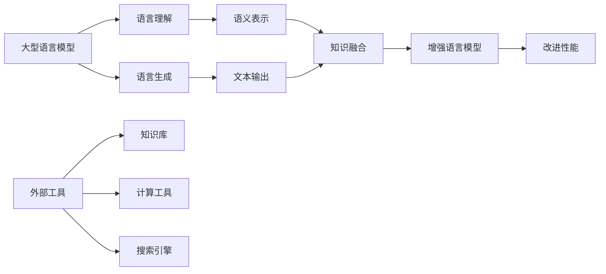

# 大语言模型应用指南：使用外部工具的基本原理

## 1. 背景介绍

### 1.1 问题的由来

随着人工智能技术的快速发展,大型语言模型(Large Language Models, LLMs)已经成为当前最具影响力的人工智能技术之一。这些模型通过在海量文本数据上进行预训练,能够捕捉到人类语言的丰富模式和语义关系,从而在广泛的自然语言处理任务中表现出令人惊叹的性能。

然而,尽管大型语言模型展现出了强大的语言理解和生成能力,但它们仍然存在一些固有的局限性。由于训练数据的有限性和模型架构的局限,大型语言模型可能缺乏对一些专门领域知识的深入理解,难以处理需要外部知识和推理的复杂任务。此外,这些模型也存在一定的安全性和可靠性问题,例如可能生成有害或不当的内容。

为了解决这些挑战,研究人员提出了将大型语言模型与外部工具相结合的方法,旨在扩展模型的能力,提高其在特定领域的性能和可靠性。这种方法通过将语言模型与各种外部工具(如知识库、搜索引擎、计算工具等)相集成,使模型能够访问和利用外部知识,从而增强其推理、计算和决策能力。

### 1.2 研究现状

近年来,将大型语言模型与外部工具相结合的研究取得了一些进展。一些著名的工作包括:

- **WebGPT**: 这是一种将GPT语言模型与互联网搜索引擎相结合的方法,允许模型在生成响应时查询互联网以获取相关信息。
- **Retrieval-Augmented Generation (RAG)**: 该方法将检索式问答系统与语言生成模型相结合,通过从知识库中检索相关文档来增强模型的问答能力。
- **ToolGPT**: 这是一种将语言模型与各种外部工具(如计算器、日期工具等)相集成的框架,使模型能够在需要时调用这些工具来执行特定任务。

这些工作展示了将语言模型与外部工具相结合的潜力,但也面临一些挑战,如如何有效地融合不同类型的工具、如何确保生成的输出的一致性和可靠性等。

### 1.3 研究意义

将大型语言模型与外部工具相结合具有重要的理论和实际意义:

- **理论意义**:这种方法有助于探索语言模型如何与外部知识和工具相互作用,为构建更加通用和智能的人工智能系统提供了新的思路。它也为研究人工智能系统的可解释性、可靠性和安全性等问题提供了一个有趣的角度。

- **实际意义**:通过利用外部工具,语言模型可以在特定领域展现出更强的性能,为各种实际应用场景(如问答系统、智能助手等)提供更加准确和可靠的服务。此外,与外部工具的集成也有助于提高模型的可解释性和可控性,从而增强用户对模型的信任度。

### 1.4 本文结构

本文将全面介绍将大型语言模型与外部工具相结合的基本原理和方法。文章的主要结构如下:

1. **背景介绍**:阐述该研究领域的背景、现状和意义。
2. **核心概念与联系**:介绍该领域的核心概念,以及它们之间的关系。
3. **核心算法原理与具体操作步骤**:详细解释该领域常用的算法原理和具体实现步骤。
4. **数学模型和公式详细讲解与举例说明**:对相关的数学模型和公式进行推导和解释,并给出具体案例分析。
5. **项目实践:代码实例和详细解释说明**:提供实际的代码实现示例,并对其进行详细的解读和分析。
6. **实际应用场景**:介绍该领域的实际应用场景,并探讨未来的应用前景。
7. **工具和资源推荐**:推荐该领域的学习资源、开发工具和相关论文等。
8. **总结:未来发展趋势与挑战**:总结该领域的研究成果,并展望未来的发展趋势和面临的挑战。
9. **附录:常见问题与解答**:解答该领域常见的一些问题。

通过全面的介绍和深入的分析,本文旨在为读者提供一个对该领域的系统理解,并为相关研究和应用提供参考和指导。

## 2. 核心概念与联系

在介绍将大型语言模型与外部工具相结合的具体方法之前,我们需要先了解该领域的一些核心概念及它们之间的关系。

1. **大型语言模型(Large Language Models, LLMs)**:这是一种基于深度学习的自然语言处理模型,通过在大规模文本数据上进行预训练,能够捕捉到人类语言的丰富模式和语义关系。常见的大型语言模型包括GPT、BERT、T5等。

2. **语言理解(Language Understanding)**:大型语言模型能够对输入的自然语言进行理解,捕捉其中的语义信息,并将其转换为内部的语义表示。

3. **语言生成(Language Generation)**:基于内部的语义表示,大型语言模型可以生成相应的自然语言文本作为输出。

4. **外部工具(External Tools)**:指与语言模型集成的各种外部资源和工具,包括知识库、计算工具、搜索引擎等。这些工具可以为语言模型提供额外的知识和功能支持。

5. **知识融合(Knowledge Fusion)**:将语言模型的语义表示与外部工具提供的知识和信息进行融合,从而增强语言模型的理解和生成能力。

6. **增强语言模型(Augmented Language Model)**:通过与外部工具的集成,语言模型的性能得到了增强,能够处理一些原本难以完成的复杂任务。

7. **改进性能(Improved Performance)**:增强后的语言模型在特定领域和任务上表现出更好的性能,如更高的准确性、更好的可解释性和可控性等。

这些核心概念相互关联,共同构成了将大型语言模型与外部工具相结合的基本框架。通过有效地融合语言模型和外部工具,我们可以扩展语言模型的能力,提高其在特定领域的性能和可靠性。

## 3. 核心算法原理与具体操作步骤

### 3.1 算法原理概述

将大型语言模型与外部工具相结合的核心算法原理可以概括为以下几个关键步骤:

1. **语言理解**:首先,语言模型对输入的自然语言进行理解,将其转换为内部的语义表示。

2. **知识检索**:根据语义表示,从外部工具(如知识库、搜索引擎等)中检索相关的知识和信息。

3. **知识融合**:将检索到的外部知识与语言模型的语义表示进行融合,形成增强后的语义表示。

4. **语言生成**:基于增强后的语义表示,语言模型生成相应的自然语言输出。

5. **结果评估**:评估生成的输出是否满足要求,如果不满足,则重复上述步骤进行迭代优化。

这个过程可以看作是一种"理解-检索-融合-生成-评估"的循环,通过不断地与外部工具交互和迭代优化,语言模型的性能得到了增强。

### 3.2 算法步骤详解

下面我们将详细介绍上述算法原理的具体实现步骤:

1. **语言理解**

   - 使用预训练的大型语言模型(如BERT、GPT等)对输入的自然语言进行编码,得到其对应的语义表示(如contextualized word embeddings)。
   - 该语义表示捕捉了输入语言的语义信息,为后续的知识检索和融合奠定基础。

2. **知识检索**

   - 根据语义表示,构建相关的查询,并在外部工具(如知识库、搜索引擎等)中进行检索。
   - 检索相关的知识片段或文档,这些知识将用于增强语言模型的理解和生成能力。
   - 常见的检索方法包括基于向量相似度的检索、基于规则的检索等。

3. **知识融合**

   - 将检索到的外部知识与语言模型的语义表示进行融合,形成增强后的语义表示。
   - 融合方法包括基于注意力机制的融合、基于记忆网络的融合等。
   - 增强后的语义表示包含了语言模型原有的语义信息,以及从外部工具获取的额外知识。

4. **语言生成**

   - 基于增强后的语义表示,语言模型生成相应的自然语言输出。
   - 生成过程可以采用序列到序列(Seq2Seq)模型、生成式对抗网络(GAN)等方法。
   - 生成的输出应该综合考虑了语言模型的原有能力和外部知识的贡献。

5. **结果评估**

   - 评估生成的输出是否满足要求,如准确性、相关性、一致性等。
   - 如果不满足要求,则根据评估结果对语言模型、知识检索或融合策略进行调整,重复上述步骤进行迭代优化。
   - 评估方法可以是自动评估(如基于参考答案的评分)或人工评估。

通过上述步骤,语言模型可以与外部工具进行有效的交互和集成,从而提高其在特定领域和任务上的性能表现。

### 3.3 算法优缺点

将大型语言模型与外部工具相结合的算法具有以下优点:

- **能力扩展**:通过利用外部工具提供的知识和功能,语言模型的能力得到了扩展,可以处理一些原本难以完成的复杂任务。
- **领域适应性**:该算法使语言模型能够更好地适应特定领域,通过融合相关领域知识,提高了模型在该领域的性能表现。
- **可解释性**:与外部工具的集成提高了语言模型的可解释性,用户可以更好地理解模型的决策过程和依据。
- **可控性**:通过调整知识检索和融合策略,用户可以在一定程度上控制语言模型的输出,提高其可靠性和安全性。

然而,该算法也存在一些潜在的缺点和挑战:

- **系统复杂性**:集成多个外部工具会增加整个系统的复杂性,需要妥善处理不同工具之间的交互和协调。
- **知识一致性**:来自不同外部工具的知识可能存在矛盾或冲突,需要采取有效的策略来解决知识一致性问题。
- **效率问题**:频繁地与外部工具交互可能会降低系统的响应效率,需要在性能和功能之间权衡。
- **数据质量**:外部工具提供的知识和信息的质量会直接影响语言模型的性能,需要对数据质量进行严格把控。

### 3.4 算法应用领域

将大型语言模型与外部工具相结合的算法可以应用于多个领域,包括但不限于:

- **问答系统**:通过融合知识库和搜索引擎,语言模型可以回答一些需要外部知识支持的复杂问题。
- **智能助理**:集成计算工具、日期工具等,语言模型可以为用户提供更加智能和多功能的助理服务。
- **内容生成**:利用外部知识,语言模型可以生成更加丰富、专业和权威的内容,如新闻报道、技术文档等。
- **决策支持**:融合相关领域知识,语言模型可以为决策过程提供有价值的建议和支持。
- **教育领域**:将语言模型与教育资源相结合,可以构建智能化的教学辅助系统。

总的来说,该算法为语言模型在各个领域