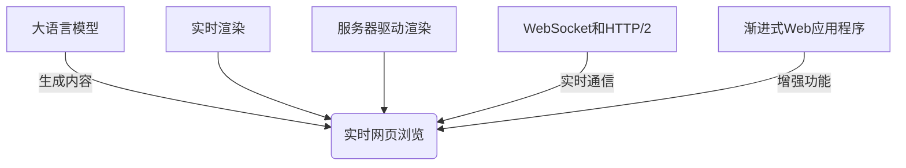

# 大语言模型应用指南：网页实时浏览

## 1. 背景介绍

### 1.1 问题的由来

在当今快节奏的数字时代，网页浏览已成为人们获取信息和体验在线服务的主要方式。然而,传统的网页浏览体验存在一些痛点和不足,例如页面加载缓慢、交互响应迟钝、内容更新滞后等,这些问题严重影响了用户体验。为了解决这些问题,实时网页浏览技术应运而生。

实时网页浏览技术旨在提供流畅、高效和实时的浏览体验,使网页内容能够及时更新,并与用户交互保持高度同步。这种技术的出现不仅为用户带来了更佳的浏览体验,也为网站开发者提供了新的机遇和挑战。

### 1.2 研究现状

实时网页浏览技术的发展离不开大语言模型的支持。近年来,大语言模型在自然语言处理、机器翻译、内容生成等领域取得了突破性进展,为实时网页浏览技术的发展提供了强大的技术支撑。

目前,已有一些公司和研究机构开始探索将大语言模型应用于实时网页浏览领域。例如,谷歌的 Web实时渲染(Real-Time Rendering)技术利用大语言模型生成网页内容,并实时更新到浏览器中。另一方面,一些开源项目也在积极推进相关技术的发展,如 Hotwire 和 LiveView 等。

### 1.3 研究意义

实时网页浏览技术的发展对于提升用户体验、优化网站性能、促进网络创新等方面具有重要意义:

1. **提升用户体验**:实时网页浏览技术可以显著提高页面加载速度、交互响应速度和内容更新速度,为用户带来流畅、高效的浏览体验。

2. **优化网站性能**:通过实时渲染和更新网页内容,可以减少网络传输量,提高网站的性能和可扩展性。

3. **促进网络创新**:实时网页浏览技术为网站开发者提供了新的设计和开发思路,有助于推动网络技术的创新和发展。

4. **降低开发成本**:利用大语言模型生成和更新网页内容,可以减轻开发人员的工作量,降低开发成本。

5. **拓展应用场景**:实时网页浏览技术可以应用于各种领域,如在线教育、协作办公、实时新闻等,为这些领域带来全新的体验。

### 1.4 本文结构

本文将全面介绍大语言模型在实时网页浏览领域的应用。首先,我们将探讨实时网页浏览的核心概念和关键技术。接下来,详细阐述实时网页浏览的核心算法原理和数学模型。然后,我们将通过实际项目实践,展示如何利用大语言模型开发实时网页浏览应用。最后,我们将分析实时网页浏览技术的实际应用场景、工具资源,并对未来发展趋势和挑战进行展望。

## 2. 核心概念与联系

实时网页浏览技术涉及多个核心概念,包括:

1. **大语言模型(Large Language Model, LLM)**:大语言模型是一种基于深度学习的自然语言处理模型,能够从大量文本数据中学习语言模式和知识,用于生成自然语言内容。在实时网页浏览中,大语言模型可以根据用户交互和上下文信息,实时生成和更新网页内容。

2. **实时渲染(Real-Time Rendering)**:实时渲染是指在用户与网页交互时,立即在浏览器中渲染和更新相应的内容,而无需重新加载整个页面。这种技术可以显著提高页面响应速度和用户体验。

3. **服务器驱动渲染(Server-Driven Rendering)**:服务器驱动渲染是一种在服务器端生成和更新网页内容的方法。服务器利用大语言模型生成HTML、CSS和JavaScript代码,并将渲染后的内容传输到浏览器进行展示。

4. **WebSocket和HTTP/2**:WebSocket和HTTP/2是实现实时网页浏览的关键技术。WebSocket提供了一种全双工的通信协议,可以实现服务器与浏览器之间的实时双向通信。HTTP/2支持多路复用和服务器推送等功能,有助于提高网页加载和更新速度。

5. **渐进式Web应用程序(Progressive Web Apps, PWA)**:渐进式Web应用程序是一种可以在浏览器中运行的Web应用程序,具有类似于原生应用程序的功能和体验。在实时网页浏览中,PWA可以利用服务工作线程(Service Worker)等技术,实现离线访问、实时更新和推送通知等功能。

这些核心概念相互关联,共同构建了实时网页浏览的技术基础。大语言模型为实时网页内容生成提供了强大的支持,而实时渲染、服务器驱动渲染、WebSocket和HTTP/2等技术则保证了内容的实时传输和更新。渐进式Web应用程序则为实时网页浏览提供了更加丰富的功能和体验。

## 3. 核心算法原理 & 具体操作步骤

### 3.1 算法原理概述

实时网页浏览技术的核心算法原理是基于大语言模型的内容生成和实时渲染。该算法主要包括以下几个关键步骤:

1. **语义理解**:利用大语言模型对用户输入和网页上下文进行语义理解,捕获用户的意图和需求。

2. **内容生成**:根据语义理解的结果,大语言模型生成相应的网页内容,包括HTML、CSS和JavaScript代码。

3. **实时渲染**:将生成的内容通过WebSocket或HTTP/2等技术实时传输到浏览器,并在浏览器中进行渲染和更新。

4. **交互处理**:监测用户在浏览器中的交互行为,并将交互数据反馈给服务器,作为下一次内容生成的输入。

5. **持续迭代**:算法会持续迭代上述步骤,实现网页内容的实时更新和交互响应。

该算法的核心在于利用大语言模型的强大语义理解和内容生成能力,结合实时渲染和交互处理技术,实现网页内容的实时生成、更新和交互。

### 3.2 算法步骤详解

1. **语义理解**

   在这一步骤中,算法需要对用户输入(如搜索查询、表单填写等)和网页上下文(如当前页面内容、用户浏览历史等)进行语义理解。这通常涉及自然语言处理技术,如词法分析、句法分析、词义消歧、命名实体识别等。

   大语言模型在这一步骤中发挥了关键作用。由于其在大量文本数据上进行了预训练,因此能够捕获丰富的语言模式和语义知识,从而更好地理解用户输入和网页上下文的语义。

2. **内容生成**

   基于语义理解的结果,算法需要利用大语言模型生成相应的网页内容。这包括HTML代码(用于网页结构和内容)、CSS代码(用于网页样式和布局)以及JavaScript代码(用于交互和动态效果)。

   大语言模型在这一步骤中也扮演着重要角色。它可以根据语义理解的结果,结合预先学习的知识和模板,生成符合语义要求的网页代码。例如,如果用户搜索"天气预报",大语言模型可以生成包含天气信息的HTML代码,并使用合适的CSS样式进行美化。

3. **实时渲染**

   生成的网页内容需要实时传输到浏览器,并在浏览器中进行渲染和更新。这一步骤通常依赖于WebSocket或HTTP/2等技术。

   WebSocket提供了一种全双工的通信协议,可以实现服务器与浏览器之间的实时双向通信。服务器可以通过WebSocket将生成的内容推送到浏览器,而浏览器也可以通过WebSocket将用户交互数据实时发送回服务器。

   HTTP/2则支持多路复用和服务器推送等功能,有助于提高网页加载和更新速度。服务器可以利用HTTP/2的服务器推送功能,主动将生成的内容推送到浏览器,而无需等待浏览器的请求。

4. **交互处理**

   算法需要监测用户在浏览器中的交互行为,如点击、滚动、表单填写等,并将这些交互数据实时发送回服务器。服务器会根据这些交互数据,更新语义理解和内容生成的结果,从而实现实时响应和更新。

   交互处理通常依赖于JavaScript和WebSocket或HTTP/2等技术。JavaScript可以捕获浏览器中的用户交互事件,并通过WebSocket或HTTP/2将交互数据发送回服务器。

5. **持续迭代**

   算法会持续迭代上述步骤,实现网页内容的实时更新和交互响应。每当用户进行新的交互或网页上下文发生变化时,算法会重新进行语义理解、内容生成、实时渲染和交互处理,从而保持网页内容的实时性和相关性。

   这种持续迭代的过程需要算法具有高效的计算能力和优化策略,以确保实时响应和更新的流畅性。

### 3.3 算法优缺点

**优点**:

1. **实时性**:算法可以实现网页内容的实时生成、更新和交互响应,大大提高了用户体验。

2. **个性化**:通过语义理解和上下文信息,算法可以根据用户需求和偏好生成个性化的网页内容。

3. **智能化**:利用大语言模型的强大语义理解和内容生成能力,算法可以提供智能化的网页内容和交互体验。

4. **可扩展性**:算法可以轻松扩展到各种网页应用场景,如电子商务、在线教育、新闻媒体等。

**缺点**:

1. **计算复杂度**:算法涉及大量的自然语言处理和内容生成计算,对计算资源的需求较高。

2. **安全性**:由于算法依赖于实时通信和渲染,存在潜在的安全风险,需要采取适当的安全措施。

3. **一致性**:在分布式环境下,算法需要确保网页内容的一致性和同步性,这可能会带来额外的复杂性。

4. **隐私问题**:算法需要收集和处理大量的用户数据,如何保护用户隐私是一个需要解决的问题。

### 3.4 算法应用领域

实时网页浏览技术可以应用于各种网页应用场景,包括但不限于:

1. **电子商务**:在电子商务网站中,实时网页浏览技术可以提供个性化的产品推荐、实时库存更新和在线客户服务等功能,提升用户体验。

2. **在线教育**:实时网页浏览技术可以用于在线课程、虚拟教室和互动学习平台,实现实时内容更新、问答互动和协作学习等功能。

3. **新闻媒体**:新闻网站可以利用实时网页浏览技术,实现新闻内容的实时更新和个性化推送,提高新闻传播的及时性和用户粘性。

4. **协作办公**:实时网页浏览技术可以应用于在线协作办公平台,实现文档的实时编辑、共享和协作,提高团队协作效率。

5. **社交网络**:在社交网络中,实时网页浏览技术可以用于实时更新动态信息、实时聊天和视频直播等功能,增强用户互动体验。

6. **游戏娱乐**:实时网页浏览技术可以用于网页游戏和虚拟现实应用,提供流畅的实时渲染和交互体验。

7. **物联网**:实时网页浏览技术可以应用于物联网设备的远程监控和控制,实现设备状态的实时更新和远程操作。

总的来说,任何需要实时内容更新、实时交