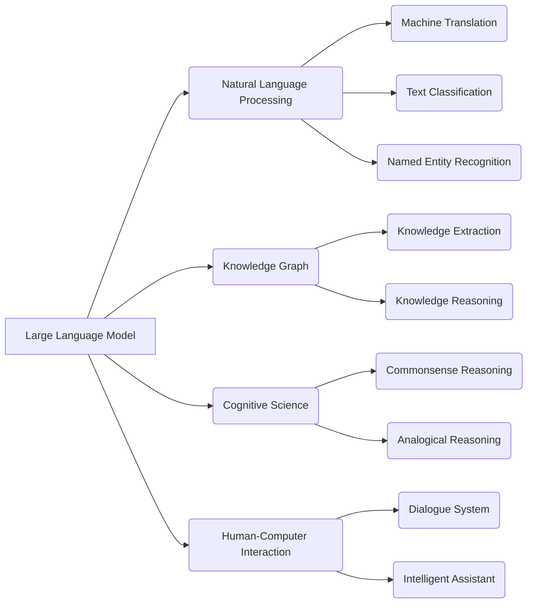

# 大语言模型应用指南：运行

关键词：大语言模型、LLM、人工智能、自然语言处理、Transformer、知识图谱、推理、对话系统、文本生成

## 1. 背景介绍

### 1.1 问题的由来
近年来，随着人工智能技术的飞速发展，大语言模型(Large Language Model, LLM)成为了自然语言处理领域的研究热点。LLM通过在海量文本数据上进行预训练，能够学习到丰富的语言知识和常识，在机器翻译、智能问答、文本生成等任务上取得了突破性进展。然而，如何有效地应用LLM来解决实际问题，仍然是一个值得深入探讨的课题。

### 1.2 研究现状
目前，业界已经涌现出一批优秀的LLM，如OpenAI的GPT系列、Google的BERT和T5、Meta的OPT等。这些模型在标准数据集上刷新了多项任务的最佳性能。同时，LLM也被应用到了更多实际场景中，如智能客服、内容创作、代码生成等。但LLM的训练和部署仍面临诸多挑战，如计算资源消耗大、推理效率低、鲁棒性不足等问题亟待解决。

### 1.3 研究意义
深入研究LLM的应用，对于推动人工智能在各行各业的落地具有重要意义。一方面，LLM能够增强现有AI系统的语言理解和生成能力，提升人机交互体验；另一方面，LLM也为知识挖掘、决策支持等应用开辟了新的思路。因此，系统总结LLM的应用实践，梳理其关键技术和发展趋势，对于学术界和产业界都具有重要的参考价值。

### 1.4 本文结构
本文将围绕LLM应用这一主题展开系统讨论。第2节介绍LLM的核心概念及其与相关技术的联系；第3节阐述LLM的基本原理和训练方法；第4节建立LLM应用的数学模型，并举例说明；第5节给出LLM的代码实现示例；第6节总结LLM的典型应用场景；第7节推荐LLM相关的学习资源和开发工具；第8节展望LLM未来的发展趋势与挑战；第9节列举LLM应用中的常见问题与解答。

## 2. 核心概念与联系

大语言模型是以Transformer为基础的深度神经网络模型，通过在大规模文本语料上进行自监督学习，习得强大的语言理解和生成能力。它与以下几个领域有着密切联系：

- 自然语言处理(NLP)：LLM是NLP技术的集大成者，融合了词向量、注意力机制、预训练等多项技术，大幅提升了NLP任务的性能上限。

- 知识图谱(Knowledge Graph)：LLM可以从文本中提取实体、关系等结构化知识，用于构建和扩充知识图谱。反之，知识图谱也可以为LLM提供外部知识，增强其推理和问答能力。

- 认知科学(Cognitive Science)：LLM模拟了人类语言习得和应用的认知过程，展现出一定的常识推理、类比、创造等能力，为探索人工通用智能(AGI)提供了新的视角。

- 人机交互(Human-Computer Interaction)：LLM使得计算机能够以更自然、智能的方式与人对话，在智能客服、虚拟助手等场景发挥重要作用，提升用户体验。

下图展示了LLM与相关概念的关联：

## 3. 核心算法原理 & 具体操作步骤

### 3.1 算法原理概述
LLM的核心是基于Transformer架构的语言模型。与传统的RNN、CNN等模型不同，Transformer完全依赖注意力机制来建模文本序列，通过自注意力层捕捉词与词之间的依赖关系，再经过前馈神经网络层增加模型容量和非线性表达能力。此外，LLM还引入了如下技术来提升性能：

- 预训练(Pre-training)：在大规模无标注语料上进行自监督学习，通过掩码语言建模(MLM)、 置换语言建模(PLM)等任务习得通用语言知识，再在下游任务上微调。

- 参数高效化：采用参数共享、低秩分解、知识蒸馏等方法来压缩模型参数量，在保证性能的同时降低存储和计算开销。

- 推理加速：利用模型剪枝、量化、张量分解等技术对推理过程进行优化，提高生成速度和效率。

- 增量学习：针对新增数据，在已训练模型的基础上进行增量训练，避免重复学习，提高训练效率。

### 3.2 算法步骤详解
LLM的训练和应用主要分为以下几个步骤：

1. 语料准备：收集目标领域的大规模文本数据，进行清洗、分词、统计词频等预处理。

2. 词向量初始化：根据词频随机初始化每个词的嵌入向量，或使用预训练词向量如GloVe、Word2Vec等。 

3. 模型构建：搭建Transformer编码器结构，设置隐藏层数、注意力头数、前馈层维度等超参数。

4. 预训练：选择合适的预训练任务如MLM，构造训练样本，采用Adam等优化器训练模型至收敛。

5. 微调：在下游任务数据上对预训练模型进行微调，调整模型结构和损失函数，进一步提升特定任务性能。

6. 推理应用：利用训练好的模型对新文本进行推断，如生成、分类、问答等，结合领域知识对输出结果进行解释和后处理。

7. 模型压缩：使用知识蒸馏、剪枝、量化等技术压缩模型体积，加速推理速度，方便模型在终端设备部署。

8. 持续学习：定期利用新数据对模型进行增量训练，适应数据分布变化，提高模型鲁棒性和泛化性。

### 3.3 算法优缺点
LLM相比传统语言模型具有以下优势：

- 语言理解能力强：通过在海量语料上预训练，LLM能够习得词汇、句法、语义、常识等多层次语言知识，具备强大的语言理解能力。

- 任务适应性好：LLM可以通过简单的提示工程或少样本学习快速适应新任务，大大减少了针对每个任务的特征工程和训练数据标注工作。

- 泛化能力强：LLM展现出一定的跨领域迁移能力，在某领域学习的知识可以迁移到其他相关领域，具有一定的常识推理和类比能力。

但LLM也存在一些局限性：

- 计算资源要求高：LLM通常包含数亿到数千亿参数，训练和推理都需要大量的算力和存储，对计算资源要求较高。

- 可解释性差：LLM内部的知识表示和决策过程是黑盒的，难以解释其输出结果的推理逻辑，存在一定的安全和伦理风险。

- 数据偏差：LLM从训练数据中习得知识，若数据存在偏差如性别歧视、种族歧视等，则模型也可能产生有偏输出，需要谨慎对待。

- 长程依赖建模能力有限：尽管Transformer比RNN更善于捕捉长距离依赖，但其位置编码是固定的，对超长文本的建模能力仍有限。

### 3.4 算法应用领域
LLM可以应用于以下领域：

- 机器翻译：将一种语言的文本翻译成另一种语言，如谷歌翻译、DeepL等。

- 智能问答：根据用户的问题从大规模知识库中检索答案，如Siri、Alexa等智能助手。

- 文本摘要：自动提取文本的关键信息生成摘要，如新闻摘要、论文摘要等。

- 情感分析：判断文本所表达的情感倾向，如正面、负面、中性等，用于舆情监测、推荐系统等。

- 文本生成：根据给定的上下文或提示生成连贯的文本，如写作助手、对话生成等。

- 信息抽取：从非结构化文本中提取结构化信息，如实体、关系、事件等，用于构建知识图谱。

- 代码生成：根据自然语言描述自动生成代码片段，如GitHub Copilot等。

## 4. 数学模型和公式 & 详细讲解 & 举例说明

### 4.1 数学模型构建
LLM的核心是语言模型，即估计一段文本 $x=\{x_1,...,x_T\}$ 的概率分布 $p(x)$。根据概率论知识，可以将联合概率分解为一系列条件概率的乘积：

$$p(x)=\prod_{t=1}^T p(x_t|x_{<t})$$

其中 $x_t$ 表示第 $t$ 个词，$x_{<t}$ 表示 $x_t$ 之前的所有词。语言模型的目标是学习这个条件概率分布。

在Transformer中，这个条件概率通过自注意力机制来建模。具体地，第 $l$ 层第 $i$ 个位置的表示 $h_i^l$ 为：

$$h_i^l=\text{Attention}(Q_i^l, K^l, V^l) + h_i^{l-1}$$

其中 $Q_i^l=W_q^l h_i^{l-1}$, $K^l=W_k^l H^{l-1}$, $V^l=W_v^l H^{l-1}$ 分别为查询、键、值向量，$W_q^l, W_k^l, W_v^l$ 为可学习参数矩阵，$H^{l-1}$ 为上一层的隐状态矩阵。

注意力函数 $\text{Attention}$ 定义为：

$$\text{Attention}(Q,K,V)=\text{softmax}(\frac{QK^T}{\sqrt{d}})V$$

其中 $d$ 为隐向量维度，$\text{softmax}$ 为归一化函数，用于将注意力分数转化为概率分布。

最后一层的隐状态经过线性变换和 $\text{softmax}$ 函数即可得到下一个词的概率分布：

$$p(x_t|x_{<t})=\text{softmax}(W_o h_t^L + b_o)$$

其中 $W_o, b_o$ 为输出层参数。

### 4.2 公式推导过程
下面我们推导 $\text{Attention}$ 函数的计算过程。首先将 $Q,K,V$ 向量化表示为矩阵：

$$Q=[q_1,...,q_n]^T \in \mathbb{R}^{n \times d}, K=[k_1,...,k_n]^T \in \mathbb{R}^{n \times d}, V=[v_1,...,v_n]^T \in \mathbb{R}^{n \times d}$$

其中 $n$ 为序列长度，$d$ 为隐向量维度。

对于查询向量 $q_i$，它与所有键向量 $k_j$ 的注意力分数为：

$$\alpha_{ij}=\frac{q_i k_j^T}{\sqrt{d}}, j=1,...,n$$

将所有分数拼成一个向量 $a_i \in \mathbb{R}^n$，经过 $\text{softmax}$ 归一化后得到注意力分布：

$$\hat{\alpha}_i=\text{softmax}(a_i)$$

其中 $\hat{\alpha}_i \in \mathbb{R}^n$ 满足 $\sum_{j=1}^n \hat{\alpha}_{ij}=1$。

最后，将注意力分布与值向量加权求和，得到 $q_i$ 的注意力输出：

$$\text{Attention}(q_i,K,V)=\sum_{j=1}^n \hat{\alpha}_{ij} v_j$$

将所有 $q_i$ 的注意力输出拼成矩阵，即得到 $\text{Attention}(Q,K,V)$。

### 4.3 案例分析与讲