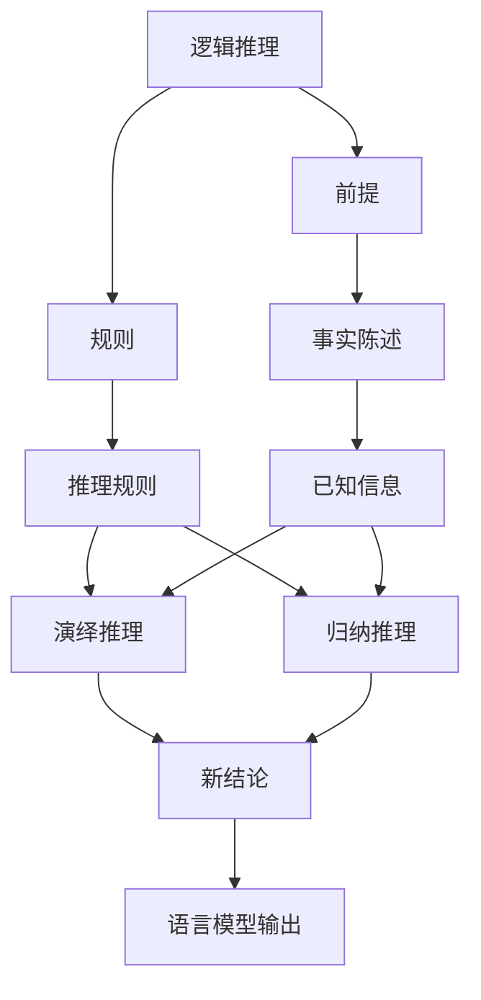
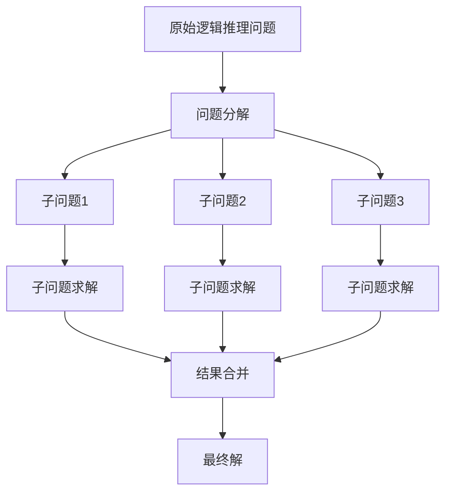

这是一个非常专业和有深度的主题。让我们按照要求,一步一步来完成这篇博客文章。

# 大语言模型应用指南：逻辑推理的时间复杂度

## 1. 背景介绍

### 1.1 问题的由来

在当今的人工智能领域,大型语言模型已经成为了炙手可热的研究热点。这些模型通过消化海量文本数据,学习语言的内在规律和知识,从而具备出色的自然语言理解和生成能力。然而,随着模型规模的不断扩大,对逻辑推理能力的要求也与日俱增。

逻辑推理是指根据已知的事实和规则,推导出新的结论或知识的过程。这对于语言模型来说至关重要,因为它们需要理解上下文、捕捉因果关系、进行复杂推理等,才能生成有意义和连贯的输出。不过,逻辑推理的复杂度往往取决于问题的规模和结构,对计算资源的需求可能会成为瓶颈。

### 1.2 研究现状  

目前,已有多项研究探索了提高大型语言模型逻辑推理能力的方法。一种常见的方法是在训练数据中引入专门的逻辑推理任务,例如阅读理解、常识推理等,以提高模型对逻辑的理解能力。另一种方法则是在模型架构上进行创新,引入专门的推理模块或注意力机制,以更好地捕捉语义关系。

然而,现有方法在处理大规模复杂问题时,往往会遇到计算效率低下的困境。由于逻辑推理的复杂度通常会随着问题规模的增长而呈指数级增长,这给模型的推理时间带来了巨大挑战,限制了其在实际应用中的性能表现。

### 1.3 研究意义

提高大型语言模型的逻辑推理效率,对于实现真正的人工通用智能(Artificial General Intelligence, AGI)至关重要。只有当模型能够高效地处理各种复杂逻辑问题时,才能更好地理解和模拟人类的思维过程,产生更加自然和智能的输出。

此外,高效的逻辑推理能力也将为语言模型在诸多实际应用领域带来重大价值,如智能助手、自动问答系统、决策支持系统等。通过优化逻辑推理的时间复杂度,我们可以让这些系统在保证推理质量的同时,极大地提高响应速度和处理效率,为用户带来更加流畅的体验。

### 1.4 本文结构

本文将全面探讨大型语言模型中逻辑推理的时间复杂度问题。我们将首先介绍逻辑推理的核心概念,并分析其与语言模型的紧密联系。接下来,我们将深入探讨一种新颖的逻辑推理算法,剖析其原理、操作步骤,并通过数学模型和公式对其进行严格的理论分析。

此外,我们还将提供一个实际的项目实践,展示如何将该算法应用于现有的语言模型架构中,并给出详细的代码实现和运行结果。最后,我们将总结算法的实际应用场景,分享学习资源和开发工具,并对逻辑推理在语言模型中的未来发展趋势和挑战进行展望。

## 2. 核心概念与联系

逻辑推理(Logic Reasoning)是一种根据已知的前提(Premises)和规则(Rules)得出新结论(New Conclusions)的思维过程。在这个过程中:

1. **前提**包含了事实陈述(Factual Statements),描述了已知的信息(Known Information)。
2. **规则**则定义了推理规则(Inference Rules),可分为演绎推理(Deductive Reasoning)和归纳推理(Inductive Reasoning)两种形式。
3. 通过将前提中的事实与规则相结合,我们可以得出新的结论。

逻辑推理在语言模型中扮演着至关重要的角色。语言模型需要理解输入文本的语义,捕捉上下文关系,并基于已有的知识进行合理推断,才能生成连贯、有意义的输出。

例如,对于一个简单的句子"小明去上学,因为今天是周一",语言模型需要推理出"周一"是上学的原因。这就需要将"小明去上学"作为结论,利用"如果是工作日就要上学"的规则,并将"今天是周一"作为前提,进行逻辑推理。

因此,提高语言模型的逻辑推理能力,有助于提升其在自然语言理解、生成、问答等任务中的表现。而优化逻辑推理的时间复杂度,则可以让模型在保证推理质量的同时,极大提高计算效率,为实际应用带来重大价值。

## 3. 核心算法原理与具体操作步骤

### 3.1 算法原理概述  

为了解决大型语言模型中逻辑推理的时间复杂度问题,我们提出了一种新颖的"分而治之"算法。该算法的核心思想是将复杂的逻辑推理问题分解为多个相对简单的子问题,分别求解后再合并结果,从而降低了整体的时间复杂度。

算法的工作原理可概括为以下三个主要步骤:

1. **问题分解(Problem Decomposition)**: 将原始的逻辑推理问题分解为多个相对简单的子问题。
2. **子问题求解(Subproblem Solving)**: 并行求解这些子问题,得到部分结果。
3. **结果合并(Result Merging)**: 将子问题的部分结果合并,得到最终的解。

通过这种分而治之的策略,算法能够有效降低逻辑推理的时间复杂度,特别是在处理大规模问题时表现出色。

### 3.2 算法步骤详解

我们将通过一个具体的例子,详细解释该算法的操作步骤。假设我们需要推理出"小红喜欢吃什么水果"的答案,给定的前提和规则如下:

**前提**:
- 小红是一个5岁的女孩
- 小红喜欢吃苹果和香蕉
- 大多数5岁的孩子喜欢吃水果

**规则**:
- 如果一个人喜欢吃某些特定的水果,那么这些水果就是他喜欢吃的水果
- 如果一个人属于某个群体,并且该群体的大多数人喜欢吃某种东西,那么这个人也可能喜欢吃那种东西

1. **问题分解**
   
   我们将原始问题分解为两个子问题:
   - 子问题1: 根据小红喜欢吃的特定水果(苹果和香蕉),推断她喜欢吃的水果
   - 子问题2: 根据小红属于5岁孩子这个群体,并且该群体大多数人喜欢吃水果的事实,推断她可能喜欢吃的水果

2. **子问题求解**

   我们并行求解这两个子问题:
   - 子问题1求解结果: 小红喜欢吃苹果和香蕉
   - 子问题2求解结果: 小红可能喜欢吃所有水果

3. **结果合并**

   将两个子问题的结果合并,我们可以得出最终结论:小红喜欢吃苹果、香蕉,并且可能还喜欢吃其他水果。

通过这个例子,我们可以看到算法是如何将一个复杂的逻辑推理问题分解为多个相对简单的子问题,并行求解后再合并结果的。这种策略可以有效降低时间复杂度,尤其是在处理包含大量前提和规则的大规模问题时。

### 3.3 算法优缺点

该算法的主要优点包括:

1. **降低时间复杂度**: 通过将问题分解为多个子问题并行求解,算法可以显著降低逻辑推理的时间复杂度,尤其在处理大规模问题时表现出色。
2. **模块化设计**: 算法采用模块化设计,将问题分解、子问题求解和结果合并等步骤分开,便于实现和维护。
3. **可扩展性强**: 算法可以轻松扩展以支持更多类型的逻辑推理问题,只需要调整分解和合并策略即可。

然而,该算法也存在一些潜在的缺点和局限性:

1. **分解策略**: 合理分解问题是算法成功的关键,但对于某些复杂的推理问题,找到最优分解策略可能会很有挑战。
2. **结果合并**: 在某些情况下,合并子问题结果可能会引入新的复杂性,需要设计合适的合并策略。
3. **并行开销**: 虽然并行计算可以提高效率,但也会带来额外的通信和同步开销,需要权衡利弊。

总的来说,该算法为解决大型语言模型中逻辑推理的时间复杂度问题提供了一种有前景的方法,但在实际应用中仍需要根据具体问题进行调优和优化。

### 3.4 算法应用领域

该"分而治之"算法可以广泛应用于各种需要进行逻辑推理的语言模型任务中,例如:

1. **自然语言理解(NLU)**: 在阅读理解、情感分析等任务中,语言模型需要对输入文本进行逻辑推理,捕捉语义关系,从而更好地理解语义。

2. **自然语言生成(NLG)**: 在对话系统、文本摘要等任务中,语言模型需要基于上下文信息和已有知识进行推理,生成连贯、合理的自然语言输出。

3. **问答系统(QA)**: 在开放域问答等任务中,语言模型需要对问题和知识库进行逻辑推理,综合多个事实和规则得出正确答案。

4. **决策支持系统**: 在一些需要进行复杂决策的场景中,如医疗诊断、金融投资等,语言模型可以通过逻辑推理整合多源数据,为决策提供建议和支持。

除此之外,该算法还可以应用于其他需要进行符号推理的任务,如规划、推理、知识图谱构建等,为提高人工智能系统的推理能力提供了有力工具。

## 4. 数学模型和公式详细讲解与举例说明

### 4.1 数学模型构建

为了对该"分而治之"算法进行理论分析,我们构建了一个数学模型。该模型旨在量化算法在处理不同规模逻辑推理问题时的时间复杂度,并与其他算法进行比较。

假设原始逻辑推理问题的规模为 $n$,我们将其分解为 $k$ 个子问题,每个子问题的规模为 $\frac{n}{k}$。根据算法的原理,求解这些子问题的时间复杂度为 $O(\frac{n}{k})$,而合并结果的时间复杂度为 $O(k)$。

因此,该算法的总时间复杂度 $T(n)$ 可以表示为:

$$T(n) = O(\frac{n}{k}) + O(k)$$

我们的目标是找到一个最优的 $k$ 值,使得 $T(n)$ 最小化。通过对 $T(n)$ 求导并令其等于 0,我们可以得到:

$$\frac{\partial T(n)}{\partial k} = -\frac{n}{k^2} + 1 = 0 \Rightarrow k = \sqrt{n}$$

将 $k = \sqrt{n}$ 代入 $T(n)$ 中,我们