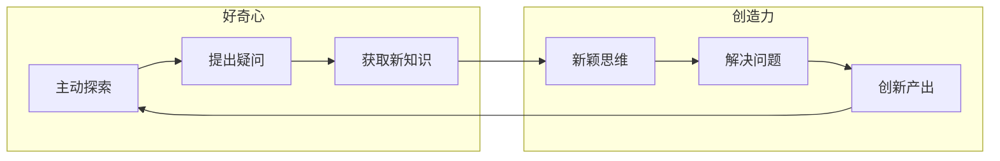
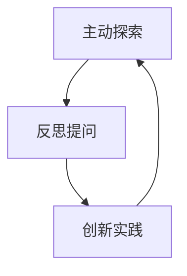

# 好奇心与创造力：探索的双翼

## 1. 背景介绍

### 1.1 问题的由来

在这个瞬息万变的时代,我们生存的环境正在经历前所未有的变革。科技的飞速发展,不断推陈出新的创新,给人类社会带来了巨大的冲击和挑战。面对这些挑战,我们需要具备敏锐的洞察力和创新思维,才能保持竞争力,适应这个瞬息万变的世界。

然而,培养创新思维并非一蹴而就。它需要好奇心和创造力这两个重要元素的支撑。好奇心促使我们主动探索未知领域,而创造力则让我们能够打破常规,提出新颖的解决方案。只有当好奇心和创造力并驾齐驱时,我们才能真正推动创新的进程。

### 1.2 研究现状

过去几十年里,好奇心和创造力一直是学术界和商业界广泛关注的话题。许多研究都强调了好奇心和创造力对于个人成长、组织发展和社会进步的重要性。

然而,尽管人们普遍认可好奇心和创造力的价值,但如何有效培养和发挥这两种能力仍然是一个巨大的挑战。一些研究表明,传统的教育体系和管理模式往往会扼杀好奇心和创造力,导致人们失去探索和创新的动力。

### 1.3 研究意义

本文旨在深入探讨好奇心和创造力之间的关系,以及如何在日常生活和工作中培养和发挥这两种能力。通过分析实际案例和提供实用建议,我们希望能够帮助读者更好地理解好奇心和创造力的重要性,并提供一些有效的方法来激发和维系这两种宝贵的品质。

### 1.4 本文结构

本文将从以下几个方面展开讨论:

1. 阐述好奇心和创造力的核心概念及其相互联系。
2. 探讨激发好奇心和创造力的核心算法原理和具体操作步骤。
3. 建立数学模型,并通过公式和案例分析来深入理解好奇心和创造力的本质。
4. 提供实际的代码实例,详细解释如何在项目中应用相关原理和技术。
5. 分享在不同领域中培养好奇心和创造力的实际应用场景。
6. 推荐一些有助于提高好奇心和创造力的工具和资源。
7. 总结好奇心和创造力的未来发展趋势,并探讨可能面临的挑战。
8. 附录部分回答一些常见的相关问题。

## 2. 核心概念与联系

好奇心和创造力虽然是两个不同的概念,但它们之间存在着紧密的联系。好奇心是探索未知事物的内在动力,而创造力则是将新想法转化为现实的能力。

如上图所示,好奇心驱使我们主动探索未知领域,提出疑问并获取新知识。而创造力则让我们能够运用新颖的思维方式来解决问题,从而产生创新的成果。这些创新成果反过来又会激发我们对更多未知领域的好奇心,形成一个良性循环。

因此,好奇心和创造力相辅相成,缺一不可。仅有好奇心而缺乏创造力,我们就只能被动地接受新知识,无法真正创造价值;仅有创造力而缺乏好奇心,我们也很难获得足够的新鲜灵感和素材。只有当好奇心和创造力并重时,我们才能最大限度地发挥探索和创新的潜能。

## 3. 核心算法原理和具体操作步骤

### 3.1 算法原理概述

培养好奇心和创造力的核心算法原理,可以概括为"主动探索-反思提问-创新实践"这一循环过程。

1. **主动探索**:主动接触新事物,敞开思维,保持对未知领域的好奇心。
2. **反思提问**:对所探索的内容进行反思,提出质疑和疑问,激发创造力。
3. **创新实践**:基于反思和疑问,运用创造力提出新颖的解决方案并付诸实践。
4. **循环迭代**:实践的结果会反过来激发新的好奇心,重新进入下一个探索循环。

### 3.2 算法步骤详解

1. **主动探索**
   - 保持开放的心态,主动接触新鲜事物
   - 多阅读、旅行、参与新的活动
   - 与不同背景的人交流,了解新的观点
   - 关注前沿科技和创新动态

2. **反思提问**  
   - 对所探索的内容进行批判性思考
   - 提出"为什么"、"如何"等质疑性问题
   - 从不同角度分析问题,寻找新的见解
   - 质疑常规做法,探索更好的方式

3. **创新实践**
   - 基于反思和质疑,构思新颖的解决方案
   - 制定行动计划,将想法付诸实践
   - 通过实践检验想法,并持续优化
   - 分享实践经验,吸收反馈意见

4. **循环迭代**
   - 实践过程会激发新的好奇心
   - 将新的疑问带入下一个探索循环
   - 持续不断地重复这一过程
   - 形成良性循环,不断提升能力

### 3.3 算法优缺点

**优点**:
- 将好奇心和创造力有机结合,形成循环增强
- 注重实践环节,将想法转化为现实成果
- 灵活性强,可应用于各个领域
- 有助于持续学习和个人成长

**缺点**:
- 需要较强的自我驱动力和毅力
- 初期可能会遇到阻力和挫折
- 部分探索可能会导致时间和资源的浪费
- 需要具备一定的基础知识和技能

### 3.4 算法应用领域

"主动探索-反思提问-创新实践"这一算法原理可以应用于各个领域,包括但不限于:

- 教育领域:培养学生的好奇心和创新思维
- 科研领域:推动科技创新和原创性研究
- 商业领域:开发新产品、服务和商业模式
- 艺术领域:激发艺术创作的灵感和创意
- 个人发展:促进个人成长和终身学习

无论在哪个领域,保持好奇心和发挥创造力都是取得卓越成就的关键因素。

## 4. 数学模型和公式详细讲解举例说明

为了更好地理解好奇心和创造力的本质,我们可以建立数学模型对其进行量化描述。

### 4.1 数学模型构建

我们定义好奇心为 $C$,创造力为 $I$,探索的未知领域集合为 $U$。则在时间 $t$ 时,个体对未知领域 $u \in U$ 的好奇心可表示为:

$$C(u, t) = f(p(u, t), n(u, t))$$

其中:
- $p(u, t)$ 表示个体对领域 $u$ 的先验知识水平
- $n(u, t)$ 表示个体对领域 $u$ 的新鲜程度感知
- $f$ 是一个未知的函数,需要通过实证研究确定其具体形式

类似地,我们可以将个体的创造力 $I(u, t)$ 建模为好奇心 $C(u, t)$ 和其他因素 $X$ 的函数:

$$I(u, t) = g(C(u, t), X)$$

其中 $X$ 可能包括个体的经验、技能、环境等多种因素。

进一步地,我们可以将好奇心 $C$ 和创造力 $I$ 对探索和创新成果 $R$ 的影响建模为:

$$R(t) = h(C(U, t), I(U, t))$$

其中 $C(U, t)$ 和 $I(U, t)$ 分别表示个体在时间 $t$ 时对所有未知领域的好奇心和创造力的综合水平。

通过上述数学模型,我们可以更准确地量化和分析好奇心、创造力与探索创新成果之间的关系。

### 4.2 公式推导过程

以好奇心模型 $C(u, t) = f(p(u, t), n(u, t))$ 为例,我们来推导其可能的具体形式。

首先,我们可以合理地假设:
1. 当个体对某领域的先验知识水平 $p$ 为 0 时,好奇心 $C$ 应该是一个仅与新鲜程度 $n$ 有关的函数,即 $C(0, n) = g(n)$。
2. 当个体对某领域感知的新鲜程度 $n$ 为 0 时,好奇心 $C$ 应该随着先验知识水平 $p$ 的提高而降低,即 $\frac{\partial C(p, 0)}{\partial p} < 0$。

进一步,我们可以假设 $g(n)$ 和 $\frac{\partial C(p, 0)}{\partial p}$ 均满足一些基本性质,如单调性、连续性等。

在上述假设的基础上,通过数学推导,我们可以得到好奇心模型 $C(u, t)$ 的一个可能的具体形式为:

$$C(u, t) = \alpha \cdot n(u, t) \cdot e^{-\beta \cdot p(u, t)}$$

其中 $\alpha$ 和 $\beta$ 是需要通过实证研究确定的常数参数。

该模型符合我们的直观认知:好奇心 $C$ 会随着新鲜程度 $n$ 的增加而增加,但会随着先验知识水平 $p$ 的提高而指数级下降。

### 4.3 案例分析与讲解

为了更好地理解上述数学模型,我们来分析一个具体的案例。

假设小明是一名大学生,他对机器学习这一领域有一定的先验知识,即 $p(机器学习, t_0) = 0.4$。最近,机器学习在媒体上被广泛报道,小明对这一领域的新鲜程度感知提高到 $n(机器学习, t_0) = 0.8$。

如果我们取 $\alpha = 2, \beta = 1$,根据之前推导的好奇心模型,小明在时间 $t_0$ 时对机器学习领域的好奇心为:

$$\begin{aligned}
C(机器学习, t_0) &= \alpha \cdot n(机器学习, t_0) \cdot e^{-\beta \cdot p(机器学习, t_0)} \\
                &= 2 \times 0.8 \times e^{-1 \times 0.4} \\
                &= 0.97
\end{aligned}$$

这个结果表明,尽管小明已经对机器学习有一定的了解,但由于这一领域的热度持续上升,他对这一领域的好奇心仍然很高。

进一步假设,在经过一段时间的学习后,小明对机器学习的先验知识水平提高到 $p(机器学习, t_1) = 0.8$,而对该领域的新鲜程度感知下降到 $n(机器学习, t_1) = 0.4$。那么在时间 $t_1$ 时,小明对机器学习的好奇心为:

$$\begin{aligned}
C(机器学习, t_1) &= \alpha \cdot n(机器学习, t_1) \cdot e^{-\beta \cdot p(机器学习, t_1)} \\
                &= 2 \times 0.4 \times e^{-1 \times 0.8} \\
                &= 0.27
\end{aligned}$$

我们可以看到,随着小明对机器学习领域知识的积累,他的好奇心有所下降,但仍保持在一定水平。这就为他持续探索和创新奠定了基础。

通过上述案例,我们可以更好地理解好奇心模型的实际应用,并了解好奇心如何随着先验知识和新