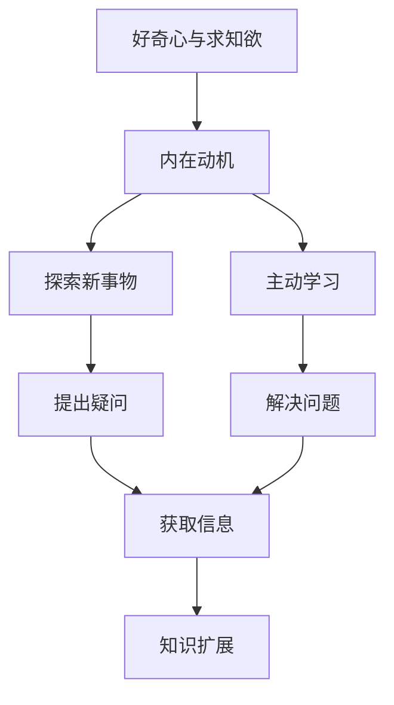

# 好奇心与求知欲：探索的动力

## 1. 背景介绍

### 1.1 问题的由来

人类与生俱来的好奇心和求知欲是推动科学发展和文明进步的根本动力。从古代哲学家对宇宙起源的探索,到现代科学家对量子理论的追寻,人类对未知领域的渴望始终贯穿于探索的进程中。好奇心促使我们提出疑问,而求知欲则驱使我们不懈寻找答案,二者相辅相成,共同推动着人类知识的扩展。

### 1.2 研究现状  

心理学和神经科学研究表明,好奇心和求知欲是人类大脑中奖赏系统的一部分。当我们学习新事物或解决难题时,大脑会释放多巴胺等神经递质,带来愉悦感受。这种内在动机不仅能提高学习效率,还能增强创造力和问题解决能力。

教育领域越来越重视培养学生的好奇心和求知欲。一些创新教学方法,如探究式学习、问题导向学习等,旨在激发学生的主动学习欲望,促进深度学习。同时,游戏化学习、虚拟现实等新兴技术也被应用于激发学生的学习动机。

### 1.3 研究意义

深入探讨好奇心和求知欲的本质及其对个人发展和社会进步的影响,具有重要意义。它不仅有助于我们更好地理解人类行为的驱动力,还能为教育、科研等领域提供有价值的启示,从而优化学习方式,提高工作效率,推动创新发展。

### 1.4 本文结构

本文将从多个角度深入探讨好奇心和求知欲的重要性及其在不同领域的体现。首先阐述好奇心和求知欲的核心概念及相互联系;其次分析其在算法设计和数学建模中的作用;再次通过代码实例说明其在实际项目中的应用;最后总结其在教育、科研等领域的意义,并展望未来发展趋势和挑战。

## 2. 核心概念与联系

好奇心和求知欲虽然相关,但又有所区别。好奇心是一种内在的心理驱动力,促使我们对新奇事物产生兴趣和探索欲望。它往往伴随着新鲜感和惊奇,是认知活动的起点。求知欲则更侧重于对知识的渴求,是主动获取信息、解决问题的内在动机。



好奇心和求知欲相互作用、相辅相成。好奇心促使我们对未知领域产生兴趣,从而激发求知欲;而求知欲则驱使我们主动探索,获取新知识,进而满足好奇心。这种动态循环不断推进着人类的学习和发现。

## 3. 核心算法原理 & 具体操作步骤  

### 3.1 算法原理概述

在人工智能和机器学习领域,激发模型的好奇心和求知欲是提高其学习效率和泛化能力的关键。一种常见的方法是基于奖励机制的强化学习算法,它通过设置合理的奖惩机制,促使模型主动探索未知领域,获取更多有价值的信息。

### 3.2 算法步骤详解

以探索性强化学习(Exploratory Reinforcement Learning)为例,其核心思想是在传统强化学习的基础上,引入一种内在奖励(Intrinsic Reward),鼓励模型探索新奇的状态。算法步骤如下:

1. 初始化模型参数和探索奖励函数
2. 模型与环境交互,获取状态$s_t$和奖励$r_t$
3. 计算探索奖励$r^{intrinsic}_t = \phi(s_t)$,其中$\phi$是探索奖励函数
4. 将外在奖励$r_t$和内在奖励$r^{intrinsic}_t$相加,得到总奖励$r_t^{total} = r_t + r^{intrinsic}_t$
5. 根据总奖励$r_t^{total}$更新模型参数
6. 重复步骤2-5,直至模型收敛

探索奖励函数$\phi$的设计是关键,常用方法包括基于状态访问计数的奖励、基于模型不确定性的奖励等。

### 3.3 算法优缺点

优点:
- 促进模型主动探索,获取更多有价值信息
- 有助于提高模型的泛化能力,避免过度拟合
- 在稀疏奖励环境中表现良好

缺点:
- 探索奖励函数的设计需要人工经验
- 过度探索可能导致学习效率降低
- 在确定性环境中,可能产生不必要的探索

### 3.4 算法应用领域

探索性强化学习算法广泛应用于机器人控制、游戏AI、推荐系统等领域。例如,在机器人导航任务中,探索奖励可以促使机器人主动探索未知环境,获取更多有价值的地图信息。在推荐系统中,探索奖励可以鼓励模型尝试推荐新颖的内容,避免陷入过度个性化的窘境。

## 4. 数学模型和公式 & 详细讲解 & 举例说明

### 4.1 数学模型构建

为了量化好奇心和求知欲的作用,我们可以构建一个基于信息论的数学模型。设$\mathcal{X}$为状态空间,$\mathcal{P}$为状态分布,$H(\mathcal{P})$为$\mathcal{P}$的信息熵,则好奇心可以定义为:

$$\text{Curiosity}(\mathcal{P}) = H(\mathcal{P})$$

即状态分布的信息熵。当状态分布更加均匀时,信息熵更大,好奇心也就更强。

进一步,我们可以定义求知欲为期望信息增益:

$$\text{Inquisitiveness}(\mathcal{P},\mathcal{A}) = \mathbb{E}_{\mathcal{A}}[H(\mathcal{P}') - H(\mathcal{P})]$$

其中$\mathcal{A}$为行为策略,$\mathcal{P}'$为执行$\mathcal{A}$后的新状态分布。求知欲越强,期望的信息增益就越大。

### 4.2 公式推导过程

我们来推导上述公式。首先回顾信息熵的定义:

$$H(X) = -\sum_{x\in\mathcal{X}}P(x)\log P(x)$$

其中$X$是一个随机变量,取值在$\mathcal{X}$上。

将其代入好奇心的定义,我们有:

$$\begin{aligned}
\text{Curiosity}(\mathcal{P}) &= H(\mathcal{P}) \\
&= -\sum_{s\in\mathcal{X}}P(s)\log P(s)
\end{aligned}$$

这说明,当状态分布$\mathcal{P}$更加均匀时,每个状态的概率$P(s)$都较小,从而使得信息熵$H(\mathcal{P})$较大,好奇心也就更强。

接下来推导求知欲的公式。注意到信息熵的链式法则:

$$H(X,Y) = H(X) + H(Y|X)$$

将其应用于状态分布$\mathcal{P}$和$\mathcal{P}'$,我们有:

$$\begin{aligned}
H(\mathcal{P}') &= H(\mathcal{P}) + H(\mathcal{P}'|\mathcal{P}) \\
\therefore H(\mathcal{P}') - H(\mathcal{P}) &= H(\mathcal{P}'|\mathcal{P})
\end{aligned}$$

$H(\mathcal{P}'|\mathcal{P})$表示在已知$\mathcal{P}$的条件下,$\mathcal{P}'$的条件信息熵,也就是通过执行行为策略$\mathcal{A}$获得的信息增益。取期望值,我们就得到了求知欲的定义公式。

### 4.3 案例分析与讲解  

假设一个机器人导航的场景,状态空间$\mathcal{X}$包含了所有可能的位置。初始时,机器人对环境一无所知,状态分布$\mathcal{P}_0$是均匀分布,信息熵$H(\mathcal{P}_0)$最大,好奇心也就最强。

现在,机器人执行策略$\mathcal{A}_1$探索环境,获得了部分地图信息,状态分布变为$\mathcal{P}_1$。由于$\mathcal{P}_1$相比$\mathcal{P}_0$更加集中,信息熵$H(\mathcal{P}_1) < H(\mathcal{P}_0)$,好奇心降低。但同时,求知欲$\text{Inquisitiveness}(\mathcal{P}_0,\mathcal{A}_1) = H(\mathcal{P}_1) - H(\mathcal{P}_0) > 0$,机器人会继续探索以获取更多信息。

重复这一过程,随着探索的深入,状态分布$\mathcal{P}_t$会逐渐收敛,好奇心逐步降低。当$\mathcal{P}_t$收敛到真实的环境分布时,求知欲将趋近于0,探索过程终止。

### 4.4 常见问题解答

**Q:** 为什么要用信息熵来量化好奇心和求知欲?

**A:** 信息熵可以很好地刻画不确定性的程度。当状态分布更加均匀时,不确定性更大,对应的好奇心也就更强。同理,期望的信息增益正是求知欲的体现。

**Q:** 如何设计合理的探索奖励函数?

**A:** 这是一个值得深入研究的问题。常见的方法包括基于访问计数的奖励、基于模型不确定性的奖励等。具体的设计需要结合任务特点和领域知识。

**Q:** 过度探索是否会影响学习效率?

**A:** 的确,过度探索可能会降低学习效率。一种解决方案是在探索和利用之间寻求适当的平衡,例如在算法中引入温度参数来控制探索程度。另一种方式是设计自适应的探索策略,根据模型的学习进度动态调整探索程度。

## 5. 项目实践:代码实例和详细解释说明

为了更好地理解探索性强化学习算法的实现,我们将基于Python和PyTorch构建一个简单的示例项目。

### 5.1 开发环境搭建

首先,我们需要安装所需的Python包:

```
pip install numpy matplotlib pytorch
```

接下来,导入必要的模块:

```python
import numpy as np
import matplotlib.pyplot as plt

import torch
import torch.nn as nn
import torch.optim as optim
```

### 5.2 源代码详细实现

我们定义一个简单的网格世界环境,机器人的目标是从起点到达终点。环境状态用机器人的坐标(x,y)表示,行为包括上下左右四个方向的移动。

```python
class GridWorld:
    def __init__(self, width, height, start, goal):
        self.width = width
        self.height = height
        self.start = start
        self.goal = goal
        
    def step(self, state, action):
        # 执行动作,获取新状态和奖励
        ...
        
    def reset(self):
        # 重置环境
        ...
        
    def render(self):
        # 渲染环境
        ...
```

然后,我们定义探索奖励函数和Q网络:

```python
class ExplorationReward(nn.Module):
    def __init__(self):
        super().__init__()
        self.visit_counts = {}
        
    def forward(self, state):
        # 基于访问计数计算探索奖励
        ...
        
class QNetwork(nn.Module):
    def __init__(self):
        super().__init__()
        self.fc1 = nn.Linear(2, 64)
        self.fc2 = nn.Linear(64, 4)
        
    def forward(self, x):
        x = torch.relu(self.fc1(x))
        x = self.fc2(x)
        return x
```

最后,我们实现探索性Q-Learning算法:

```python
env = GridWorld(10, 10, (0, 0), (9, 9))
q_net = QNetwork()
exploration_reward = ExplorationReward()
optimizer = optim.Adam(q_net.parameters())

for episode in range(1000):
    state = env.reset()
    done = False
    while not done: