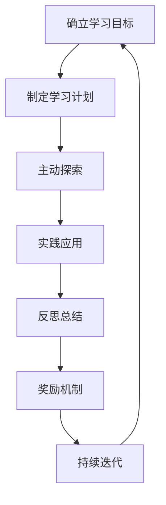

# 好奇心和持续学习：有学习和理解新事物的欲望，对知识展开持续的、自发的追求

## 1. 背景介绍

### 1.1 问题的由来

在这个瞬息万变的时代,科技的飞速发展使得新知识、新技术层出不穷。作为IT从业者,我们必须时刻保持学习的状态,不断更新自己的知识库,以适应这个快速变化的环境。然而,很多人都发现,随着时间的推移,他们对学习新事物的热情逐渐消退,陷入了一种停滞状态。这种现象的根源在于缺乏好奇心和持续学习的动力。

### 1.2 研究现状

许多研究表明,好奇心和持续学习是成功的关键因素之一。那些保持好奇心和终身学习态度的人,往往能够更好地适应变化,抓住新机遇,并在职业生涯中取得更大的成就。相反,那些失去好奇心和学习动力的人,很容易被时代所淘汰,陷入停滞和落后的境地。

### 1.3 研究意义

本文旨在探讨如何培养和保持好奇心,以及如何建立持续学习的习惯。通过分析好奇心和持续学习的重要性,介绍相关的核心概念和方法,并提供实践建议,希望能够帮助读者重拾对知识的渴望,激发终身学习的热情,从而在瞬息万变的IT行业中保持竞争力和创新力。

### 1.4 本文结构

本文将从以下几个方面展开讨论:

1. 阐述好奇心和持续学习的核心概念及其重要性。
2. 介绍培养好奇心和建立持续学习习惯的核心原理和算法。
3. 构建相关的数学模型,并通过公式和案例进行详细说明。
4. 提供实际的代码实现示例,并对其进行解读和分析。
5. 探讨好奇心和持续学习在实际应用场景中的作用。
6. 推荐相关的学习资源、工具和论文等。
7. 总结未来发展趋势和面临的挑战,并对研究展望进行阐述。

## 2. 核心概念与联系

好奇心和持续学习是密切相关的两个概念。好奇心是一种内在的驱动力,它促使我们去探索未知的领域,追求新的知识和经验。持续学习则是一种行为习惯,它要求我们主动地、持续地获取新知识,不断更新自己的技能和见解。

这两个概念相辅相成,缺一不可。好奇心为持续学习提供了动力,而持续学习则是满足好奇心的途径。只有当我们保持好奇心时,才会有动力去主动学习;同时,只有通过持续学习,我们才能真正满足好奇心,获得新的见解和体验。

在IT行业,好奇心和持续学习尤为重要。技术的快速迭代使得我们必须时刻关注最新的发展动向,主动学习新的知识和技能。那些失去好奇心和学习动力的人,很容易被时代所淘汰,无法跟上技术的发展步伐。相反,保持好奇心和持续学习的人,则能够抓住新机遇,在瞬息万变的环境中保持竞争力和创新力。

## 3. 核心算法原理 & 具体操作步骤

### 3.1 算法原理概述

培养好奇心和建立持续学习习惯可以借鉴一些核心算法原理,例如:

1. **渐进式学习算法(Incremental Learning Algorithm)**: 这种算法强调通过持续不断地学习新知识,逐步提高自己的能力和水平。它避免了一次性学习大量知识的压力,而是将学习过程分解为多个小步骤,循序渐进地完成。

2. **主动学习算法(Active Learning Algorithm)**: 这种算法强调主动地寻找学习机会,而不是被动地等待知识的呈现。它鼓励我们提出问题,探索未知领域,并主动地寻求答案和解决方案。

3. **元学习算法(Meta-Learning Algorithm)**: 这种算法关注如何更好地学习,即学习如何学习。它强调反思和总结学习过程中的经验教训,不断优化和改进自己的学习方法。

4. **强化学习算法(Reinforcement Learning Algorithm)**: 这种算法通过奖惩机制来强化期望的行为。在培养好奇心和持续学习习惯的过程中,我们可以设置一些奖励机制,例如当达到某个学习目标时给予奖励,从而强化学习行为。

### 3.2 算法步骤详解

基于上述算法原理,我们可以总结出培养好奇心和建立持续学习习惯的具体步骤:

1. **确立学习目标**: 明确自己想要学习的知识领域,并设定可衡量的学习目标。这有助于集中注意力,并在学习过程中保持动力。

2. **制定学习计划**: 根据学习目标,制定详细的学习计划,包括学习内容、时间安排等。将学习任务分解为可管理的小步骤,以避免压力过大。

3. **主动探索**: 积极主动地寻找学习资源和机会,不要被动地等待知识的呈现。提出问题,探索未知领域,并主动寻求答案和解决方案。

4. **实践应用**: 将所学知识应用于实践中,通过实际操作来加深理解和巩固记忆。同时,关注实践过程中遇到的问题和挑战,并努力解决它们。

5. **反思总结**: 定期回顾和反思学习过程,总结经验教训。根据反思结果,调整和优化学习方法,以提高学习效率。

6. **奖励机制**: 设置奖励机制,当达到学习目标或取得进步时给予适当的奖励,以强化学习行为。

7. **持续迭代**: 将上述步骤形成一个循环,持续不断地重复这个过程,实现终身学习。

### 3.3 算法优缺点

上述算法的优点在于:

1. 将学习过程分解为可管理的小步骤,避免压力过大。
2. 强调主动探索和实践应用,有助于加深理解和巩固记忆。
3. 通过反思总结和奖励机制,形成了正向反馈循环,有助于持续保持学习动力。
4. 具有一定的灵活性,可以根据个人情况进行调整和优化。

但同时也存在一些缺点:

1. 需要较强的自我驱动力和自律性,对于一些缺乏动力的人可能难以坚持。
2. 制定合理的学习计划和奖励机制需要一定的经验和技巧。
3. 在实践应用阶段,可能会遇到一些实际困难和障碍。

### 3.4 算法应用领域

上述算法不仅适用于IT领域的学习,也可以推广到其他领域的知识获取和技能培养。无论是学习新的编程语言、掌握新的框架或者了解新的技术趋势,都可以借鉴这些算法原理和步骤。

此外,这些算法也可以应用于职业发展和个人成长。通过持续学习,我们可以不断提升自己的能力,适应环境的变化,抓住新的机遇。在快速变化的时代,拥有好奇心和持续学习的习惯,将有助于我们保持竞争力和创新力。

## 4. 数学模型和公式 & 详细讲解 & 举例说明

为了更好地理解和量化好奇心和持续学习的过程,我们可以构建相关的数学模型。

### 4.1 数学模型构建

假设我们将好奇心定义为对新知识的渴望程度,用变量 $C$ 表示。持续学习则可以定义为在一段时间内获取新知识的数量,用变量 $L$ 表示。我们希望最大化 $L$,即获取尽可能多的新知识。

我们可以将 $L$ 建模为 $C$ 和其他一些因素的函数:

$$L = f(C, X_1, X_2, \ldots, X_n)$$

其中 $X_1, X_2, \ldots, X_n$ 表示影响持续学习的其他因素,如学习时间、学习资源、学习方法等。

为了简化模型,我们假设 $f$ 是一个线性函数:

$$L = \alpha C + \beta_1 X_1 + \beta_2 X_2 + \ldots + \beta_n X_n$$

其中 $\alpha, \beta_1, \beta_2, \ldots, \beta_n$ 是待定系数,表示各个因素对持续学习的影响程度。

我们的目标是最大化 $L$,即:

$$\max L = \max (\alpha C + \beta_1 X_1 + \beta_2 X_2 + \ldots + \beta_n X_n)$$

subject to:
- $C \geq 0$ (好奇心不能为负)
- $X_i \geq 0, i = 1, 2, \ldots, n$ (其他影响因素也不能为负)

通过求解这个优化问题,我们可以得到最优的 $C$ 和 $X_i$ 的值,从而实现最大化持续学习。

### 4.2 公式推导过程

我们可以使用拉格朗日乘数法来求解上述优化问题。首先构造拉格朗日函数:

$$\mathcal{L}(C, X_1, X_2, \ldots, X_n, \lambda_0, \lambda_1, \ldots, \lambda_n) = \alpha C + \beta_1 X_1 + \beta_2 X_2 + \ldots + \beta_n X_n - \lambda_0 C - \lambda_1 X_1 - \ldots - \lambda_n X_n$$

其中 $\lambda_0, \lambda_1, \ldots, \lambda_n$ 是拉格朗日乘数。

接下来,我们对 $\mathcal{L}$ 分别关于 $C, X_1, X_2, \ldots, X_n$ 求偏导数,并令其等于零:

$$
\begin{aligned}
\frac{\partial \mathcal{L}}{\partial C} &= \alpha - \lambda_0 = 0 \\
\frac{\partial \mathcal{L}}{\partial X_i} &= \beta_i - \lambda_i = 0, \quad i = 1, 2, \ldots, n
\end{aligned}
$$

由于 $C, X_i \geq 0$,所以我们还需要考虑complementary slackness条件:

$$
\begin{aligned}
\lambda_0 C &= 0 \\
\lambda_i X_i &= 0, \quad i = 1, 2, \ldots, n
\end{aligned}
$$

通过求解这个方程组,我们可以得到最优的 $C$ 和 $X_i$ 的值。

### 4.3 案例分析与讲解

假设我们考虑两个影响持续学习的因素:学习时间 $X_1$ 和学习资源 $X_2$。根据经验,我们设置 $\alpha = 2, \beta_1 = 1, \beta_2 = 1.5$。

我们的目标是最大化持续学习 $L$,即:

$$\max L = \max (2C + X_1 + 1.5X_2)$$

subject to:
- $C \geq 0$
- $X_1 \geq 0$
- $X_2 \geq 0$

构造拉格朗日函数:

$$\mathcal{L}(C, X_1, X_2, \lambda_0, \lambda_1, \lambda_2) = 2C + X_1 + 1.5X_2 - \lambda_0 C - \lambda_1 X_1 - \lambda_2 X_2$$

对 $\mathcal{L}$ 分别关于 $C, X_1, X_2$ 求偏导数,并令其等于零:

$$
\begin{aligned}
\frac{\partial \mathcal{L}}{\partial C} &= 2 - \lambda_0 = 0 \\
\frac{\partial \mathcal{L}}{\partial X_1} &= 1 - \lambda_1 = 0 \\
\frac{\partial \mathcal{L}}{\partial X_2} &= 1.5 - \lambda_2 = 0
\end{aligned}
$$

考虑complementary slackness条件:

$$
\begin{aligned}
\lambda_0 C &= 0 \\
\lambda_