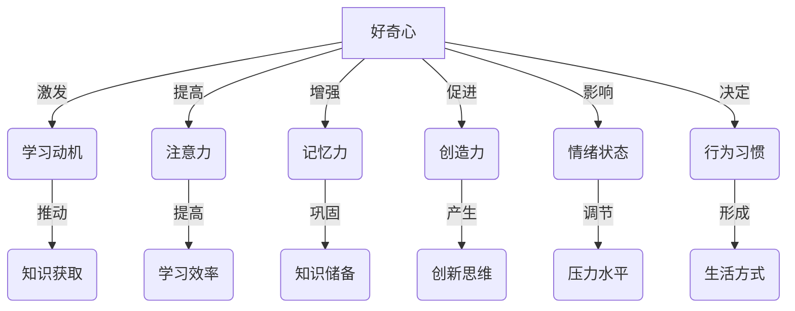
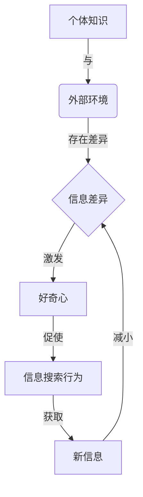

# 好奇心：探索世界的钥匙

## 1. 背景介绍

### 1.1 问题的由来

好奇心是人类与生俱来的一种特质,它推动着人类不断探索未知、追求新知识。从古至今,人类对未知世界的渴望一直是科学发展和文明进步的根本动力。好奇心促使人类走出洞穴,驯服火焰,发明工具,开拓疆土,探索星空,揭开自然奥秘。

然而,在当代社会,人们似乎逐渐丧失了这种宝贵的品质。被工作、生活压力所困扰,我们往往止步于舒适区,对新事物失去了好奇心。一味追随潮流,盲目接受权威观点,缺乏独立思考和质疑精神。这种现象不仅阻碍了个人成长,也可能导致社会停滞不前。

### 1.2 研究现状  

近年来,一些学者和思想家开始重视好奇心的重要性,并对其进行了深入研究。他们发现,好奇心不仅是人类进步的动力,也与个人的创造力、学习能力和心理健康息息相关。

心理学家把好奇心分为两种类型:

1. **感知好奇心(Perceptual curiosity)**:对新奇刺激的自然反应,如婴儿对新玩具的兴趣。
2. **认知好奇心(Epistemic curiosity)**:主动寻求新知识以减少不确定性的愿望。

研究表明,适度的好奇心可以激发大脑活动,提高注意力集中度,增强记忆力。好奇心还与更高的智力水平和创造力相关。此外,保持好奇心有助于减轻压力,增强生活乐趣。

### 1.3 研究意义

培养和保持好奇心对个人发展和社会进步至关重要。个人层面,好奇心可以帮助我们主动学习新知识,发现新兴趣,开拓视野,实现自我价值。社会层面,好奇心是科技创新和文化繁荣的源泉,是人类文明不断向前的根本动力。

因此,深入探讨如何激发和维系好奇心,为个人成长和社会发展注入新的活力,是一个值得重视的课题。

### 1.4 本文结构

本文将从多个角度深入探讨好奇心的重要性及其对个人和社会的影响。首先阐述好奇心的核心概念及其与其他心理特质的关联。接下来剖析好奇心的生物学和心理学基础,介绍相关的数学模型和算法原理。然后通过实例分析好奇心在不同领域的实际应用。最后,总结好奇心的发展趋势和面临的挑战,并提供相关学习资源和工具推荐。

## 2. 核心概念与联系

好奇心是一种内在的心理动机,促使人们主动探索新事物,获取新知识。它与人类的认知能力、情绪状态和行为习惯等多个心理特质密切相关。

上图展示了好奇心与其他心理特质之间的关联关系:

- 好奇心是学习和探索的内在动力,可以激发学习动机,推动知识获取。
- 好奇心会提高人们的注意力集中度,从而提高学习效率。
- 好奇心有助于加强记忆力,巩固已有知识储备。
- 好奇心是创造力的源泉,可以促进创新思维的产生。
- 好奇心会影响个人的情绪状态,适度的好奇心可以调节压力水平。
- 好奇心还会决定人们的行为习惯,进而形成特定的生活方式。

总的来说,好奇心是一种内在的驱动力,与人类的认知、情绪和行为等多个层面息息相关,对个体发展和社会进步都有着深远影响。

## 3. 核心算法原理 & 具体操作步骤

### 3.1 算法原理概述

好奇心的形成和维系涉及大脑中多个区域的互动,包括奖赏系统、注意力网络和记忆系统等。科学家们提出了一些理论模型来解释好奇心背后的生物学和心理学机制。

其中,最具影响力的是**信息差异理论(Information Gap Theory)**。该理论认为,好奇心源于个体对信息的渴望。当个体感知到自身知识和外部环境之间存在"信息差异"时,就会产生好奇心,从而主动寻求新信息以填补这一差异。

上图描述了信息差异理论的核心流程:

1. 个体已有的知识与外部环境之间存在差异,形成"信息差异"。
2. "信息差异"激发了个体的好奇心。
3. 好奇心促使个体主动寻求新信息,表现为信息搜索行为。
4. 获取新信息后,可以减小个体与外部环境之间的"信息差异"。

这一过程是动态循环的,新获得的信息会成为个体知识的一部分,与外部环境之间可能仍存在新的"信息差异",从而再次激发好奇心,如此循环往复。

### 3.2 算法步骤详解  

根据信息差异理论,我们可以将好奇心的形成过程分解为以下几个步骤:

1. **感知信息差异**

   个体通过与外部环境的互动,感知到自身知识与环境信息之间存在差异。这种差异可能来自:
   - 全新的未知信息
   - 与已有知识存在矛盾的信息  
   - 模糊不清或缺失的信息

2. **评估信息价值**  

   个体会评估这一信息差异的重要性和价值。影响因素包括:
   - 个人兴趣和目标
   - 信息的新颖性和复杂性
   - 获取信息的成本和风险

3. **激发好奇心**

   如果信息差异被评估为足够重要和有价值,就会激发个体的好奇心,产生一种强烈的渴望去弥补这一差异。

4. **展开信息搜索**

   好奇心会驱使个体主动采取行动,通过有针对性的信息搜索行为来获取所需的新信息,例如:
   - 观察和探索环境
   - 提出疑问和假设 
   - 查阅资料和请教他人

5. **整合新信息**

   获取到新信息后,个体需要将其与已有知识进行整合,形成更完整和一致的认知结构。这个过程可能需要重新建构现有理解。

6. **回路反馈**

   新获得的知识会成为个体认知的一部分。如果与外部环境之间仍存在"信息差异",就会重新激发好奇心,进入下一个循环。

这一动态循环过程解释了好奇心如何推动着人类不断学习和探索的过程。值得注意的是,好奇心的强度和持续时间会受到个体的先前经历、动机水平和注意力资源等多种因素的影响。

### 3.3 算法优缺点

**优点:**

1. **解释力强**:信息差异理论较好地解释了好奇心的起源、作用机制和影响因素,具有较强的解释力。

2. **操作性好**:该理论将好奇心形成过程分解为清晰的步骤,便于量化研究和应用于实践中。

3. **契合认知规律**:人类的认知活动确实是在已有知识和新信息之间不断调整的过程,与该理论的核心思想一致。

4. **可促进学习**:明确了好奇心对于主动学习和知识获取的重要作用,为培养好奇心提供了理论依据。

**缺点:**  

1. **个体差异较大**:不同个体对信息差异的感知、评估和应对方式可能存在较大差异,影响因素较多,降低了理论的普适性。

2. **忽视情绪因素**:好奇心的形成还受到情绪状态和性格特质等主观因素的影响,该理论对这一方面阐述不足。

3. **缺乏神经机制解释**:理论侧重于心理学层面的解释,对好奇心的生物学和神经基础阐述不够深入。

4. **应用场景有限**:目前该理论主要应用于学习和探索领域,在其他领域(如创新、决策等)的应用有待拓展。

总的来说,信息差异理论是解释好奇心的一个重要理论模型,具有一定的合理性和解释力,但仍有待进一步完善和发展。

### 3.4 算法应用领域

信息差异理论及其衍生模型已被广泛应用于教育、游戏设计、人机交互等多个领域,为激发和维系好奇心提供了有力理论支持。

1. **教育领域**

   该理论为课堂教学和教材设计提供了指导。教师可以:
   - 营造"信息差异",激发学生的好奇心
   - 设置合理难度,保持学生对知识的渴望
   - 鼓励学生主动探索,培养终身学习的习惯

2. **游戏设计**

   很多游戏的吸引力源于对玩家好奇心的有效利用:
   - 设置谜题和未解之谜,激发玩家探索欲望
   - 逐步解锁新要素,保持新鲜感和挑战性
   - 奖励有助于维系好奇心和学习动机

3. **人机交互**

   人工智能系统可以根据用户的好奇心特征提供个性化服务:
   - 分析用户的兴趣和知识缺口
   - 主动推荐有价值的新信息
   - 设计有趣的交互方式,激发好奇心

4. **科普传播**

   好奇心是科普的根本动力。科普工作者可以:
   - 挖掘生活中有趣的科学现象,激发大众好奇心
   - 用通俗生动的方式解答"为什么"
   - 培养公众对科学的兴趣和求知欲

5. **创新驱动**

   好奇心是创新的源泉。企业可以:
   - 营造包容失败的文化氛围,鼓励员工大胆尝试  
   - 给予员工充足的自主权,激发其主动学习的动机
   - 重视跨学科交流,开拓新的视野和思路

好奇心作为人类基本的心理需求,对于个体发展和社会进步都有着重要意义。因此,在诸多领域都有必要重视和正确引导好奇心,发挥其积极作用。

## 4. 数学模型和公式 & 详细讲解 & 举例说明

为了更好地量化和研究好奇心,科学家们发展了多种数学模型,试图对好奇心的形成机制、影响因素和作用效果等进行形式化描述。这些模型为好奇心的理论研究和实际应用提供了有力的数学工具支持。

### 4.1 数学模型构建

**信息论模型**

信息论是研究好奇心的一个重要数学基础。香农于1948年在其著作《通信的数学理论》中,首次提出了信息熵(information entropy)的概念,用于衡量信息的不确定性。

信息熵公式:

$$H(X) = -\sum_{i=1}^{n}P(x_i)\log_2 P(x_i)$$

其中,$X$是一个离散随机变量,$P(x_i)$是$X$取值$x_i$的概率。

信息熵越高,表示随机变量的不确定性越大,也就意味着获取相关信息的价值越