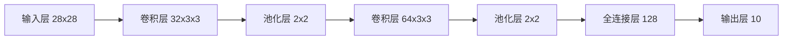

# 好奇心：探索世界的钥匙

## 1. 背景介绍
### 1.1 问题的由来
好奇心是人类与生俱来的天性,它驱使我们不断探索未知的世界。从古至今,无数科学家和发明家都是在好奇心的驱使下,不断突破人类认知的边界,推动人类文明的进步。那么,好奇心在IT领域又扮演着怎样的角色呢?它又是如何引领着IT技术的不断发展呢?

### 1.2 研究现状
目前,IT领域正处于飞速发展的阶段,新技术层出不穷。人工智能、大数据、云计算、区块链等前沿技术正在深刻改变着人类的生活方式。而支撑这些技术不断突破的动力,正是IT从业者们的好奇心。他们不满足于现有的技术,总是在思考如何让技术更加智能、高效、安全。正是在这种好奇心的驱使下,IT技术才能不断突破瓶颈,实现跨越式发展。

### 1.3 研究意义 
探究好奇心在IT领域的作用,对于我们理解IT技术的发展规律,把握未来IT技术的发展方向具有重要意义。通过分析好奇心是如何推动IT技术不断进步的,我们可以更好地理解创新的本质,找到培养创新型IT人才的方法。同时,对好奇心的研究也有助于我们反思当前IT领域存在的问题,探索解决问题的新思路、新方法。

### 1.4 本文结构
本文将从以下几个方面来探讨好奇心在IT领域的作用:
- 首先,介绍好奇心的概念以及它与创新的关系;
- 其次,通过经典案例分析好奇心是如何推动IT技术突破的; 
- 再次,总结培养IT领域创新人才需要注重好奇心的培养;
- 最后,展望好奇心在未来IT技术发展中的重要作用。

## 2. 核心概念与联系
好奇心是指人们对未知事物和问题产生兴趣,并渴望探索和了解的一种心理特质。它是人类求知的内在动力,激励着人们不断提出问题,探索未知。

创新是指在现有的基础上,提出新的思路、方法,创造出新的事物。它是推动社会进步的重要力量。

好奇心与创新有着天然的联系。正是基于对未知问题的好奇,人们才会不断探索,提出新的见解,最终实现创新。没有好奇心的驱动,就不会有问题意识,也就不会有创新的动力。可以说,好奇心是创新的源泉。

在IT领域,技术的发展日新月异,唯有保持旺盛的好奇心,不断探索未知,才能紧跟技术发展的脚步,引领技术的变革。当前IT领域的很多重大突破,都源于科技工作者对未知问题的好奇与执着的探索。

## 3. 核心算法原理 & 具体操作步骤
本节将通过经典案例,分析好奇心是如何引领IT技术突破的。

### 3.1 算法原理概述
深度学习是当前人工智能领域最前沿、最受关注的技术之一。它模拟人脑的神经网络结构,通过海量数据的训练,让机器具备了识别、理解、决策等智能能力。

深度学习的核心是神经网络算法。神经网络由大量的节点(神经元)组成,节点之间相互连接,形成复杂的网络结构。通过调整神经元之间连接的权重,网络可以学习到数据背后的规律,从而具备智能化的能力。

### 3.2 算法步骤详解
深度学习的神经网络训练过程可以分为以下四个步骤:

(1)定义网络结构。根据任务的需求,设计合适的网络层数、每层节点数、激活函数等参数,搭建神经网络的基本框架。

(2)准备训练数据。将大量的有标签数据(训练集)输入到网络中,让网络通过反复训练,学习数据的特征。

(3)训练网络。采用梯度下降等优化算法,通过迭代计算,使网络的预测结果与真实标签尽可能接近,找到最优的网络参数。

(4)评估结果。利用另一部分数据(验证集)来评估训练好的模型性能,不断调整优化,直到达到理想的效果。

### 3.3 算法优缺点
深度学习具有强大的特征学习能力,能够处理复杂的非线性问题,在图像、语音、自然语言等领域取得了突破性进展。

但深度学习也存在一定局限性,主要有:
- 需要大量的有标签数据,获取成本较高;
- 网络结构复杂,训练时间长,调参难度大;
- 模型的可解释性较差,容易成为"黑盒"。

### 3.4 算法应用领域
得益于深度学习技术的发展,人工智能在很多领域取得了长足进展,如:
- 计算机视觉:图像识别、目标检测、人脸识别等
- 语音识别:语音助手、实时翻译、语音输入等  
- 自然语言处理:机器翻译、情感分析、智能问答等
- 无人驾驶:环境感知、路径规划、智能决策等

这些领域的突破性进展,与科技工作者的好奇心密不可分。正是他们对未知问题的不懈探索,才推动了深度学习技术的飞速发展。

## 4. 数学模型和公式 & 详细讲解 & 举例说明
### 4.1 数学模型构建
神经网络可以用数学模型来表示。假设一个简单的三层网络,包括输入层、隐藏层、输出层,如下图所示:


设输入层有 $n$ 个节点,隐藏层 $m$ 个节点,输出层 $l$ 个节点。输入数据为 $x=(x_1,x_2,...,x_n)$,隐藏层的输出为 $h=(h_1,h_2,...,h_m)$,最终的输出为 $\hat{y}=(\hat{y}_1,\hat{y}_2,...,\hat{y}_l)$。

输入层到隐藏层的权重参数为 $w_{ij}^{(1)}$,隐藏层到输出层的权重参数为 $w_{jk}^{(2)}$,其中 $1\leq i\leq n, 1\leq j\leq m, 1\leq k\leq l$。

隐藏层第 $j$ 个节点的输入为:
$$z_j^{(1)} = \sum_{i=1}^n w_{ij}^{(1)} x_i$$

隐藏层第 $j$ 个节点的输出为:
$$h_j = f(z_j^{(1)})$$

其中 $f$ 为激活函数,常见的有 sigmoid、tanh、ReLU 等。

输出层第 $k$ 个节点的输入为:  
$$z_k^{(2)} = \sum_{j=1}^m w_{jk}^{(2)} h_j$$

输出层第 $k$ 个节点的输出为:
$$\hat{y}_k = g(z_k^{(2)})$$

其中 $g$ 为输出层的激活函数,常见的有 softmax、sigmoid 等。

### 4.2 公式推导过程
网络训练的目标是最小化预测输出与真实标签之间的损失函数,即:

$$\min J(w) = \frac{1}{N}\sum_{i=1}^N L(\hat{y}^{(i)},y^{(i)})$$

其中 $\hat{y}^{(i)}$ 是网络对第 $i$ 个样本的预测输出,$y^{(i)}$ 是第 $i$ 个样本的真实标签,$L$ 为损失函数,常见的有均方误差、交叉熵等。

网络通过反向传播算法来更新权重参数。根据链式法则,损失函数 $J$ 对隐藏层到输出层权重 $w_{jk}^{(2)}$ 的梯度为:

$$\frac{\partial J}{\partial w_{jk}^{(2)}} = \frac{1}{N}\sum_{i=1}^N \frac{\partial L^{(i)}}{\partial \hat{y}_k^{(i)}} \cdot \frac{\partial \hat{y}_k^{(i)}}{\partial z_k^{(2)(i)}} \cdot h_j^{(i)}$$

同理,损失函数 $J$ 对输入层到隐藏层权重 $w_{ij}^{(1)}$ 的梯度为:

$$\frac{\partial J}{\partial w_{ij}^{(1)}} = \frac{1}{N}\sum_{i=1}^N \sum_{k=1}^l \frac{\partial L^{(i)}}{\partial \hat{y}_k^{(i)}} \cdot \frac{\partial \hat{y}_k^{(i)}}{\partial z_k^{(2)(i)}} \cdot w_{jk}^{(2)} \cdot f'(z_j^{(1)(i)}) \cdot x_i^{(i)}$$

根据梯度下降法,权重参数的更新公式为:

$$w := w - \alpha \cdot \frac{\partial J}{\partial w}$$

其中 $\alpha$ 为学习率。

### 4.3 案例分析与讲解
下面我们以手写数字识别为例,来说明如何用深度学习实现图像分类。

首先准备训练数据,MNIST 是常用的手写数字数据集,包含 60000 个训练样本和 10000 个测试样本,每个样本是一张 28x28 的灰度图像,如下图所示:


我们可以搭建一个简单的卷积神经网络,结构如下:



其中卷积层用于提取图像特征,池化层用于降维,全连接层用于分类。

在 TensorFlow 中,可以用以下代码实现该网络:

```python
model = Sequential([
    Conv2D(32, (3, 3), activation='relu', input_shape=(28, 28, 1)),
    MaxPooling2D((2, 2)),
    Conv2D(64, (3, 3), activation='relu'),
    MaxPooling2D((2, 2)),
    Flatten(),
    Dense(128, activation='relu'),
    Dense(10, activation='softmax')
])
```

编译模型,设置优化器、损失函数、评估指标:

```python
model.compile(optimizer='adam',
              loss='categorical_crossentropy',
              metrics=['accuracy'])
```

训练模型,设置训练轮数、批量大小:

```python
model.fit(train_images, train_labels, epochs=5, batch_size=64)
```

在测试集上评估模型性能:

```python
test_loss, test_acc = model.evaluate(test_images, test_labels)
print('Test accuracy:', test_acc)
```

最终在测试集上可以达到 99% 以上的识别准确率。

### 4.4 常见问题解答
问:为什么要使用卷积层而不是全连接层?

答:图像数据具有局部特征,卷积层通过滑动窗口提取局部特征,并通过权值共享减少参数数量。全连接层会导致参数过多,容易过拟合。卷积层能更好地利用图像的空间信息。

问:如何选择网络的超参数?

答:超参数对网络性能有很大影响,需要根据具体任务反复调试。一些常用的调优方法有:
- 网格搜索:设置超参数的取值范围,遍历所有组合,挑选最优
- 随机搜索:随机采样超参数,在更大范围内寻找最优
- 贝叶斯优化:根据先验知识,构建超参数的概率模型,智能搜索最优

问:深度学习需要大量标注数据,如何解决数据不足的问题?  

答:小样本学习是当前深度学习面临的一大挑战。一些常用的方法有:
- 数据增强:通过旋转、缩放、添加噪声等操作,增加数据的多样性 
- 迁移学习:利用在其他大型数据集上预训练的模型,在小样本数据上进行微调
- 元学习:学习如何快速适应新的任务,从少量样本中学习

## 5. 项