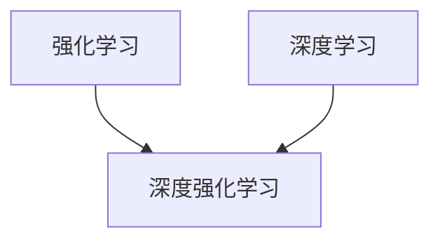

# 强化学习Reinforcement Learning与深度学习的结合之路

关键词：强化学习、深度学习、深度强化学习、Q-learning、DQN、策略梯度、Actor-Critic、AlphaGo

## 1. 背景介绍 
### 1.1 问题的由来
强化学习(Reinforcement Learning, RL)作为一种重要的机器学习范式,其目标是学习一个最优策略,使得智能体(agent)在与环境交互的过程中获得最大的累积奖励。近年来,随着深度学习的蓬勃发展,将深度学习与强化学习相结合,即深度强化学习(Deep Reinforcement Learning, DRL)已成为人工智能领域的研究热点。

### 1.2 研究现状
深度强化学习在Atari游戏、围棋、机器人控制等领域取得了令人瞩目的成就。DeepMind公司开发的DQN在Atari游戏上的表现已经超越人类高手,AlphaGo更是战胜了世界顶尖围棋选手。这些成功案例表明,深度强化学习正在逐步接近通用人工智能(AGI)的目标。

### 1.3 研究意义 
深入研究强化学习与深度学习的结合,对于推动人工智能的发展具有重要意义。一方面,深度学习为强化学习提供了更强大的函数逼近能力,使得强化学习算法能够应用于更加复杂的决策问题。另一方面,强化学习为深度学习引入了目标导向的学习范式,使得神经网络的训练过程更加高效和稳定。二者的结合有望突破当前人工智能的瓶颈,实现更加智能化的系统。

### 1.4 本文结构
本文将系统地介绍强化学习与深度学习结合的基本原理、代表性算法以及实际应用。第2节介绍强化学习和深度学习的核心概念与二者的关联;第3节详细阐述几种主流的深度强化学习算法原理;第4节给出这些算法涉及的数学模型与公式推导;第5节通过代码实例演示深度强化学习算法的实现细节;第6节总结深度强化学习的实际应用场景;第7节推荐相关的学习资源与开发工具;第8节对深度强化学习的未来发展趋势与面临的挑战进行展望;第9节列举一些常见问题与解答。

## 2. 核心概念与联系

强化学习的核心概念包括:
- 智能体(Agent):与环境交互并做出决策的主体 
- 环境(Environment):智能体所处的环境,对智能体的行为做出反馈
- 状态(State):环境的状态表示
- 行为(Action):智能体能够采取的行动
- 策略(Policy):从状态到行为的映射,即给定状态下应该采取何种行动
- 奖励(Reward):环境对智能体行为的即时反馈
- 价值函数(Value Function):衡量状态或状态-行为对的长期累积奖励

深度学习则主要利用多层神经网络对输入数据进行表征学习和特征提取。常见的深度学习模型包括:
- 前馈神经网络(Feedforward Neural Network) 
- 卷积神经网络(Convolutional Neural Network, CNN)
- 循环神经网络(Recurrent Neural Network, RNN)

深度强化学习的核心思想是利用深度神经网络逼近强化学习中的价值函数或策略函数。相比传统的强化学习算法,深度强化学习具有更强的表征能力和泛化能力,能够处理高维度的状态空间。同时,深度强化学习也继承了强化学习的探索机制,能够在复杂环境中自主学习最优策略。

下图展示了强化学习、深度学习与深度强化学习三者之间的关系:



## 3. 核心算法原理 & 具体操作步骤
### 3.1 算法原理概述
深度强化学习的主流算法可分为以下三大类:
1. 基于值(Value-based)的方法:通过学习状态-行为值函数(Q函数),选择Q值最大的行为。代表算法为DQN系列算法。
2. 基于策略(Policy-based)的方法:直接学习状态到行为的映射策略。代表算法为策略梯度(Policy Gradient)算法。
3. 结合值和策略(Actor-Critic)的方法:同时学习值函数和策略函数。代表算法为DDPG、A3C等。

### 3.2 算法步骤详解
以DQN算法为例,其主要步骤如下:
1. 初始化Q网络参数θ,目标网络参数θ'=θ
2. 初始化经验回放池D
3. for episode = 1 to M do
    1. 初始化初始状态s
    2. for t = 1 to T do 
        1. 根据ε-贪心策略选择行为a
        2. 执行行为a,观察奖励r和下一状态s'
        3. 将转移样本(s,a,r,s')存入D
        4. 从D中随机采样一个batch的转移样本(s_i,a_i,r_i,s'_i)
        5. 计算目标值y_i=r_i+γ*max(Q(s'_i,a';θ'))
        6. 最小化损失L(θ)=(y_i-Q(s_i,a_i;θ))^2
        7. 每C步更新目标网络参数θ'=θ
        8. s = s'
    3. end for
4. end for

### 3.3 算法优缺点
DQN的优点在于:
1. 引入经验回放,打破了数据的相关性
2. 使用目标网络,提高训练稳定性
3. 端到端学习,不需要人工特征工程

DQN的缺点包括:
1. 不能有效处理连续动作空间
2. 难以应用于部分可观测环境
3. 对超参数敏感,调参难度大

### 3.4 算法应用领域
DQN及其变体在以下领域得到了广泛应用:
- 游戏(Atari、星际争霸、Dota等)
- 推荐系统(阿里、京东等)  
- 智能电网调度
- 自然语言处理
- 机器人控制

## 4. 数学模型和公式 & 详细讲解 & 举例说明
### 4.1 数学模型构建
马尔可夫决策过程(Markov Decision Process, MDP)是强化学习的标准数学模型。一个MDP由以下元素组成:
- 状态空间S
- 行为空间A
- 转移概率P(s'|s,a):在状态s下采取行为a后转移到状态s'的概率
- 奖励函数R(s,a):在状态s下采取行为a获得的即时奖励

策略π(a|s)定义为在状态s下选择行为a的概率。

状态-行为值函数(Q函数)定义为:
$$Q^π(s,a)=E[∑_{t=0}^∞γ^tR(s_t,a_t)|s_0=s,a_0=a,π]$$
其中γ为折扣因子。

最优Q函数满足贝尔曼最优方程:
$$Q^*(s,a)=R(s,a)+γ∑_{s'}P(s'|s,a)max_{a'}Q^*(s',a')$$

### 4.2 公式推导过程
DQN算法的目标是学习最优Q函数。定义Q网络参数为θ,优化目标为最小化时序差分(TD)误差:
$$L(θ)=E[(r+γmax_{a'}Q(s',a';θ')-Q(s,a;θ))^2]$$
其中θ'为目标网络参数。

对损失函数求导可得:
$$\nabla_θL(θ)=E[(r+γmax_{a'}Q(s',a';θ')-Q(s,a;θ))∇_θQ(s,a;θ)]$$

利用随机梯度下降法对参数θ进行更新:
$$θ←θ-α\nabla_θL(θ)$$
其中α为学习率。

### 4.3 案例分析与讲解
考虑一个简单的网格世界环境,如下图所示:

```
+---+---+---+
| S |   |   |
+---+---+---+
|   |   | T |
+---+---+---+
```

其中S为起始状态,T为终止状态。智能体的目标是学习一个策略,使得从S出发尽快到达T。

我们可以将这个环境建模为一个MDP:
- 状态空间S={(0,0),(0,1),(0,2),(1,0),(1,1),(1,2)}
- 行为空间A={上,下,左,右}
- 奖励函数R(s,a)=0(非终止状态),R(s,a)=1(终止状态)

应用DQN算法,我们可以得到最优Q函数和最优策略,如下图所示:

```
+------+------+------+
|  0.8 |  0.9 |  1.0 |
+------+------+------+
|  0.7 |  0.8 |  0.9 |
+------+------+------+

最优策略:
+---+---+---+
| > | > | ^ |
+---+---+---+
| ^ | > | ^ |
+---+---+---+
```

可以看出,DQN算法成功学习到了最优策略,能够指导智能体高效地到达目标状态。

### 4.4 常见问题解答
1. Q: DQN算法能否处理连续状态和行为空间?
   A: 原始DQN只能处理离散状态和行为空间。对于连续状态空间,可以使用连续DQN(CDQN)算法;对于连续行为空间,可以使用DDPG等基于Actor-Critic的算法。

2. Q: DQN算法的收敛性如何?
   A: DQN算法基于Q学习,在一定条件下(如探索充分)能够收敛到最优Q函数。但在实际应用中,神经网络的拟合误差会影响收敛性。可以采用Double DQN等改进方法提高收敛性。

3. Q: DQN算法的探索策略有哪些?   
   A: 常用的探索策略包括ε-贪心、Boltzmann探索等。此外,可以使用基于熵正则化的探索策略,鼓励智能体在不确定性高的状态多探索。

## 5. 项目实践：代码实例和详细解释说明
### 5.1 开发环境搭建
实现DQN算法需要安装以下依赖库:
- Python 3.5+
- Tensorflow 1.x/2.x
- Gym
- Numpy
- Matplotlib

可以使用pip命令进行安装:
```
pip install tensorflow-gpu gym numpy matplotlib
```

### 5.2 源代码详细实现
下面给出DQN算法的核心代码实现:

```python
import tensorflow as tf
import numpy as np
import gym

# 超参数
GAMMA = 0.9 # 折扣因子
LEARNING_RATE = 0.0001 # 学习率
EPSILON = 0.9 # epsilon-贪心参数
REPLAY_SIZE = 10000 # 经验回放池大小
BATCH_SIZE = 32 # 批大小

class DQN:
    def __init__(self, env):
        # 状态空间和行为空间维度
        self.state_dim = env.observation_space.shape[0]
        self.action_dim = env.action_space.n
        
        # 创建Q网络和目标Q网络
        self.Q = self._build_net() 
        self.Q_target = self._build_net()
        
        # 定义优化器
        self.optimizer = tf.optimizers.Adam(LEARNING_RATE)
        
        # 经验回放池
        self.replay_buffer = []
        
    def _build_net(self):
        """构建Q网络"""
        model = tf.keras.Sequential([
            tf.keras.layers.Dense(64, activation='relu', input_shape=(self.state_dim,)),
            tf.keras.layers.Dense(64, activation='relu'),
            tf.keras.layers.Dense(self.action_dim)
        ])
        return model
    
    def update_target_net(self):
        """更新目标Q网络"""
        self.Q_target.set_weights(self.Q.get_weights()) 
        
    def choose_action(self, state):
        """epsilon-贪心策略选择行为"""
        if np.random.uniform() < EPSILON:
            q_values = self.Q.predict(state[np.newaxis])
            action = np.argmax(q_values)
        else:
            action = np.random.choice(self.action_dim)
        return action
        
    def train(self, state, action, reward, next_state, done):
        """训练Q网络"""
        # 将转移样本存入经验回放池
        self.replay_buffer.append((state, action, reward, next_state, done))
        
        # 从经验回放池中随机采样一个batch