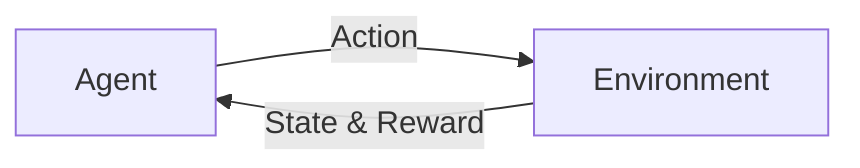

# 强化学习Reinforcement Learning在智慧城市中的应用案例

关键词：强化学习、智慧城市、智能交通、智能电网、智能建筑、智能医疗

## 1. 背景介绍
### 1.1  问题的由来
随着城市化进程的不断加快,城市规模不断扩大,城市人口不断增加,城市面临的各种问题也日益突出,如交通拥堵、环境污染、能源短缺、医疗资源紧张等。为了解决这些问题,建设智慧城市成为了必然选择。智慧城市利用物联网、云计算、大数据等新一代信息技术,感测、分析、整合城市运行核心系统的各项关键信息,从而对包括民生、环保、公共安全、城市服务、工商业活动在内的各种需求做出智能响应。

### 1.2  研究现状
目前,国内外学者已经开始将强化学习应用于智慧城市的各个领域。在智能交通方面,有学者提出了基于深度强化学习的交通信号控制算法,通过不断与环境互动学习,使信号灯的配时方案不断优化,从而减少车辆延误时间。在智能电网方面,有学者提出了基于强化学习的需求侧响应策略,通过学习用户的用电行为,预测未来的用电需求,从而制定合理的电价政策,引导用户错峰用电,提高电网效率。在智能建筑方面,有学者提出了基于强化学习的智能空调控制策略,通过学习用户的使用习惯和偏好,自动调节空调的工作参数,在保证舒适性的同时节约能源。在智能医疗方面,有学者提出了基于强化学习的辅助诊断系统,通过学习大量病例数据,辅助医生进行疾病诊断,提高诊断的准确率。

### 1.3  研究意义
将强化学习应用于智慧城市建设,对于提高城市管理和服务水平,改善人们生活质量,实现城市可持续发展具有重要意义。一方面,强化学习能够通过不断试错和学习,找到最优的决策方案,这在复杂多变的城市环境中具有独特优势。另一方面,将强化学习与深度学习相结合,能够直接从原始数据中学习提取特征,挖掘隐藏的规律和模式,极大提升了系统的智能化水平。因此,深入研究强化学习在智慧城市中的应用,对于推动智慧城市建设,具有重要的理论和实践意义。

### 1.4  本文结构
本文将重点介绍强化学习在智慧城市几个关键领域的应用案例,包括智能交通、智能电网、智能建筑和智能医疗。第2部分介绍强化学习的核心概念和基本原理。第3部分详细讲解几个经典的强化学习算法。第4部分介绍强化学习中常用的数学模型和公式。第5部分通过代码实例,演示如何用Python实现几个典型的强化学习算法。第6部分列举了一些强化学习在智慧城市中的实际应用场景。第7部分推荐了一些学习强化学习的资源和工具。第8部分对全文进行总结,并展望了强化学习在智慧城市中的发展趋势和面临的挑战。

## 2. 核心概念与联系
强化学习是一种重要的机器学习范式,它研究如何让智能体通过与环境的交互来学习最优策略,以获得最大的累积奖励。与监督学习和无监督学习不同,强化学习不需要预先准备标注数据,而是通过探索和利用来不断优化策略。一个典型的强化学习系统由以下几个核心概念组成:

- 环境(Environment):智能体所处的环境,一般用一个马尔可夫决策过程(MDP)来建模。环境中包含一组状态(State)和一组动作(Action)。
- 智能体(Agent):在环境中学习和作决策的主体,它根据当前的状态,选择一个动作,环境对动作做出反馈,并告知智能体新的状态和奖励。
- 策略(Policy):智能体选择动作的策略或规则,用 $\pi$ 表示。给定一个状态,策略决定智能体应该采取什么样的动作。优化策略是强化学习的核心目标。
- 奖励(Reward):环境对智能体动作的即时反馈,用 $r$ 表示。奖励可以是正的,表示做得好;也可以是负的,表示做得不好。智能体的目标就是获得最大的累积奖励。
- 价值(Value):衡量状态或动作的长期价值,用 $V$ 或 $Q$ 表示。价值函数表示从某个状态开始,执行某个策略,可以获得的期望累积奖励。
- 模型(Model):环境的模型,包括状态转移概率和奖励函数。模型用于规划和预测未来。基于模型的强化学习算法需要学习环境模型,无模型算法则直接学习策略或价值函数。

下图展示了强化学习中智能体与环境交互的基本过程:

智能体与环境不断交互,根据当前状态选择动作,环境反馈新的状态和奖励,智能体据此更新策略,以获得更多的奖励。这个过程不断循环,直到达到最优策略。

强化学习在智慧城市中有广泛应用,比如:

- 在智能交通中,可以将车辆看作智能体,将路网看作环境,通过优化车辆的行驶策略来缓解拥堵。
- 在智能电网中,可以将用户看作智能体,将电网看作环境,通过优化用电策略来平衡供需,提高能效。
- 在智能建筑中,可以将空调系统看作智能体,将建筑物看作环境,通过优化控制策略来改善室内环境品质,节约能耗。
- 在智能医疗中,可以将诊断系统看作智能体,将海量医疗数据看作环境,通过学习诊断策略来辅助临床决策。

## 3. 核心算法原理 & 具体操作步骤
### 3.1  算法原理概述
强化学习有多种经典算法,它们在原理和实现上各有特点,但都遵循同一个基本框架,即通过策略迭代或价值迭代来优化决策。下面简要介绍几个主要算法:

- 蒙特卡洛方法(Monte Carlo):通过采样完整的状态-动作序列来估计价值函数,然后基于价值函数改进策略。优点是可以从经验中学习,缺点是效率较低,只适用于回合制任务。
- 时序差分学习(Temporal Difference):通过状态转移时的 TD 误差来更新价值函数,相比蒙特卡洛方法更加高效。常见算法有 Sarsa 和 Q-learning。
- 策略梯度(Policy Gradient):直接对策略函数的参数进行梯度上升,以提高在好的动作上的概率。常见算法有 REINFORCE 和 Actor-Critic。
- 近端策略优化(Proximal Policy Optimization):基于信任域的策略优化算法,通过限制新旧策略的差异,来平衡探索和利用,提高训练稳定性。
- 深度Q网络(Deep Q-Network):将价值函数用深度神经网络来拟合,并引入了经验回放和目标网络等技术,实现了端到端的深度强化学习。

### 3.2  算法步骤详解
以 Q-learning 为例,详细说明该算法的具体步骤:

1. 初始化 Q 表格 $Q(s,a)$,对于所有状态-动作对,初始值可以设为0。
2. 重复下面步骤,直到收敛:
   1. 根据 $\epsilon$-贪婪策略,选择一个动作 $a$,即以 $\epsilon$ 的概率随机选择动作,否则选择 $Q(s,a)$ 最大的动作。
   2. 执行动作 $a$,观察奖励 $r$ 和新状态 $s'$。 
   3. 更新 $Q(s,a)$:
      $Q(s,a) \leftarrow Q(s,a) + \alpha [r + \gamma \max_{a'} Q(s',a') - Q(s,a)]$
      其中 $\alpha$ 是学习率,$\gamma$ 是折扣因子。
   4. $s \leftarrow s'$。
3. 输出最优策略 $\pi^*(s) = \arg\max_a Q(s,a)$。

Q-learning 的核心思想是,利用 TD 误差来更新 Q 值,使其逼近最优动作价值函数 $Q^*$。通过不断地试错和学习,Q 值最终会收敛到 $Q^*$,此时贪婪策略就是最优策略。

### 3.3  算法优缺点
Q-learning 的主要优点有:
- 简单易实现,适用于离散状态和动作空间。
- 能够学习最优策略,无需事先知道环境模型。
- 通过离线学习,可以利用历史数据,提高样本效率。

Q-learning 的主要缺点有:  
- 难以处理连续状态和动作空间,需要进行离散化。
- 在状态和动作空间很大时,Q 表格难以存储和更新。
- 在稀疏奖励的任务中,探索效率低,容易陷入局部最优。

### 3.4  算法应用领域
Q-learning 及其变种在智慧城市中有许多应用,例如:

- 在智能交通中,可以用 Q-learning 来优化交通信号灯的配时,减少车辆延误。
- 在智能电网中,可以用 Q-learning 来优化储能设备的充放电策略,平滑新能源发电的波动。
- 在智能建筑中,可以用 Q-learning 来优化楼宇的能源管理系统,提高能源利用效率。
- 在智能医疗中,可以用 Q-learning 来优化药物治疗方案,提高疗效,降低副作用。

## 4. 数学模型和公式 & 详细讲解 & 举例说明
### 4.1  数学模型构建
强化学习可以用马尔可夫决策过程(MDP)来建模,一个 MDP 由以下元素组成:

- 状态空间 $\mathcal{S}$:所有可能的状态的集合。
- 动作空间 $\mathcal{A}$:所有可能的动作的集合。
- 转移概率 $\mathcal{P}$:状态转移的概率分布,即 $\mathcal{P}(s'|s,a)$ 表示在状态 $s$ 下执行动作 $a$ 后转移到状态 $s'$ 的概率。
- 奖励函数 $\mathcal{R}$:奖励的期望值,即 $\mathcal{R}(s,a)$ 表示在状态 $s$ 下执行动作 $a$ 后获得的即时奖励的期望。
- 折扣因子 $\gamma$:未来奖励的折扣率,取值范围 $[0,1]$,用于平衡即时奖励和长期奖励。

MDP 的目标是寻找一个最优策略 $\pi^*$,使得从任意状态开始执行该策略,获得的期望累积奖励最大化:

$$\pi^* = \arg\max_\pi \mathbb{E}[\sum_{t=0}^{\infty} \gamma^t r_t | \pi]$$

其中 $r_t$ 表示在时刻 $t$ 获得的奖励。

### 4.2  公式推导过程  
以 Q-learning 为例,推导其核心公式。Q-learning 的目标是学习最优动作价值函数 $Q^*$,它满足贝尔曼最优方程:

$$Q^*(s,a) = \mathcal{R}(s,a) + \gamma \sum_{s' \in \mathcal{S}} \mathcal{P}(s'|s,a) \max_{a'} Q^*(s',a')$$

即最优动作价值等于即时奖励加上下一状态的最优动作价值的折现和。

Q-learning 用采样的方式来逼近 $Q^*$,其更新公式为:

$$Q(s,a) \leftarrow Q(s,a) + \alpha [r + \gamma \max_{a'} Q(s',a') - Q(s,a)]$$

其中 $r$ 是采样得到的即时奖励,$s'$ 是采样得到的下一状态,$\alpha$ 是学习率。

可以证明,在适当的条件下(如探索充