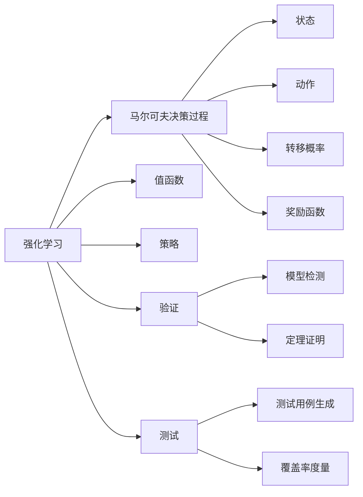

# 强化学习Reinforcement Learning算法的验证与测试

## 1. 背景介绍
### 1.1 问题的由来
强化学习(Reinforcement Learning, RL)作为一种重要的机器学习范式,其灵感来源于心理学中的"强化"概念,即通过奖励来增强某种行为。与监督学习和无监督学习不同,强化学习更关注如何基于环境而行动,以取得最大化的预期利益。近年来,强化学习在许多领域取得了重大突破,如AlphaGo击败世界冠军、Dota2人工智能击败人类选手等,充分展现了其强大的潜力。然而,当前强化学习算法在实际应用中仍面临诸多挑战,其中一个关键问题就是如何对算法进行有效的验证和测试,以确保其安全性、可靠性和鲁棒性。

### 1.2 研究现状
目前,针对强化学习算法的验证与测试已有一些初步的研究。一些学者提出了基于形式化方法的验证技术,如模型检测、定理证明等,可以验证算法的正确性和收敛性。也有研究采用对抗性测试的思路,通过构造对抗样本来评估算法的鲁棒性。此外,还有学者探索了面向强化学习的测试用例生成、覆盖率度量等测试技术。但总体而言,该领域尚处于起步阶段,还缺乏系统性和成熟度,许多问题有待进一步研究。

### 1.3 研究意义 
RL算法的验证与测试研究对于推动强化学习技术的发展和应用具有重要意义:

1. 保障算法的安全性和可靠性,防止出现意外行为,尤其是在自动驾驶、医疗诊断等安全关键场景。 

2. 提高算法的鲁棒性和泛化能力,使其能够应对复杂多变的真实环境。

3. 加速RL算法的开发和测试效率,缩短应用落地的周期。

4. 促进RL领域的标准化和规范化,形成统一的验证测试流程和评估标准。

5. 为其他智能系统的测试验证提供有益借鉴和参考。

### 1.4 本文结构
本文将重点探讨强化学习算法的验证与测试问题。第2部分介绍相关的核心概念;第3部分阐述RL算法的基本原理和主要步骤;第4部分建立算法的数学模型并给出详细推导;第5部分通过具体代码实例演示相关测试方法;第6部分分析讨论RL测试验证在实际场景中的应用;第7部分总结全文,展望未来的研究方向和挑战。

## 2. 核心概念与联系

在探讨强化学习算法的验证测试之前,首先需要明确几个核心概念:

- 强化学习:一种通过试错与环境互动并根据反馈不断优化行为策略以获得最大累积奖励的学习范式。

- 马尔可夫决策过程(MDP):用于描述强化学习问题的经典数学框架,由状态、动作、转移概率和奖励函数等要素组成。

- 策略(Policy):RL智能体采取行动的策略函数,即给定状态下动作的概率分布。

- 值函数(Value Function):评估特定状态或状态-动作对的期望回报,包括状态值函数和动作值函数。 

- 验证:采用形式化方法如模型检测、定理证明等来判断算法是否满足特定性质或规范。

- 测试:通过构造测试用例,执行并分析测试结果,以评估算法的正确性、性能、鲁棒性等指标。

这些概念之间存在紧密的内在联系。MDP为RL提供了理论基础,值函数和策略是RL的核心要素。验证和测试则是评估RL算法的两种互补方法,前者侧重理论分析,后者侧重实践评估,二者相辅相成,以全面保障RL系统的质量。下图展示了这些概念间的逻辑关系:

## 3. 核心算法原理 & 具体操作步骤
### 3.1 算法原理概述
强化学习的目标是学习一个最优策略函数,使得智能体能够在与环境交互的过程中获得最大的累积奖励。一般而言,RL算法主要包括以下几个关键组件:

1. 策略(Policy):根据当前状态选择动作的策略函数。
2. 环境模型(Environment Model):刻画智能体与环境交互的过程,即在某状态下执行某动作后,环境如何转移到下一状态并返回相应的奖励反馈。
3. 值函数(Value Function):评价每个状态或状态-动作对的长期期望回报。
4. 探索与利用(Exploration vs. Exploitation):平衡对未知的探索和利用已有知识,以在获取新知识和优化当前策略间取得平衡。

RL的学习过程通常可以概括为:根据当前策略与环境交互生成轨迹数据,基于这些数据更新值函数从而优化策略,优化后的策略再指导后续的交互,周而复始,最终收敛到最优策略。

### 3.2 算法步骤详解
以经典的Q学习算法为例,其具体步骤如下:

1. 初始化Q表格 $Q(s,a)$,对于所有状态-动作对,令初值为0。

2. 重复以下步骤,直到收敛:
   
   a. 根据当前状态 $s$,用 $\epsilon$-贪婪策略选择一个动作 $a$:
      - 以 $\epsilon$ 的概率随机选择动作
      - 以 $1-\epsilon$ 的概率选择Q值最大的动作,即 $a=\arg\max_{a'}Q(s,a')$
   
   b. 执行动作 $a$,观察奖励 $r$ 和下一状态 $s'$

   c. 更新Q值:
      $$Q(s,a) \leftarrow Q(s,a) + \alpha [r + \gamma \max_{a'}Q(s',a') - Q(s,a)]$$
      其中 $\alpha \in (0,1]$ 为学习率, $\gamma \in [0,1]$ 为折扣因子。

   d. 令 $s \leftarrow s'$,开始下一轮迭代

3. 输出最终学到的Q表格和最优策略 $\pi^*(s)=\arg\max_a Q(s,a)$

可见,Q学习本质上是一种值迭代方法,通过不断迭代更新状态-动作值函数 $Q(s,a)$ 来逼近最优Q函数 $Q^*(s,a)$,从而得到最优策略。

### 3.3 算法优缺点
Q学习的主要优点包括:
- 简单易实现,适合初学者学习RL的基本概念
- 能够在未知环境动态中学习,具有一定的适应性
- 对状态空间和决策过程没有过多假设,适用范围广

但它也存在一些局限:
- 难以处理连续或高维状态动作空间
- 需要大量的训练数据和迭代才能收敛
- 容易出现过拟合,泛化能力不足
- 对奖励函数和超参数敏感,调参困难

针对这些问题,后续出现了许多改进的RL变体,如DQN、A3C、PPO等,在实际应用中取得了不错的效果。

### 3.4 算法应用领域
凭借其独特的"从环境中学习"的能力,强化学习在诸多领域展现出了巨大的应用潜力,主要包括:

- 游戏:如国际象棋、围棋、雅达利游戏、星际争霸等
- 机器人控制:如机械臂操纵、四足机器人、仿人机器人等  
- 自然语言处理:如对话系统、机器翻译、文本生成等
- 推荐系统:如电商推荐、新闻推荐、广告投放等
- 网络优化:如数据中心冷却、网络路由优化等
- 交通控制:如自动驾驶、智能交通信号灯控制等
- 金融:如股票交易、投资组合优化、金融风控等

未来,随着RL理论和算法的进一步发展,有望在更多实际场景中大显身手,为人类生活带来更多便利。

## 4. 数学模型和公式 & 详细讲解 & 举例说明
### 4.1 数学模型构建
为了对强化学习算法进行严格的数学刻画,通常采用马尔可夫决策过程(MDP)作为基本模型。一个MDP由以下元组构成:

$$\mathcal{M}=\langle\mathcal{S},\mathcal{A},\mathcal{P},\mathcal{R},\gamma\rangle$$

其中:
- $\mathcal{S}$ 是有限的状态集
- $\mathcal{A}$ 是有限的动作集  
- $\mathcal{P}$ 是状态转移概率函数,$\mathcal{P}(s'|s,a)$表示在状态$s$下执行动作$a$后转移到状态$s'$的概率
- $\mathcal{R}$ 是奖励函数,$\mathcal{R}(s,a)$表示在状态$s$下执行动作$a$获得的即时奖励
- $\gamma\in[0,1]$ 是折扣因子,用于平衡即时奖励和长期奖励

MDP的目标是寻找一个最优策略$\pi^*$,使得从任意初始状态出发,执行该策略获得的期望累积奖励达到最大,即:

$$\pi^* = \arg\max_{\pi}\mathbb{E}_{\pi}[\sum_{t=0}^{\infty}\gamma^t \mathcal{R}(s_t,a_t)]$$

为了求解最优策略,引入值函数的概念。定义状态值函数$V^{\pi}(s)$为从状态$s$开始执行策略$\pi$获得的期望回报:

$$V^{\pi}(s)=\mathbb{E}_{\pi}[\sum_{k=0}^{\infty}\gamma^k \mathcal{R}(s_{t+k},a_{t+k})|s_t=s]$$

类似地,定义动作值函数$Q^{\pi}(s,a)$为在状态$s$下选择动作$a$,然后持续执行策略$\pi$获得的期望回报:

$$Q^{\pi}(s,a)=\mathbb{E}_{\pi}[\sum_{k=0}^{\infty}\gamma^k \mathcal{R}(s_{t+k},a_{t+k})|s_t=s,a_t=a]$$

最优值函数$V^*(s)$和$Q^*(s,a)$分别定义为所有策略中的最大值函数:

$$
\begin{aligned}
V^*(s) &= \max_{\pi}V^{\pi}(s)\\
Q^*(s,a) &= \max_{\pi}Q^{\pi}(s,a)
\end{aligned}
$$

如果我们能够准确估计出最优值函数,就可以很容易地得到最优策略:

$$\pi^*(s) = \arg\max_{a\in\mathcal{A}}Q^*(s,a)$$

因此,RL的核心问题就转化为如何高效准确地估计最优值函数。

### 4.2 公式推导过程
以Q学习为例,下面给出其核心公式的推导过程。Q学习的目标是直接估计最优动作值函数$Q^*(s,a)$,并据此得到最优策略。根据贝尔曼最优方程,最优Q函数满足:

$$Q^*(s,a) = \mathcal{R}(s,a) + \gamma\sum_{s'\in\mathcal{S}}\mathcal{P}(s'|s,a)\max_{a'\in\mathcal{A}}Q^*(s',a') \tag{1}$$

但在实际中,状态转移概率$\mathcal{P}$往往是未知的,无法直接利用式(1)求解$Q^*$。Q学习巧妙地利用了采样的思想,将式(1)转化为基于采样轨迹的迭代更新。

假设在第$t$步,智能体处于状态$s_t$,根据$\epsilon$-贪婪策略选择动作$a_t$,执行后观察到