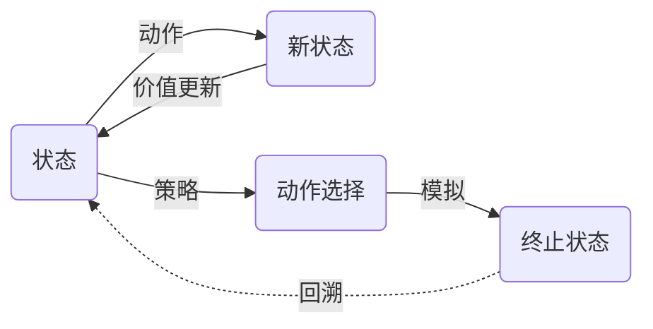
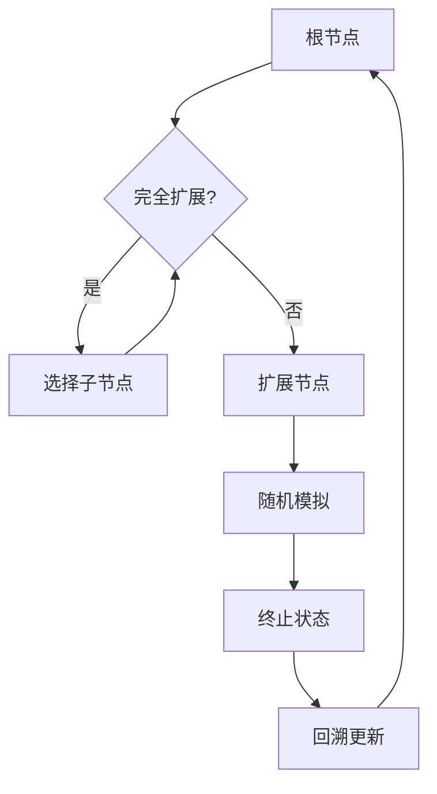
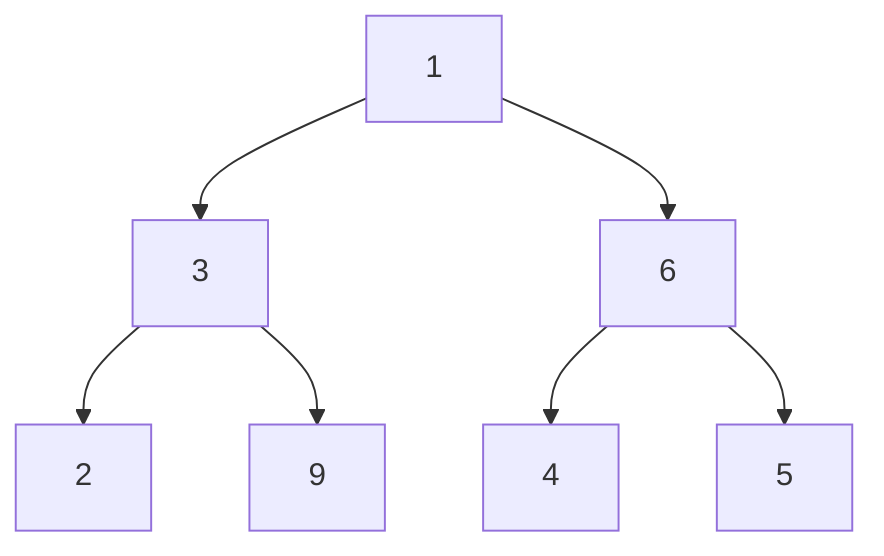

# 强化学习算法：蒙特卡洛树搜索 (Monte Carlo Tree Search) 原理与代码实例讲解

关键词：强化学习, 蒙特卡洛树搜索, MCTS, 策略搜索, 探索-利用平衡, 博弈论

## 1. 背景介绍
### 1.1  问题的由来
在许多复杂的决策问题中,如围棋、国际象棋等博弈游戏,以及自动驾驶、机器人控制等实际应用场景,我们往往面临着巨大的状态空间和动作空间。传统的搜索算法如深度优先、宽度优先等很难有效应对如此庞大的搜索空间。蒙特卡洛树搜索(Monte Carlo Tree Search, MCTS)正是为解决这类问题而提出的一种启发式搜索算法。它通过大量的随机模拟来估计每个决策的长期收益,并不断优化决策树,以期得到最优决策序列。

### 1.2  研究现状
MCTS算法最早由Coulom在2006年提出,此后迅速成为博弈搜索领域的研究热点。2016年,基于MCTS的AlphaGo程序击败了人类顶尖围棋选手,引起了学术界和工业界的广泛关注。近年来,MCTS在博弈搜索、强化学习、组合优化等领域取得了许多令人瞩目的成果。同时,围绕MCTS的改进和优化也是当前的一个研究热点,如如何引入先验知识、如何平衡探索和利用、如何设计高效的搜索策略等。

### 1.3  研究意义
MCTS为解决大规模复杂决策问题提供了一种新的思路。它充分利用了随机性和统计规律,通过不断试错来逼近最优决策。这种思想对于解决现实世界中的许多决策优化问题具有重要的启发意义。深入理解MCTS的原理,并针对不同应用场景进行改进和优化,将有助于我们设计出更加智能高效的决策系统。同时,MCTS也为强化学习、博弈论等领域的研究提供了新的视角和方法论。

### 1.4  本文结构
本文将从以下几个方面对MCTS算法进行深入讲解：
- 第2部分介绍MCTS中的核心概念及其联系
- 第3部分详细阐述MCTS的算法原理和操作步骤
- 第4部分给出MCTS的数学模型和关键公式,并结合具体案例进行讲解
- 第5部分提供MCTS的代码实现范例,并对关键代码进行解析
- 第6部分讨论MCTS在不同领域的实际应用场景
- 第7部分推荐MCTS相关的学习资源、开发工具和文献
- 第8部分总结MCTS的研究现状,展望其未来的发展趋势和挑战
- 第9部分列举MCTS的常见问题,并给出解答

## 2. 核心概念与联系
在介绍MCTS算法之前,我们先来了解几个核心概念：
- **状态(State)**: 表示问题求解过程中的一个局面或者节点,如棋局中的一个棋面位置。每个状态都对应着之后可能的一系列决策。 
- **动作(Action)**: 在某个状态下可以采取的一个决策,如棋局中的一个落子位置。每个动作会导致状态的转移。
- **策略(Policy)**: 在给定状态下动作的选择倾向,通常用一个概率分布来表示。
- **价值(Value)**: 表示了在某个状态下,按照某种策略行动的长期累积回报的期望。
- **回溯(Backpropagation)**: 将模拟结果的评估值反向传播更新树中的节点统计信息的过程。

这些概念之间的联系可以用下图表示:

MCTS算法正是通过不断在状态间模拟和价值回溯,来更新决策树,最终找到最优决策的过程。

## 3. 核心算法原理 & 具体操作步骤
### 3.1  算法原理概述
MCTS的基本思想是:在状态空间中构建一棵搜索树,树中每个节点表示一个状态,每条边表示一个动作。通过在树中不断进行随机模拟,估计每个节点的价值,然后根据价值选择最优动作,同时不断扩展树的广度和深度,最终找到从根节点到终止状态的最优路径,即最佳决策序列。

### 3.2  算法步骤详解
MCTS主要包括4个步骤:选择、扩展、模拟、回溯。

1. **选择(Selection)**: 从根节点出发,依据一定的选择策略,递归地选择子节点,直到到达一个未被完全扩展的节点,或者终止状态。常见的选择策略有UCB(Upper Confidence Bound)、ε-greedy等。

2. **扩展(Expansion)**: 对于选择阶段到达的节点,如果它不是终止状态,则创建一个或多个子节点。子节点对应了从当前状态可以到达的后继状态。

3. **模拟(Simulation)**: 从扩展阶段创建的新节点出发,采用一定的模拟策略(如随机策略),一直运行到到达终止状态。模拟过程中一般不存储中间节点,只记录最终的获胜状态。

4. **回溯(Backpropagation)**: 将模拟阶段的结果评估值(胜负、得分等)反向传播更新路径上各个节点的统计信息(如访问次数、价值估计等)。

以上4个步骤不断迭代,直到满足某个停止条件(如搜索时间用尽、搜索次数达到阈值等),然后根据根节点处的统计信息,选择最优动作。

MCTS的完整流程可用下图表示:

### 3.3  算法优缺点
MCTS的主要优点包括:
- 不需要领域知识,通用性强
- 能够在超大状态空间中找到近似最优解
- 随着时间的增加,解的质量会不断提高
- 能够平衡探索和利用,避免过早收敛

但MCTS也存在一些缺点:
- 需要大量的模拟,计算开销大
- 对奖励稀疏的问题,收敛速度慢
- 对状态扩展和模拟策略的选择敏感
- 容易陷入局部最优

### 3.4  算法应用领域
MCTS在许多领域都有成功的应用,如:
- 棋类游戏:围棋、国际象棋、五子棋等
- 纸牌游戏:桥牌、德州扑克等
- 博弈论:多智能体对抗搜索
- 组合优化:旅行商问题、车间调度等
- 自动驾驶、机器人控制

## 4. 数学模型和公式 & 详细讲解 & 举例说明
### 4.1  数学模型构建
我们可以用一个元组 $(S, A, P, R, \gamma)$ 来表示MCTS所面临的问题,其中:
- $S$ 是有限的状态集
- $A$ 是有限的动作集
- $P$ 是状态转移概率,$P(s'|s,a)$ 表示在状态 $s$ 下采取动作 $a$ 后转移到状态 $s'$ 的概率
- $R$ 是奖励函数,$R(s,a)$ 表示在状态 $s$ 下采取动作 $a$ 后获得的即时奖励
- $\gamma \in [0,1]$ 是折扣因子,表示未来奖励的重要程度

MCTS的目标是找到一个最优策略 $\pi^*: S \rightarrow A$,使得从任意状态 $s$ 出发,采用 $\pi^*$ 能获得最大的期望累积奖励:

$$V^*(s) = \max_{\pi} \mathbb{E}[\sum_{t=0}^{\infty} \gamma^t R(s_t,\pi(s_t)) | s_0=s]$$

其中 $s_t$ 表示 $t$ 时刻的状态。

### 4.2  公式推导过程
在MCTS中,每个状态节点 $s$ 维护两个关键量:
- $N(s)$:状态 $s$ 被访问的次数
- $Q(s,a)$:在状态 $s$ 下采取动作 $a$ 的平均累积奖励估计

初始时,对所有的 $s$ 和 $a$,令 $N(s)=0$,$Q(s,a)=0$。

每次模拟后,对路径上的每个状态节点 $s$,令:

$$N(s) \leftarrow N(s) + 1$$
$$Q(s,a) \leftarrow Q(s,a) + \frac{R - Q(s,a)}{N(s)}$$

其中 $R$ 是从状态 $s$ 出发,采取动作 $a$ 后,模拟到终止状态得到的累积奖励。

在选择阶段,我们希望既能探索新的可能性,又能利用已有的经验。一个常用的选择策略是UCB(Upper Confidence Bound):

$$a^* = \arg\max_{a} \left( Q(s,a) + c \sqrt{\frac{\ln N(s)}{N(s,a)}} \right)$$

其中 $c$ 是一个平衡探索和利用的常数。$\sqrt{\frac{\ln N(s)}{N(s,a)}}$ 项鼓励去尝试被访问次数较少的动作。

### 4.3  案例分析与讲解
下面我们以一个简单的二叉树搜索为例,来说明MCTS的工作过程。

假设我们要在如下的二叉树中搜索最大值:

根节点的值为1,左右子树的最大值分别为9和6,因此整棵树的最大值为9。

我们令探索常数 $c=1$,模拟策略为:在每个节点上选择一个尚未访问过的子节点,直到到达叶子节点,然后返回该叶子节点的值。

初始时,所有节点的 $N$ 和 $Q$ 值都为0。

**第1次迭代:**
- 选择:根节点A是未扩展节点,选择它
- 扩展:扩展节点A的两个子节点B和C
- 模拟:从B节点开始,随机选择一个子节点D,得到值2
- 回溯:将值2回溯更新路径A-B上的统计量。令B的 $N=1$,$Q=2$;A的 $N=1$,$Q=2$

**第2次迭代:**
- 选择:根据UCB公式,B的分数为 $2+1\sqrt{\ln 1/1}=2$,C的分数为 $0+1\sqrt{\ln 1/0}=\infty$,因此选择C
- 扩展:扩展节点C的两个子节点F和G
- 模拟:从F节点开始,得到值4
- 回溯:将值4回溯更新路径A-C-F上的统计量。

**第3次迭代:**
- 选择:B的分数为 $2+1\sqrt{\ln 2/1}=2+1.177=3.177$,C的分数为 $4+1\sqrt{\ln 2/1}=5.177$,选择C;然后在C的子节点中,F的分数为 $4+1\sqrt{\ln 1/1}=4$,G的分数为 $\infty$,因此选择G
- 模拟:直接得到G的值5
- 回溯:将值5回溯更新路径A-C-G上的统计量。

**第4次迭代:**
- 选择:B的分数为3.177,C的分数为4.588,选择C;F的分数为 $4+1\sqrt{\ln 2/1}=5.177$,G的分数为 $5+1\sqrt{\ln 2/1}=6.177$,选择G
- 模拟:直接得到G的值5
- 回溯:将值5回溯更新路径A-C-G上的统计量。

**第5次