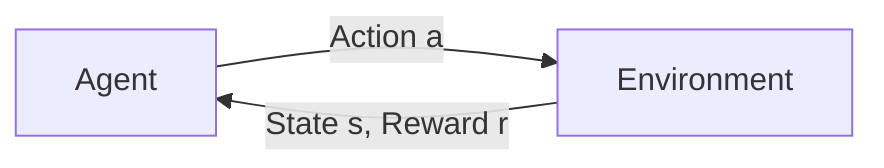

# 强化学习进阶原理与代码实战案例讲解

## 1. 背景介绍
### 1.1 问题的由来
强化学习(Reinforcement Learning, RL)作为人工智能的一个重要分支,其灵感来源于心理学中的行为主义理论。该理论认为,智能体(agent)通过与环境的交互来学习最优策略,从而获得最大化的累积奖励。与监督学习和非监督学习不同,强化学习并不需要大量的标注数据,而是通过探索(exploration)和利用(exploitation)来自主学习。

近年来,随着深度学习的蓬勃发展,深度强化学习(Deep Reinforcement Learning, DRL)开始崭露头角。DRL通过深度神经网络来逼近值函数或策略函数,极大地提升了传统强化学习算法的表示能力和泛化能力。一系列里程碑式的成果,如DQN玩Atari游戏[1]、AlphaGo战胜人类围棋高手[2]、OpenAI Five击败Dota 2职业队伍[3]等,都彰显了DRL的巨大潜力。

### 1.2 研究现状
目前,DRL已经被广泛应用于游戏、机器人、自然语言处理、计算机视觉、推荐系统等诸多领域。一些经典的DRL算法如DQN[4]、DDPG[5]、A3C[6]、PPO[7]等,在不同的任务中取得了瞩目的成绩。此外,一些前沿的研究方向如元强化学习(Meta-RL)[8]、分层强化学习(Hierarchical RL)[9]、迁移强化学习(Transfer RL)[10]等,也受到了学界的高度关注。

尽管DRL已经取得了长足的进步,但仍然存在一些亟待解决的问题,如样本效率低、探索困难、泛化能力差、鲁棒性不足等。因此,如何进一步改进DRL算法,提升其性能和适用性,是当前的研究重点之一。

### 1.3 研究意义
深入研究DRL,对于推动人工智能的发展具有重要意义:

1. 从理论角度来看,DRL为研究智能体如何通过自主学习来适应复杂环境提供了新的视角,有助于加深我们对智能的本质的认识。 

2. 从应用角度来看,DRL有望在自动驾驶、智能制造、智慧城市等领域大显身手,为解决现实世界中的挑战性问题提供新的思路。

3. 从产业角度来看,DRL正在催生一批创新型企业,如DeepMind、OpenAI等,为人工智能产业注入新的活力。

### 1.4 本文结构
本文将围绕DRL的核心概念、原理、算法、应用等方面展开深入讨论。全文结构如下:

- 第2部分介绍DRL的核心概念,如MDP、值函数、策略等,并阐述它们之间的联系。
- 第3部分详细讲解DRL的核心算法,包括Q-learning、Policy Gradient、Actor-Critic等,并给出具体的操作步骤。
- 第4部分建立DRL的数学模型,推导相关公式,并结合案例进行分析和讲解。
- 第5部分通过代码实例,演示如何使用PyTorch等深度学习框架来实现DRL算法。
- 第6部分介绍DRL在游戏、机器人、推荐系统等领域的实际应用场景。
- 第7部分推荐DRL相关的学习资源、开发工具和研究论文。
- 第8部分总结DRL的研究现状,展望其未来发展趋势,并指出面临的挑战。
- 第9部分列出DRL常见的问题,并给出解答。

## 2. 核心概念与联系
DRL的理论基础是马尔可夫决策过程(Markov Decision Process, MDP)[11]。MDP由状态空间S、动作空间A、转移概率P、奖励函数R和折扣因子γ组成,可以用一个五元组<S, A, P, R, γ>来表示。

在MDP中,智能体与环境进行交互,过程如下:



智能体根据当前状态s采取动作a,环境接收动作后,给出下一个状态s'和奖励r,然后智能体再根据新的状态采取下一个动作,周而复始。智能体的目标是学习一个最优策略π,使得期望累积奖励最大化:

$$
\pi^* = \arg\max_{\pi} \mathbb{E}_{\pi} \left[\sum_{t=0}^{\infty} \gamma^t r_t \right]
$$

为了求解最优策略,需要引入值函数的概念。值函数分为状态值函数V(s)和动作值函数Q(s,a),分别表示状态s和状态-动作对(s,a)的长期价值:

$$
V^{\pi}(s) = \mathbb{E}_{\pi} \left[\sum_{t=0}^{\infty} \gamma^t r_t | s_0 = s \right] \\
Q^{\pi}(s,a) = \mathbb{E}_{\pi} \left[\sum_{t=0}^{\infty} \gamma^t r_t | s_0 = s, a_0 = a \right]
$$

最优值函数 $V^*(s)$ 和 $Q^*(s,a)$ 满足Bellman最优方程:

$$
V^*(s) = \max_a Q^*(s,a) \\
Q^*(s,a) = R(s,a) + \gamma \sum_{s'} P(s'|s,a) V^*(s')
$$

策略 $\pi(a|s)$ 表示在状态s下选择动作a的概率。最优策略 $\pi^*$ 可以通过最优Q值函数得到:

$$
\pi^*(a|s) = \arg\max_a Q^*(s,a)
$$

由此可见,值函数、策略、最优Bellman方程等概念之间环环相扣,共同构成了DRL的理论基石。

## 3. 核心算法原理 & 具体操作步骤
### 3.1 算法原理概述
DRL的主要算法可以分为以下三大类:

1. 基于值函数(Value-based)的方法,如DQN、Double DQN[12]、Dueling DQN[13]等,通过学习值函数来得到最优策略。

2. 基于策略(Policy-based)的方法,如REINFORCE[14]、Actor-Critic[15]、A3C、PPO等,直接对策略函数进行优化。

3. 基于模型(Model-based)的方法,如Dyna-Q[16]、MuZero[17]等,通过学习环境模型来规划最优策略。

下面以DQN为例,详细讲解其算法原理。

### 3.2 算法步骤详解
DQN使用深度神经网络来逼近最优Q函数,其损失函数为:

$$
L(\theta) = \mathbb{E}_{(s,a,r,s') \sim D} \left[ \left( r + \gamma \max_{a'} Q(s', a'; \theta^-) - Q(s, a; \theta) \right)^2 \right]
$$

其中,D是经验回放池,用于存储智能体与环境交互的轨迹数据(s,a,r,s');θ是Q网络的参数;θ-是目标Q网络的参数,每隔一段时间从Q网络复制得到,以提高训练稳定性。

DQN的具体操作步骤如下:

1. 初始化Q网络参数θ和目标Q网络参数θ-
2. 初始化经验回放池D
3. for episode = 1 to M do
4.     初始化初始状态s
5.     for t = 1 to T do
6.         根据ε-greedy策略选择动作a
7.         执行动作a,得到奖励r和下一状态s'
8.         将(s,a,r,s')存入D
9.         从D中随机采样一个batch的数据(s_i,a_i,r_i,s'_i)
10.        计算目标值 $y_i = r_i + \gamma \max_{a'} Q(s'_i, a'; \theta^-)$
11.        计算损失 $L(\theta) = \frac{1}{N} \sum_i \left( y_i - Q(s_i, a_i; \theta) \right)^2$
12.        通过梯度下降法更新Q网络参数θ
13.        每隔C步,将Q网络参数θ复制给目标Q网络参数θ-
14.        s = s'
15.    end for
16. end for

其中,M是训练的episode数,T是每个episode的最大步数,N是batch size,C是目标网络更新频率。

### 3.3 算法优缺点
DQN的主要优点有:

1. 采用深度神经网络,具有强大的函数拟合能力
2. 引入经验回放,打破了数据的相关性,提高了样本利用效率
3. 使用目标网络,缓解了训练不稳定的问题

DQN的主要缺点有:

1. 不能直接处理连续动作空间
2. 存在Q值高估(overestimation)的问题
3. 探索策略简单,容易陷入局部最优

针对这些问题,后续的一些算法如DDPG、SAC[18]、Rainbow[19]等,提出了改进的方案。

### 3.4 算法应用领域
DQN及其变体在以下领域取得了不错的效果:

1. 游戏:Atari游戏、Flappy Bird、Minecraft等
2. 机器人控制:MuJoCo[20]、Robotics[21]等
3. 自动驾驶:CARLA[22]、TORCS[23]等
4. 推荐系统:阿里巴巴的DDPG-based Recommend[24] 

## 4. 数学模型和公式 & 详细讲解 & 举例说明
### 4.1 数学模型构建
以最简单的Grid World为例,说明如何建立DRL的数学模型。Grid World是一个2D的网格世界,智能体可以执行上下左右四个动作,每个格子有不同的即时奖励,如下图所示:

```
+--+--+--+--+
|  |  |  |  |
+--+--+--+--+
|  |  |  |  |
+--+--+--+--+
|  |  |  |  |
+--+--+--+--+
|  |  |  |  |
+--+--+--+--+
```

我们可以将其建模为一个MDP:

- 状态空间S:所有的格子,共16个状态
- 动作空间A:上、下、左、右,共4个动作
- 转移概率P:执行动作后到达下一个状态的概率,一般为确定性转移
- 奖励函数R:每个格子的即时奖励,如终点奖励为+1,陷阱奖励为-1,其他为-0.01
- 折扣因子γ:一般取0.9~0.99

这样,Grid World就被抽象为一个五元组<S, A, P, R, γ>,为后续的算法设计提供了理论依据。

### 4.2 公式推导过程
以Q-learning为例,说明如何推导其更新公式。Q-learning是一种异策略(off-policy)的时序差分(Temporal Difference, TD)算法,其更新公式为:

$$
Q(s,a) \leftarrow Q(s,a) + \alpha \left[ r + \gamma \max_{a'} Q(s',a') - Q(s,a) \right]
$$

推导过程如下:

1. 根据Bellman最优方程,最优Q函数满足:

$$
Q^*(s,a) = R(s,a) + \gamma \sum_{s'} P(s'|s,a) \max_{a'} Q^*(s',a')
$$

2. 将Q替换为Q*,得到:

$$
Q(s,a) = R(s,a) + \gamma \sum_{s'} P(s'|s,a) \max_{a'} Q(s',a')
$$

3. 由于转移概率P是未知的,无法直接计算期望,因此使用采样的方式来近似:

$$
Q(s,a) = R(s,a) + \gamma \max_{a'} Q(s',a')
$$

4. 引入学习率α,将上式改写为增量形式:

$$
Q(s,a) \leftarrow Q(s,a) + \alpha \left[ R(s,a) + \gamma \max_{a'} Q(s',a') - Q(s,a) \right]
$$

5. 将奖励函数R(s,a)替换为采样得到的即时奖励r,就得到了Q-learning的更新公式:

$$
Q(s,a) \leftarrow Q(s,a) + \alpha \left[ r + \gamma \max_{a'} Q(s',a') - Q(s,a) \right]
$$

可以看出,Q-learning通过不断地利用TD误差来更新Q值,最终收敛到最优Q函数。

### 4.3 案例分析与讲解
还是