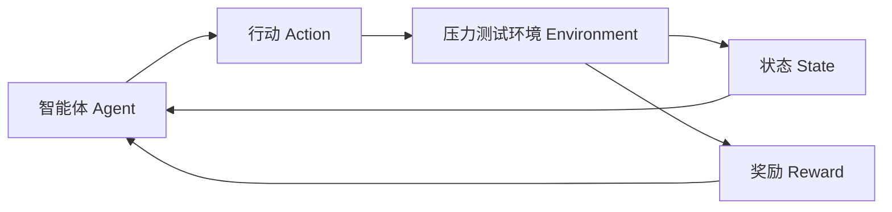

# 强化学习：在压力测试中的应用

## 1. 背景介绍
### 1.1 问题的由来
在软件开发过程中，压力测试是一个非常重要但又容易被忽视的环节。压力测试旨在通过模拟大量并发用户或高强度的请求来评估系统在极端条件下的性能表现。传统的压力测试方法往往依赖于人工设计测试用例和场景，不仅耗时耗力，而且难以覆盖所有可能的极端情况。因此，亟需一种智能化的压力测试方法来提高测试效率和效果。

### 1.2 研究现状
近年来，人工智能技术在软件测试领域得到了广泛应用，其中强化学习以其智能性和自适应性而备受关注。一些研究者尝试将强化学习应用于压力测试，通过智能体自主学习和探索来自动生成高质量的压力测试用例。例如，Zheng等人提出了一种基于深度强化学习的Web应用压力测试方法，通过训练智能体来自动生成高覆盖率和高效率的测试用例[1]。Gu等人提出了一种结合遗传算法和Q-learning的混合方法，用于自动生成针对性强的压力测试数据[2]。

### 1.3 研究意义
将强化学习应用于压力测试具有重要的研究意义：
1. 提高压力测试的智能化水平，减少人工干预，提升测试效率。  
2. 通过持续学习和优化，自动探索出更多有价值的极端测试场景，提高压力测试的覆盖率。
3. 在复杂系统和海量数据场景下，强化学习能够展现出色的性能，为压力测试提供新的思路和方法。

### 1.4 本文结构
本文将重点介绍强化学习在压力测试中的应用。第2节介绍压力测试和强化学习的核心概念和二者之间的联系。第3节重点阐述将强化学习应用于压力测试的核心算法原理和具体操作步骤。第4节给出算法涉及的数学模型和公式，并通过案例进行详细讲解。第5节提供一个基于强化学习的压力测试代码实例，并进行详细的解释说明。第6节分析强化学习在压力测试实际应用场景中的价值。第7节推荐相关的学习资源、开发工具和参考文献。第8节对全文进行总结，并展望强化学习在压力测试中的未来发展趋势和面临的挑战。

## 2. 核心概念与联系
- 压力测试：通过模拟大量用户并发或高强度请求等极端条件，来评估被测系统的性能、可靠性和稳定性的一种测试方法。其目的是发现系统在高负载下可能出现的各种问题，如响应时间变长、系统崩溃、资源耗尽等。

- 强化学习：一种重要的机器学习范式，旨在通过智能体（Agent）与环境（Environment）的交互，使智能体学会采取最优的行动策略（Policy），以最大化累积奖励（Reward）。智能体通过不断尝试、观察环境反馈（State）、获得奖励，并调整行动策略，最终学习到最优策略。

- 强化学习与压力测试的联系：将压力测试看作一个强化学习问题，可以通过设计合适的环境状态、行动空间和奖励函数，让智能体学习生成高质量的压力测试用例。智能体的行动可以是各种压力测试参数的组合，如并发用户数、请求频率等；环境状态可以是被测系统的各种性能指标，如响应时间、CPU占用率等；奖励函数可以根据测试目标来设计，如发现的缺陷数量、覆盖率提升等。通过智能体的自主学习，可以自动探索出有价值的压力测试场景，并不断优化测试效果。

下图展示了强化学习在压力测试中的应用流程：

## 3. 核心算法原理 & 具体操作步骤
### 3.1 算法原理概述
将强化学习应用于压力测试的核心算法主要有以下几类：
1. 基于值函数（Value-Based）的方法，如Q-Learning、Sarsa等，通过学习状态-动作值函数，来选择最优动作。
2. 基于策略梯度（Policy Gradient）的方法，如REINFORCE、Actor-Critic等，通过参数化策略函数，并通过梯度上升等方法来直接优化策略。 
3. 基于模型（Model-Based）的方法，如Dyna-Q、PILCO等，通过学习环境模型，利用规划来选择动作。
4. 结合其他优化方法的混合方法，如遗传算法+强化学习、蚁群算法+强化学习等。

本文重点介绍基于Q-Learning的压力测试算法，其核心思想是：通过不断尝试不同的测试动作（如调整并发用户数、请求频率等），观察环境反馈（如响应时间、错误率等），获得即时奖励，并更新Q值表，最终学习到最优的测试策略。

### 3.2 算法步骤详解
基于Q-Learning的压力测试算法步骤如下：

输入：
- S: 压力测试环境状态集合，如不同时间段、不同负载水平等
- A: 压力测试动作集合，如不同的并发用户数、请求频率等
- R: 奖励函数，根据测试结果（如响应时间、错误率、缺陷数等）给出即时奖励
- α: 学习率，控制Q值更新的幅度
- γ: 折扣因子，权衡即时奖励和未来奖励的重要性
- ε: ε-贪婪策略的参数，控制探索和利用的平衡

算法流程：
1. 初始化Q值表Q(s,a)，对所有状态-动作对初始化为0
2. 重复以下步骤，直到满足终止条件（如达到最大迭代次数、Q值收敛等）：
   1. 根据ε-贪婪策略选择一个动作a，即以ε的概率随机选择，以1-ε的概率选择Q值最大的动作
   2. 执行动作a，得到即时奖励r和下一个状态s'
   3. 更新Q值：$Q(s,a) \leftarrow Q(s,a) + \alpha[r + \gamma \max_{a'}Q(s',a') - Q(s,a)]$
   4. 将当前状态s更新为s'
3. 返回最终学习到的Q值表和最优策略π*(s)=argmax_a Q(s,a)

### 3.3 算法优缺点
优点：
1. 通过不断学习和优化，能够自动探索出高质量的压力测试用例，提高测试覆盖率。
2. 能够适应不同的被测系统和测试需求，具有较强的通用性和灵活性。
3. 相比传统的压力测试方法，大大减少了人工成本，提高了测试效率。

缺点：
1. 需要合理设计状态空间、动作空间和奖励函数，对领域知识和经验有一定要求。
2. 训练过程可能需要较长时间和大量数据，对计算资源有一定需求。
3. 训练得到的策略可能难以完全迁移到实际系统中，需要进一步的调优和验证。

### 3.4 算法应用领域
强化学习在压力测试中的应用主要集中在以下领域：
1. Web应用压力测试：通过智能体自动生成各种压力测试场景，如模拟大量用户并发访问、频繁刷新、提交表单等，来测试Web应用的性能和稳定性。
2. 数据库压力测试：通过智能体自动生成各种数据库操作，如大量插入、查询、更新等，来测试数据库的并发性能和容错能力。
3. 分布式系统压力测试：通过智能体模拟各种网络异常、节点失效等极端情况，来测试分布式系统的可用性和容灾能力。
4. 移动应用压力测试：通过智能体模拟大量用户并发使用移动App的各种功能，来测试移动应用的性能和兼容性。

## 4. 数学模型和公式 & 详细讲解 & 举例说明
### 4.1 数学模型构建
强化学习可以用马尔可夫决策过程（Markov Decision Process, MDP）来建模，一个MDP由以下元素组成：
- S：有限状态集合
- A：有限动作集合 
- P：状态转移概率矩阵，$P(s'|s,a)$表示在状态s下执行动作a后转移到状态s'的概率
- R：奖励函数，$R(s,a)$表示在状态s下执行动作a获得的即时奖励
- γ：折扣因子，$\gamma \in [0,1]$，表示未来奖励的重要程度

在压力测试场景下，可以将MDP的元素映射如下：
- S：压力测试的各种环境状态，如服务器负载水平、网络延迟、并发用户数等
- A：压力测试的各种动作，如调整并发用户数、请求频率、数据量等
- P：状态转移概率，可以通过历史数据或专家经验估计
- R：压力测试的评估指标，如响应时间、错误率、资源利用率等，需要设计合理的奖励函数
- γ：折扣因子，根据测试需求和经验设置，权衡短期和长期收益

### 4.2 公式推导过程
Q-Learning的核心是学习一个最优的状态-动作值函数Q*(s,a)，它表示在状态s下执行动作a并且此后都遵循最优策略能够获得的期望累积奖励。最优Q函数满足Bellman最优方程：

$$Q^*(s,a) = R(s,a) + \gamma \sum_{s' \in S}P(s'|s,a) \max_{a'}Q^*(s',a')$$

Q-Learning通过以下迭代更新规则来逼近最优Q函数：

$$Q(s,a) \leftarrow Q(s,a) + \alpha[r + \gamma \max_{a'}Q(s',a') - Q(s,a)]$$

其中，$\alpha \in (0,1]$是学习率，控制每次更新的幅度；r是执行动作a后获得的即时奖励；$\max_{a'}Q(s',a')$是下一个状态s'下的最大Q值，代表了遵循当前策略能获得的最大期望累积奖励。

通过不断迭代更新Q值，Q-Learning最终收敛到最优Q函数，从而得到最优策略π*：

$$\pi^*(s) = \arg\max_{a}Q^*(s,a)$$

即在每个状态下选择Q值最大的动作作为最优动作。

### 4.3 案例分析与讲解
下面通过一个简单的案例来说明如何使用Q-Learning进行压力测试：

假设我们要对一个Web应用进行压力测试，测试目标是在保证响应时间不超过1秒的情况下，找出最大的并发用户数。为简化问题，我们假设只有3个测试动作：低并发（100用户）、中并发（500用户）、高并发（1000用户），以及3个测试状态：空闲（平均响应时间<0.5s）、正常（0.5s≤平均响应时间<1s）、繁忙（平均响应时间≥1s）。

我们设计奖励函数如下：如果在空闲或正常状态下执行高并发动作，奖励为1；如果在繁忙状态下执行高并发动作，奖励为-1；其他情况下奖励为0。这样可以引导智能体尽可能执行高并发动作，但又不会导致系统过载。

接下来，我们使用Q-Learning算法进行训练，假设学习率α=0.1，折扣因子γ=0.9，初始Q值都为0。我们模拟智能体与环境交互的过程，每次随机选择一个动作，观察环境反馈，并更新Q值，重复1000次。

假设在第100次交互时，智能体当前处于正常状态，选择了高并发动作，执行后环境仍处于正常状态，获得奖励1。则Q值更新如下：

$$Q(正常,高并发) \leftarrow Q(正常,高并发) + 0.1[1 + 0.9 \max_{a'}Q(正常,a') - Q