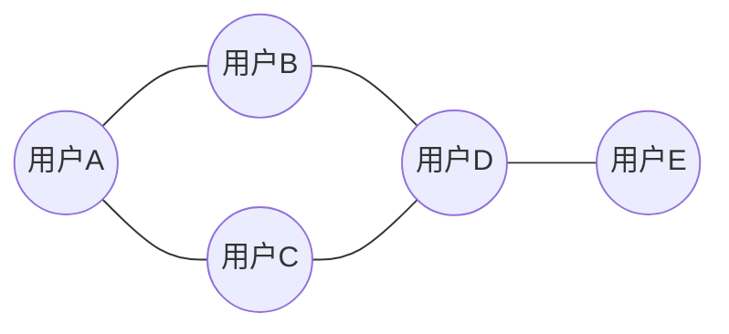

# 影响力分析与社会网络：AI代理的工作流研究

关键词：影响力分析、社会网络、AI代理、工作流、图神经网络、网络嵌入、图卷积网络、信息传播

## 1. 背景介绍
### 1.1  问题的由来
在当今数字时代，社交网络已经成为人们生活中不可或缺的一部分。随着社交平台的快速发展，海量的用户生成内容和复杂的用户交互为研究人员提供了前所未有的机会，来深入理解社会动态和人类行为。其中，影响力分析是社会网络分析中的一个关键问题，旨在识别网络中的关键节点，这些节点在信息传播和社会互动中扮演着重要角色。

### 1.2  研究现状
目前，影响力分析的研究主要集中在以下几个方面：
1. 基于中心性的方法：通过计算节点的度中心性、介数中心性、接近中心性等指标来衡量其影响力。
2. 基于随机游走的方法：通过模拟信息在网络中的传播过程，如PageRank和HITS算法，来评估节点的重要性。
3. 基于机器学习的方法：利用节点特征和网络结构信息，训练分类器或回归模型来预测节点的影响力。

然而，现有的方法仍然存在一些局限性，如忽略了网络的动态演化、未充分利用节点内容信息等。

### 1.3  研究意义
影响力分析在许多领域都有着广泛的应用，如病毒式营销、社会动员、舆情分析等。通过识别具有高影响力的个体，可以更有效地传播信息、引导公众舆论和优化资源分配。此外，影响力分析还可以帮助我们深入理解社会网络的结构和动力学，为社会学、心理学和人类行为研究提供新的视角。

### 1.4  本文结构
本文将从以下几个方面展开论述：
1. 介绍影响力分析和社会网络的核心概念与联系。 
2. 详细阐述基于图神经网络的影响力分析算法原理和操作步骤。
3. 构建影响力分析的数学模型，并给出公式推导和案例分析。
4. 提供基于Python的代码实例，并对其进行详细解释说明。
5. 探讨影响力分析在实际应用场景中的价值和未来展望。
6. 推荐相关的工具、资源和文献，供读者进一步学习和研究。
7. 总结全文，并对影响力分析的未来发展趋势和面临的挑战进行展望。

## 2. 核心概念与联系
在开始详细探讨影响力分析算法之前，我们首先需要了解一些核心概念：

- 社会网络：由个体（节点）和他们之间的关系（边）组成的复杂网络结构。
- 影响力：个体在网络中影响其他个体行为、决策或意见的能力。
- 节点中心性：衡量节点在网络中的重要性或影响力的指标，如度中心性、介数中心性等。
- 信息传播：信息或影响力在社会网络中从一个节点到另一个节点的传递过程。
- 图神经网络：一类专门用于处理图结构数据的深度学习模型，可以有效地学习节点的表示和预测其属性。

影响力分析与社会网络密切相关，其核心目标是通过分析网络结构和节点属性，识别出网络中具有高影响力的关键节点。这些关键节点在信息传播和社会互动中扮演着重要角色，对网络的演化和功能产生重大影响。

传统的影响力分析方法主要基于节点中心性指标，如度中心性（节点的连接数）和介数中心性（节点在最短路径上出现的频率）。然而，这些方法忽略了网络的动态演化和节点内容信息，难以捕捉复杂的影响力模式。

近年来，图神经网络的兴起为影响力分析提供了新的思路。通过将社会网络建模为图结构，并利用图神经网络对节点进行表示学习，我们可以更好地融合网络结构和节点属性信息，从而更准确地预测节点的影响力。同时，图神经网络还可以处理动态演化的网络，捕捉影响力的时间变化模式。

下面，我们将详细介绍基于图神经网络的影响力分析算法原理和操作步骤。

## 3. 核心算法原理 & 具体操作步骤
### 3.1  算法原理概述
本文提出的影响力分析算法基于图神经网络（Graph Neural Network，GNN），旨在学习节点的低维表示，并根据这些表示预测节点的影响力。算法的核心思想是将社会网络建模为一个图，其中节点表示个体，边表示个体之间的关系。通过在图上应用卷积操作，GNN可以聚合节点的局部邻域信息，学习节点的表示向量。这些表示向量不仅编码了节点自身的属性，还包含了节点在网络中的结构角色。

### 3.2  算法步骤详解
影响力分析算法的具体步骤如下：

1. 数据准备
   - 收集社会网络数据，包括节点属性（如用户档案）和边信息（如用户交互）。
   - 将数据转化为图的表示形式，如邻接矩阵或邻接列表。

2. 图神经网络构建
   - 选择合适的图神经网络架构，如图卷积网络（Graph Convolutional Network，GCN）或图注意力网络（Graph Attention Network，GAT）。
   - 根据任务需求设计网络的层数、隐藏单元数和激活函数等超参数。

3. 节点表示学习
   - 将图输入到图神经网络中，通过前向传播计算节点的隐藏表示。
   - 在每一层中，节点的表示通过聚合其邻居节点的信息并应用非线性变换来更新。
   - 重复多次迭代，直到获得节点的最终表示向量。

4. 影响力预测
   - 将节点的表示向量输入到全连接层或其他预测器中，生成节点的影响力分数。
   - 根据影响力分数对节点进行排序，识别出具有高影响力的关键节点。

5. 模型训练与评估
   - 使用带标签的数据（如已知的影响力节点）对模型进行监督学习，优化模型参数以最小化预测损失。
   - 在测试集上评估模型的性能，如准确率、召回率、F1分数等。

6. 结果分析与应用
   - 对识别出的高影响力节点进行分析，解释其在网络中的作用和影响。
   - 将结果应用于实际场景，如病毒式营销、社会动员等。

### 3.3  算法优缺点
优点：
- 能够有效融合网络结构和节点属性信息，提高影响力预测的准确性。
- 可以处理大规模和动态演化的网络，具有良好的可扩展性。
- 学习到的节点表示可以用于其他下游任务，如节点分类、链接预测等。

缺点：
- 需要大量带标签的数据进行监督学习，标注成本较高。
- 模型的解释性相对较弱，难以直观地理解节点表示的含义。
- 对网络结构和节点属性的变化敏感，需要定期重新训练模型。

### 3.4  算法应用领域
影响力分析算法可以应用于多个领域，包括：
- 社交媒体分析：识别社交网络中的意见领袖和关键用户，了解信息传播模式。
- 病毒式营销：选择最具影响力的节点作为种子用户，最大化产品或服务的曝光和采用。
- 社会动员：发现社会运动或群体行为中的关键个体，优化资源分配和动员策略。
- 学术影响力评估：分析学术合作网络，识别高影响力的研究者和机构。
- 金融风险分析：在金融交易网络中识别关键节点，评估系统性风险和传染效应。

## 4. 数学模型和公式 & 详细讲解 & 举例说明
### 4.1  数学模型构建
我们使用图卷积网络（GCN）作为影响力分析的数学模型。GCN通过在图结构上应用卷积操作，学习节点的表示向量。

设 $G=(V,E)$ 为一个无向图，其中 $V$ 是节点集合，$E$ 是边集合。$A \in \mathbb{R}^{N \times N}$ 是图的邻接矩阵，$N=|V|$ 是节点数。$X \in \mathbb{R}^{N \times F}$ 是节点特征矩阵，$F$ 是特征维度。

GCN的每一层可以表示为：

$$
H^{(l+1)} = \sigma(\tilde{D}^{-\frac{1}{2}} \tilde{A} \tilde{D}^{-\frac{1}{2}} H^{(l)} W^{(l)})
$$

其中，$H^{(l)} \in \mathbb{R}^{N \times D}$ 是第 $l$ 层的节点表示矩阵，$D$ 是隐藏层维度。$\tilde{A}=A+I_N$ 是添加了自环的邻接矩阵，$I_N$ 是单位矩阵。$\tilde{D}$ 是 $\tilde{A}$ 的度矩阵，其中 $\tilde{D}_{ii} = \sum_j \tilde{A}_{ij}$。$W^{(l)}$ 是第 $l$ 层的权重矩阵，$\sigma$ 是激活函数（如ReLU）。

### 4.2  公式推导过程
GCN的核心思想是在图结构上应用卷积操作。传统的卷积神经网络在规则的网格结构（如图像）上进行卷积，而GCN将其扩展到不规则的图结构。

GCN的卷积操作可以分解为以下步骤：

1. 将节点特征矩阵 $X$ 与权重矩阵 $W$ 相乘，得到转换后的特征矩阵 $XW$。

2. 计算归一化的邻接矩阵 $\tilde{A}=\tilde{D}^{-\frac{1}{2}} \tilde{A} \tilde{D}^{-\frac{1}{2}}$。这一步的目的是对邻接矩阵进行归一化，使得每个节点的特征贡献平衡。

3. 将归一化的邻接矩阵 $\tilde{A}$ 与转换后的特征矩阵 $XW$ 相乘，得到聚合后的节点表示 $\tilde{A}XW$。这一步的目的是聚合每个节点的邻居信息，更新节点的表示。

4. 对聚合后的节点表示应用激活函数 $\sigma$，引入非线性变换，得到最终的节点表示 $H=\sigma(\tilde{A}XW)$。

通过多层GCN的堆叠，可以逐步聚合节点的多跳邻居信息，学习到更高级别的节点表示。

### 4.3  案例分析与讲解
我们以一个简单的社交网络为例，说明GCN在影响力分析中的应用。

考虑一个由5个用户组成的社交网络，如下图所示：

每个用户有两个属性：年龄和性别。我们将这些属性编码为节点特征矩阵 $X$：

$$
X = \begin{bmatrix}
25 & 0 \\
30 & 1 \\
35 & 0 \\
28 & 1 \\
40 & 0
\end{bmatrix}
$$

其中，第一列表示年龄，第二列表示性别（0为女性，1为男性）。

邻接矩阵 $A$ 表示用户之间的连接关系：

$$
A = \begin{bmatrix}
0 & 1 & 1 & 0 & 0 \\
1 & 0 & 0 & 1 & 0 \\
1 & 0 & 0 & 1 & 0 \\
0 & 1 & 1 & 0 & 1 \\
0 & 0 & 0 & 1 & 0
\end{bmatrix}
$$

我们使用一层GCN对节点进行表示学习。设隐藏层维度为2，