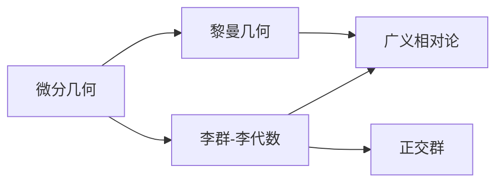

# 微分几何入门与广义相对论：O（m）群（正交群，orthogonal group）

关键词：微分几何、广义相对论、正交群、李群、李代数、黎曼几何、爱因斯坦场方程

## 1. 背景介绍
### 1.1  问题的由来
微分几何作为数学的一个分支，在物理学尤其是广义相对论中有着重要的应用。广义相对论是爱因斯坦在1915年提出的一种全新的时空理论，它利用黎曼几何来描述引力作用下的时空弯曲。而正交群O(m)作为最基本的李群之一，在微分几何和广义相对论的框架下有着特殊的地位和作用。

### 1.2  研究现状
目前，利用微分几何和李群、李代数的方法研究广义相对论已经成为了主流。人们利用这些数学工具，在广义相对论的框架下取得了许多重要成果，如黑洞的几何和热力学性质、引力波的产生和传播、宇宙学模型等。同时，将广义相对论与其他物理理论（如量子场论）结合，也是当前的一个研究热点。

### 1.3  研究意义
深入理解正交群在微分几何和广义相对论中的作用，对于我们更好地认识时空结构、引力本质有着重要意义。同时，这也为广义相对论的进一步发展和与其他物理理论的结合提供了数学基础。

### 1.4  本文结构
本文将首先介绍微分几何和广义相对论的一些核心概念，然后重点讨论正交群的定义、性质以及它与微分几何、黎曼几何之间的联系。接着，我们将给出正交群的一些重要性质的严格数学证明。在此基础上，讨论正交群以及它的李代数在广义相对论中的应用。最后，介绍一些与正交群、微分几何和广义相对论相关的学习资源和研究方向。

## 2. 核心概念与联系
微分几何是利用微积分、线性代数等工具研究曲线、曲面乃至更一般的流形的几何性质的数学分支。黎曼几何是微分几何的一个重要分支，它主要研究黎曼流形的性质。黎曼流形是一类带有黎曼度量的光滑流形，能够定义曲率等几何量。广义相对论正是利用黎曼几何来描述时空的几何性质的。

群论是数学的另一个重要分支，它主要研究群的性质。群是一种集合加上一种二元运算的代数结构，这个运算满足一些特定的性质（如结合律）。李群是一类特殊的群，它还额外带有光滑流形的结构，即群元素之间的乘法运算是光滑的。李代数是与李群相关联的一种代数结构，它可以看作是李群的"无穷小"或"局部"版本。

正交群O(m)是欧几里得空间中保持原点不动且保持距离不变的全体线性变换构成的群，它是一个最基本的李群。从几何直观上看，正交变换包括旋转和镜面反射。正交群以及它的李代数在微分几何和广义相对论中有着广泛应用，如描述时空的对称性、构建规范场论等。

## 3. 核心算法原理 & 具体操作步骤
### 3.1  算法原理概述
正交群O(m)作为一个矩阵李群，它的很多性质都可以通过矩阵的语言来刻画。比如正交阵的定义、正交群的生成元、李代数的矩阵表示等。同时，在微分几何中，我们也需要利用正交群的性质来研究流形的几何性质，如切丛、联络、曲率等概念都与正交群有着密切联系。

### 3.2  算法步骤详解
1. 给定m维欧式空间 $\mathbb{R}^m$，定义一个黎曼度量 $g$。
2. 考虑 $\mathbb{R}^m$ 上的一个正交基 $\{e_i\}$，定义矩阵 $A=(a_ij)$，其中 $a_ij=\langle e_i,e_j \rangle$。
3. 正交群 $O(m)$ 定义为所有满足 $A^TA=AA^T=I$ 的实 $m\times m$ 矩阵 $A$ 全体，其中 $A^T$ 表示 $A$ 的转置，$I$ 为单位矩阵。
4. $O(m)$ 的单位元为单位矩阵 $I$，逆元为转置矩阵 $A^{-1}=A^T$。
5. 对任意两个矩阵 $A,B\in O(m)$，它们的乘积 $AB$ 也属于 $O(m)$，且满足结合律。从而 $O(m)$ 在矩阵乘法运算下构成一个群。
6. $O(m)$ 的生成元为基本旋转矩阵和反射矩阵。$m$ 维空间中的基本旋转矩阵为
$$
R_{ij}(\theta)=\begin{pmatrix}
1 & \cdots & 0 & \cdots & 0 & \cdots & 0\\
\vdots & \ddots & \vdots & \vdots & \vdots & \vdots & \vdots\\
0 & \cdots & \cos\theta & \cdots & -\sin\theta & \cdots & 0\\
\vdots & \vdots & \vdots & \ddots & \vdots & \vdots & \vdots\\
0 & \cdots & \sin\theta & \cdots & \cos\theta & \cdots & 0\\
\vdots & \vdots & \vdots & \vdots & \vdots & \ddots & \vdots\\
0 & \cdots & 0 & \cdots & 0 & \cdots & 1
\end{pmatrix}
$$
其中 $\theta$ 为旋转角，$R_{ij}$ 表示在 $e_i,e_j$ 平面内旋转。而基本反射矩阵为
$$
S_i=\begin{pmatrix}
1 & \cdots & 0 & \cdots & 0\\
\vdots & \ddots & \vdots & \vdots & \vdots\\
0 & \cdots & -1 & \cdots & 0\\
\vdots & \vdots & \vdots & \ddots & \vdots\\
0 & \cdots & 0 & \cdots & 1
\end{pmatrix}
$$
表示将 $e_i$ 方向反射。

7. $O(m)$ 也可以看作流形，它的切空间可以用反对称矩阵来刻画。$O(m)$ 的李代数 $\mathfrak{o}(m)$ 定义为所有 $m\times m$ 反对称矩阵 $X$ 全体，满足 $X^T=-X$。
8. $\mathfrak{o}(m)$ 上可以定义一个 Lie bracket 运算 $[X,Y]=XY-YX$，使其构成一个李代数。它满足反对称性和雅可比等式。
9. 指数映射 $\exp:\mathfrak{o}(m)\to O(m)$ 将李代数映射到李群，具体为 $\exp(X)=\sum_{k=0}^\infty \frac{1}{k!}X^k$。

### 3.3  算法优缺点
利用正交群及其李代数的性质，我们能够比较系统地研究各种几何对象，如黎曼度量、联络、曲率等。特别地，在广义相对论中，我们可以用正交群描述时空的对称性。正交群的优点是概念清晰，计算也比较简单。但是它的缺点是只能描述欧式空间和黎曼流形的情形，对于更一般的流形，需要引入更高级的李群，如酉群、辛群等。

### 3.4  算法应用领域
正交群广泛应用于微分几何、广义相对论、规范场论等领域。比如在广义相对论中，我们利用正交群来描述时空的各种对称性，如平移、转动、宇宙学原理等。在规范场论中，内禀对称性通常由规范群给出，它们往往也是某些正交群或酉群。另外，正交群在连续介质力学、机器人控制等工程领域也有应用。

## 4. 数学模型和公式 & 详细讲解 & 举例说明
### 4.1  数学模型构建
我们考虑 $m$ 维欧式空间 $\mathbb{R}^m$，其上有一个标准内积 $\langle\cdot,\cdot\rangle$。正交群 $O(m)$ 的作用就是保持这个内积不变。具体地，对任意 $A\in O(m)$ 和 $u,v\in\mathbb{R}^m$，都有
$$\langle Au,Av\rangle=\langle u,v\rangle$$

从矩阵的角度来看，这等价于 $A^TA=AA^T=I$。因此，$O(m)$ 可以定义为
$$O(m)=\{A\in GL(m,\mathbb{R})|A^TA=AA^T=I\}$$
其中 $GL(m,\mathbb{R})$ 表示所有 $m$ 阶可逆实矩阵构成的一般线性群。

$O(m)$ 的单位元为单位矩阵 $I$，逆元为转置矩阵 $A^{-1}=A^T$。群乘法为矩阵乘法，满足结合律。因此 $O(m)$ 构成一个群。进一步，矩阵乘法和取逆运算都是光滑的，因此 $O(m)$ 还是一个李群，它的维数为 $\frac{m(m-1)}{2}$。

$O(m)$ 的李代数 $\mathfrak{o}(m)$ 定义为所有 $m\times m$ 反对称矩阵 $X$ 全体，满足 $X^T=-X$。它的维数也为 $\frac{m(m-1)}{2}$。$\mathfrak{o}(m)$ 上的 Lie bracket 运算定义为
$$[X,Y]=XY-YX$$
容易验证它满足反对称性和雅可比等式。

指数映射 $\exp:\mathfrak{o}(m)\to O(m)$ 将李代数映射到李群，具体为 
$$\exp(X)=\sum_{k=0}^\infty \frac{1}{k!}X^k$$
它满足一些重要性质，如 $\exp(sX)\exp(tX)=\exp((s+t)X),\forall s,t\in\mathbb{R}$。

### 4.2  公式推导过程
下面我们来推导一些正交群的重要性质。

**性质1：** 正交群是紧致的。

**证明：** 我们知道，$m$ 阶矩阵全体 $M(m,\mathbb{R})$ 是一个 $m^2$ 维欧式空间，其中矩阵 $A=(a_{ij}),B=(b_{ij})$ 之间的距离定义为
$$d(A,B)=\sqrt{\sum_{i,j=1}^m(a_{ij}-b_{ij})^2}$$
在此度量下，$O(m)$ 显然是 $M(m,\mathbb{R})$ 中的一个闭子集，因为矩阵元素满足方程 $A^TA=I$ 的解集是闭的。另一方面，$O(m)$ 也是有界的，因为对任意 $A\in O(m)$，有
$$\sum_{i,j=1}^ma_{ij}^2=\text{tr}(A^TA)=\text{tr}(I)=m$$
因此 $|a_{ij}|\leq\sqrt{m},\forall i,j$。由 Heine-Borel 定理知，$M(m,\mathbb{R})$ 中的有界闭集必紧致，因此 $O(m)$ 是紧致的。$\square$

**性质2：** $SO(m)$ 的基本群为 $\mathbb{Z}_2$。

**证明：** 特殊正交群 $SO(m)$ 定义为 $O(m)$ 中行列式为1的矩阵全体，即
$$SO(m)=\{A\in O(m)|\det(A)=1\}$$
容易验证，$SO(m)$ 是 $O(m)$ 的子群，并且是联通的。事实上，任意 $A\in SO(m)$ 都可以对角化为
$$A=Q\begin{pmatrix}
R_1 & & \\
& \ddots & \\
& & R_k
\end{pmatrix}Q^{-1}$$
其中 $Q\in SO(m)$，$R_i$ 为 $2