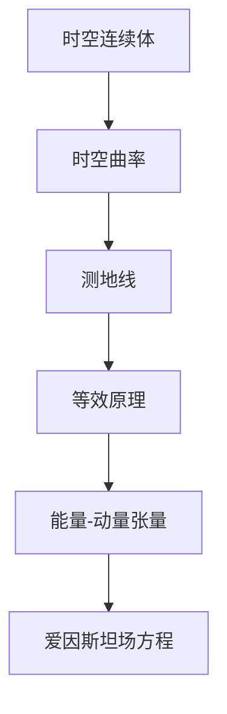

# 微分几何入门与广义相对论：广义相对论的经典实验验证

## 1. 背景介绍

### 1.1 问题的由来

广义相对论是20世纪最伟大的理论之一,它彻底改变了我们对时空和引力的认知。爱因斯坦在1915年完成了这一革命性理论的建立,并在随后的几十年中不断发展和完善。尽管广义相对论的数学基础非常抽象和复杂,但它对宇宙的描述却十分简单和优雅。

广义相对论认为,物质决定了时空的曲率,而时空的曲率又决定了物质的运动。这种时空和物质的相互作用,打破了牛顿经典力学中时空是绝对的观念。爱因斯坦的理论预言了许多前所未有的现象,如黑洞、重力波、时空扭曲等,这些都与我们的日常经验相去甚远。

然而,任何新理论的确立,都需要经过大量的实验检验。广义相对论在提出之初,就面临着严峻的实验考验。如果实验与理论的预言不符,这个理论就将被抛弃。因此,对广义相对论进行经典实验验证,是检验这一革命性理论正确性的关键一步。

### 1.2 研究现状

自从广义相对论问世以来,科学家们就不遗余力地对其进行了大量的实验检验。到目前为止,广义相对论已经通过了各种精密实验的考验,其预言也被一一证实,从而进一步巩固了这个理论在物理学中的核心地位。

一些经典实验包括:

- 水星周转历偏移实验
- 光线弯曲实验 
- 重力红移实验
- 伦敦-华盛顿同步时钟实验
- 双星系统实验
- 引力波直接探测实验

这些实验从不同角度验证了广义相对论关于时空弯曲、引力等方面的预言,为这一理论的正确性提供了有力的实验依据。

### 1.3 研究意义  

对广义相对论的经典实验进行深入研究,具有重要的理论意义和应用价值:

1. **理论意义**:系统梳理和总结这些实验,有助于更好地理解广义相对论的内在本质,把握其核心思想,推进对时空本质的认识。
2. **技术推动**:这些实验中所使用的先进技术手段,如激光、原子钟等,推动了相关领域的技术进步。
3. **应用价值**:广义相对论的应用已延伸到航天、导航、通信等诸多领域,理解其实验基础有助于更好地应用这一理论。
4. **未来发展**:随着实验手段的不断改进,对这些经典实验的深入研究,将为未来更精密的实验检验奠定基础。

总之,对广义相对论经典实验的深入剖析,不仅能够增进我们对这一伟大理论的认识,也将为其未来发展和应用提供有力支撑。

### 1.4 本文结构

本文将系统介绍广义相对论的几个经典实验,重点包括:

1. 实验背景和原理
2. 实验设计和关键技术 
3. 实验数据分析
4. 实验结果及其意义
5. 存在的问题和发展方向

在此基础上,我们将对这些实验的理论意义、技术贡献和未来展望进行全面评述。

## 2. 核心概念与联系

广义相对论的核心概念主要包括:

1. **时空连续体**
2. **时空曲率**
3. **测地线**
4. **等效原理**
5. **能量-动量张量**
6. **爱因斯坦场方程**

这些概念之间存在内在的逻辑联系,构成了广义相对论的理论框架。

1. **时空连续体**:广义相对论将时空看作一个四维连续多样体,打破了经典力学中时空分离的观念。
2. **时空曲率**:物质的存在使时空产生曲率,曲率的分布由物质的能量-动量分布决定。
3. **测地线**:自由运动的物体沿着时空中的测地线(最短路径)运动。
4. **等效原理**:重力场等同于加速系,将引力问题转化为研究加速系的问题。
5. **能量-动量张量**:描述物质的能量-动量分布,是场方程的源项。
6. **爱因斯坦场方程**:将时空曲率与物质的能量-动量分布联系起来的核心方程。

这些概念相互关联、相辅相成,共同构建了广义相对论的理论体系。理解它们及其内在联系,是掌握广义相对论本质的关键。

## 3. 核心算法原理与具体操作步骤

### 3.1 算法原理概述

广义相对论的核心是**爱因斯坦场方程**,它将时空曲率与物质的能量-动量分布联系起来。这个方程的具体形式为:

$$
R_{\mu\nu} - \frac{1}{2}g_{\mu\nu}R = \frac{8\pi G}{c^4}T_{\mu\nu}
$$

其中:

- $R_{\mu\nu}$ 是**里奇张量**(Ricci Tensor),描述时空的曲率
- $R$ 是**标量曲率**(Ricci Scalar),等于里奇张量的迹
- $g_{\mu\nu}$ 是**度规张量**(Metric Tensor),描述时空的度规关系
- $T_{\mu\nu}$ 是**能量-动量张量**(Energy-Momentum Tensor),描述物质的能量-动量分布
- $G$ 是**万有引力常数**
- $c$ 是**光速**

这个方程揭示了时空曲率与物质能量-动量分布之间的内在关联,是广义相对论的数学核心。

### 3.2 算法步骤详解

要解析广义相对论的问题,需要按照如下步骤:

1. **建立度规张量**
   
   首先需要根据具体问题的对称性,建立描述时空度规关系的度规张量 $g_{\mu\nu}$。

2. **计算曲率张量**

   利用度规张量,计算描述时空曲率的**里奇曲率张量** $R_{\mu\nu\rho\sigma}$。

3. **求解里奇张量**

   从里奇曲率张量中,可以进一步求解描述时空曲率的**里奇张量** $R_{\mu\nu}$ 和**标量曲率** $R$。

4. **确定能量-动量张量**

   根据问题中物质的具体分布,确定描述其能量-动量分布的**能量-动量张量** $T_{\mu\nu}$。

5. **解场方程**

   将上述张量代入爱因斯坦场方程,并结合具体边界条件,求解该方程,从而获得描述时空几何的度规张量解。

6. **分析运动方程**

   利用解得的度规张量,可以进一步分析物体在该时空背景下的运动,如测地线方程等。

这一系列步骤,将广义相对论的数学形式表述转化为具体的物理问题求解过程。掌握这一核心算法,是分析和求解广义相对论问题的基础。

### 3.3 算法优缺点

**优点**:

1. 简洁优雅,利用张量方程统一描述时空和物质
2. 具有很强的普适性,可应用于各种对称性情况
3. 为解决复杂的时空问题提供了有效的数学工具

**缺点**:

1. 数学形式抽象,需要扎实的微分几何基础
2. 解析解往往难以获得,需要数值计算
3. 在极端条件下可能失去适用性,需要量子修正

总的来说,尽管广义相对论的数学形式复杂,但其核心算法思想简洁而有力,为解决时空引力问题提供了行之有效的理论框架。

### 3.4 算法应用领域

广义相对论的核心算法在诸多领域有着广泛的应用:

1. **天体物理学**:解释天体运动、黑洞、引力透镜等天文现象
2. **宇宙学**:描述宇宙的起源、演化和未来命运
3. **实验物理学**:引力波探测、高精度时间测量等
4. **理论物理学**:构建更高层次的统一理论
5. **航天技术**:卫星导航、轨道设计等
6. **应用数学**:提供求解复杂几何问题的工具

总之,广义相对论的核心算法贯穿于从微观到宏观的诸多领域,是现代物理学和应用数学中不可或缺的重要工具。掌握这一算法思想,对于从事相关研究工作至关重要。

## 4. 数学模型和公式详细讲解与举例说明

### 4.1 数学模型构建

为了描述广义相对论的理论框架,我们需要建立一套精确的数学模型。这个模型的基础是**流形**和**张量**的概念。

**流形**是广义相对论的基本时空模型。它是一个四维连续多样体,每一点都由四个坐标 $(t, x, y, z)$ 来标记。这种四维时空连续体打破了经典力学中时空分离的观念。

在这个流形上,我们需要定义**度规张量** $g_{\mu\nu}$ 来描述时空的度规关系。度规张量是一个二阶张量场,它决定了时空中两个无穷接近点之间的距离关系。

此外,我们还需要引入其他一些张量量来描述时空的几何性质和物质的分布。比如:

- **里奇张量** $R_{\mu\nu}$: 描述时空曲率
- **能量-动量张量** $T_{\mu\nu}$: 描述物质的能量-动量分布

利用这些张量量,我们可以建立广义相对论的核心方程——**爱因斯坦场方程**:

$$
R_{\mu\nu} - \frac{1}{2}g_{\mu\nu}R = \frac{8\pi G}{c^4}T_{\mu\nu}
$$

这个方程将时空的几何性质(曲率)与物质的能量-动量分布联系起来,是广义相对论的数学核心。

通过解这个方程,我们可以获得描述时空几何的度规张量解,进而分析物体在该时空背景下的运动规律。

### 4.2 公式推导过程

为了更好地理解爱因斯坦场方程的来源,让我们简要推导一下这个方程。

我们从**等效原理**出发。等效原理认为,重力场等同于加速系。因此,我们可以将研究重力场的问题,转化为研究加速系的问题。

在加速系中,我们知道能量-动量守恒定律应该修正为:

$$
\frac{d}{d\tau}\left(\frac{\partial\mathcal{L}}{\partial\dot{x}^\mu}\right) - \frac{\partial\mathcal{L}}{\partial x^\mu} = 0
$$

其中 $\mathcal{L}$ 是广义相对论中的广义拉格朗日量,包含了时空度规的贡献。

利用最小曲率原理,我们可以推导出描述自由粒子在曲率时空中运动的**测地线方程**:

$$
\frac{d^2x^\mu}{d\tau^2} + \Gamma^\mu_{\alpha\beta}\frac{dx^\alpha}{d\tau}\frac{dx^\beta}{d\tau} = 0
$$

这里 $\Gamma^\mu_{\alpha\beta}$ 是**切曲线系数**,由度规张量 $g_{\mu\nu}$ 决定。

为了将这个方程推广到任意物质场,我们需要引入**能量-动量张量** $T^{\mu\nu}$。通过变分原理,我们可以得到:

$$
\nabla_\nu T^{\mu\nu} = 0
$$

这就是广义相对论中的**能量-动量张量守恒定律**。

最后,通过一系列复杂的数学推导,我们可以将上述方程统一为**爱因斯坦场方程**的张量形式:

$$
R_{\mu\nu} - \frac{1}{2}g_{\mu\nu}R = \frac{8\pi G}{c^4}T_{\mu\nu}
$$

这个方程将时空的几何性质(曲率)与物质的