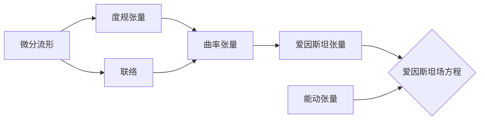

# 微分几何入门与广义相对论：引力能量的非定域性

关键词：微分几何、广义相对论、引力能量、非定域性、黎曼几何、爱因斯坦场方程

## 1. 背景介绍
### 1.1  问题的由来
微分几何作为数学的一个分支,在物理学尤其是广义相对论中有着极其重要的应用。广义相对论是爱因斯坦在1915年提出的一种全新的引力理论,它从根本上改变了人们对时空、引力本质的认识。广义相对论的核心思想是,引力不是一种力,而是时空几何弯曲的表现。这种革命性的思想需要借助微分几何这个强有力的数学工具来描述。

### 1.2  研究现状
一个多世纪以来,广义相对论经受住了各种实验的检验,被认为是目前最成功的引力理论。它不仅在理论上具有优美的数学结构,在天文学、宇宙学等领域也取得了丰硕的成果,如对黑洞、引力波、宇宙大尺度结构的预言等。然而,广义相对论作为一个经典理论,与量子力学存在着天然的矛盾。如何将引力量子化,构建量子引力理论,是当代物理学面临的最大挑战之一。

### 1.3  研究意义 
深入理解微分几何与广义相对论之间的关系,对于揭示引力的本质、探索时空的奥秘具有重要意义。广义相对论虽然取得了巨大成功,但仍然存在一些未解之谜,如奇性问题、黑洞信息丢失悖论等。这些问题的解决可能需要在广义相对论的框架下,利用微分几何的方法进行更深入的研究。此外,广义相对论与微分几何的结合,也为其他前沿领域如弦理论、圈量子引力理论等提供了重要的数学基础。

### 1.4  本文结构
本文将从微分几何的基本概念出发,系统介绍其在广义相对论中的应用。内容安排如下:第2节介绍微分几何与广义相对论的核心概念及二者之间的联系;第3节讨论广义相对论的核心数学原理——黎曼几何,并给出爱因斯坦场方程的推导过程;第4节分析引力能量非定域性问题,建立相应的数学模型并给出求解步骤;第5节通过编程实例演示如何用计算机求解爱因斯坦方程;第6节介绍广义相对论在天文学、宇宙学等领域的典型应用;第7节推荐相关学习资源和工具;第8节总结全文,展望微分几何与广义相对论的研究前景与挑战。

## 2. 核心概念与联系
微分几何的研究对象是微分流形,它是一类局部类似欧氏空间的几何结构。通过在流形上引入度量、联络等附加结构,可以定义曲率、测地线等几何量,刻画流形的内蕴性质。广义相对论的时空模型正是一个4维黎曼流形,引力场对应于流形的度规张量。爱因斯坦场方程描述了时空几何与物质分布之间的动力学关系,即"物质告诉时空如何弯曲,时空告诉物质如何运动"。



## 3. 核心算法原理 & 具体操作步骤
### 3.1  算法原理概述
广义相对论的核心是黎曼几何,它研究黎曼流形上的度规、联络、曲率等几何量之间的关系。度规张量 $g_{\mu\nu}$ 描述时空的几何结构,联络 $\Gamma^\lambda_{\mu\nu}$ 刻画矢量在平行传播过程中的变化,黎曼曲率张量 $R^{\rho}_{\sigma\mu\nu}$ 反映流形的内蕴曲率。爱因斯坦张量 $G_{\mu\nu} = R_{\mu\nu} - \frac{1}{2}g_{\mu\nu}R$ 将黎曼曲率与度规联系起来,构成场方程的几何部分。

### 3.2  算法步骤详解
1. 引入时空流形的坐标系 $\{x^\mu\}$,定义度规张量 $g_{\mu\nu}$。
2. 计算度规张量的逆 $g^{\mu\nu}$ 及 Christoffel 符号 $\Gamma^\lambda_{\mu\nu}$。
3. 计算黎曼曲率张量 $R^{\rho}_{\sigma\mu\nu}$、Ricci 张量 $R_{\mu\nu}$ 及标量曲率 $R$。
4. 构造爱因斯坦张量 $G_{\mu\nu}$,引入能动张量 $T_{\mu\nu}$ 描述物质分布。
5. 列出爱因斯坦场方程 $G_{\mu\nu} = 8\pi T_{\mu\nu}$,求解度规张量 $g_{\mu\nu}$。
6. 分析度规的性质,给出时空的因果结构、测地线方程、引力红移等物理效应。

### 3.3  算法优缺点
黎曼几何是广义相对论的核心,其优点是能够自洽地描述引力作用下时空的几何性质,具有坐标无关性,与物理规律相容。但其数学结构复杂,场方程是一组非线性偏微分方程组,求解难度大。目前尚没有系统的量子引力理论,在奇性、小尺度极限下可能失效。

### 3.4  算法应用领域
广义相对论不仅在理论物理、数学领域有重要地位,在天文、宇宙学等应用领域也取得了丰硕成果。如广义相对论对水星近日点进动的精确预言,对引力透镜效应、引力波的预言,对宇宙学模型的构建等,都彰显了其强大的解释力和预言力。

## 4. 数学模型和公式 & 详细讲解 & 举例说明
### 4.1  数学模型构建
考虑一个4维时空流形 $(M, g_{\mu\nu})$,度规张量 $g_{\mu\nu}$ 满足爱因斯坦场方程:

$$
G_{\mu\nu} \equiv R_{\mu\nu} - \frac{1}{2}g_{\mu\nu}R = 8\pi T_{\mu\nu}
$$

其中 $G_{\mu\nu}$ 为爱因斯坦张量,$R_{\mu\nu}$ 和 $R$ 分别为 Ricci 张量和标量曲率, $T_{\mu\nu}$ 为能动张量。希腊字母的指标取值范围为 $0,1,2,3$,采用自然单位制 $c=G=1$。上述方程表明,时空几何(左端)与物质分布(右端)之间存在动力学关联。

为了求解上述方程,需要给出能动张量 $T_{\mu\nu}$ 的具体形式。最简单的物质分布是理想流体,其能动张量为

$$
T_{\mu\nu} = (\rho + p)u_\mu u_\nu + pg_{\mu\nu}
$$

其中 $\rho$ 为静止能量密度,$p$ 为压强,$u^\mu$ 为四速度。对于真空解,有 $T_{\mu\nu}=0$。

### 4.2  公式推导过程
为了推导爱因斯坦场方程,首先需要定义黎曼曲率张量。考虑流形上的一个矢量场 $V^\mu$,其在联络 $\Gamma^\lambda_{\mu\nu}$ 作用下的协变导数为

$$
\nabla_\nu V^\mu = \partial_\nu V^\mu + \Gamma^\mu_{\nu\lambda}V^\lambda
$$

矢量场 $V^\mu$ 沿闭合曲线 $C$ 平行传播所产生的变化量为

$$
\Delta V^\mu = \oint_C \nabla_\nu V^\mu dx^\nu = \int \int_S R^\mu{}_{\nu\rho\sigma}V^\nu dx^\rho \wedge dx^\sigma
$$

由此可以定义黎曼曲率张量 $R^\mu{}_{\nu\rho\sigma}$,它刻画了流形的内蕴几何性质。

将黎曼曲率张量对第一个和第三个指标缩并,得到 Ricci 张量 $R_{\mu\nu}$:

$$
R_{\mu\nu} = R^\lambda{}_{\mu\lambda\nu}
$$

进一步缩并可得标量曲率 $R = g^{\mu\nu}R_{\mu\nu}$。由 Ricci 张量和标量曲率组合可构造出爱因斯坦张量 $G_{\mu\nu}$:

$$
G_{\mu\nu} \equiv R_{\mu\nu} - \frac{1}{2}g_{\mu\nu}R
$$

爱因斯坦张量满足协变散度为零 $\nabla^\mu G_{\mu\nu} = 0$,这与能动张量的性质相容。最后,将爱因斯坦张量与能动张量联系起来,就得到了爱因斯坦场方程。

### 4.3  案例分析与讲解
下面以史瓦西(Schwarzschild)度规为例,说明如何求解爱因斯坦方程。史瓦西度规描述了一个球对称、静态的黑洞时空,其线元可写为

$$
ds^2 = -\left(1-\frac{2M}{r}\right)dt^2 + \left(1-\frac{2M}{r}\right)^{-1}dr^2 + r^2(d\theta^2+\sin^2\theta d\phi^2)
$$

其中 $M$ 为黑洞质量。将该度规代入真空场方程 $R_{\mu\nu}=0$,可以验证它确实是方程的解。

史瓦西度规有许多有趣的性质。它存在一个事件视界 $r=2M$,位于视界内的事件无法影响视界外的观者。当 $r\to\infty$ 时,史瓦西度规趋于平直的闵可夫斯基度规。在视界处和 $r=0$ 处存在坐标奇性,但 $r=0$ 也是一个本质奇性,标量曲率 $R$ 在此发散。

### 4.4  常见问题解答
Q: 为什么要用黎曼几何来描述引力?
A: 引力本质上是时空几何的弯曲效应,而非力学作用。黎曼几何提供了描述弯曲时空的自然数学语言。广义相对论借助黎曼几何,将引力几何化,得到了一个自洽、优美的引力理论。

Q: 广义相对论有哪些可观测的预言?
A: 广义相对论预言了许多新颖的引力效应,如光线在引力场中的偏折、引力红移、引力时间延迟等。这些效应已经被实验所证实。此外,广义相对论还预言了引力波的存在,并于2015年被直接探测到。

Q: 广义相对论面临的主要挑战是什么?
A: 广义相对论与量子力学存在概念上的矛盾,如何将二者协调统一是一个巨大挑战。广义相对论存在奇性,在极小尺度上可能失效。因此,需要构建出一个量子引力理论。目前的尝试包括圈量子引力、弦理论等。

## 5. 项目实践：代码实例和详细解释说明
### 5.1  开发环境搭建
本项目使用Python语言,需要安装以下库:
- NumPy: 数值计算库
- SymPy: 符号计算库
- Matplotlib: 绘图库

可以使用pip安装:
```
pip install numpy sympy matplotlib
```

### 5.2  源代码详细实现
下面的代码演示了如何使用SymPy求解爱因斯坦方程,并绘制施瓦西度规的时空图。

```python
import sympy as sp
import numpy as np
import matplotlib.pyplot as plt

# 定义坐标变量
t, r, theta, phi = sp.symbols('t r theta phi')

# 定义度规张量
g = sp.diag(-(1-2*sp.Symbol('M')/r), 1/(1-2*sp.Symbol('M')/r), r**2, r**2*sp.sin(theta)**2)

# 计算 Christoffel 符号
Gamma = sp.Array([[[0 for i in range(4)] for j in range(4)] for k in range(4)])
for mu in range(4):
    for nu in range(4):
        for lam in range(4):
            Gamma[mu,nu,l