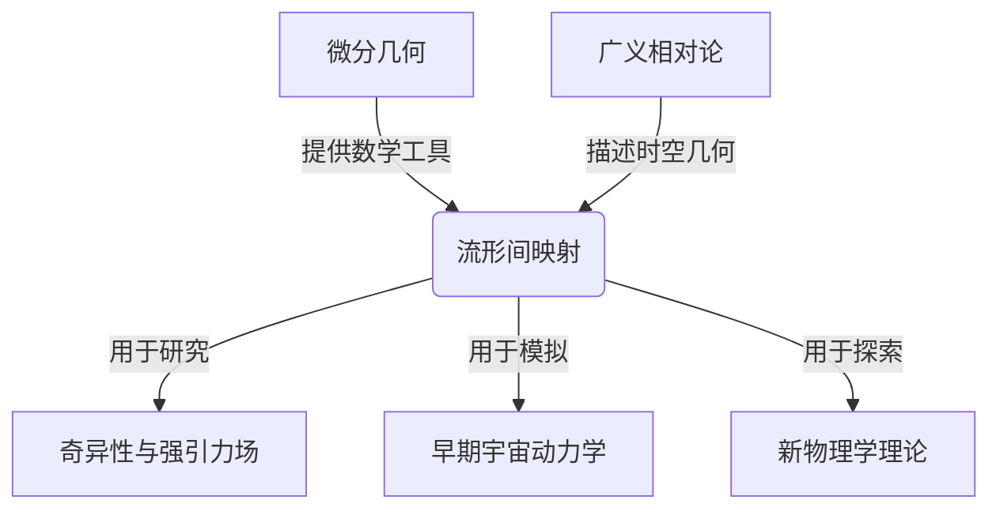

# 微分几何入门与广义相对论：流形间的映射

## 1. 背景介绍

### 1.1 问题的由来

微分几何与广义相对论是现代物理学和数学的两个关键领域,它们的交叉点在于研究时空的几何结构。爱因斯坦的广义相对论理论将时空描述为一个四维流形,物质和能量在这个流形上造成时空曲率,而曲率又反过来影响物质和能量的运动。因此,理解流形之间的映射关系对于深入探索广义相对论至关重要。

### 1.2 研究现状

微分几何为研究流形提供了强大的数学工具,如张量代数、黎曼几何和拓扑学等。近年来,随着计算能力的提高,数值相对论(Numerical Relativity)的发展为探索广义相对论提供了新的途径。然而,由于广义相对论中的非线性场方程组极其复杂,解析解仍然十分有限。因此,发展高效、精确的数值算法来模拟流形之间的映射关系成为了一个重要的研究课题。

### 1.3 研究意义

深入理解流形间的映射关系对于以下几个方面具有重要意义:

1. 揭示广义相对论中的奇异性问题,如黑洞和宇宙奇点的性质。
2. 模拟致密天体系统(如双中子星并合)中的强引力场效应。
3. 研究早期宇宙的动力学演化,验证宇宙学模型。
4. 探索可能的新物理学,如量子引力理论。

### 1.4 本文结构

本文将首先介绍微分几何和广义相对论的基本概念,然后详细阐述流形间映射的数学描述和数值算法。接下来,我们将讨论具体的应用场景,如黑洞和早期宇宙模型。最后,我们将总结该领域的发展趋势和面临的挑战。

## 2. 核心概念与联系

微分几何和广义相对论是研究流形间映射的两个核心概念。微分几何提供了描述流形几何性质的数学语言,如张量代数、黎曼几何和拓扑学等。而广义相对论则将时空描述为一个四维流形,物质和能量在这个流形上造成时空曲率,曲率又反过来影响物质和能量的运动。

通过研究流形间的映射关系,我们可以深入探索广义相对论中的奇异性问题(如黑洞和宇宙奇点)、模拟致密天体系统中的强引力场效应、研究早期宇宙的动力学演化,甚至探索可能的新物理学理论(如量子引力理论)。

## 3. 核心算法原理 & 具体操作步骤

### 3.1 算法原理概述

为了数值模拟流形间的映射关系,我们需要将广义相对论中的Einstein场方程组离散化,并在计算机上求解。这通常涉及以下几个关键步骤:

1. 构造合适的坐标系统和基本变量。
2. 将Einstein场方程组分解为一个由约束方程和演化方程组成的系统。
3. 采用有限差分或谱方法等数值方法对该方程系统进行离散化。
4. 设计时间推进算法,结合适当的边界条件求解离散方程组。
5. 提取和可视化感兴趣的物理量,如曲率标量、视界等。

该算法的核心思想是将连续的微分方程离散化,并在计算机上进行求解,从而模拟流形间的映射。

### 3.2 算法步骤详解

1. **坐标系统和基本变量**

   通常采用3+1分解,将四维时空分解为时间方向和三维空间方向。引入标量曲率、外尔张量和运动学量等作为基本变量。

2. **方程组分解**

   Einstein场方程组可分解为:
   - 约束方程:描述初始数据的几何性质,如Hamiltonian约束和矩动量约束。
   - 演化方程:描述系统在时间上的演化,如Arnowitt-Deser-Misner (ADM)方程组。

3. **离散化**

   - 有限差分法:在离散网格上近似微分算子,常用技术包括迭代Crank-Nicolson等。
   - 谱方法:利用基函数展开求解,如球谐函数等。

4. **时间推进与边界条件**

   - 时间推进:Runge-Kutta方法、迭代Crank-Nicolson等。
   - 边界条件:人工边界、无边界等处理技术。

5. **数据提取与可视化**

   从数值解中提取感兴趣的物理量,如曲率标量、视界位置等,并进行可视化展示。

该算法需要结合并行计算、自适应网格等优化技术,以提高精度和效率。

### 3.3 算法优缺点

**优点**:

- 能够模拟各种复杂的流形映射情况。
- 可以研究非线性效应和奇异性。
- 与观测数据相结合,有助于验证理论模型。

**缺点**:

- 计算量大,需要高性能计算资源。
- 数值误差可能会积累,影响长时间模拟的精度。
- 部分问题存在奇异性,需要特殊处理技术。

### 3.4 算法应用领域

该算法广泛应用于以下领域:

- 黑洞物理学:研究黑洞形成、演化和辐射过程。
- 致密天体并合:模拟双中子星、中子星-黑洞并合等强引力场过程。
- 早期宇宙模型:研究宇宙起源、膨胀和结构形成。
- 量子引力理论:探索量子效应对时空的影响。

## 4. 数学模型和公式 & 详细讲解 & 举例说明

### 4.1 数学模型构建

在广义相对论中,时空被描述为一个四维流形,其几何性质由Einstein场方程组决定:

$$
R_{\mu\nu} - \frac{1}{2}g_{\mu\nu}R = \frac{8\pi G}{c^4}T_{\mu\nu}
$$

其中:

- $R_{\mu\nu}$是黎曼曲率张量
- $R$是黎曼曲率标量
- $g_{\mu\nu}$是度规张量
- $T_{\mu\nu}$是能量-动量张量
- $G$是牛顿万有引力常数
- $c$是光速

这是一个十分复杂的非线性偏微分方程组,描述了时空曲率与物质能量分布之间的关系。

为了数值求解,我们需要对该方程组进行3+1分解,引入一系列辅助变量。例如,在ADM形式中,基本变量包括:

- 3维度规$\gamma_{ij}$
- 外尔张量$K_{ij}$
- 标量曲率$R$

通过对这些变量进行演化,我们可以追踪时空几何的变化。

### 4.2 公式推导过程

Einstein场方程组的推导过程包括以下几个关键步骤:

1. **等同原理与曲率张量**

   根据广义相对论的等同原理,自由落体的运动遵循时空中的测地线。这导致了广义相对论中的基本对象——黎曼曲率张量$R_{\mu\nu\rho\sigma}$的引入。

   $$
   R^\rho_{\ \sigma\mu\nu} = \partial_\mu\Gamma^\rho_{\nu\sigma} - \partial_\nu\Gamma^\rho_{\mu\sigma} + \Gamma^\rho_{\mu\lambda}\Gamma^\lambda_{\nu\sigma} - \Gamma^\rho_{\nu\lambda}\Gamma^\lambda_{\mu\sigma}
   $$

   其中$\Gamma^\rho_{\mu\nu}$是affine连接。

2. **黎曼曲率张量的简化**

   通过对称性和其他性质,黎曼曲率张量可以简化为黎曼曲率张量$R_{\mu\nu}$:

   $$
   R_{\mu\nu} = R^\rho_{\ \mu\rho\nu}
   $$

3. **引入能量-动量张量**

   根据广义相对论的等效原理,物质和能量的存在会导致时空曲率。我们引入能量-动量张量$T_{\mu\nu}$来描述物质和能量的分布。

4. **Einstein场方程组**

   通过一系列数学推导,我们可以得到连接时空曲率和物质能量分布的Einstein场方程组:

   $$
   R_{\mu\nu} - \frac{1}{2}g_{\mu\nu}R = \frac{8\pi G}{c^4}T_{\mu\nu}
   $$

这个方程组描述了时空几何与物质能量分布之间的关系,是广义相对论的核心。

### 4.3 案例分析与讲解

让我们以Schwarzschild黑洞为例,来分析广义相对论中的时空几何。

Schwarzschild度规描述了一个球对称、静态的黑洞时空:

$$
ds^2 = -\left(1-\frac{2GM}{rc^2}\right)c^2dt^2 + \left(1-\frac{2GM}{rc^2}\right)^{-1}dr^2 + r^2d\Omega^2
$$

其中$M$是黑洞质量,$r$是球对称坐标半径。

从这个度规中,我们可以推导出一些有趣的几何性质:

- 存在一个事件视界$r=2GM/c^2$,通过它的光线无法逃逸。
- 时空是奇异的,在$r=0$处存在奇点。
- 时空几何在远离黑洞时趋于平直。

通过数值求解Einstein方程组,我们可以模拟更复杂的情况,如旋转黑洞或者黑洞并合等。这为探索强引力场奇异性提供了有力工具。

### 4.4 常见问题解答

1. **奇异性是否意味着广义相对论的破裂?**

   不完全是。广义相对论在奇异性处失去了预测能力,但并不意味着整个理论的破裂。事实上,广义相对论预言了自身的局限性,为发展新的量子引力理论指明了方向。

2. **如何处理数值计算中的奇异性?**

   通常采用特殊的技术来处理奇异性,如借助适当的坐标系统、人工边界条件、自适应网格等。另一种思路是发展特殊的"奇异性捕捉"算法,能够准确捕捉奇异性的位置和性质。

3. **数值相对论与解析相对论有何区别?**

   解析相对论侧重于寻找Einstein方程组的精确解析解,适用于一些高度对称的情况。而数值相对论则能够处理更一般的情况,尤其是缺乏对称性或存在强非线性效应的情况。两者相辅相成,共同推进了对广义相对论的理解。

4. **量子效应对广义相对论有何影响?**

   量子效应会在极小的尺度上修正广义相对论的预言,导致时空的"泡沫"结构。发展一种自洽的量子引力理论,统一量子论和广义相对论,是当前理论物理学的一个重大挑战。

## 5. 项目实践:代码实例和详细解释说明

在这一部分,我们将通过一个具体的代码示例,演示如何使用数值相对论算法模拟流形间的映射。我们将使用Einstein Toolkit这一开源软件,它集成了多种数值相对论算法和可视化工具。

### 5.1 开发环境搭建

Einstein Toolkit可在Linux和macOS系统上运行,需要预先安装以下依赖项:

- C/C++编译器(如GCC)
- FORTRAN编译器(如gfortran)
- MPI并行计算库(如OpenMPI)
- HDF5科学数据格式库
- Python 3及相关数值计算库(如NumPy、SciPy)

完整的安装步骤请参考官方文档。

### 5.2 源代码详细实现

我们将模拟一个简单的Schwarzschild黑洞时空。相关代码位于`$CACTUS_DIR/arrangements/Arrangement_FO_BSSN/`目录下。

关键代码文件包括:

- `BSSN_RHS.