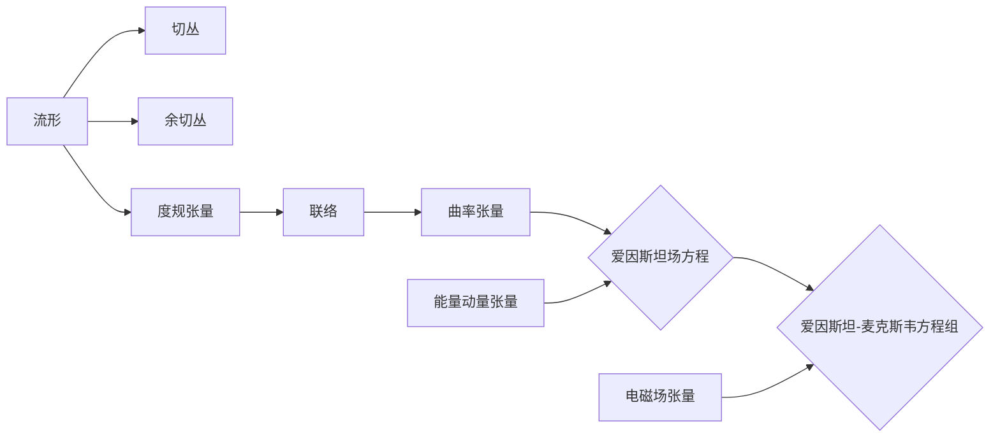

# 微分几何入门与广义相对论：用NP形式求解爱因斯坦-麦克斯韦方程举例

关键词：微分几何、广义相对论、NP形式、爱因斯坦-麦克斯韦方程、曲率张量、四维时空

## 1. 背景介绍
### 1.1  问题的由来
微分几何作为数学的一个分支,在物理学特别是广义相对论中有着广泛而重要的应用。广义相对论是爱因斯坦在1915年提出的一种全新的引力理论,它将引力描述为时空的曲率,用黎曼几何来刻画时空的几何性质。而要深入理解广义相对论,微分几何的知识是不可或缺的。

### 1.2  研究现状
目前,利用微分几何研究广义相对论已经取得了丰硕的成果。人们构建了各种复杂的时空解,如黑洞解、宇宙学解等,极大地拓展了我们对宇宙奥秘的认识。而将广义相对论与其他物理理论,如麦克斯韦电磁理论结合起来,也是当前的一个研究热点。

### 1.3  研究意义
将微分几何应用于广义相对论研究,可以帮助我们更好地理解时空的本质,认识宇宙的起源和演化。同时,这种研究也有助于推动引力理论的发展,为量子引力的构建提供思路。此外,广义相对论在天文学、宇宙学等领域也有重要应用。

### 1.4  本文结构
本文将首先介绍微分几何的一些核心概念,如流形、切丛、联络、曲率等。然后概述广义相对论的基本原理,引入爱因斯坦场方程。接着,我们将详细讲解如何用NP形式处理爱因斯坦-麦克斯韦方程组,给出求解步骤和案例分析。最后,讨论该方法的应用及广义相对论的发展前景。

## 2. 核心概念与联系
微分几何的核心概念包括:

- 流形(manifold):可以看作是一个局部类似欧氏空间的空间,广义相对论中的时空即为一个4维流形。
- 切丛(tangent bundle):流形上每一点的所有切向量构成的空间,反映流形的局部性质。
- 余切丛(cotangent bundle):切丛的对偶丛,在广义相对论中用来描述场的梯度。  
- 度规张量(metric tensor):一个二阶对称张量场,用来度量流形上向量的长度和角度,以及流形的曲率。
- 联络(connection):定义了流形上的平行传输,用于比较不同点的向量。
- 曲率张量(curvature tensor):刻画流形的曲率,是联络的一个重要不变量。

广义相对论的核心是爱因斯坦场方程:

$$R_{\mu\nu}-\frac{1}{2}Rg_{\mu\nu}=8\pi T_{\mu\nu}$$

其中$R_{\mu\nu}$为黎琪曲率张量,$R$为曲率标量,$g_{\mu\nu}$为度规张量,$T_{\mu\nu}$为能量动量张量。该方程将时空几何与物质分布联系起来。当引入电磁场时,便得到爱因斯坦-麦克斯韦方程组。

下图概括了微分几何和广义相对论的主要概念及其联系:



## 3. 核心算法原理 & 具体操作步骤
### 3.1  算法原理概述
在求解爱因斯坦-麦克斯韦方程组时,通常采用NP(Newman-Penrose)形式。NP形式是一种特殊的零标架形式,它将场方程分解为一组标量方程,大大简化了求解过程。NP形式引入了一组复空间的零向量作为标架,通过Lorentz变换和尺度变换可以对其进行规范固定。

### 3.2  算法步骤详解
求解爱因斯坦-麦克斯韦方程组的具体步骤如下:

1. 选择合适的零标架。常见的选择有Kinnersley标架和Bondi标架等。
2. 将度规、联络、曲率分量表示为标架分量。
3. 引入Weyl张量和Ricci旋度等NP变量,将场方程改写为关于这些变量的一阶微分方程组。
4. 对方程组进行简化,如利用Bianchi恒等式、Ricci恒等式等。 
5. 求解简化后的方程组,得到NP变量随坐标的表达式。
6. 代入NP变量的表达式,重构度规、电磁场等物理量。
7. 进行物理解释和分析,研究时空的性质和演化。

### 3.3  算法优缺点
NP形式的优点在于:
- 将场方程简化为一组标量方程,便于求解。
- 引入复空间标架,具有更多的对称性和自由度。
- 可以系统地分类时空解,如代数特殊解等。

但NP形式也存在一些局限:
- 计算量大,对于一般情况往往需要借助符号计算软件。  
- 物理图像不够直观,需要重构度规张量等。
- 有些问题不适合用NP形式处理,如非真空解等。

### 3.4  算法应用领域
NP形式在广义相对论研究中应用广泛,主要包括:
- 求解真空爱因斯坦方程,构建黑洞解、引力波解等。
- 研究带电或带旋转物质源的引力场。  
- 分析时空奇性和视界的性质。
- 探索高维时空和非对称时空的性质。
- 数值相对论中用于提取引力波信号等。

## 4. 数学模型和公式 & 详细讲解 & 举例说明
### 4.1  数学模型构建
在NP形式下,引入一组复空间标架 $\{l,n,m,\bar{m}\}$,它们满足

$$l_\mu n^\mu=-m_\mu \bar{m}^\mu=1,\quad l_\mu l^\mu=n_\mu n^\mu=m_\mu m^\mu=0$$

标架的选取有一定的自由度,常用的是Kinnersley标架,其中 $l,n$ 为主零向量。

度规张量 $g_{\mu\nu}$ 可以用标架分量表示为

$$g_{\mu\nu}=2(l_{(\mu}n_{\nu)}-m_{(\mu}\bar{m}_{\nu)})$$

联络、曲率等几何量也可以类似地分解到标架上。

对于电磁场,定义复电场强度和复磁场强度为

$$\phi_0=F_{\mu\nu}l^\mu m^\nu,\quad \phi_1=\frac{1}{2}F_{\mu\nu}(l^\mu n^\nu+\bar{m}^\mu m^\nu), \quad \phi_2=F_{\mu\nu}\bar{m}^\mu n^\nu$$

麦克斯韦方程 $\nabla^\mu F_{\mu\nu}=J_\nu$ 在NP形式下可以写成关于 $\phi_A$ 的一阶微分方程组。

### 4.2  公式推导过程
以真空爱因斯坦方程为例,在NP形式下,它等价于Weyl张量分量满足的一组方程:

$$
\begin{aligned}
(D-\rho)\Psi_0-\bar{\delta}\Psi_1+3\rho\Psi_1&=0\\
(D-2\rho)\Psi_1-\bar{\delta}\Psi_2+2\rho\Psi_2&=0\\
(D-3\rho)\Psi_2-\bar{\delta}\Psi_3+\rho\Psi_3&=0\\
(\Delta+\mu)\Psi_0-\delta\Psi_1+3\mu\Psi_1&=0\\
(\Delta+2\mu)\Psi_1-\delta\Psi_2+2\mu\Psi_2&=0\\
(\Delta+3\mu)\Psi_2-\delta\Psi_3+\mu\Psi_3&=0\\
(D-\rho+\bar{\rho})\Psi_2-(\bar{\delta}+2\tau)\Psi_3+3\rho\Psi_3&=0\\
(\Delta+\mu+\bar{\mu})\Psi_2-(\delta-2\bar{\tau})\Psi_1+3\mu\Psi_1&=0
\end{aligned}
$$

其中 $\Psi_A$ 是Weyl张量的NP分量, $D,\Delta,\delta$ 是标架方向的微分算子, $\rho,\mu,\tau$ 等是标架的旋度系数。上述方程组可以通过将Weyl张量、Ricci张量分解到标架上,并利用Bianchi恒等式导出。

### 4.3  案例分析与讲解
下面以Kerr黑洞为例,说明如何用NP形式求解爱因斯坦方程。Kerr度规描述了一个旋转的带电黑洞,在Boyer-Lindquist坐标下的线元为

$$ds^2=-\frac{\Delta}{\rho^2}(dt-a\sin^2\theta d\phi)^2+\frac{\rho^2}{\Delta}dr^2+\rho^2d\theta^2+\frac{\sin^2\theta}{\rho^2}[adt-(r^2+a^2)d\phi]^2$$

其中 $\Delta=r^2-2Mr+a^2$, $\rho^2=r^2+a^2\cos^2\theta$。

选取Kinnersley标架为

$$
\begin{aligned}
l&=\frac{r^2+a^2}{\Delta}\partial_t+\partial_r+\frac{a}{\Delta}\partial_\phi\\
n&=\frac{r^2+a^2}{2\rho^2}\partial_t-\frac{\Delta}{2\rho^2}\partial_r+\frac{a}{2\rho^2}\partial_\phi\\
m&=\frac{ia\sin\theta}{\sqrt{2}\bar{\rho}}\partial_t+\frac{1}{\sqrt{2}\bar{\rho}}\partial_\theta+\frac{i}{\sqrt{2}\sin\theta\bar{\rho}}\partial_\phi
\end{aligned}
$$

计算标架的旋度系数和Weyl张量分量,可以得到

$$\Psi_2=-\frac{M}{(r-ia\cos\theta)^3},\quad \Psi_0=\Psi_1=\Psi_3=\Psi_4=0$$

代入真空场方程,可以验证上述结果满足方程组。进一步地,还可以分析Kerr黑洞的视界、人格奇点等性质。

### 4.4  常见问题解答
Q: 为什么要引入复空间标架?
A: 复空间标架具有更多的对称性和自由度,可以简化场方程的形式,有利于分类和求解。

Q: NP形式能否推广到高维时空?
A: 可以。但标架的选取和场方程的形式会更加复杂。目前对高维NP形式的研究还不够完善。

Q: 对于带物质源的情况,NP形式还适用吗?
A: 适用。但物质源会引入额外的场方程,如麦克斯韦方程、流体动力学方程等,求解难度会增大。

Q: NP形式是否依赖于坐标选择?
A: NP形式本身是坐标无关的。但在实际计算中,常常选择特定的坐标系,如Boyer-Lindquist坐标、Eddington-Finkelstein坐标等,以简化方程的形式。

## 5. 项目实践：代码实例和详细解释说明
### 5.1  开发环境搭建
求解NP方程组通常需要借助符号计算软件,如Mathematica, Maple, SymPy等。以Python的SymPy库为例,可以按以下步骤搭建开发环境:

1. 安装Python和SymPy库。
2. 在Python中导入SymPy模块: `import sympy as sp`。
3. 定义符号变量,如 `r, theta = sp.symbols('r theta')`。
4. 定义度规、标架、场张量等,利用SymPy进行符号计算。

### 5.2  源代码详细实现
下面给出求解Kerr黑洞NP方程的Python代码实现:

```python
import sympy as sp

# 定义符号变量
t, r, theta, phi = sp.symbols('t r theta phi')
M, a = sp.symbols('M a')

# 定义度规函数
Delta = r**2 - 