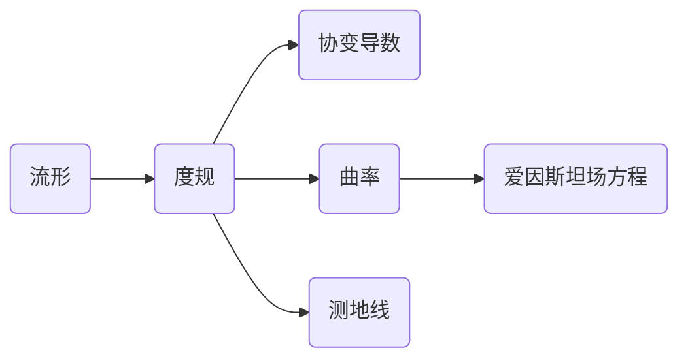

# 微分几何入门与广义相对论：转盘系的空间几何

关键词：微分几何、广义相对论、转盘系、黎曼几何、时空弯曲、测地线、爱因斯坦场方程

## 1. 背景介绍
### 1.1  问题的由来
微分几何是数学的一个分支,它利用微积分的方法来研究几何对象的性质。而广义相对论则是爱因斯坦在1915年提出的一个关于引力的理论,它利用微分几何的语言来描述时空的弯曲以及物质如何影响时空的弯曲。在广义相对论中,引力不再被看作是一种力,而是时空几何弯曲的表现。

转盘系是研究广义相对论的一个重要模型。它描述了一个均匀转动的刚性圆盘所感受到的时空几何性质。在转盘系中,由于转动产生的潮汐力,使得圆盘上的尺规会发生变形,从而导致圆盘上的几何性质与欧几里得平直空间不同。通过研究转盘系的几何性质,我们可以更好地理解广义相对论中时空弯曲的概念。

### 1.2  研究现状
目前,对转盘系的研究主要集中在以下几个方面:

1. 转盘系的度规和曲率计算。通过计算转盘系的度规和曲率张量,可以定量描述转盘系的几何性质。

2. 转盘系中的测地线方程。测地线是时空中的最短路径,研究测地线方程可以帮助我们理解转盘系中物体的运动规律。

3. 转盘系与其他时空模型的比较。将转盘系与其他常见的时空模型(如施瓦西时空、德西特时空等)进行比较,可以加深我们对不同时空几何的理解。

4. 转盘系的物理应用。转盘系作为一个简单的时空模型,在研究黑洞、引力波等相对论效应时有重要的应用价值。

### 1.3  研究意义
转盘系虽然是一个相对简单的时空模型,但它却包含了广义相对论的许多核心思想,如时空弯曲、测地线等。深入研究转盘系的几何性质,对于理解广义相对论的基本概念和数学框架有重要意义。同时,转盘系也是将微分几何应用于物理学的一个典型例子,体现了数学与物理学的紧密联系。此外,转盘系的研究对于探索极端条件下的时空性质(如黑洞附近)也有一定的参考价值。

### 1.4  本文结构
本文将从以下几个方面介绍转盘系的空间几何性质:

1. 微分几何和广义相对论的核心概念
2. 转盘系的度规和曲率计算
3. 转盘系中的测地线方程
4. 转盘系的物理应用和启示

通过对转盘系的几何性质的深入分析,帮助读者建立起微分几何和广义相对论的直观图像,为进一步学习广义相对论打下基础。

## 2. 核心概念与联系
在正式讨论转盘系的几何性质之前,我们先来回顾一下微分几何和广义相对论的一些核心概念。

**流形(Manifold)**: 流形是微分几何的研究对象,它是一个局部类似于欧氏空间的空间。更准确地说,一个n维流形是一个可以被局部映射到n维欧氏空间的空间。流形的例子包括各种曲线、曲面以及更高维的对象。

**度规(Metric)**: 度规是定义在流形上的一个二次型,它为流形上的每一点指定了一个内积结构。通过度规,我们可以测量流形上向量的长度和角度,定义曲线的长度以及流形的曲率等。在广义相对论中,时空连续体就是一个四维流形,而度规则描述了时空的几何性质。

**协变导数(Covariant Derivative)**: 协变导数是流形上的一种导数运算,它描述了向量场沿着流形上的曲线的变化率。与普通导数不同,协变导数考虑了流形的几何结构,因此它满足一些特殊的性质,如无挠性和度规相容性。

**曲率(Curvature)**: 曲率是描述流形局部弯曲程度的一个量。对于二维曲面,曲率可以用高斯曲率来刻画。高斯曲率为正的曲面称为正曲率面(如球面),高斯曲率为负的曲面称为负曲率面(如马鞍面),而高斯曲率处处为零的曲面称为平直曲面(如平面和柱面)。对于高维流形,曲率由黎曼曲率张量来描述。

**测地线(Geodesic)**: 测地线是流形上的一条"直线",它是两点之间的最短路径。在平直空间中,测地线就是普通的直线。但在弯曲的流形上,测地线可能是弯曲的曲线。例如,地球表面的测地线是大圆(如赤道)上的弧线段。

**爱因斯坦场方程(Einstein Field Equations)**: 爱因斯坦场方程是广义相对论的核心方程,它描述了时空几何与物质分布之间的关系。方程的左边是描述时空几何的爱因斯坦张量,右边是描述物质分布的能量动量张量。场方程表明,物质告诉时空如何弯曲,而弯曲的时空则告诉物质如何运动。

下图展示了这些核心概念之间的逻辑联系:

有了这些准备知识,我们就可以开始探讨转盘系的空间几何性质了。转盘系是一个二维流形,它的度规可以通过转动的角速度来表示。利用度规,我们可以计算转盘系的曲率以及测地线方程,从而揭示转盘系的几何结构。此外,转盘系也是研究广义相对论效应(如时间膨胀)的一个重要模型。

## 3. 核心算法原理 & 具体操作步骤
### 3.1  算法原理概述
要研究转盘系的几何性质,我们需要利用微分几何的方法,主要包括以下几个步骤:

1. 建立转盘系的坐标系,给出度规的表达式。
2. 计算度规的克氏符(Christoffel symbols),得到协变导数的表达式。
3. 计算黎曼曲率张量、里奇张量和标量曲率,刻画转盘系的曲率性质。
4. 利用测地线方程,求解转盘系中的测地线。
5. 分析转盘系的物理性质,如时间膨胀效应等。

### 3.2  算法步骤详解
下面我们详细介绍每一个步骤的具体计算过程。

**Step 1: 建立转盘系的坐标系和度规**

我们采用极坐标系 $(r,\phi)$ 来描述转盘系,其中 $r$ 表示到转轴的距离,$\phi$ 表示角度。转盘的角速度为 $\omega$,半径为 $R$。

在转盘系中,空间部分的度规可以写为:

$$
\mathrm{d}s^2 = \mathrm{d}r^2 + r^2(1-\frac{\omega^2r^2}{c^2})^{-1}\mathrm{d}\phi^2
$$

其中 $c$ 是光速。这个度规表明,由于转动效应,转盘上的周长与半径之比不再是 $2\pi$,而是与 $r$ 有关。

**Step 2: 计算度规的克氏符和协变导数**

度规的非零分量为:

$$
g_{11} = 1,\quad g_{22} = r^2(1-\frac{\omega^2r^2}{c^2})^{-1}
$$

利用度规的表达式,我们可以计算克氏符:

$$
\Gamma^1_{22} = -r(1-\frac{\omega^2r^2}{c^2})^{-1},\quad
\Gamma^2_{12} = \Gamma^2_{21} = \frac{1}{r}(1-\frac{\omega^2r^2}{c^2})^{-1}
$$

有了克氏符,我们就可以计算协变导数了。例如,一个向量场 $V^i$ 的协变导数为:

$$
\nabla_jV^i = \partial_jV^i + \Gamma^i_{jk}V^k
$$

**Step 3: 计算黎曼曲率张量和标量曲率**

利用克氏符,我们可以计算黎曼曲率张量的分量:

$$
R_{1212} = \frac{\omega^2r^2}{c^2(1-\frac{\omega^2r^2}{c^2})}
$$

其他分量由对称性给出。里奇张量和标量曲率可以通过缩并黎曼曲率张量得到:

$$
R_{ij} = R^k_{ikj},\quad R = g^{ij}R_{ij}
$$

经计算,转盘系的标量曲率为:

$$
R = \frac{2\omega^2}{c^2(1-\frac{\omega^2r^2}{c^2})^2}
$$

这表明转盘系是一个曲率不为零的二维流形。

**Step 4: 求解测地线方程**

测地线方程可以写为:

$$
\frac{\mathrm{d}^2x^i}{\mathrm{d}s^2} + \Gamma^i_{jk}\frac{\mathrm{d}x^j}{\mathrm{d}s}\frac{\mathrm{d}x^k}{\mathrm{d}s} = 0
$$

其中 $s$ 是测地线的弧长参数。将转盘系的度规和克氏符代入,可以得到关于 $r(\phi)$ 的常微分方程:

$$
\frac{\mathrm{d}^2r}{\mathrm{d}\phi^2} + r = \frac{3\omega^2r^3}{c^2(1-\frac{\omega^2r^2}{c^2})}
$$

求解这个方程,就可以得到转盘系中的测地线。

**Step 5: 分析转盘系的物理性质**

利用上面得到的几何量,我们可以研究转盘系的物理性质。例如,转盘系中的时间膨胀效应可以用度规的时间分量来描述:

$$
\mathrm{d}\tau^2 = (1-\frac{\omega^2r^2}{c^2})\mathrm{d}t^2
$$

其中 $\tau$ 是固有时,$t$ 是坐标时。这个公式表明,转盘边缘的时钟相对于转轴处的时钟会变慢,这就是著名的钟慢效应。

### 3.3  算法优缺点
上述算法的优点在于:

1. 利用微分几何的方法,可以系统地研究转盘系的几何和物理性质。
2. 通过计算度规、曲率等几何量,可以定量刻画转盘系的时空结构。
3. 测地线方程给出了转盘系中质点运动的规律,有助于理解广义相对论效应。

但是,该算法也存在一些局限性:

1. 转盘系是一个相对简单的模型,对于更复杂的时空,计算过程会变得非常繁琐。
2. 算法中涉及大量的张量计算,需要较好的数学基础和计算能力。
3. 对于一般的度规,测地线方程往往难以求解,需要借助数值方法。

### 3.4  算法应用领域
转盘系的研究对于以下领域有重要意义:

1. 广义相对论教学。转盘系是广义相对论的一个重要模型,可以帮助学生理解时空弯曲、测地线等核心概念。
2. 引力理论研究。转盘系展示了旋转物体的时空性质,对于研究旋转黑洞、中子星等天体有参考价值。
3. 实验室检验。一些高精度实验(如Sagnac效应)可以用转盘系来解释和预言。
4. 惯性导航。转盘系的几何性质与转动惯性系密切相关,在惯性导航系统的设计中有应用。

## 4. 数学模型和公式 & 详细讲解 & 举例说明
### 4.1  数学模型构建
转盘系的数学模型可以用下面的度规来描述:

$$
\mathrm{d}s^2 = -c^