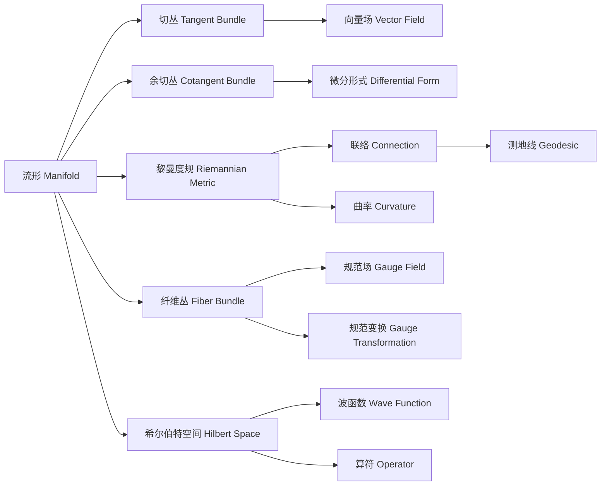

# 微分几何入门与广义相对论：量子力学数学基础简介

关键词：微分几何、广义相对论、量子力学、黎曼几何、流形、张量分析、规范场论、狄拉克方程、希尔伯特空间

## 1. 背景介绍
### 1.1 问题的由来
微分几何作为数学的一个分支,在物理学尤其是广义相对论和量子力学中有着广泛而深刻的应用。它为描述时空的弯曲、引力场的性质以及量子系统的演化提供了必不可少的数学工具和语言。深入理解微分几何的基本概念和方法,对于掌握现代物理学的理论基础具有重要意义。

### 1.2 研究现状
目前,微分几何在物理学研究中的应用已经十分广泛和深入。广义相对论借助黎曼几何来刻画时空的几何性质和引力作用,并取得了巨大的成功。量子力学的数学基础也与微分几何密切相关,如希尔伯特空间、李群和李代数、纤维丛和联络等概念在量子理论中有着重要应用。此外,现代物理学的许多前沿领域如弦理论、圈量子引力理论、非交换几何等,都涉及微分几何的深层次问题。

### 1.3 研究意义
深入学习微分几何,对于理解和掌握现代物理学理论具有重要意义:

1. 微分几何为广义相对论提供了数学基础,学习微分几何有助于理解广义相对论的核心内容如时空弯曲、引力场方程、黑洞等。 

2. 量子力学的数学形式与微分几何有着内在联系,如波函数可看作希尔伯特空间中的矢量,量子态的演化可用幺正算符来描述。学习微分几何有助于从数学角度深化对量子力学的认识。

3. 在粒子物理的规范场论中,规范场可看作一种联络,费米场可看作纤维丛上的截面。微分几何是研究当代粒子物理的重要数学工具。

4. 弦理论等前沿物理学领域大量使用了微分几何的概念和方法,学习微分几何有助于理解这些领域的最新进展。

### 1.4 本文结构
本文将介绍微分几何的一些基本概念,重点讨论它们在广义相对论和量子力学中的应用。内容安排如下:

1. 介绍流形、切丛、余切丛、微分形式等微分几何的基本概念。
2. 讨论黎曼几何,引入度规、联络、曲率等概念,并给出广义相对论中的应用。
3. 介绍纤维丛、规范场、规范变换等物理中的重要概念,并讨论它们与微分几何的联系。
4. 探讨微分几何在量子力学中的应用,包括希尔伯特空间、狄拉克方程、几何量子化等内容。
5. 总结微分几何在物理学中的重要意义,并对学习微分几何提出一些建议。

## 2. 核心概念与联系

微分几何的核心概念包括:

- 流形(Manifold):描述局部类似欧氏空间的空间,是微分几何的研究对象。
- 切丛(Tangent Bundle):由流形上所有切空间构成的空间,刻画流形上的"速度"。
- 余切丛(Cotangent Bundle):切丛的对偶空间,刻画流形上的"动量"。
- 黎曼度规(Riemannian Metric):为流形上每一点的切空间引入内积结构。
- 联络(Connection):定义切丛或余切丛上的平行移动和协变导数。
- 曲率(Curvature):刻画流形的内蕴几何性质,与黎曼度规密切相关。
- 纤维丛(Fiber Bundle):由基空间、纤维空间和投影组成的空间,物理中的许多场可看作其上的截面。
- 规范场(Gauge Field):定义在纤维丛上的联络场,刻画物理相互作用。
- 希尔伯特空间(Hilbert Space):完备的内积空间,量子力学的数学框架。

这些概念相互联系、有机统一,构成了微分几何的理论体系。在物理学中,流形常用来描述时空,黎曼几何用于研究引力,纤维丛和规范场用于描述相互作用,希尔伯特空间是量子力学的数学语言。

## 3. 核心算法原理 & 具体操作步骤
### 3.1 算法原理概述
微分几何中的许多问题,如测地线方程、曲率计算等可以用相应的算法求解。这些算法往往基于黎曼几何、张量分析等微分几何的基本原理。下面以测地线方程为例进行说明。

测地线是黎曼流形上的"直线",其满足微分方程:

$$
\frac{d^2 x^i}{dt^2} + \Gamma^i_{jk} \frac{dx^j}{dt} \frac{dx^k}{dt} = 0
$$

其中 $x^i$ 是测地线的参数方程, $\Gamma^i_{jk}$ 是联络系数,由度规 $g_{ij}$ 决定:

$$
\Gamma^i_{jk} = \frac{1}{2} g^{il} \left( \frac{\partial g_{lj}}{\partial x^k} + \frac{\partial g_{lk}}{\partial x^j} - \frac{\partial g_{jk}}{\partial x^l} \right)
$$

因此,求解测地线问题可以分为以下步骤:

1. 给定度规 $g_{ij}$,计算联络系数 $\Gamma^i_{jk}$。
2. 将联络系数代入测地线方程。
3. 求解常微分方程组,得到测地线的参数方程 $x^i(t)$。

### 3.2 算法步骤详解
以二维球面(球面坐标系)为例,详细说明求解测地线的步骤。

步骤1:度规的计算

球面坐标系 $(θ,φ)$ 的度规为:

$$
g_{ij} = \begin{pmatrix} 
R^2 & 0 \\
0 & R^2 \sin^2 θ
\end{pmatrix}
$$

其中 $R$ 为球面半径。度规的逆矩阵为:

$$
g^{ij} = \begin{pmatrix}
\frac{1}{R^2} & 0 \\  
0 & \frac{1}{R^2 \sin^2 θ}
\end{pmatrix}
$$

步骤2:联络系数的计算

利用度规及其导数,计算非零的联络系数:

$$
\Gamma^θ_{φφ} = - \sin θ \cos θ, \quad 
\Gamma^φ_{θφ} = \Gamma^φ_{φθ} = \cot θ
$$

步骤3:测地线方程的建立

将联络系数代入测地线方程,得到:

$$
\begin{cases}
\frac{d^2 θ}{dt^2} - \sin θ \cos θ \left( \frac{dφ}{dt} \right)^2 = 0 \\
\frac{d^2 φ}{dt^2} + 2 \cot θ \frac{dθ}{dt} \frac{dφ}{dt} = 0
\end{cases}
$$

步骤4:求解测地线方程

这是一个二阶非线性常微分方程组,需要数值方法求解。给定初始条件 $θ(0), φ(0), \frac{dθ}{dt}(0), \frac{dφ}{dt}(0)$,可以用龙格-库塔法等数值积分方法求解,得到测地线的参数方程 $θ(t), φ(t)$。

### 3.3 算法优缺点
优点:
1. 测地线算法直接基于黎曼几何原理,具有明确的几何意义。
2. 算法结果准确,可以得到测地线的参数方程。
3. 算法适用于任意维度的黎曼流形。

缺点:
1. 联络系数的计算比较复杂,尤其在高维情形。
2. 测地线方程一般需要数值求解,计算量较大。
3. 算法对初始条件敏感,可能出现数值不稳定性。

### 3.4 算法应用领域
测地线算法在以下领域有重要应用:
1. 广义相对论中,测地线描述自由粒子在弯曲时空中的运动。
2. 计算机视觉中,测地线可用于寻找图像中的最短路径。
3. 机器学习中,测地线可用于流形学习和降维算法。
4. 最优控制中,测地线对应于最优轨道。

## 4. 数学模型和公式 & 详细讲解 & 举例说明
### 4.1 数学模型构建
广义相对论是建立在黎曼几何模型基础上的引力理论。其核心思想是,引力是时空几何弯曲的表现。广义相对论的数学模型可概括为:

1. 时空是一个四维黎曼流形 $(M, g_{μν})$,度规 $g_{μν}$ 描述时空几何。
2. 物质分布决定时空几何,满足爱因斯坦场方程:

$$
G_{μν} = R_{μν} - \frac{1}{2} R g_{μν} = \frac{8πG}{c^4} T_{μν}
$$

其中 $G_{μν}$ 是爱因斯坦张量,$R_{μν}$ 是黎奇张量,$R$ 是标量曲率,$T_{μν}$ 是能量-动量张量,$G$ 是引力常数,$c$ 是光速。

3. 自由粒子沿时空测地线运动,满足测地线方程:

$$
\frac{d^2 x^μ}{dτ^2} + Γ^μ_{νρ} \frac{dx^ν}{dτ} \frac{dx^ρ}{dτ} = 0
$$

其中 $x^μ(τ)$ 是粒子的世界线,$τ$ 是固有时,$Γ^μ_{νρ}$ 是联络系数,由度规决定。

### 4.2 公式推导过程
下面以球对称黑洞的度规公式为例,说明广义相对论中度规的求解过程。

考虑真空中的静态球对称度规:

$$
ds^2 = -A(r) dt^2 + B(r) dr^2 + r^2 (dθ^2 + \sin^2 θ dφ^2)
$$

其中 $A(r), B(r)$ 待定。将此度规代入真空爱因斯坦方程 $R_{μν}=0$,得到:

$$
\begin{cases}
\frac{A'}{A} + \frac{B'}{B} = 0 \\
\frac{1}{B} \left( \frac{A'}{rA} + \frac{1}{r^2} \right) - \frac{1}{r^2} = 0
\end{cases}
$$

求解此方程组,得到:

$$
A(r) = \frac{1}{B(r)} = 1 - \frac{r_s}{r}, \quad r_s = \frac{2GM}{c^2}
$$

其中 $M$ 为黑洞质量。因此,球对称黑洞的度规为:

$$
ds^2 = - \left( 1-\frac{r_s}{r} \right) dt^2 + \frac{1}{1-\frac{r_s}{r}} dr^2 + r^2 (dθ^2 + \sin^2 θ dφ^2)
$$

这就是著名的史瓦西度规(Schwarzschild metric)。

### 4.3 案例分析与讲解
下面以光线在史瓦西度规下的运动为例,说明广义相对论的一个重要效应——光线弯曲。

考虑径向运动的光线,其运动方程为:

$$
ds^2 = - \left( 1-\frac{r_s}{r} \right) dt^2 + \frac{1}{1-\frac{r_s}{r}} dr^2 = 0
$$