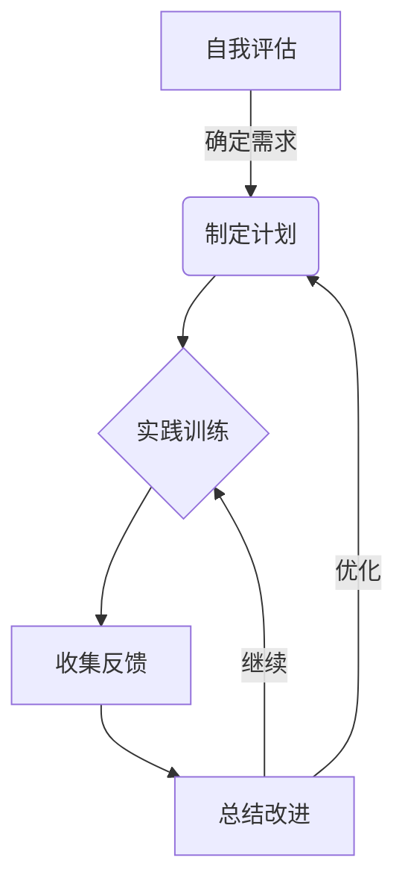

# 怎样培养优秀的沟通协调能力、领导能力、组织能力、控制能力、分析判断能力、组织能力

## 1. 背景介绍

### 1.1 问题的由来

在当今快节奏的商业环境中，拥有出色的软技能已经成为职业发展的关键因素之一。无论是在企业内部还是与外部利益相关者打交道,良好的沟通协调、领导、组织、控制、分析判断和协调能力都是必不可少的。这些能力不仅有助于提高工作效率,而且还能促进团队合作、建立良好的人际关系,并有效地管理和指导项目。

### 1.2 研究现状  

许多研究都强调了这些软技能的重要性。一项针对全球500强企业高管的调查显示,90%的受访者认为沟通技巧是最重要的职业技能。另一项研究则发现,优秀的领导能力可以提高团队绩效高达20%。然而,尽管这些能力备受重视,但很多专业人士仍然缺乏有效培养和提升这些技能的途径。

### 1.3 研究意义

本文旨在为读者提供系统的方法和实用的技巧,帮助他们培养和提升沟通协调、领导、组织、控制、分析判断和协调等关键软技能。通过全面探讨这些能力的核心概念、培养方法和实践技巧,读者可以更有针对性地识别自身的不足,并采取有效的措施加以改进。

### 1.4 本文结构

本文将首先介绍这些软技能的核心概念及其相互关联,然后深入探讨每项能力的培养方法和实践技巧。此外,还将提供实际案例分析、工具和资源推荐,以及对未来发展趋势和挑战的展望。

## 2. 核心概念与联系

以下是本文涉及的六大软技能的核心概念及其相互关联:

1. **沟通协调能力**:准确、清晰地表达想法,并积极倾听他人观点,协调各方利益,达成共识。这是所有其他软技能的基础。

2. **领导能力**:激励和引导团队朝着共同目标前进,做出明智决策,赢得他人的尊重和信任。良好的沟通协调是领导力的先决条件。

3. **组织能力**:有效规划和管理资源(人力、物力、财力等),确保工作高效有序开展。需要结合领导力和分析判断能力。

4. **控制能力**:监控工作进度,及时发现并解决问题,确保目标如期实现。需要组织能力和分析判断能力的支持。

5. **分析判断能力**:客观审视问题,综合考虑各种因素,做出明智决策。是领导力、组织能力和控制能力的基础。

6. **协调能力**:协调各方利益,化解矛盾,促进团队合作。需要良好的沟通技巧和领导力。

这六大软技能相辅相成,相互影响。比如,缺乏沟通协调能力会影响领导力的发挥;分析判断能力不足会导致组织和控制效率低下;而缺乏协调能力则会阻碍团队高效合作。因此,全面培养和提升这些能力对于个人和组织的成功至关重要。

## 3. 核心算法原理 & 具体操作步骤

### 3.1 算法原理概述

培养软技能并非一蹴而就,而是需要持之以恒的努力和练习。这一过程可以借鉴"循序渐进"和"精益求精"的算法思想:

1. **循序渐进**:将目标分解为可实现的小步骤,逐步完成。例如,提高沟通技巧可以先从改善语言表达开始,再学习倾听技巧等。

2. **精益求精**:通过反馈和持续改进,不断优化和完善技能。例如,在实践中总结经验教训,并将其应用于下一次的实践中。

这一算法思想的核心是将看似艰巨的目标分解为可管理的小任务,通过反复实践和改进,最终实现技能的全面提升。

### 3.2 算法步骤详解

以下是培养软技能的具体算法步骤:

1. **自我评估**:客观评估自身的软技能水平,确定需要改进的领域。可以寻求他人的反馈意见,或使用标准化测试工具。

2. **制定计划**:根据评估结果,为每项需要提升的技能制定具体的行动计划,包括目标、时间表和具体步骤。

3. **实践训练**:按照计划有针对性地进行实践训练,例如参加培训课程、模拟演练、实战锻炼等。

4. **收集反馈**:在实践过程中,主动寻求他人的反馈意见,了解自身的优缺点和改进空间。

5. **总结改进**:根据反馈,总结经验教训,调整行动计划,持续优化和改进技能。

6. **重复实践**:按照优化后的计划,进行下一轮的实践训练,形成闭环反馈,不断精进技能。

7. **持之以恒**:软技能的培养是一个漫长的过程,需要持之以恒的努力和坚持。

通过这一系统化的算法,个人可以有效地规划和执行软技能的培养,并通过反馈和改进不断提高。

### 3.3 算法优缺点

**优点**:

1. **系统化**:将软技能培养过程系统化,有利于制定全面的行动计划。

2. **可控性强**:通过分解目标和反馈改进,能够更好地控制培养进度。

3. **持续改进**:形成闭环反馈,确保技能不断优化和提高。

4. **可量化**:通过设置可衡量的目标和时间表,便于跟踪和评估进展情况。

**缺点**:

1. **需要自驱力**:算法的有效执行需要个人的高度自我驱动力和坚持。

2. **反馈质量影响大**:反馈的准确性和建设性对改进效果有重大影响。

3. **成本较高**:实施算法可能需要投入大量时间和资源(如培训费用等)。

4. **难以量化软技能**:某些软技能(如领导力)难以用量化指标精准衡量。

### 3.4 算法应用领域

该算法可广泛应用于各行各业的软技能培养,包括但不限于:

- 企业培训
- 个人职业发展
- 教育和课程设计
- 团队建设
- 领导力发展
- 项目管理
- 客户服务
- ...

无论是组织层面还是个人层面,通过有针对性的实施,都可以有效提升相关软技能,从而提高工作绩效和职业发展潜力。

## 4. 数学模型和公式 & 详细讲解 & 举例说明  

### 4.1 数学模型构建

为了量化和评估软技能培养的效果,我们可以构建一个数学模型。假设某个软技能的当前水平为$S_0$,目标水平为$S_t$,那么需要提升的幅度为:

$$\Delta S = S_t - S_0$$

我们将软技能培养过程视为一个学习曲线,其中$x$表示投入的时间(或其他资源),而$y$表示软技能水平的提升幅度。一般来说,学习曲线遵循对数曲线模型:

$$y = a\ln(x+b) + c$$

其中$a$、$b$和$c$是模型参数,需要通过实际数据拟合获得。将$y$代入$\Delta S$,我们得到:

$$\Delta S = a\ln(x+b) + c$$

这个模型反映了软技能提升过程的一般规律:初期进展缓慢,后期提升加快,最终趋于稳定。通过估算模型参数,我们可以预测在投入一定资源后,软技能的提升水平。

### 4.2 公式推导过程

我们来推导一下上述对数曲线模型的具体过程:

1) 假设软技能的提升遵循"边际递减"规律,即每单位投入产生的效果递减。这符合现实情况,因为初期学习相对容易,后期越来越难以有明显进步。

2) 令$f(x)$表示软技能水平,其一阶导数$f'(x)$表示边际效用(每单位投入产生的效果)。根据"边际递减"规律,我们有$f''(x) < 0$。

3) 将$f'(x)$积分可得:
$$f(x) = \int f'(x)\,\mathrm{d}x = a\ln(x+b) + c$$

其中$a$、$b$和$c$是积分常数,需要通过实际数据拟合确定。这就得到了我们的对数曲线模型。

该模型的优点是简单、符合实际规律,缺点是参数的确定需要大量数据支持。在实际应用中,我们可以根据具体情况对模型进行改进,以提高预测准确性。

### 4.3 案例分析与讲解

现在我们来看一个具体的案例。假设小明目前的沟通协调能力评分为60分(满分100分),他希望将这一能力提升至90分。根据过往经验,参数$a=25$、$b=10$、$c=35$。那么,小明需要投入多少时间和努力呢?

将已知条件代入模型方程:

$$
\begin{aligned}
\Delta S &= S_t - S_0\\
         &= 90 - 60\\
         &= 30\\
         &= 25\ln(x+10) + 35
\end{aligned}
$$

解方程可得:$x \approx 22$

也就是说,如果小明投入大约22个单位的时间(或其他资源),就可以将沟通协调能力提升至90分的目标水平。

当然,这只是一个理论预测值。在实际操作中,小明需要制定具体的行动计划,有针对性地安排实践训练、收集反馈、总结改进等环节,并根据实际进展情况动态调整。但这一模型可以为他提供一个合理的期望值,有助于更好地把控培养进度。

### 4.4 常见问题解答

**Q1: 为什么要使用对数曲线模型?是否有其他更合适的模型?**

A1: 对数曲线模型符合软技能提升的"边际递减"规律,能较好地描述这一过程。当然,也可以使用其他模型,如S形曲线模型、指数模型等,具体取决于实际数据的拟合效果。如果有更合适的模型,也可以替代对数曲线模型。

**Q2: 如何确定模型参数?需要多少数据?**

A2: 模型参数的确定需要大量的实际数据支持,包括投入的时间(或其他资源)、软技能水平的评估数据等。一般来说,数据量越多,拟合效果越好。如果难以获取足够的数据,也可以先根据经验给出初始参数值,后续通过实际数据不断优化调整参数。

**Q3: 该模型是否适用于所有软技能?不同软技能是否有差异?**

A3: 理论上,该模型适用于所有遵循"边际递减"规律的软技能培养过程。但由于不同软技能的特点不同,模型参数可能会有一定差异。例如,相对抽象的领导能力可能比具体的沟通技巧更难掌握,其参数$a$和$b$会相对更大。因此,在实际应用中,需要针对每种具体的软技能调整和优化模型参数。

**Q4: 该模型是否考虑了个人差异因素?**

A4: 目前的模型是一个通用模型,没有考虑个人的先天禀赋、学习能力等差异因素。实际上,不同个人的学习曲线可能有所不同。为了提高预测准确性,可以在模型中引入个人差异参数,但这需要更多的个人数据支持。

## 5. 项目实践:代码实例和详细解释说明

为了更好地演示软技能培养的过程,我们将构建一个简单的Python程序,并模拟不同参数下的学习曲线。

### 5.1 开发环境搭建

我们需