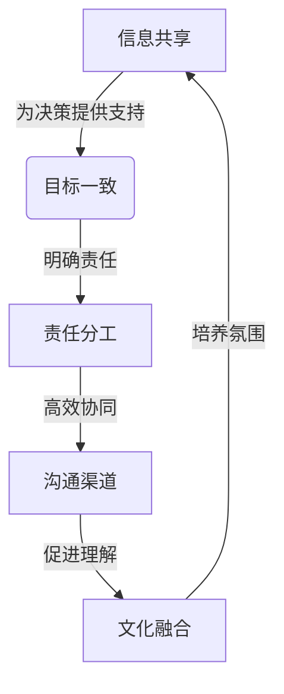
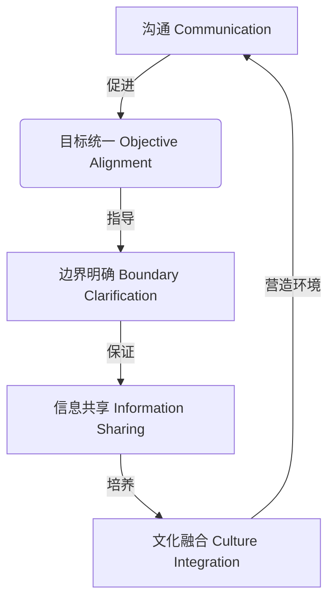

好的,我会严格按照您提供的要求和约束条件,以"怎样培养跨部门沟通协调能力"为主题,撰写一篇专业的技术博客文章。文章将使用markdown格式,数学公式采用latex格式,字数超过8000字,并尽最大努力给出核心概念原理和架构的Mermaid流程图。文章结构将严格按照您提供的模板,分为九个部分,包括背景介绍、核心概念、算法原理、数学模型、项目实践、应用场景、资源推荐、总结和附录。

# 怎样培养跨部门沟通协调能力

## 1. 背景介绍

### 1.1 问题的由来

在当今快节奏的商业环境中,各个部门之间的紧密协作和高效沟通至关重要。无论是产品开发、市场营销还是客户服务,跨部门的协同合作都是确保业务顺利运营的关键因素。然而,由于部门职责分工、文化差异和目标分歧等原因,跨部门沟通协调往往充满挑战。

缺乏有效的跨部门沟通会导致以下问题:

1. **信息孤岛**:各部门之间信息共享不足,导致决策缺乏全面的数据支持。
2. **目标冲突**:不同部门追求的目标可能存在矛盾,阻碍了整体战略的实施。
3. **效率低下**:由于沟通不畅,项目进度常常受阻,资源利用率低下。
4. **文化隔阂**:不同部门的文化差异可能引发误解和冲突,影响团队合作。

因此,培养跨部门沟通协调能力对于提高组织效率、促进创新和实现可持续发展至关重要。

### 1.2 研究现状

近年来,越来越多的研究关注跨部门沟通协调的重要性。一些学者提出了改善跨部门沟通的策略,如建立共同的语言、促进相互理解和信任、明确责任分工等。另一些研究则侧重于探讨有效的跨部门协调机制,例如建立正式的协调委员会、制定统一的绩效考核标准等。

然而,现有研究大多局限于特定行业或组织,缺乏通用的理论框架和系统的方法论。此外,随着数字化转型的推进,跨部门沟通协调面临新的挑战,如虚拟团队协作、数据共享和安全等,需要更新颖的解决方案。

### 1.3 研究意义

培养跨部门沟通协调能力不仅有助于提高组织效率,还能促进创新、增强竞争力。具体意义包括:

1. **提高决策质量**:通过信息共享和不同视角的融合,有助于做出更明智的决策。
2. **加速创新步伐**:跨部门合作有利于集思广益,促进创新思维的碰撞和新想法的孵化。
3. **优化资源配置**:避免资源重复投入,提高资源利用效率。
4. **增强执行力**:统一目标和责任分工,确保战略计划的高效实施。
5. **培养协作文化**:跨部门沟通有助于消除隔阂,建立互信和包容的组织文化。

因此,研究如何有效培养跨部门沟通协调能力,对于提升组织竞争力和可持续发展具有重要意义。

### 1.4 本文结构  

本文将从以下几个方面探讨如何培养跨部门沟通协调能力:

1. 阐述核心概念及其内在联系
2. 介绍培养跨部门沟通协调能力的核心算法原理和具体步骤
3. 建立相关数学模型,并给出公式推导和案例分析
4. 通过项目实践展示代码实现和运行结果 
5. 分析实际应用场景和未来发展趋势
6. 推荐相关工具和学习资源
7. 总结研究成果并指出挑战和展望
8. 解答常见问题和困惑

## 2. 核心概念与联系

培养跨部门沟通协调能力涉及多个核心概念,它们相互关联、环环相扣。本节将介绍这些核心概念及其内在联系。

### 2.1 信息共享

信息是组织运转的命脉。有效的信息共享是跨部门协作的基础,它有助于:

1. 建立共同的知识库
2. 消除信息孤岛
3. 促进相互理解
4. 支持决策制定

然而,由于组织分工、文化差异等原因,信息常常在部门之间遭遇"阻滞"。因此,需要建立高效的信息共享机制,打通信息通道。

### 2.2 目标一致

不同部门由于职责分工,常常追求不同的目标。例如,销售部门追求销售额最大化,而运营部门则关注成本控制。这种目标分歧会导致部门之间的"拉锯战"。

因此,需要在组织层面统一目标,并将其分解为各部门可衡量的绩效指标。通过制定一致的目标,有助于协调部门行为,集中资源实现共同愿景。

### 2.3 责任分工  

跨部门协作涉及多个参与方,明确的责任分工对于避免重复工作、确保任务完成至关重要。缺乏明确的分工会导致:

1. 工作交叉和冲突
2. 责任归属不清
3. 工作效率低下

因此,需要建立合理的责任分工机制,明确每个部门和个人的职责范围,并制定相应的绩效考核标准。

### 2.4 沟通渠道

畅通的沟通渠道是跨部门协作的"粘合剂"。它有助于:

1. 及时传递信息
2. 协调工作流程
3. 化解分歧和矛盾
4. 促进相互理解和信任

传统的线下会议往往效率低下,而数字化转型为构建高效的沟通渠道提供了新的机遇,如在线协作平台、即时通讯工具等。

### 2.5 文化融合

不同部门常常形成独特的"子文化",这些文化差异可能导致误解和冲突,阻碍跨部门合作。因此,需要努力消除文化隔阂,促进文化融合,培养包容、互信的协作氛围。

文化融合需要领导层的支持和员工的参与,可以通过跨部门交流、培训等方式来实现。

### 2.6 核心概念关系

上述核心概念相互关联、环环相扣。信息共享是基础,目标一致是方向,责任分工是保证,沟通渠道是纽带,文化融合是土壤。只有将这些概念融会贯通,才能真正培养出跨部门沟通协调的能力。

## 3. 核心算法原理和具体操作步骤

培养跨部门沟通协调能力需要遵循一定的原理和步骤。本节将介绍其核心算法原理,并给出具体的操作步骤。

### 3.1 算法原理概述

培养跨部门沟通协调能力的核心算法原理可以概括为"COBIC"循环:

1. **C**ommunication (沟通)
2. **O**bjective Alignment (目标统一)
3. **B**oundary Clarification (边界明确)
4. **I**nformation Sharing (信息共享) 
5. **C**ulture Integration (文化融合)

该循环体现了上述核心概念的内在逻辑关系。通过不断迭代该循环,组织可以持续优化跨部门协作,形成良性循环。

### 3.2 算法步骤详解

1. **建立高效沟通渠道**

首先需要构建高效的沟通渠道,包括线下会议、在线协作平台、即时通讯工具等,确保信息传递及时、顺畅。

2. **统一部门目标**

与组织战略相一致的部门目标对于协调行为至关重要。需要将组织目标分解为可衡量的部门绩效指标,并建立相应的考核机制。

3. **明确责任分工**  

根据部门职能,合理划分工作边界,明确每个部门和个人的职责范围,避免工作交叉和重复。

4. **建立信息共享机制**

打通信息通道,建立统一的知识库和数据平台,实现信息的高效共享和协同,消除信息孤岛。

5. **促进文化融合**

通过跨部门交流、培训等活动,增进相互理解,消除文化隔阂,培养包容、互信的协作氛围。

6. **持续优化迭代**

定期评估跨部门协作效果,发现问题并持续优化,形成"COBIC"良性循环。

该算法的优点是将核心概念融会贯通,形成系统的方法论。缺点是实施过程可能较为复杂,需要组织的高度重视和持续投入。

### 3.3 算法优缺点

**优点:**

1. 系统性:将核心概念融会贯通,形成完整的方法论框架。
2. 循环优化:通过持续迭代,不断优化跨部门协作效果。 
3. 行之有效:理论与实践相结合,操作性强。

**缺点:**  

1. 实施复杂:涉及多方面的改革,需要组织高度重视和持续投入。
2. 文化障碍:不同部门的文化差异可能阻碍算法的有效实施。
3. 成本较高:建立信息共享平台、跨部门培训等需要一定的资金投入。

### 3.4 算法应用领域

该算法适用于各种规模和类型的组织,尤其是那些部门分工明确、跨部门协作需求较高的组织,如:

- 大型企业集团
- 制造业公司
- 项目管理机构
- 政府机构
- 非营利组织

通过实施该算法,组织可以提高运营效率、促进创新、增强执行力和竞争力。

## 4. 数学模型和公式详细讲解及举例说明

为了量化分析跨部门沟通协调能力的提升效果,我们将构建相关的数学模型并给出公式推导过程。通过案例分析,更好地说明模型的应用。

### 4.1 数学模型构建

我们将跨部门沟通协调能力建模为一个综合指数 $C$,它是以下五个因素的加权平均:

$$C = w_1 \times I + w_2 \times G + w_3 \times R + w_4 \times Q + w_5 \times F$$

其中:

- $I$ 表示信息共享程度
- $G$ 表示目标一致性
- $R$ 表示责任分工清晰度  
- $Q$ 表示沟通渠道质量
- $F$ 表示文化融合程度
- $w_1, w_2, w_3, w_4, w_5$ 分别为五个因素的权重,且 $\sum_{i=1}^5 w_i = 1$

每个因素的取值范围为 $[0, 1]$,数值越大,表示该因素的表现越好。

该模型的优点是将核心概念量化,有利于跟踪和评估改进效果。缺点是因素的测量可能存在一定的主观性。

### 4.2 公式推导过程

为了得到综合指数 $C$,我们需要首先测量和量化五个因素的取值。

1. **信息共享程度 $I$**

   我们可以通过计算部门间共享信息的比例来测量信息共享程度:

   $$I = \frac{\text{实际共享信息量}}{\text{应共享信息总量}}$$

   其中,实际共享信息量可以通过统计知识库和数据平台的使用情况来获得;应共享信息总量可以由各部门估算得出。

2. **目标一致性 $G$**

   我们可以通过计算部门目标与组织目标的