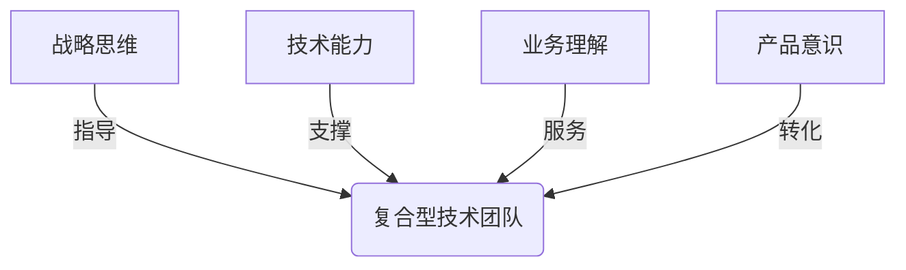
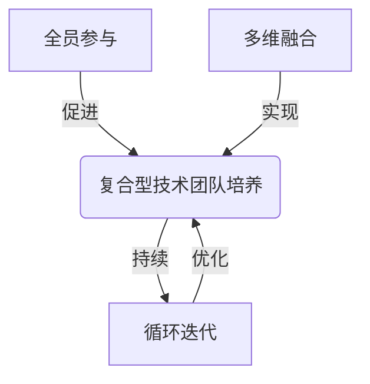

# 怎样建设和培养懂战略、懂技术、懂业务、懂产品的技术团队

## 1. 背景介绍

### 1.1 问题的由来

在当今快节奏的商业环境中，拥有一支出色的技术团队已经成为企业赢得竞争优势的关键因素。然而，仅仅拥有出色的技术能力已经不够,技术团队还需要具备全面的战略视野、深入的业务理解以及出色的产品意识,才能真正为企业创造价值。

传统的技术团队往往过于关注技术细节,缺乏对整体战略的认知,导致研发方向偏离企业发展大计。同时,技术人员对业务流程和用户需求的理解不足,开发出的产品难以真正解决实际问题。此外,产品思维的缺失也使得技术团队难以将技术转化为有价值的产品和服务。

因此,构建一支"懂战略、懂技术、懂业务、懂产品"的复合型技术团队,成为企业保持竞争力的迫切需求。

### 1.2 研究现状

目前,业界已经意识到培养复合型技术人才的重要性,并采取了一些措施来应对这一挑战。

一些大型科技公司开始引入产品经理、业务分析师等角色,充当技术团队与业务部门的桥梁,促进双方的理解与协作。同时,也有公司鼓励技术人员参与业务会议、用户访谈等活动,提高他们对业务和用户需求的认知。

此外,一些领先的技术公司还将战略规划、产品设计等内容纳入技术人员的培训计划,帮助他们拓展视野,提升战略思维和产品意识。

然而,这些措施往往是零散的,缺乏系统性。如何建立一个完整的体系,将战略、技术、业务和产品有机融合,培养真正的复合型技术人才,仍然是一个亟待解决的问题。

### 1.3 研究意义

建设和培养"懂战略、懂技术、懂业务、懂产品"的技术团队,对于企业的可持续发展至关重要:

1. **提高产品质量和用户体验**。复合型技术团队能够更好地理解用户需求,开发出符合实际场景的高质量产品,提升用户体验。

2. **加快产品迭代和创新**。技术团队掌握了业务和产品知识后,能够主动发现问题和机会,加快产品迭代和创新步伐。

3. **提升技术决策的前瞻性**。具备战略思维的技术团队能够预判技术发展趋势,做出更加前瞻的技术决策,避免被动跟随。

4. **促进技术与业务的融合**。复合型技术团队能够更好地理解企业战略,将技术与业务目标有机结合,创造更大的商业价值。

5. **吸引和留住优秀人才**。为技术人员提供全面发展的机会,有利于吸引和留住优秀的复合型人才。

因此,探索如何系统地建设和培养这种复合型技术团队,对于企业的可持续发展具有重要意义。

### 1.4 本文结构

本文将从以下几个方面阐述如何建设和培养"懂战略、懂技术、懂业务、懂产品"的技术团队:

1. 明确复合型技术团队的核心能力,并分析其重要性。
2. 介绍培养复合型技术人才的核心方法和具体实施步骤。
3. 探讨如何构建支持复合型技术团队发展的组织架构和文化环境。
4. 分析在实践中可能遇到的挑战,并提出应对策略。
5. 总结复合型技术团队对企业发展的重要意义,并展望未来发展趋势。

## 2. 核心概念与联系

培养"懂战略、懂技术、懂业务、懂产品"的复合型技术团队,需要将以下四个核心概念有机融合:

1. **战略思维**:技术团队需要具备全局观和前瞻性,能够把握企业发展大方向,将技术研发与企业战略目标紧密结合。

2. **技术能力**:扎实的技术功底是复合型技术团队的基础,包括编程、架构设计、工程实践等多方面的专业技能。

3. **业务理解**:技术团队必须深入理解企业的业务流程、商业模式和用户需求,才能开发出真正有价值的产品和解决方案。

4. **产品意识**:技术团队需要具备产品思维,能够将技术转化为有价值的产品和服务,并不断优化和迭代以满足用户需求。

这四个核心概念相互依赖、相辅相成。战略思维为技术团队指明方向,技术能力提供支撑,业务理解确保解决方案与实际需求相符,产品意识则将技术转化为可交付的价值。只有将这四个方面有机融合,才能真正建设出"懂战略、懂技术、懂业务、懂产品"的复合型技术团队。

## 3. 核心算法原理 & 具体操作步骤

培养复合型技术团队是一个系统性的过程,需要从多个维度入手。本节将介绍其核心算法原理和具体操作步骤。

### 3.1 算法原理概述

培养复合型技术团队的核心算法原理可以概括为"全员参与、多维融合、循环迭代"。

1. **全员参与**:培养复合型技术团队需要技术人员、产品经理、业务人员和战略决策者的共同参与和配合。

2. **多维融合**:需要将战略思维、技术能力、业务理解和产品意识这四个维度有机融合,形成一个完整的体系。

3. **循环迭代**:培养复合型技术团队是一个持续的过程,需要不断优化和迭代,形成正向循环。

### 3.2 算法步骤详解

基于上述原理,培养复合型技术团队的具体算法步骤如下:

1. **建立共识,明确目标**
   
   首先需要让全体相关人员认识到培养复合型技术团队的重要性,明确预期目标和效果。

2. **构建知识体系**
   
   整合战略、技术、业务和产品等多个维度的知识,构建一个系统的复合型知识体系。

3. **设计培养计划**
   
   基于知识体系,设计全面的培养计划,包括课程培训、实践项目、导师指导等多种形式。

4. **组建跨职能团队**
   
   组建包含技术、产品、业务和战略等不同角色的跨职能团队,促进多维度的交流和融合。

5. **实施培养计划**
   
   按计划有序实施各项培养活动,注重理论和实践的结合。

6. **持续反馈和优化**
   
   定期收集反馈,评估培养效果,并根据反馈持续优化培养计划和方法。

7. **建立激励机制**
   
   建立合理的激励机制,鼓励技术人员主动学习和发展,形成正向循环。

8. **优化组织架构**
   
   根据需要优化组织架构,为复合型技术团队的发展提供有利环境。

9. **培养导师和领导者**
   
   重点培养复合型技术领导者和导师,形成可持续发展的人才梯队。

10. **持续迭代和完善**
    
    将上述步骤形成闭环,持续迭代和完善,不断提高复合型技术团队的能力和水平。

### 3.3 算法优缺点

上述算法的优点在于:

1. 全面性强,涵盖了培养复合型技术团队所需的各个关键环节。
2. 注重理论和实践相结合,有利于知识的内化和能力的提升。
3. 采用循环迭代的方式,可以持续优化和完善培养体系。
4. 强调全员参与,有利于形成组织内部的共识和文化氛围。

但也存在一些潜在缺点:

1. 实施过程较为复杂,需要多方面的资源投入和精心组织。
2. 短期内可能会增加一定的运营成本和人力投入。
3. 需要一定时间才能看到显著的培养效果,存在一定风险。
4. 对组织的领导力和执行力有较高要求,否则难以推行。

因此,在实施该算法时,需要根据具体情况进行权衡,并做好充分的准备工作。

### 3.4 算法应用领域

培养复合型技术团队的需求不仅存在于科技行业,在传统行业的数字化转型过程中也越来越受到重视。该算法可以广泛应用于以下领域:

1. **科技公司**:科技公司是培养复合型技术团队的主要需求方,算法可以帮助他们提升技术创新能力和产品竞争力。

2. **互联网公司**:互联网公司需要快速响应用户需求,算法有助于培养敏捷高效的复合型技术团队。

3. **制造业**:制造业正在向数字化、智能化转型,需要复合型技术团队来推动智能制造的发展。

4. **金融业**:金融科技的兴起要求技术团队深入理解金融业务,算法可以帮助培养复合型金融科技人才。

5. **医疗健康**:医疗健康领域对技术创新有着巨大需求,复合型技术团队可以促进医疗科技的发展。

6. **教育培训**:算法不仅可以应用于企业内部,也可以用于高校和培训机构培养复合型技术人才。

总之,无论是新兴行业还是传统行业,只要存在对复合型技术人才的需求,该算法都可以发挥作用,帮助企业和机构培养所需的人才。

## 4. 数学模型和公式 & 详细讲解 & 举例说明

为了更好地量化和优化复合型技术团队的培养过程,我们可以借助数学模型和公式进行建模和分析。

### 4.1 数学模型构建

我们将复合型技术团队的能力水平定义为一个四维向量:

$$
\vec{C} = (c_s, c_t, c_b, c_p)
$$

其中:

- $c_s$ 表示战略思维能力
- $c_t$ 表示技术能力
- $c_b$ 表示业务理解能力
- $c_p$ 表示产品意识能力

我们的目标是最大化这个四维向量的模长,即:

$$
\max \lVert \vec{C} \rVert = \max \sqrt{c_s^2 + c_t^2 + c_b^2 + c_p^2}
$$

在培养过程中,我们可以通过不同的措施来提升这四个维度的能力值,例如:

- 战略培训提升 $c_s$
- 技术培训提升 $c_t$
- 业务实践提升 $c_b$
- 产品设计实践提升 $c_p$

但是,由于资源有限,我们需要在这四个维度之间进行权衡和平衡。我们可以引入一个权重向量 $\vec{w} = (w_s, w_t, w_b, w_p)$,表示对四个维度的重视程度。

则我们的优化目标可以表示为:

$$
\max \vec{w} \cdot \vec{C} = \max (w_s c_s + w_t c_t + w_b c_b + w_p c_p)
$$

$$
\text{s.t. } \sum_{i=1}^4 w_i = 1, \quad w_i \geq 0
$$

这个优化问题可以通过线性规划等方法求解,得到最优的权重向量 $\vec{w}^*$,从而指导我们在四个维度之间进行资源分配。

### 4.2 公式推导过程

下面我们将推导出上述优化目标的解析解。

首先,我们可以将原优化问题转化为拉格朗日函数:

$$
L(\vec{w},