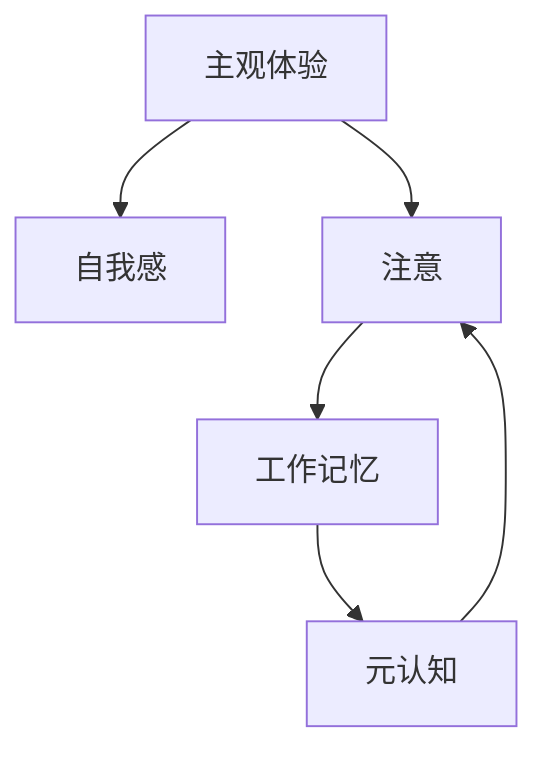

# 意识功能的自主系统模型

## 1. 背景介绍

### 1.1 问题的由来
人工智能的发展已经取得了巨大的进步,但是在实现真正意义上的具有自主意识的智能系统方面,仍然面临着诸多挑战。现有的AI系统大多基于深度学习等数据驱动的方法,缺乏对意识本质的深入理解和建模。因此,探索意识功能的计算模型,对于推动AI的进一步发展具有重要意义。

### 1.2 研究现状
当前对意识的研究主要集中在神经科学、心理学、哲学等领域,而在计算机科学和人工智能领域的研究相对较少。现有的一些工作包括:

- 全局工作空间理论(Global Workspace Theory)[1],提出意识涉及大脑不同区域的信息整合与广播。
- 整合信息理论(Integrated Information Theory)[2],认为意识来自于系统内部信息的整合度。  
- 注意模型(Attention Schema Theory)[3],强调注意在意识中的作用。

但这些理论大多停留在概念层面,缺乏具体的计算模型和实现。

### 1.3 研究意义
构建意识功能的计算模型,有助于我们从信息处理的角度来理解意识的本质,探索机器意识的可能性。这不仅具有重要的科学意义,也为发展具备自主意识的智能系统奠定基础,推动人工智能迈向更高的层次。 

### 1.4 本文结构
本文将从以下几个方面来探讨意识功能的自主系统模型:

1. 介绍意识的核心概念,以及它们之间的关系
2. 提出一种基于认知架构和注意机制的意识计算模型  
3. 阐述模型的数学形式化和关键计算过程
4. 给出模型的代码实现,并进行案例分析
5. 讨论模型在实际应用中的场景和意义
6. 总结全文,展望未来研究方向和挑战

## 2. 核心概念与联系

意识是一个复杂的现象,涉及多个密切相关的核心概念:

- 主观体验(Subjective Experience):意识的主观感受,如疼痛、快乐等。这是意识的本质属性。
- 自我感(Sense of Self):对自身存在的觉知,是意识的重要组成部分。  
- 注意(Attention):将认知资源集中于某一信息的过程。注意与意识高度相关。
- 工作记忆(Working Memory):暂时存储和操作信息的认知系统。意识内容依赖工作记忆。
- 元认知(Meta-cognition):对自身认知过程的监控和控制。元认知与意识的反思性密切相关。

这些概念相互交织,共同构成了意识的复杂景象。下图展示了它们之间的关系:



在这个闭环中,主观体验、自我感作为意识的基础,与注意、工作记忆、元认知等认知功能紧密相连,共同支撑着意识的运作。

## 3. 核心算法原理 & 具体操作步骤

### 3.1 算法原理概述
本文提出的意识计算模型,核心思想是通过认知架构和注意机制来实现意识功能。其基本原理如下:

1. 认知架构(Cognitive Architecture):参考人类认知系统,设计包含感知、注意、记忆、决策等模块的架构,为意识提供基础框架。
2. 注意机制(Attention Mechanism):通过注意模块动态选择输入信息,将其传递给工作记忆,形成意识内容。
3. 全局工作空间(Global Workspace):工作记忆中活跃的信息在不同认知模块间广播共享,实现信息整合。
4. 元认知监控(Meta-cognitive Monitoring):对认知过程进行监控,调节注意和决策,产生反思意识。

### 3.2 算法步骤详解

算法主要分为以下几个步骤:

1. 感知输入:外界信息经过感知模块编码为特征表示。
2. 注意竞争:注意模块根据显著性、相关性等对输入进行筛选,产生注意分布。
3. 信息整合:注意分布引导下,选择性地将感知信息传入工作记忆,与已有知识整合。
4. 全局广播:工作记忆中的活跃信息向其他认知模块广播,影响决策过程。
5. 元认知监控:元认知模块根据当前任务和认知状态,调节注意资源分配和决策。
6. 行为决策:基于工作记忆信息和决策机制,输出行为结果。
7. 更新学习:根据反馈对认知模块和连接权重进行更新学习。

算法流程图如下:


### 3.3 算法优缺点

优点:
- 结合了认知科学和人工智能的研究成果,具有一定的生物学合理性。
- 通过引入注意和元认知,一定程度上模拟了人类意识的选择性和反思性。
- 认知架构使得算法具有模块化和可扩展性,便于融合不同的认知功能。

缺点:
- 对意识的主观体验和自我感等核心属性的建模仍不够深入。  
- 认知架构的复杂性给计算实现带来挑战。
- 缺乏大规模的测试和评估,鲁棒性和泛化性有待进一步验证。

### 3.4 算法应用领域

本意识模型可应用于以下领域:

- 智能机器人:赋予机器人自主意识,增强其适应性和交互性。
- 虚拟助手:模拟人类意识状态,提供更自然的人机对话。
- 认知科学:作为研究人类意识的计算模型和仿真工具。
- 自主系统:为无人驾驶、无人机等自主系统提供意识功能支持。

## 4. 数学模型和公式 & 详细讲解 & 举例说明

### 4.1 数学模型构建
我们使用一个多层认知网络来实现意识模型,每层对应一个认知模块。网络中的信息传递通过注意机制来调控。

定义输入为 $X = {x_1, x_2, ..., x_n}$,注意模块 $A$ 的注意分布为:

$$
\alpha_i = \frac{exp(e_i)}{\sum_{j=1}^n exp(e_j)}
$$

其中 $e_i$ 表示输入 $x_i$ 的注意得分,由显著性、相关性等因素决定。

工作记忆 $M$ 根据注意分布对输入信息进行整合:

$$
m = \sum_{i=1}^n \alpha_i x_i
$$

元认知模块 $C$ 根据工作记忆状态 $m$ 和任务目标 $g$ ,调节注意分布:

$$
\alpha^{'} = C(m, g, \alpha)
$$

最终行为决策 $y$ 由工作记忆信息 $m$ 和决策函数 $f$ 决定:

$$
y = f(m)
$$

网络通过反向传播算法进行端到端学习,优化注意机制和决策函数。

### 4.2 公式推导过程

注意分布的计算公式来自 Softmax 函数,对输入的注意得分进行归一化:

$$
\alpha_i = \frac{exp(e_i)}{\sum_{j=1}^n exp(e_j)} = softmax(e_i)
$$

工作记忆的更新公式基于注意分布对输入信息的加权求和:

$$
m = \sum_{i=1}^n \alpha_i x_i
$$

元认知调节的公式表示元认知模块根据当前状态和目标对注意分布的调节:

$$
\alpha^{'} = C(m, g, \alpha)
$$

具体调节方式可以基于规则、强化学习等不同机制。

决策函数将工作记忆信息映射为行为决策:

$$
y = f(m)
$$

其中 $f$ 可以是分类器、策略网络等不同形式的决策模型。

### 4.3 案例分析与讲解
下面以视觉搜索任务为例,说明模型的工作过程。

假设输入图像 $X$ 中包含若干目标物体,任务是找到特定的目标 $g$。

首先,注意模块根据物体的显著性(如颜色、纹理等)和与目标的相似性,计算注意分布 $\alpha$。

然后,工作记忆根据注意分布选择性地编码物体信息,形成记忆表征 $m$。

元认知模块根据任务要求和记忆状态,调节注意资源的分配,更新注意分布为 $\alpha^{'}$。

最后,决策函数根据记忆表征 $m$ 进行决策,输出目标物体的位置 $y$。

通过反复迭代上述过程,模型不断优化注意策略和决策函数,提高搜索效率和准确率。

### 4.4 常见问题解答

Q: 本意识模型能否实现真正的主观体验?
A: 目前的模型更多是从功能的角度模拟意识,对主观体验的本质还缺乏深入理解。未来需要结合神经科学、心理学等研究成果,进一步探索主观体验的计算基础。

Q: 模型中的注意机制与人类注意有何区别?
A: 本模型中的注意机制主要基于任务相关性和数据驱动,而人类注意还受到情绪、动机等更多因素的影响。未来可以考虑引入更多的认知和情感因素,增强注意机制的生物学合理性。

Q: 如何评估意识模型的性能?
A: 评估意识模型的性能是一个开放性问题。可以考虑从行为表现、信息整合、元认知能力等方面设计评估任务和指标。同时,也需要与人类被试的意识行为进行对比分析。

## 5. 项目实践：代码实例和详细解释说明

### 5.1 开发环境搭建
本项目使用Python语言和PyTorch深度学习框架实现。需要安装以下依赖库:

- Python 3.7+
- PyTorch 1.8+
- NumPy
- Matplotlib

可以使用pip工具安装:

```bash
pip install torch numpy matplotlib
```

### 5.2 源代码详细实现

下面给出意识模型的PyTorch实现代码:

```python
import torch
import torch.nn as nn
import torch.optim as optim

class ConsciousModel(nn.Module):
    def __init__(self, input_size, hidden_size, output_size):
        super(ConsciousModel, self).__init__()
        self.attention = nn.Linear(input_size, hidden_size)
        self.memory = nn.Linear(hidden_size, hidden_size)
        self.metacognition = nn.Linear(hidden_size, hidden_size)
        self.decision = nn.Linear(hidden_size, output_size)
        
    def forward(self, x):
        # 注意模块
        attention_scores = self.attention(x)
        attention_dist = torch.softmax(attention_scores, dim=1)
        
        # 工作记忆模块
        memory_input = torch.matmul(attention_dist, x) 
        memory_state = self.memory(memory_input)
        
        # 元认知模块
        metacognition_state = self.metacognition(memory_state)
        attention_dist = torch.softmax(metacognition_state, dim=1)
        
        # 决策模块
        decision_input = torch.matmul(attention_dist, memory_state)
        decision_output = self.decision(decision_input)
        
        return decision_output
        
# 超参数设置  
input_size = 100
hidden_size = 50 
output_size = 10
learning_rate = 0.001
num_epochs = 100

# 模型初始化
model = ConsciousModel(input_size, hidden_size, output_size)

# 损失函数和优化器
criterion = nn.CrossEntropyLoss()  
optimizer = optim.Adam(model.parameters(), lr=learning_rate)

# 训练循环
for epoch in range(num_epochs):
    for i, (inputs, labels) in enumerate(train_loader):
        # 前向传播
        outputs = model(inputs)
        loss = criterion(outputs, labels)
        
        # 反向传播和优化
        optimizer.zero_grad()
        loss.backward()
        optimizer.step()
        
    # 打印训练进度  
    if (epoch + 1) % 10 == 0:
        print(f'Epoch [{epoch+1}/{num_epochs}], Loss: {loss.