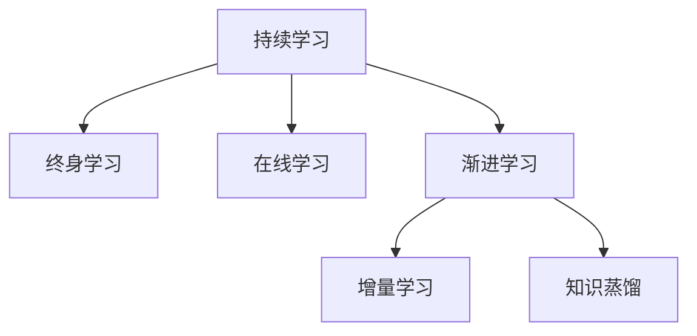

# 持续学习与渐进学习原理与代码实战案例讲解

关键词：持续学习、渐进学习、机器学习、终身学习、在线学习、知识增量、知识迁移

## 1. 背景介绍

### 1.1 问题的由来
在人工智能快速发展的今天,机器学习模型面临着数据分布变化、概念漂移等诸多挑战。传统的批量学习模式难以适应这种动态变化的场景,亟需一种能够持续学习、不断进化的学习范式。持续学习(Continual Learning)和渐进学习(Incremental Learning)应运而生,为解决上述问题提供了新的思路和方法。

### 1.2 研究现状
目前,持续学习和渐进学习已经成为机器学习领域的研究热点。谷歌DeepMind、斯坦福大学、加州大学伯克利分校等知名研究机构都在积极探索这一方向。一些代表性的工作包括:EWC(Elastic Weight Consolidation)、GEM(Gradient Episodic Memory)、iCaRL(Incremental Classifier and Representation Learning)等。这些方法从不同角度解决了灾难性遗忘、增量学习等问题,取得了一定的研究进展。

### 1.3 研究意义
持续学习和渐进学习对于构建真正智能的AI系统具有重要意义:

1. 适应动态环境:现实世界是复杂多变的,数据分布经常发生改变。持续学习使得模型能够不断适应环境,保持性能稳定。

2. 节省存储和计算资源:批量学习需要存储大量历史数据,占用存储空间。而持续学习通过知识蒸馏、增量更新等技术,大大减少了对存储和计算资源的需求。

3. 实现知识迁移和泛化:通过持续学习,模型可以在已学习的知识基础上学习新知识,实现知识的迁移和泛化,这是通向通用人工智能的关键一步。

4. 模拟人类学习特点:人类具有持续学习、终身学习的能力。研究持续学习有助于揭示人脑学习的奥秘,为构建类脑智能提供借鉴。

### 1.4 本文结构
本文将重点介绍持续学习与渐进学习的核心概念、原理、经典算法以及代码实战。全文分为以下几个部分:

第2部分介绍持续学习与渐进学习的核心概念与联系。

第3部分重点讲解持续学习的核心算法原理与具体步骤。

第4部分通过数学模型和公式推导,加深读者对算法的理解。

第5部分提供了详细的代码实例和解释说明,手把手教你实现持续学习。

第6部分讨论了持续学习和渐进学习的实际应用场景。

第7部分推荐了一些学习资源和开发工具。

第8部分对全文进行总结,并对未来的发展趋势和挑战进行展望。

第9部分的附录,解答了一些常见问题。

## 2. 核心概念与联系

持续学习(Continual Learning)和渐进学习(Incremental Learning)是两个密切相关但又有所区别的概念。

持续学习是指让机器在连续的学习过程中不断获取新知识,同时保持对之前学习知识的记忆,防止灾难性遗忘(Catastrophic Forgetting)。持续学习的目标是使得模型像人一样,具备持续学习、终身学习的能力。

渐进学习是持续学习的一个子集,它更关注如何在保留已有知识的基础上,逐步学习新的知识。渐进学习的核心是增量更新(Incremental Update),即每学习一个新任务,都在原有模型的基础上进行增量更新,而不是重新训练整个模型。

二者的联系可以用下面的 Mermaid 图来表示:

可以看出,持续学习是一个更广泛的概念,包含了终身学习、在线学习、渐进学习等多个方面。而渐进学习是持续学习的一个重要分支,主要通过增量学习和知识蒸馏来实现。

## 3. 核心算法原理 & 具体操作步骤

### 3.1 算法原理概述
持续学习的核心是如何在学习新知识的同时,保持对已学知识的记忆,避免灾难性遗忘。主流的持续学习算法可以分为三类:

1. 正则化方法:通过添加正则化项来约束重要参数的更新,代表算法有 EWC、SI 等。

2. 记忆回放方法:通过存储一部分历史数据,在学习新任务时回放这些数据,代表算法有 GEM、A-GEM 等。 

3. 动态架构方法:通过动态调整网络架构来适应新任务,代表算法有 Progressive Networks、DEN 等。

下面我们以 EWC 算法为例,详细讲解其原理和步骤。

### 3.2 算法步骤详解
EWC(Elastic Weight Consolidation)是一种基于正则化的持续学习算法,核心思想是对重要参数施加约束,使其在学习新任务时不会发生剧烈变化。

算法主要分为三个步骤:

1. 计算 Fisher 信息矩阵:
$$
F=\mathbb{E}_{x \sim D}\left[\left(\frac{\partial \log p(y|x,\theta)}{\partial \theta}\right)^2\right]
$$
其中 $D$ 表示旧任务的数据集,$\theta$ 表示模型参数。Fisher 信息矩阵度量了每个参数对旧任务的重要性。

2. 计算正则化项:
$$
L_{EWC}=\sum_i \frac{\lambda}{2} F_i(\theta_i-\theta_{A,i}^*)^2
$$
其中 $\lambda$ 是正则化系数,$\theta_A^*$ 是旧任务的参数,$i$ 表示参数的索引。正则化项惩罚了那些对旧任务重要但在新任务中发生剧烈变化的参数。

3. 最终的损失函数为:
$$
L=L_B+L_{EWC}
$$
其中 $L_B$ 是新任务的损失函数。最小化该损失函数,可以在学习新任务的同时保护旧任务的重要参数。

### 3.3 算法优缺点

EWC 算法的优点是:

1. 无需存储旧数据,节省存储空间。
2. 通过 Fisher 信息矩阵,自适应地衡量每个参数的重要性。
3. 正则化项可以有效缓解灾难性遗忘问题。

但 EWC 也存在一些局限性:

1. Fisher 信息矩阵的计算比较耗时,不适合大规模数据集。
2. 需要提前知道任务的边界,不能处理任务无界的情况。
3. 对于某些复杂任务,EWC 的效果有限,需要结合其他方法。

### 3.4 算法应用领域
EWC 和其他持续学习算法已经在多个领域得到应用,比如:

1. 自然语言处理:持续学习新的语言知识,同时保持对已学语言的记忆。
2. 计算机视觉:在无需重新训练的情况下,持续扩充图像分类的类别。
3. 强化学习:智能体在连续的游戏关卡中持续学习和进化策略。
4. 机器人控制:机器人在执行新任务的同时,保持对已学技能的记忆。

持续学习使得机器学习模型能够像人一样持续进化、不断超越,为实现通用人工智能铺平了道路。

## 4. 数学模型和公式 & 详细讲解 & 举例说明

### 4.1 数学模型构建
为了更好地理解 EWC 算法,我们首先构建一个简化的数学模型。假设一个两层的神经网络,其中输入层有 $n$ 个节点,隐藏层有 $m$ 个节点,输出层有 $k$ 个节点。我们用 $W^{(1)} \in \mathbb{R}^{n \times m}$ 和 $W^{(2)} \in \mathbb{R}^{m \times k}$ 分别表示输入层到隐藏层和隐藏层到输出层的权重矩阵。

给定一个样本 $(x,y)$,其中 $x \in \mathbb{R}^n$ 表示输入特征,$y \in \{0,1\}^k$ 表示 one-hot 编码的标签。神经网络的前向传播过程可以表示为:

$$
\begin{aligned}
h &= \sigma(W^{(1)}x) \\
\hat{y} &= \text{softmax}(W^{(2)}h)
\end{aligned}
$$

其中 $\sigma$ 是激活函数(如 ReLU),$\text{softmax}$ 是归一化指数函数,用于将输出转化为概率分布。

网络的训练目标是最小化交叉熵损失函数:

$$
L=-\sum_{i=1}^k y_i \log \hat{y}_i
$$

通过反向传播和梯度下降,可以不断更新权重矩阵 $W^{(1)}$ 和 $W^{(2)}$ ,使得损失函数最小化。

### 4.2 公式推导过程
下面我们详细推导 EWC 算法中的关键公式。为了简洁起见,我们用 $\theta$ 表示神经网络的所有参数,即:

$$
\theta=(W^{(1)},W^{(2)})
$$

根据 EWC 算法的步骤,首先需要计算 Fisher 信息矩阵。Fisher 信息矩阵定义为损失函数梯度的外积的期望,即:

$$
F=\mathbb{E}_{x \sim D}\left[\left(\frac{\partial L}{\partial \theta}\right)^2\right]
$$

利用链式法则,可以将损失函数对参数的梯度写成:

$$
\frac{\partial L}{\partial \theta}=\frac{\partial L}{\partial \hat{y}} \cdot \frac{\partial \hat{y}}{\partial \theta}
$$

其中 $\frac{\partial L}{\partial \hat{y}}$ 是损失函数对输出的梯度,$\frac{\partial \hat{y}}{\partial \theta}$ 是输出对参数的梯度。根据交叉熵损失函数的定义,可以得到:

$$
\frac{\partial L}{\partial \hat{y}_i}=- \frac{y_i}{\hat{y}_i}
$$

根据 softmax 函数的性质,可以得到:

$$
\frac{\partial \hat{y}_i}{\partial \theta}=\hat{y}_i(\mathbf{1}(i=j)-\hat{y}_j) \cdot \frac{\partial (W^{(2)}h)_j}{\partial \theta}
$$

将以上两式代入,可以得到损失函数对参数的完整梯度表达式。进一步地,将其代入 Fisher 信息矩阵的定义式,并利用独立同分布的性质,可以得到 Fisher 信息矩阵的近似计算公式:

$$
F \approx \frac{1}{|D|} \sum_{x \in D} \left(\frac{\partial L}{\partial \theta}\right)^2
$$

这样,我们就可以在旧任务的数据集 $D$ 上计算出 Fisher 信息矩阵。

有了 Fisher 信息矩阵,我们就可以构造 EWC 正则化项:

$$
L_{EWC}=\sum_i \frac{\lambda}{2} F_i(\theta_i-\theta_{A,i}^*)^2
$$

其中 $\lambda$ 是正则化系数,$\theta_A^*$ 是旧任务的参数,$i$ 表示参数的索引。这个正则化项的作用是惩罚那些对旧任务重要(即 Fisher 信息值大)但在新任务中发生剧烈变化的参数,从而起到保护旧知识的作用。

最后,将 EWC 正则化项加入到新任务的损失函数中,得到最终的目标函数:

$$
L=L_B+L_{EWC}
$$

其中 $L_B$ 是新任务的交叉熵损失函数。最小化这个目标函数,就可以在学习新知识的同时,最大限度地保护旧知识,达到持续学习的目的。

### 4.3 案例分析与讲解
下面我们以一个简单的案例来说明 EWC 算法的效果。假设我们要训练一个手写数字识别模型,数据集是 MNIST。我们先在 0~4 这5个数字上训练模型,然后再