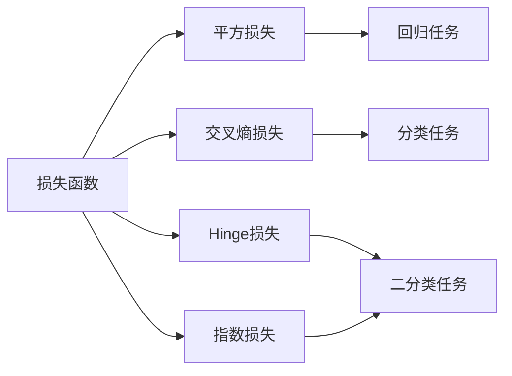

# 损失函数 (Loss Function) 原理与代码实例讲解

关键词：损失函数、机器学习、深度学习、优化算法、梯度下降、反向传播

## 1. 背景介绍
### 1.1 问题的由来
在机器学习和深度学习中,模型的训练过程本质上是一个优化问题。我们需要通过不断调整模型的参数,使得模型在训练数据上的表现尽可能地好。而衡量模型表现好坏的关键就在于选择一个合适的损失函数(Loss Function)。损失函数能够量化模型预测值与真实值之间的差距,指导模型的优化方向。因此,深入理解损失函数的原理和使用方法,对于训练出高质量的机器学习模型至关重要。

### 1.2 研究现状
目前,损失函数的研究已经取得了长足的进展。在不同的任务中,研究者们提出了各种各样的损失函数,如用于分类问题的交叉熵损失函数、用于回归问题的均方误差损失函数等。同时,针对一些特定问题,也出现了新的损失函数变种,如Focal Loss、Center Loss等。这些损失函数的合理应用,极大地推动了机器学习技术的发展。

### 1.3 研究意义
深入研究损失函数的意义主要体现在以下几个方面:

1. 指导模型优化方向,提升性能。合适的损失函数能够准确反映模型的优化目标,引导模型朝着正确的方向更新参数,从而获得更好的性能。

2. 加速模型收敛,节省计算资源。选择恰当的损失函数,可以加快模型的收敛速度,减少训练所需的迭代次数和时间,节省计算资源。

3. 适应不同任务需求,提高模型泛化能力。针对不同类型的任务和数据,设计出更加有针对性的损失函数,能够帮助模型更好地学习到数据的内在规律,提高模型的泛化能力。

### 1.4 本文结构
本文将全面介绍损失函数的相关知识,内容组织如下:

- 第2部分介绍损失函数的核心概念和基本类型。
- 第3部分讲解损失函数在模型优化中的作用原理和具体步骤。  
- 第4部分通过数学模型和公式推导,加深读者对损失函数的理解。
- 第5部分给出损失函数的代码实现示例,并进行详细解释。
- 第6部分列举损失函数在实际任务中的应用场景。
- 第7部分推荐一些学习损失函数的资源和工具。
- 第8部分对全文内容进行总结,并对损失函数的未来发展趋势和挑战进行展望。
- 第9部分的附录中列出了一些常见问题与解答,帮助读者解决疑惑。

## 2. 核心概念与联系

在讨论损失函数的细节之前,我们先来了解一下几个核心概念:

- 模型参数(Model Parameters):机器学习模型中需要学习的参数,通常用 $\theta$ 表示。
- 预测值(Predicted Value):模型根据输入数据给出的预测结果,记为 $\hat{y}$。
- 真实值(True Value):数据对应的真实标签,记为 $y$。
- 损失函数(Loss Function):用于衡量预测值与真实值之间差异的函数,记为 $L$。

损失函数的作用就是量化模型的预测值 $\hat{y}$ 与真实值 $y$ 之间的差距。通过最小化损失函数,可以使得模型的预测结果尽可能接近真实标签,从而提高模型的性能。

常见的损失函数可以分为以下几类:

1. 平方损失(Square Loss):用于回归任务,计算预测值与真实值差值的平方。
2. 交叉熵损失(Cross Entropy Loss):用于分类任务,衡量预测概率分布与真实分布之间的差异。
3. Hinge损失(Hinge Loss):用于二分类任务,鼓励正负样本的预测值超过一定阈值。
4. 指数损失(Exponential Loss):用于二分类任务,对分类错误的样本施加更大的惩罚。

下图展示了几种常见损失函数之间的联系与区别:



从图中可以看出,不同类型的损失函数适用于不同的任务。在实际应用中,需要根据具体问题选择合适的损失函数。

## 3. 核心算法原理 & 具体操作步骤
### 3.1 算法原理概述
机器学习模型的训练过程可以看作是一个优化问题,目标是最小化损失函数。假设我们的模型为 $f(x;\theta)$,其中 $x$ 为输入数据, $\theta$ 为模型参数。给定训练数据集 $\{(x_1,y_1),\cdots,(x_N,y_N)\}$,模型的优化目标可以表示为:

$$
\min_{\theta} \frac{1}{N} \sum_{i=1}^N L(f(x_i;\theta),y_i)
$$

其中, $L$ 为选定的损失函数。上式表示我们希望找到一组参数 $\theta$,使得模型在训练集上的平均损失最小。

### 3.2 算法步骤详解
为了优化模型参数,通常采用梯度下降(Gradient Descent)算法。梯度下降的基本思想是:沿着损失函数梯度的反方向更新参数,使得损失函数的值不断减小,直到达到最小值。

具体步骤如下:

1. 随机初始化模型参数 $\theta$。
2. 重复以下步骤,直到满足停止条件(如达到最大迭代次数或损失函数值的变化小于某个阈值):
   a. 从训练集中随机选择一个小批量(mini-batch)数据 $\{(x_1,y_1),\cdots,(x_m,y_m)\}$。
   b. 在当前参数下,计算小批量数据的平均损失: $L=\frac{1}{m} \sum_{i=1}^m L(f(x_i;\theta),y_i)$。
   c. 计算损失函数关于参数的梯度: $\nabla_{\theta}L=\frac{1}{m} \sum_{i=1}^m \nabla_{\theta}L(f(x_i;\theta),y_i)$。
   d. 更新参数: $\theta \leftarrow \theta - \eta \nabla_{\theta}L$,其中 $\eta$ 为学习率。
3. 返回优化后的参数 $\theta$。

### 3.3 算法优缺点
梯度下降算法的优点包括:

- 原理简单,易于实现。
- 适用于各种类型的损失函数和模型。
- 在大规模数据上表现良好。

但梯度下降也存在一些缺点:

- 可能收敛到局部最优解。
- 对学习率和批量大小等超参数敏感。
- 在某些问题上收敛速度较慢。

### 3.4 算法应用领域
梯度下降算法在机器学习和深度学习中应用广泛,几乎所有的模型训练都离不开它。一些常见的应用领域包括:

- 图像分类
- 语音识别
- 自然语言处理
- 推荐系统
- 强化学习

## 4. 数学模型和公式 & 详细讲解 & 举例说明
### 4.1 数学模型构建
为了更好地理解损失函数的作用原理,我们以线性回归模型为例,建立数学模型。

假设我们有一组训练数据 $\{(x_1,y_1),\cdots,(x_N,y_N)\}$,其中 $x_i \in \mathbb{R}^d$ 为 $d$ 维特征向量, $y_i \in \mathbb{R}$ 为标量响应值。线性回归模型的目标是学习一个线性函数 $f(x)=w^Tx+b$,使得 $f(x_i)$ 尽可能接近 $y_i$。

选择均方误差作为损失函数,则优化目标可以写为:

$$
\min_{w,b} \frac{1}{N} \sum_{i=1}^N (w^Tx_i+b-y_i)^2
$$

### 4.2 公式推导过程
为了求解上述优化问题,我们对损失函数关于参数 $w$ 和 $b$ 求梯度:

$$
\begin{aligned}
\frac{\partial L}{\partial w} &= \frac{2}{N} \sum_{i=1}^N (w^Tx_i+b-y_i)x_i \\
\frac{\partial L}{\partial b} &= \frac{2}{N} \sum_{i=1}^N (w^Tx_i+b-y_i)
\end{aligned}
$$

根据梯度下降算法,参数的更新公式为:

$$
\begin{aligned}
w &\leftarrow w - \eta \frac{\partial L}{\partial w} \\
b &\leftarrow b - \eta \frac{\partial L}{\partial b}
\end{aligned}
$$

其中 $\eta$ 为学习率。重复执行上述更新,直到损失函数收敛或达到最大迭代次数。

### 4.3 案例分析与讲解
我们用一个简单的例子来说明线性回归的损失函数优化过程。假设训练数据如下:

| $x$ | $y$ |
|:---:|:---:|
| 1   | 2   |
| 2   | 4   |
| 3   | 6   |

我们的目标是找到一条直线 $y=wx+b$,使其尽可能拟合这些数据点。

首先,随机初始化参数,例如取 $w=1,b=0$。然后,计算当前参数下的损失函数值:

$$
L = \frac{1}{3}[(1+0-2)^2+(2+0-4)^2+(3+0-6)^2] = \frac{14}{3}
$$

接着,计算损失函数关于 $w$ 和 $b$ 的梯度:

$$
\begin{aligned}
\frac{\partial L}{\partial w} &= \frac{2}{3}[1(1+0-2)+2(2+0-4)+3(3+0-6)] = -\frac{14}{3} \\
\frac{\partial L}{\partial b} &= \frac{2}{3}[(1+0-2)+(2+0-4)+(3+0-6)] = -4
\end{aligned}
$$

取学习率 $\eta=0.1$,更新参数:

$$
\begin{aligned}
w &\leftarrow 1 - 0.1 \times (-\frac{14}{3}) \approx 1.47 \\
b &\leftarrow 0 - 0.1 \times (-4) = 0.4
\end{aligned}
$$

经过一次更新后,我们得到了新的参数值 $w \approx 1.47,b=0.4$。重复上述过程,不断更新参数,直到损失函数收敛。最终,我们可以得到一组最优参数,使得拟合直线与数据点尽可能接近。

### 4.4 常见问题解答
Q: 为什么要使用小批量数据,而不是整个训练集?
A: 使用小批量数据可以减少内存占用,加速计算。同时,小批量梯度下降也有一定的正则化效果,有助于避免过拟合。

Q: 如何选择合适的学习率?
A: 学习率是梯度下降算法中的一个重要超参数。如果学习率太小,收敛速度会很慢;如果学习率太大,可能会导致损失函数震荡甚至发散。一般可以通过尝试不同的学习率,观察损失函数的变化情况来选择合适的值。此外,也可以采用一些自适应学习率的优化算法,如Adam、RMSprop等。

## 5. 项目实践：代码实例和详细解释说明
### 5.1 开发环境搭建
本节我们将使用Python语言和PyTorch库来实现一个简单的线性回归模型,并使用均方误差损失函数进行优化。

首先,确保已经安装了Python和PyTorch。可以通过以下命令安装PyTorch:

```bash
pip install torch
```

### 5.2 源代码详细实现
下面是线性回归模型的PyTorch实现代码:

```python
import torch
import torch.nn as nn
import torch.optim as optim

# 定义数据
X = torch.tensor([[1.0], [2.0], [3.0]])
y = torch.tensor([[2