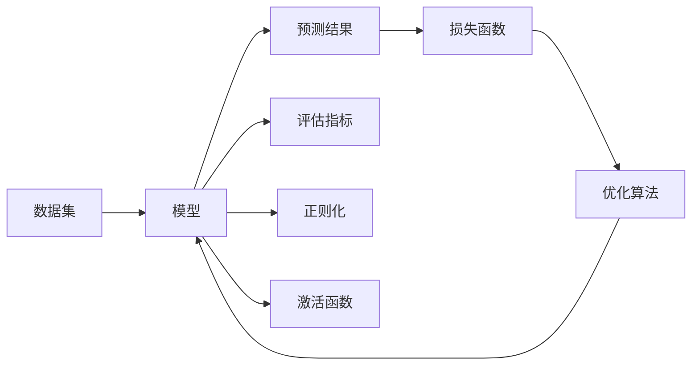

# 损失函数 (Loss Function) 原理与代码实例讲解

关键词：损失函数、机器学习、优化、梯度下降、回归、分类、PyTorch、TensorFlow

## 1. 背景介绍
### 1.1 问题的由来
在机器学习和深度学习中,损失函数(Loss Function)是一个非常重要的概念。它用于衡量模型预测值与真实值之间的差距,是优化模型参数、提高模型性能的关键。了解损失函数的原理和使用方法,对于理解机器学习算法和实现高效的模型训练至关重要。
### 1.2 研究现状
目前,损失函数已经在机器学习和深度学习的各个领域得到了广泛应用,如计算机视觉、自然语言处理、语音识别等。常见的损失函数包括均方误差(MSE)、交叉熵(Cross-entropy)、对数似然损失(Log-likelihood Loss)等。不同的任务和模型需要选择适合的损失函数。近年来,针对特定问题,研究者们也提出了许多新的损失函数变体,如Focal Loss、Center Loss等,以进一步提升模型的性能。
### 1.3 研究意义 
深入理解损失函数的原理和使用方法,对于机器学习从业者和研究者来说非常重要。通过学习损失函数,可以更好地理解模型训练的过程,并根据具体问题选择或设计合适的损失函数,从而提高模型的性能。此外,对损失函数的研究也有助于推动机器学习理论的发展,促进新的优化算法和模型结构的出现。
### 1.4 本文结构
本文将首先介绍损失函数的基本概念和常见类型,然后深入探讨几种主要损失函数的数学原理和适用场景。接着,我们将通过Python代码实例演示如何在PyTorch和TensorFlow中使用这些损失函数进行模型训练。最后,总结损失函数的发展趋势和面临的挑战,并提供一些学习资源和工具推荐。

## 2. 核心概念与联系
损失函数是用于衡量模型预测值与真实值之间差距的函数。在监督学习中,我们通过最小化损失函数来优化模型参数,使模型的预测结果尽可能接近真实标签。损失函数的选择直接影响模型的训练效果和收敛速度。

损失函数与以下几个概念密切相关:
- 优化算法:用于最小化损失函数,更新模型参数,如梯度下降法。
- 评估指标:用于评估模型的性能,如准确率、精确率、召回率等。
- 正则化:用于控制模型复杂度,防止过拟合,如L1/L2正则化。
- 激活函数:用于引入非线性,增强模型的表达能力,如ReLU、Sigmoid等。

下图展示了损失函数在机器学习中的核心地位和与其他概念的关系:



## 3. 核心算法原理 & 具体操作步骤
### 3.1 算法原理概述
损失函数的核心原理是通过衡量预测值与真实值的差距,将模型的训练目标量化为一个标量值。然后,利用优化算法(如梯度下降)不断调整模型参数,使损失函数的值最小化,从而得到性能良好的模型。

不同类型的机器学习任务(如回归、分类)需要选择不同的损失函数。例如,回归任务常用均方误差(MSE),分类任务常用交叉熵(Cross-entropy)。

### 3.2 算法步骤详解
以均方误差(MSE)为例,其数学定义为:

$$
\text{MSE} = \frac{1}{n} \sum_{i=1}^{n} (y_i - \hat{y}_i)^2
$$

其中,$n$为样本数,$y_i$为第$i$个样本的真实值,$\hat{y}_i$为第$i$个样本的预测值。

使用MSE作为损失函数的算法步骤如下:
1. 将数据集划分为训练集和验证集。
2. 定义包含MSE损失函数的模型,并初始化模型参数。
3. 对训练集进行多个Epoch的迭代:
   - 将训练数据输入模型,得到预测值。
   - 计算预测值与真实值的MSE损失。
   - 通过反向传播计算梯度,并用优化算法更新模型参数。
4. 在验证集上评估模型性能,根据需要调整超参数。
5. 重复步骤3-4,直到模型性能满足要求或达到预设的Epoch数。

### 3.3 算法优缺点
MSE损失函数的优点包括:
- 数学形式简单,易于理解和实现。
- 对异常值敏感,能够快速收敛到最优解。

缺点包括:  
- 可能受异常值影响较大,导致模型性能下降。
- 不适用于分类任务。

### 3.4 算法应用领域
MSE损失函数主要用于回归任务,如:
- 房价预测
- 销量预测
- 气温预测

其他常见损失函数如交叉熵、对数似然损失等,分别适用于不同的分类和概率估计任务。

## 4. 数学模型和公式 & 详细讲解 & 举例说明
### 4.1 数学模型构建
以二元交叉熵损失函数为例,其数学定义为:

$$
\text{BCE} = -\frac{1}{n} \sum_{i=1}^{n} [y_i \log(\hat{y}_i) + (1-y_i) \log(1-\hat{y}_i)]
$$

其中,$n$为样本数,$y_i \in \{0,1\}$为第$i$个样本的真实标签,$\hat{y}_i \in [0,1]$为第$i$个样本的预测概率。

### 4.2 公式推导过程
二元交叉熵损失函数的推导过程如下:

设样本的真实标签为$y$,预测概率为$\hat{y}$,则样本的似然函数为:

$$
P(y|\hat{y}) = \hat{y}^y (1-\hat{y})^{1-y}
$$

对似然函数取对数,得到对数似然函数:

$$
\log P(y|\hat{y}) = y \log(\hat{y}) + (1-y) \log(1-\hat{y})
$$

对所有样本的对数似然函数取平均,并取相反数,得到二元交叉熵损失函数:

$$
\text{BCE} = -\frac{1}{n} \sum_{i=1}^{n} [y_i \log(\hat{y}_i) + (1-y_i) \log(1-\hat{y}_i)]
$$

### 4.3 案例分析与讲解
考虑一个二分类问题,样本的真实标签为$y \in \{0,1\}$,模型预测概率为$\hat{y} \in [0,1]$。

假设有3个样本,其真实标签和预测概率如下:

| 样本 | 真实标签 $y$ | 预测概率 $\hat{y}$ |
|:---:|:---:|:---:|
| 1 | 1 | 0.8 |
| 2 | 0 | 0.3 |
| 3 | 1 | 0.6 |

根据二元交叉熵损失函数的定义,计算损失值:

$$
\begin{aligned}
\text{BCE} &= -\frac{1}{3} [1 \log(0.8) + (1-0) \log(1-0.3) + 1 \log(0.6)] \\
&= -\frac{1}{3} [\log(0.8) + \log(0.7) + \log(0.6)] \\
&\approx 0.363
\end{aligned}
$$

可以看出,预测概率与真实标签越接近,损失值越小;反之,损失值越大。这体现了二元交叉熵损失函数的优化目标:使预测概率尽可能接近真实标签。

### 4.4 常见问题解答
**Q:** 为什么要使用交叉熵作为分类任务的损失函数?

**A:** 交叉熵衡量了两个概率分布之间的差异性。在分类任务中,我们希望模型预测的概率分布尽可能接近真实标签的分布(即one-hot编码)。使用交叉熵作为损失函数,可以度量预测分布与真实分布的差异,并通过最小化交叉熵来优化模型参数,使预测结果更准确。

**Q:** 二元交叉熵损失函数和多分类交叉熵损失函数有什么区别?

**A:** 二元交叉熵用于二分类问题,真实标签为0或1,预测结果为概率值。多分类交叉熵用于多分类问题,真实标签为one-hot编码,预测结果为各类别的概率分布。它们的数学形式略有不同,但本质上都是衡量预测分布与真实分布的差异性。

## 5. 项目实践：代码实例和详细解释说明
### 5.1 开发环境搭建
本节将演示如何使用PyTorch和TensorFlow实现几种常见的损失函数。首先,确保已正确安装以下库:
- Python 3.x
- PyTorch
- TensorFlow

可以使用pip命令安装:

```bash
pip install torch
pip install tensorflow
```

### 5.2 源代码详细实现
#### PyTorch实现
```python
import torch
import torch.nn as nn

# 均方误差损失
mse_loss = nn.MSELoss()
y_true = torch.tensor([1.0, 2.0, 3.0])
y_pred = torch.tensor([1.2, 1.8, 3.3])
loss = mse_loss(y_pred, y_true)
print(f"MSE Loss: {loss.item():.4f}")

# 二元交叉熵损失
bce_loss = nn.BCELoss()
y_true = torch.tensor([1, 0, 1])
y_pred = torch.tensor([0.8, 0.3, 0.6])
loss = bce_loss(y_pred, y_true.float())
print(f"BCE Loss: {loss.item():.4f}")

# 多分类交叉熵损失
ce_loss = nn.CrossEntropyLoss()
y_true = torch.tensor([2, 0, 1])
y_pred = torch.tensor([[0.2, 0.3, 0.5], [0.7, 0.2, 0.1], [0.1, 0.6, 0.3]])
loss = ce_loss(y_pred, y_true)
print(f"Cross-entropy Loss: {loss.item():.4f}")
```

#### TensorFlow实现
```python
import tensorflow as tf

# 均方误差损失
mse_loss = tf.keras.losses.MeanSquaredError()
y_true = tf.constant([1.0, 2.0, 3.0])
y_pred = tf.constant([1.2, 1.8, 3.3])
loss = mse_loss(y_true, y_pred)
print(f"MSE Loss: {loss.numpy():.4f}")

# 二元交叉熵损失
bce_loss = tf.keras.losses.BinaryCrossentropy()
y_true = tf.constant([1, 0, 1])
y_pred = tf.constant([0.8, 0.3, 0.6])
loss = bce_loss(y_true, y_pred)
print(f"BCE Loss: {loss.numpy():.4f}")

# 多分类交叉熵损失
ce_loss = tf.keras.losses.SparseCategoricalCrossentropy()
y_true = tf.constant([2, 0, 1])
y_pred = tf.constant([[0.2, 0.3, 0.5], [0.7, 0.2, 0.1], [0.1, 0.6, 0.3]])
loss = ce_loss(y_true, y_pred)
print(f"Cross-entropy Loss: {loss.numpy():.4f}")
```

### 5.3 代码解读与分析
在PyTorch中,常见的损失函数都在`torch.nn`模块中定义,如`MSELoss`、`BCELoss`、`CrossEntropyLoss`等。使用时,先创建损失函数对象,然后将预测值和真实值传入即可计算损失。

在TensorFlow中,常见的损失函数在`tf.keras.losses`模块中定义,使用方法与PyTorch类似。

以上代码分别演示了如何使用均方误差、二元交叉熵和多分类交叉熵计算损失。需要注意的是:
- 对于二元交叉熵,真实标签和预测值都应为0-1之间的概率值。
- 对于多分类交叉熵,真实标签应为类别索引,预测值应为各类别的概率分布。

### 5.4 运行结果展示
运行以上PyTorch和TensorFlow代码,可以得