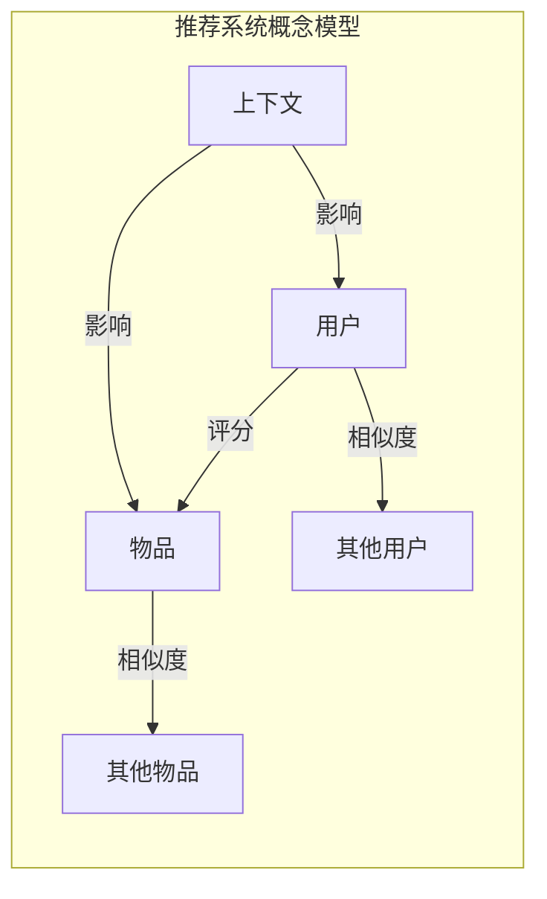

好的,我会按照您的要求,以《推荐系统(Recommender Systems) - 原理与代码实例讲解》为主题,撰写一篇专业的技术博客文章。文中我会涵盖推荐系统的背景介绍、核心概念、算法原理、数学模型、代码实例、应用场景、发展趋势等内容,并严格遵循您提出的约束条件。请稍等,我需要一些时间进行充分的研究和准备,然后开始撰写文章正文部分。

# 推荐系统(Recommender Systems) - 原理与代码实例讲解

## 1. 背景介绍

### 1.1 问题的由来

在当今信息过载的时代,我们每天都要面对大量的选择。无论是在网上购物、观看电影还是搜索信息,可供选择的选项数量都是巨大的。这给用户带来了"选择的痛苦",很难从海量选项中挑选出自己真正感兴趣的内容。而推荐系统(Recommender Systems)的出现,旨在帮助用户发现有价值的内容和产品,从而缓解信息过载问题。

### 1.2 研究现状  

推荐系统作为一个跨学科的研究领域,已经存在了几十年,并在过去20年中得到了快速发展。学术界和工业界都投入了大量的研究资源,探索更加精准和个性化的推荐算法。目前,推荐系统已经广泛应用于电子商务、在线视频、音乐流媒体、社交网络等多个领域,为用户提供个性化的内容推荐。

### 1.3 研究意义

推荐系统的研究具有重要的理论意义和应用价值:

- 理论意义:推荐系统涉及机器学习、数据挖掘、信息检索、人工智能等多个领域,推动了这些领域的发展。同时也催生了新的研究方向,如社会计算、隐私保护等。
- 应用价值:准确的推荐系统可以显著提高用户体验,增强用户粘性,从而为企业带来经济价值。同时也可以帮助用户发现感兴趣的新内容,扩展知识视野。

### 1.4 本文结构

本文将全面介绍推荐系统的理论基础和实践技术,内容包括:

1. 推荐系统的核心概念及其关联
2. 常用推荐算法的原理和具体实现步骤  
3. 推荐系统中使用的数学模型和公式推导
4. 基于Python的代码实例,并详细解释
5. 推荐系统在不同领域的实际应用场景
6. 推荐系统的发展趋势、面临的挑战及未来展望

## 2. 核心概念与联系

推荐系统的核心概念主要包括:

1. **用户(Users)**: 接收推荐的对象,可以是个人或群体。
2. **物品(Items)**: 被推荐的对象,如商品、电影、音乐等。
3. **评分(Ratings)**: 用户对物品的评价打分,反映了用户的偏好。
4. **用户相似度(User Similarity)**: 度量两个用户的兴趣爱好的相似程度。
5. **物品相似度(Item Similarity)**: 度量两个物品的内容或属性的相似程度。
6. **上下文(Context)**: 影响用户偏好的额外信息,如时间、地点、心情等。

这些概念之间存在着密切的关联,推荐算法需要基于它们之间的关系进行建模和计算。下面是一个简化的推荐系统概念模型:

## 3. 核心算法原理 & 具体操作步骤

推荐系统的核心算法主要分为以下几类:

### 3.1 算法原理概述

1. **协同过滤(Collaborative Filtering)**
    - **基于用户(User-based)**: 找到与目标用户兴趣相似的其他用户,并推荐这些用户喜欢的物品。
    - **基于物品(Item-based)**: 找到与目标物品相似的其他物品,并推荐这些相似物品。

2. **基于内容(Content-based)**
    - 分析物品的内容特征,如文本、图像等,推荐与用户过去喜欢的物品相似的新物品。

3. **基于知识(Knowledge-based)** 
    - 根据推荐规则和领域知识,结合用户需求进行推荐。

4. **混合推荐(Hybrid Recommendation)**
    - 将上述多种算法进行有机结合,以弥补单一算法的缺陷。

5. **基于深度学习(Deep Learning based)**
    - 利用深度神经网络自动从数据中学习特征表示,并进行推荐。

### 3.2 算法步骤详解

以协同过滤算法为例,具体步骤如下:

1. **数据收集**: 收集用户对物品的评分数据。
2. **数据预处理**: 处理缺失值、异常值等,将数据转换为算法可识别的格式。
3. **计算相似度**: 基于评分数据,计算用户之间或物品之间的相似度。常用的相似度度量方法有:
    - 欧几里得距离
    - 皮尔逊相关系数: $sim(u,v)=\frac{\sum_{i\in I}(r_{ui}-\overline{r_u})(r_{vi}-\overline{r_v})}{\sqrt{\sum_{i\in I}(r_{ui}-\overline{r_u})^2}\sqrt{\sum_{i\in I}(r_{vi}-\overline{r_v})^2}}$
    - 余弦相似度: $sim(u,v)=\frac{\vec{r_u}\cdot\vec{r_v}}{|\vec{r_u}||\vec{r_v}|}$
4. **生成候选集**: 对于基于用户的算法,候选集是与目标用户相似的其他用户喜欢的物品;对于基于物品的算法,候选集是与目标物品相似的其他物品。
5. **计算预测评分**: 对候选集中的每个物品,基于相似用户或物品的已知评分,计算目标用户的预测评分。常用的计算方法有:
    - 基于用户: $\hat{r}_{ui}=\overline{r_u}+\frac{\sum_{v\in N(u,i)}sim(u,v)(r_{vi}-\overline{r_v})}{\sum_{v\in N(u,i)}sim(u,v)}$
    - 基于物品: $\hat{r}_{ui}=\mu+\frac{\sum_{j\in N(u,i)}sim(i,j)(r_{uj}-\mu)}{\sum_{j\in N(u,i)}sim(i,j)}$
6. **生成推荐列表**: 根据预测评分,选取最高分的N个物品,作为对目标用户的推荐列表。

### 3.3 算法优缺点

协同过滤算法的优点:

- 无需了解物品的内容,只需要用户的行为数据
- 可以发现用户的隐性兴趣偏好
- 算法相对简单,可解释性较好

缺点包括:

- 冷启动问题:对新用户或新物品难以作出有效推荐
- 稀疏问题:当用户评分数据稀疏时,难以找到相似用户或物品
- 灰矮袋问题:推荐流行物品,难以发现小众新颖物品

### 3.4 算法应用领域

协同过滤算法广泛应用于以下领域:

- 电子商务网站:推荐感兴趣的商品
- 视频/音乐流媒体:推荐电影、电视剧、音乐等
- 社交网络:推荐好友、有趣的人和内容
- 新闻/资讯网站:推荐个性化新闻和文章
- 课程/MOOC平台:推荐相关课程和学习资源

## 4. 数学模型和公式 & 详细讲解 & 举例说明  

### 4.1 数学模型构建

推荐系统常用的数学模型是基于矩阵分解的模型。假设我们有一个 $m\times n$ 的评分矩阵 $R$,其中 $R_{ij}$ 表示用户 $i$ 对物品 $j$ 的评分。我们的目标是预测缺失的评分值。

基于矩阵分解的思想,我们可以将评分矩阵 $R$ 分解为两个低秩矩阵的乘积:

$$R \approx P^TQ$$

其中 $P$ 是一个 $d\times m$ 的矩阵,表示用户的隐特征;$Q$ 是一个 $d\times n$ 的矩阵,表示物品的隐特征。$d$ 是隐特征的维数,通常远小于 $m$ 和 $n$。

对于给定的用户 $u$ 和物品 $i$,预测评分可以表示为:

$$\hat{r}_{ui} = p_u^Tq_i$$

其中 $p_u$ 和 $q_i$ 分别是用户 $u$ 和物品 $i$ 的隐特征向量。

我们可以通过最小化评分矩阵与预测矩阵之间的差异,来学习隐特征矩阵 $P$ 和 $Q$:

$$\min_{P,Q}\sum_{(u,i)\in R}(r_{ui}-p_u^Tq_i)^2+\lambda(||P||^2+||Q||^2)$$

其中 $\lambda$ 是正则化系数,用于避免过拟合。这个优化问题可以使用随机梯度下降等方法求解。

### 4.2 公式推导过程

我们以皮尔逊相关系数的推导为例,说明公式的推导过程。

皮尔逊相关系数用于度量两个向量之间的相似度,公式如下:

$$sim(u,v)=\frac{\sum_{i\in I}(r_{ui}-\overline{r_u})(r_{vi}-\overline{r_v})}{\sqrt{\sum_{i\in I}(r_{ui}-\overline{r_u})^2}\sqrt{\sum_{i\in I}(r_{vi}-\overline{r_v})^2}}$$

其中 $r_{ui}$ 表示用户 $u$ 对物品 $i$ 的评分, $\overline{r_u}$ 表示用户 $u$ 的平均评分。

推导过程:

1. 定义两个向量 $\vec{x}$ 和 $\vec{y}$,分别表示用户 $u$ 和 $v$ 对共同评分物品的评分:
   $$\vec{x}=(r_{u1}-\overline{r_u},r_{u2}-\overline{r_u},...,r_{un}-\overline{r_u})$$
   $$\vec{y}=(r_{v1}-\overline{r_v},r_{v2}-\overline{r_v},...,r_{vn}-\overline{r_v})$$

2. 向量点乘公式:
   $$\vec{x}\cdot\vec{y}=\sum_{i=1}^n x_iy_i$$

3. 向量模长公式:
   $$||\vec{x}||=\sqrt{\sum_{i=1}^n x_i^2}$$

4. 将上述公式代入皮尔逊相关系数的定义:
   $$sim(u,v)=\frac{\vec{x}\cdot\vec{y}}{||\vec{x}||||\vec{y}||}=\frac{\sum_{i\in I}(r_{ui}-\overline{r_u})(r_{vi}-\overline{r_v})}{\sqrt{\sum_{i\in I}(r_{ui}-\overline{r_u})^2}\sqrt{\sum_{i\in I}(r_{vi}-\overline{r_v})^2}}$$

这个公式的取值范围在 $[-1,1]$ 之间。值越接近 1,表示两个向量越相似;值越接近 -1,表示两个向量越不相似;值为 0 表示两个向量正交,没有相关性。

### 4.3 案例分析与讲解

假设我们有以下评分数据:

| 用户/物品 | 物品1 | 物品2 | 物品3 | 物品4 |
|-----------|-------|-------|-------|-------|
| 用户A     | 5     | 3     | ?     | 4     |
| 用户B     | 4     | ?     | 4     | 3     |
| 用户C     | ?     | 5     | 4     | ?     |

我们的目标是预测用户A对物品3的评分。

1. 计算用户相似度

   使用皮尔逊相关系数计算用户A与用户B的相似度:
   
   $$sim(A,B)=\frac{(5-4.33)(4-3